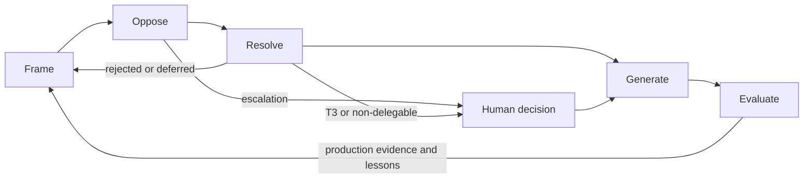
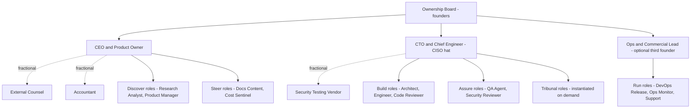
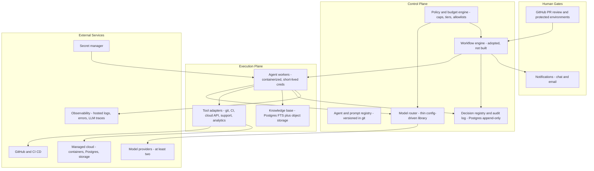

# Part 1 — Executive Blueprint

**Crucible Systems** (working name — a company that forges products under adversarial pressure)
An AI-native SaaS company operated by a small human leadership team and a roster of specialized AI agents.

Version 0.1 — Draft for founder review · Prepared under the FORGE reality-first rules

**Labeling convention used throughout this document:**

| Tag | Meaning |
|---|---|
| **[Fact]** | Verifiable today without further research |
| **[Assumption]** | Believed but unproven; validation method stated |
| **[Recommendation]** | A proposed choice, with rationale |
| **[Experiment]** | Speculative capability; explicitly gated behind evidence |
| **[Decision]** | Requires a named human owner and a deadline |
| **[Open question]** | Unresolved; must not be silently assumed away |

---

## 1. Executive Summary

Crucible Systems is a SaaS company in which AI agents are the default executors of work and humans are the exclusive holders of accountability. The company discovers, validates, builds, launches, operates, and — when the evidence says so — retires SaaS products, using a roster of roughly twelve specialized agent roles directed by two to three human founders.

The design rests on three commitments:

1. **Governance cost must scale with consequence, not with ambition.** Every decision is assigned a risk tier (T0–T3). Routine reversible work flows automatically with logging; only genuinely consequential decisions receive the full multi-agent Deliberation Tribunal, and every Tribunal case has a hard token budget and round limit. **[Recommendation]** Total governance/debate spend is capped at ~5% of the monthly AI API budget.
2. **The platform is thin by default.** Phase 1 rents and reuses rather than builds: GitHub protected environments serve as the human approval gate, a managed cloud provides runtime, existing workflow/queue technology provides orchestration, and a config-driven routing library provides multi-model access. Custom platform components are built only after a product cycle demonstrates the need twice. **[Recommendation]**
3. **Evidence has provenance and an expiry date.** Every material decision is registered with its evidence, assumptions, confidence, owner, and review date. Unverified agent-generated claims never become permanent organizational knowledge.

**Headline numbers — all [Assumption], validated in Phases 0–2:**

- Human team at launch: 2–3 founders plus fractional legal, accounting, and security services.
- Agent roster at launch: ~12 role definitions (roles, not persistent "employees" — instantiated on demand and budgeted like cloud resources).
- Non-payroll monthly burn: roughly **$3,000–8,000** (AI APIs $1,000–3,000; cloud $300–1,200; tooling $150–500; legal/accounting amortized $500–1,500; marketing experiments $500–2,000).
- Twelve-month capital envelope excluding founder salaries: **$40,000–100,000**.
- First product in market: month 6–9. First revenue: month 6–9. Break-even on non-payroll burn at a $29–99/month B2B price point: roughly 60–170 customers.

**The two biggest threats are self-inflicted:** (a) over-building the internal platform before revenue, and (b) governance theater — expensive agent debates that add words, not evidence. The blueprint hard-caps both. The biggest external threat is silent quality debt: subtle defects that pass agent review and surface in production. The mitigations are structural: independent review by a different model family than the author, sampled human audits, seeded "canary defects" to test reviewers, and a defect-escape metric with explicit kill/pivot thresholds.

**Confidence:** moderate (roughly 6.5/10) that Phases 0–2 produce a functioning single-product company at the stated burn; low-to-moderate for Phase 3+ claims, which are deliberately made contingent on Phase 2 measurements. This blueprint should be treated as a bounded, instrumented experiment with kill criteria — not a certainty.

---

## 2. Company Concept

### 2.1 Thesis

A disciplined two-to-three-person team, equipped with frontier AI models, structured adversarial review, and strict human authority gates, can operate the full lifecycle of niche B2B SaaS products at a fraction of the headcount cost of a conventional software company — **provided** the oversight cost of catching AI mistakes stays lower than the cost of hiring humans to do the work. That "provided" is the central bet of the company and is measured explicitly (Section 11, milestones M5–M6).

### 2.2 What "AI-native" means here — and what it does not

- **AI-assisted company (not this):** humans do the work; AI autocompletes it.
- **Autonomous company (not this, and not currently real):** AI does the work and owns the outcomes. No accountable legal or practical structure exists for this; designs assuming it are fantasy.
- **AI-native (this):** the *default executor* of any task is an agent unless the risk tier demands a human. The *default authority* for any consequential or irreversible decision is a human, always. Execution is inverted; accountability is not.

### 2.3 Agents are roles, not employees

This reframe removes most of the fantasy from AI-company designs. An "agent" at Crucible is:

> a **versioned role specification** — mission, responsibilities, exclusions, required inputs/outputs, tool permissions, model tier, memory access, budget caps, escalation rules, and a named human owner — **instantiated on demand** and metered like a cloud resource.

Consequences:

- The company does not "hire 40 agents." It maintains ~12 role specs and spins up instances when work exists. Idle agents cost nothing.
- "Departments" in later phases are mostly *groupings of role specs plus policies*, not standing infrastructure.
- Authority is a property of the role spec, granted by humans, auditable, and revocable in one commit.

### 2.4 The company's durable assets

1. The **Decision Registry** — every material decision with evidence, dissent, conditions, and expiry (institutional memory that survives model upgrades).
2. The **evaluation dataset** — what agent outputs were right, wrong, reworked, and at what cost (the basis for trust calibration).
3. The **role-spec and prompt library** — versioned, tested, improvable.
4. The **product portfolio** and its customers.

### 2.5 What we sell

Niche, boring-by-design B2B SaaS: narrow workflow tools with clear willingness to pay, business-hours support expectations, low data sensitivity, and no regulated-domain exposure at launch. **[Recommendation]** The first product is deliberately small — chosen by the Product Factory's Gate 1–2 evidence, not by this document. Candidate spaces are an **[Open question]** for Phase 0.

### 2.6 What we are not

Not an AGI lab. Not a consultancy (though "AI-assisted development services" is the documented pivot option if Phase 2 metrics fail). Not autonomous. Not a company whose product is "having many agents."

---

## 3. Realistic Scope

Per reality-first rule 2.1, every major capability in the full spec is classified below. **Launch scope in one sentence: one product, one cloud, two model providers, three humans, twelve agent roles, and a decision log.**

| Capability | Classification | Notes |
|---|---|---|
| Risk-tiered FORGE lifecycle (T0–T3 decision routing) | **Launch requirement** | The core operating discipline |
| Decision Registry + append-only audit log | **Launch requirement** | Postgres tables; no custom product needed |
| Human approval gates via GitHub protected environments + PR review | **Launch requirement** | Reuses battle-tested tooling instead of building a portal |
| Agent roster of ~12 role specs, ≥2 model providers | **Launch requirement** | Separation of duties requires a second provider anyway |
| Per-agent / per-decision cost caps and metering | **Launch requirement** | Non-negotiable; cost runaway is a top-3 risk |
| Full 7-round Tribunal procedure (T3 only) | **Launch requirement (procedure), rare in use** | Expected <5 cases per quarter at launch |
| SaaS Product Factory Gates 1–10 | **Launch requirement (lightweight forms)** | Templates first; automation later |
| Basic agent accuracy tracking (rework %, escaped defects) | **Launch requirement** | Simple counters, not a reputation system |
| Custom human-approval web portal | **Growth requirement** | Build only when GitHub-based gates measurably bind |
| Dedicated support tooling + AI-sent replies for low-risk tickets | **Growth requirement** | Launch = AI-drafted, human-sent |
| Agent apprenticeship ladder / weighted reputation voting | **Growth → Advanced** | Needs months of audited history to mean anything |
| Multi-product cells, shared platform division | **Advanced capability (Phase 4)** | Premature before product #2 exists |
| Local model hosting for sensitive data | **Advanced capability** | Until then: data minimization, provider DPAs, no-training flags; GPU hosting is a real cost, not a checkbox |
| Vector search / RAG infrastructure | **Growth (only if a retrieval need proves it)** | Start with Postgres full-text; add pgvector when justified |
| Internal AI marketplace | **Experimental concept** | Phase 4+ at earliest |
| Decision Digital Twin (simulation of decisions) | **Experimental concept** | Cheap MVP = spreadsheet scenario models; full version unproven |
| Organizational Immune System (anomaly-detecting monitors) | **Growth (MVP = alerts on cost/error/rework thresholds)** | The advanced behavioral version is experimental |
| Fully autonomous high-risk production deployment | **Rejected concept** | Violates rule 2.2 permanently |
| Agent-controlled bank accounts, payments, or legal commitments | **Rejected concept** | Human-only, permanently |
| Building a custom orchestrator from scratch in Phase 1 | **Rejected concept** | Adopt existing workflow/queue technology |
| Microservices at launch | **Rejected concept** | Modular monolith until pain is measurable |
| 24/7 support SLA at launch | **Rejected concept** | Three humans cannot honestly staff it; sell business-hours B2B first |

---

## 4. Key Assumptions

Per rule 2.3: no fabricated evidence. Each assumption states why it matters and how it will be validated.

| # | Assumption | Why it matters | Validation method | Status |
|---|---|---|---|---|
| A1 | Current frontier models, wrapped in independent review + human gates, produce production-grade code for narrow B2B products with ≤30% human rework | The entire economic premise | Phase 1–2 pilot: measure rework %, escaped defects, human hours per feature | **[Assumption]** — the central bet |
| A2 | Monthly AI API spend is containable at $1,000–3,000 with tiered routing, caching, and caps | Burn rate and runway | Metered pilot in Phase 1; validate against current provider pricing in Phase 0 | **[Assumption]** |
| A3 | 2–3 founders can absorb all approval/gate load at ≤10 hours/week/person of pure governance overhead | Human bottleneck risk | Time-tracking during Phase 2 | **[Assumption]** |
| A4 | A viable niche B2B product exists that agents can build to beta in ≤12 weeks | Time to revenue | Product Factory Gates 1–2 (interviews, landing-page test, pricing test) | **[Assumption]** |
| A5 | Model providers' commercial terms permit our use of outputs and our data-handling posture | Legal exposure; IP in shipped code | Legal review of current provider terms in Phase 0 — do not rely on memory of terms | **[Open question]** |
| A6 | An incorporation jurisdiction with workable payment rails is available to the founders | You cannot sell SaaS without a merchant account | Legal/banking consultation in Phase 0. Note: founders based in markets without direct access to major payment processors (e.g., much of MENA including Iraq) commonly incorporate a US, UK, or UAE entity — this is a solved but non-trivial path with real cost and admin | **[Open question]** — budgeted in Section 10 |
| A7 | First paying customer by month 6–9 | Runway math | Roadmap milestone M4; kill/pivot trigger if missed by >3 months without strong pipeline evidence | **[Assumption]** |
| A8 | First product avoids regulated domains (consumer health, consumer finance, children's data) and heavy data-residency demands | Keeps compliance scope survivable for a 3-person company | Enforced as a Gate 1 constraint | **[Recommendation]**, enforced |
| A9 | At least two independent model providers remain available at comparable quality | Separation of duties; provider-outage resilience | Continuous; router abstraction makes switching cheap | **[Assumption]** |

---

## 5. Key Risks

Top risks only; the full risk register with likelihood/impact scoring arrives in Part 7.

| # | Risk | Likelihood | Impact | Primary mitigations | Owner |
|---|---|---|---|---|---|
| R1 | **Silent quality debt** — subtle bugs/security flaws pass agent review, surface in production | Medium-High | High | Author/reviewer from different model families; human review gate on all prod merges; seeded canary defects to test reviewer agents monthly; escaped-defect metric with thresholds | CTO |
| R2 | **Cost runaway** — token spend balloons via retries, long contexts, debate loops | Medium | High | Hard per-agent daily caps, per-decision caps (T1 ≤ $2, T2 ≤ $15, T3 ≤ $75 **[Assumption]**), governance ≤5% of AI budget, caching, prompt compression, kill-switch | CEO |
| R3 | **Review theater** — reviewer agents converge/rubber-stamp; Tribunal produces prose, not evidence | Medium | High | Independent blind first-pass reviews; canary defects; humans sample-audit 10% of T1 approvals; Tribunal outputs must cite registered evidence or state "no evidence" | CTO |
| R4 | **Human approval bottleneck** — gates pile up on 2–3 people; either work stalls or humans rubber-stamp | High | Medium | Risk tiering keeps the human queue small by design; approval SLAs; batched review windows; measure A3 | CEO |
| R5 | **Platform navel-gazing** — building the company OS instead of a product | High (for this kind of company) | High | Hard rule: no platform component before two demonstrated needs; Phase 1 time-boxed; Phase 2 = real product with revenue milestone | CEO |
| R6 | **Provider dependency** — outage, price change, policy change, model regression | Medium | Medium | ≥2 providers, routing abstraction, pinned model versions with regression evals before switching, local-model path documented for later | CTO |
| R7 | **Security failure via agents** — secrets leakage, prompt injection through tool use, over-scoped permissions | Medium | High | No standing production credentials for agents; short-lived scoped tokens; secrets only in a secret manager; all external/customer content treated as untrusted input; tool allowlists; append-only audit | CTO (CISO hat) |
| R8 | **Market risk** — the product nobody wants | High (base rate for all startups) | High | Gates 1–2 demand evidence before build; landing-page and pricing experiments; kill criteria at Gate 2 | CEO |
| R9 | **Legal/compliance gaps** — entity, tax, ToS, data protection (e.g., GDPR if EU customers) | Medium | High | Phase 0 legal consultation; A6/A5 open questions resolved before launch; standard DPA + subprocessor list templates in Part 4 docs | CEO + external counsel |
| R10 | **Knowledge pollution** — hallucinated claims entering organizational memory | Medium | Medium | Provenance tags on all memory entries; evidence expiry dates; "unverified" class quarantined from decision citations | CTO |

---

## 6. Human Role and AI Role

### 6.1 Decisions humans can never delegate **[Decision class — permanent policy]**

Per rule 2.2, agents may recommend, analyze, draft, review, test, and monitor — but the following are human-only, at every phase, forever:

Legal commitments and contracts · bank accounts and money movement · large financial transactions and budgets · hiring/termination · customer data deletion · production database destruction · security-incident disclosure · regulatory submissions · high-risk production deployments · access-control and encryption/key-management policy changes · M&A · anything that could materially harm customers.

### 6.2 Authority by decision class

| Decision class | AI role | Human role | Example |
|---|---|---|---|
| Routine reversible work (T0) | Execute within policy, log | Spot-audit samples | Formatting fix, doc update, dev-env task |
| Low-risk changes (T1) | Execute + independent agent review | Async notification; audit 10% | Small feature within approved spec; minor dependency patch |
| Medium-risk decisions (T2) | Mini-tribunal recommends | Approve/reject the recommendation | Schema change; new dependency; public pricing-page copy |
| High-risk / irreversible (T3) | Full Tribunal produces options + evidence + dissent | Human decides; agent may not | Architecture selection; launch/kill; any 6.1 item |
| Non-delegable (6.1 list) | Prepare materials only | Decide **and** execute | Signing, paying, deploying to prod, disclosing |

### 6.3 Mode of operation by function (Phase 1)

Per spec section 7.8's four modes:

| Function | Phase 1 mode |
|---|---|
| Market/customer/competitor research | AI-operated with human approval of conclusions |
| Product requirements, user stories | AI-operated with human approval |
| Architecture and ADRs | AI-drafted; human (CTO) approves — T2/T3 |
| Code implementation | AI-operated; human merge gate on protected branches |
| Code review | AI-operated (independent model family) + human review on prod merges |
| Testing and QA | AI-operated; human reviews the QA report, not every test |
| Security review | AI-assisted; human (CTO/CISO hat) owns sign-off |
| Deployment to production | AI-prepared, **human-executed** via approved pipeline |
| Monitoring and alert triage | AI-operated; humans own incident command |
| Customer support | AI-drafted, human-sent at launch → AI-sent for low-risk with sampling (Growth) |
| Marketing content | AI-operated with human approval before publish |
| Finance, banking, invoicing approval | Human-led, AI-assisted (reports, reconciliation drafts) |
| Legal | Human-led with external counsel, AI-assisted (summaries, first drafts) |
| Fully automated (no per-item human touch) | T0 only: log rotation, doc regeneration, dependency-update *proposals*, internal report generation |

### 6.4 Honest accounting of founder time

**[Assumption]** In Phase 1–2, expect founders to spend 30–40% of working hours on direction, gates, and audits — declining as trust calibrates and tiering proves out. If measured governance load exceeds ~50% for a sustained month, that is a design failure triggering re-tiering, not a reason to weaken gates.

---

## 7. Operating Methodology — The FORGE Method (Summary)

The name **FORGE** is retained deliberately: it is apt, it is already meaningful (Frame · Oppose · Resolve · Generate · Evaluate), and it matches the company identity — a crucible is where material is tested by heat before it is trusted. Alternatives considered (TEMPER, ANVIL) added novelty, not meaning. The full protocol, Tribunal procedure, and templates arrive in Part 2; this section states what a founder must approve now.

### 7.1 The five phases and ten stages

| FORGE phase | Lifecycle stages | Core question |
|---|---|---|
| **F — Frame** | 1. Frame | What problem, for whom, at what cost, with what unknowns? |
| **O — Oppose** | 2. Investigate · 3. Challenge · 4. Deliberate | What evidence exists, and what breaks this idea? |
| **R — Resolve** | 5. Decide | What is decided, by whom, under what conditions, until when? |
| **G — Generate** | 6. Build · 7. Verify · 8. Release | Ship it through independent verification and controlled release |
| **E — Evaluate** | 9. Observe · 10. Evolve | What does production evidence say, and what changes because of it? |

**Diagram explanation:** Work flows Frame → Oppose → Resolve → Generate → Evaluate, and Evaluate feeds production evidence back into new Frames — the loop never ends at launch, which is why post-launch operations are a first-class phase, not an afterthought. Two paths exit the machine loop to humans: escalation triggers during Oppose, and any Resolve that is high-risk (T3) or on the non-delegable list. Rejected or deferred proposals return to Frame with their evidence preserved in the Decision Registry.

### 7.2 What makes FORGE different from renamed Agile

1. **Adversarial review is structural, not optional.** Independent agents are *required* to attack proposals before humans see them (Challenge stage), with blind first passes to prevent groupthink.
2. **Decisions are registered artifacts with expiry dates**, not meeting outcomes. Evidence expiry automatically re-opens decisions when the world changes.
3. **Process weight is chosen by risk tier**, not by ceremony calendar. There are no standing meetings; there are decision records.
4. **The lifecycle is a loop through production**, with Observe/Evolve carrying equal weight to Build — matching the reality that most of a SaaS product's life is after launch.

### 7.3 Decision risk tiers **[Recommendation — the single most important governance rule]**

| Tier | Criteria | Process | Max cost/decision | Human involvement |
|---|---|---|---|---|
| **T0 — Routine** | Reversible, no prod/customer/data/money impact | Agent executes within policy; logged | ~$0.50 | Sampled audits only |
| **T1 — Low** | Small blast radius, easily reversed, within approved spec | One independent reviewer agent; logged | ≤ $2 | Async notification; 10% audited |
| **T2 — Medium** | Touches prod schema, dependencies, customer-visible surfaces, or ≤$500 spend | Mini-tribunal: advocate + 2 domain critics + judge; max 2 rounds | ≤ $15 | Human approves the recommendation |
| **T3 — High/Critical** | Irreversible, security-relevant, >$500, strategic, or any 6.1 item | Full Tribunal, relevant roles only; max 4–6 rounds; red-team pass mandatory | ≤ $75 | **Human decides**; agents only recommend |

All cost caps are **[Assumption]** — calibrated against real token prices in Phase 0 and revised with evidence.

**Escalation to a human is mandatory when:** round limits are hit; consensus stays below threshold; two expert agents present strongly conflicting evidence; legal/regulatory position is unclear; security risk is high; cost exceeds approved budget; customers could be materially harmed; required evidence is unavailable; confidence stays low; the decision is irreversible; or agents loop repetitively.

**Governance cost cap:** total T2+T3 deliberation spend ≤ ~5% of the monthly AI budget. If governance wants more, that is evidence the tiering thresholds are wrong — fix the thresholds, not the cap. Agents must never hold debates merely to improve wording.

---

## 8. High-Level Organization

### 8.1 Phase 1 organization

**Diagram explanation:** Solid lines are accountability — every agent role group has exactly one human owner who approves its outputs at the relevant tier and answers for its failures. Dotted lines are fractional external services (counsel, accounting, penetration testing) bought as needed rather than hired. Tribunal roles (advocate, critics, judge, red-team) are not standing agents; they are instantiated per T2/T3 case and dissolved after, which is what keeps governance cheap. If only two founders exist, the Ops/Commercial lead's duties split between CEO (commercial, support escalation) and CTO (ops) — workable but tighter, and the bus-factor risk (R4) rises.

### 8.2 Human roster at launch

| Role | Owns | Approves | Non-delegable duties |
|---|---|---|---|
| **CEO / Product Owner** | Strategy, product decisions, customers, money, legal relationships | Gate 1–3 and 8–10 outcomes, pricing, spend, all 6.1 commercial/legal items | Contracts, banking, hiring, disclosure |
| **CTO / Chief Engineer (CISO hat)** | Architecture, security, production, platform | Prod merges/deploys, T2/T3 technical decisions, security sign-offs, access control | Prod deploy execution, key management, incident command |
| **Ops & Commercial Lead** (3rd founder, optional) | Support, billing ops, marketing execution, vendor admin | Support escalations, published content, refunds within limits | Customer-harm calls, refund/credit beyond limits |

### 8.3 Agent roster at launch (~12 role specs) **[Recommendation]**

| Group | Role | Mission (one line) | Default model tier | Authority ceiling |
|---|---|---|---|---|
| Discover | Research Analyst | Market/competitor/customer evidence with sources and confidence | Tier 2 | Recommend only |
| Discover | Product Manager | PRDs, user stories, acceptance criteria from framed problems | Tier 2–3 | T1 doc changes |
| Build | Solution Architect | Designs, ADRs, threat-model first drafts | Tier 3 | Recommend only |
| Build | Software Engineer (N instances) | Implement approved specs with tests | Tier 3 | T1 within spec |
| Build | Code Reviewer | Independent review — **different model family than author** | Tier 3–4 | Block/approve T1 |
| Assure | QA Agent | Test plans, generated tests, QA reports | Tier 2–3 | Recommend only |
| Assure | Security Reviewer | SAST/dependency triage, threat-model review, secret-scan gate | Tier 3–4 | Block anything; approve nothing |
| Run | DevOps/Release Agent | IaC drafts, pipelines, release checklists, rollback plans | Tier 3 | T0/T1 in non-prod |
| Run | Ops Monitor | Log/alert triage, incident summaries, weekly reliability report | Tier 1–2 | Page humans |
| Run | Support Agent | Draft replies, KB articles, ticket triage | Tier 2 | Draft only (launch) |
| Steer | Docs/Content Agent | Product docs, release notes, marketing drafts | Tier 2 | T1 internal docs |
| Steer | Cost Sentinel | Spend tracking, unit-economics reports, anomaly flags | Tier 1–2 | Freeze-spend alert to humans |
| On demand | Tribunal roles (advocate, critics, judge, red-team, evidence validator) | Per-case deliberation | Mixed | Produce decision records |

**Separation of duties, enforced by role spec:** the Engineer cannot approve its own security posture; the Security Reviewer can block but never approve alone; the estimator (Cost Sentinel) never approves budgets; the release preparer never self-approves deployment; author and reviewer come from different model families where feasible. **[Recommendation]**

### 8.4 Organizational evolution by phase **[Assumption — headcounts indicative]**

| Phase | Humans | Agent roles | New structures |
|---|---|---|---|
| 1 — Founding | 2–3 + fractional | ~12 | Everything in this section |
| 2 — Product-market fit | 3–5 | ~15–20 | Specialized support/security/commercial roles; AI-sent low-risk support |
| 3 — Operational stability | 5–8 | ~20–30 | Product Continuity & Evolution division formalized; agent accuracy → early reputation; formal governance council (humans) |
| 4 — Multi-product | 8–15 | Cells | Product cells (spec §12.5) with human product owners; shared platform group; portfolio management |

The full future-state org (all offices and departments of spec §7) is the **target-state map**, delivered in Part 2 — with the explicit warning that most boxes remain *role specs and policies*, not headcount, until evidence demands otherwise.

---

## 9. High-Level Architecture

### 9.1 Principles

1. **Boring technology, earned complexity.** Postgres, object storage, one queue, containers, IaC. Complexity is added only when pain is measured, with the reasoning written down (ADR).
2. **Control plane vs execution plane.** Agents run in the execution plane with scoped, short-lived credentials. The control plane (registries, policies, budgets, audit) is where authority lives.
3. **Humans hold the keys.** No agent holds standing production credentials, cloud-account admin, banking access, or signing authority. Production writes happen only through CI pipelines behind human-approved gates.
4. **Rent before build.** Every component below is buy/adopt-first; build is the exception and requires two demonstrated needs.

### 9.2 Phase 1 architecture

**Diagram explanation:** The workflow engine advances FORGE stages and instantiates agent workers per task. Every model call passes through the router, which enforces the policy engine's tier, budget, and provider rules and writes usage to the audit log. Agents touch the outside world only through tool adapters with allowlisted actions; production changes route through GitHub/CI, where protected environments require human approval before anything deploys — GitHub *is* the Phase 1 human-approval portal. The Decision Registry and audit log receive events from both the workflow engine (decisions, gates) and agents (actions, costs), forming the append-only record. Secrets are injected at runtime from the secret manager and never appear in prompts, code, logs, or model responses. All agent output that could contain fetched external content is treated as untrusted input, never as instructions.

### 9.3 Buy vs build **[Recommendation]**

| Component | Phase 1 choice | Build later when |
|---|---|---|
| Orchestration/workflow | Adopt an existing durable-workflow engine or Postgres-backed job queue + state machine | Only if adopted tools measurably bind — likely never |
| Model router | Thin open-source routing library + our config (tiers, caps, fallbacks) | Custom service only at multi-team scale |
| Approval portal | GitHub protected environments, PR reviews, CODEOWNERS | Phase 3, when non-code approvals (pricing, support, content) outgrow ad-hoc flows |
| Secrets | Cloud secret manager; per-env credentials; rotation; dev/prod separation | Never build |
| Observability | Hosted error tracking + logs + an LLM-tracing tool (free tiers first) | Never build |
| Knowledge base | Postgres (FTS) + object storage, provenance columns, expiry dates | Add pgvector when a real retrieval need appears twice |
| CI/CD | GitHub Actions | Never build |
| Runtime | Containers on a managed runtime; managed Postgres; IaC from day one | Microservices only per §3 rejection criteria |
| Product analytics / billing | Established SaaS billing provider + lightweight analytics | Never build billing. Ever. |

### 9.4 Security model (launch posture)

Least-privilege role specs · no standing prod credentials for agents · short-lived scoped tokens per task · secrets only via secret manager (never hard-coded, never in prompts, never in logs, never in responses) · key rotation and emergency revocation runbook · separate dev/prod keys and cloud accounts/projects · tool allowlists per role · all customer/external content treated as untrusted (prompt-injection posture) · dependency and secret scanning in CI · append-only audit of every agent action and model call · human-only access-control changes (T3) · backups tested, not assumed.

### 9.5 Agent memory (launch subset of spec §9.2)

Working memory (per task, ephemeral) → task/project memory (Postgres, provenance-tagged) → organizational knowledge (Decision Registry + curated docs). Every entry carries: source reference, classification (verified / unverified / expired), expiry date, version, and access level. **Unverified agent claims are quarantined from decision citations** — the Tribunal's Evidence Validator may only cite verified entries or explicitly declare an evidence gap.

---

## 10. Initial Budget Categories

All figures **[Assumption]**, in USD, to be validated in Phase 0 against current provider and cloud pricing. Ranges reflect lean vs comfortable operation.

### 10.1 One-time costs

| Item | Range | Notes |
|---|---|---|
| Incorporation + initial legal (entity, ToS/privacy/DPA templates, provider-terms review) | $2,000–8,000 | Higher end if cross-border entity is needed per A6 **[Open question]** |
| Cloud + tooling setup, domains, trademarks search | $300–1,000 | |
| Pre-launch light security assessment of product #1 | $3,000–8,000 | External vendor; scheduled at Gate 7, not day one |
| **One-time total** | **$5,000–17,000** | |

### 10.2 Monthly operating costs (Phase 1–2, non-payroll)

| Category | Range / month | Controls |
|---|---|---|
| AI APIs (all agents + Tribunal) | $1,000–3,000 (spikes to $5,000 in heavy build months) | Per-agent daily caps; per-decision caps; governance ≤5%; caching; tier routing; Cost Sentinel freeze alert |
| Cloud (company platform + product staging/prod) | $300–1,200 | One region; managed services; rightsizing review monthly |
| Dev tools & SaaS (repo hosting, error tracking, email, secret mgmt, analytics, misc.) | $150–500 | Free tiers first |
| LLM tracing/observability | $0–300 | Free tiers first |
| Legal + accounting (amortized) | $500–1,500 | Fractional |
| Marketing experiments (landing pages, small paid tests) | $500–2,000 | Only during Gates 1–2 and launch windows |
| Insurance (cyber/E&O) | $0 pre-revenue → $150–500 | Growth item, before first paying customer with data exposure |
| **Non-payroll burn** | **≈ $2,500–8,500 / month** | |

### 10.3 Payroll scenarios **[Decision — founders]**

| Scenario | Monthly payroll | Note |
|---|---|---|
| A — Sweat equity | ~$0–1,000 | Founders defer salary; longest runway; highest personal risk |
| B — Survival salaries | Location-dependent; set by founders | The honest variable this document cannot set for you |

### 10.4 Capital envelope and early unit economics

Twelve months of non-payroll burn plus one-time costs ⇒ **$40,000–100,000** excluding salaries **[Assumption]**. At a $29–99/month B2B price point, covering non-payroll burn requires roughly **60–170 customers** — a sanity check that the first product must target a niche where that count is plausibly reachable within 12–18 months. Full financial model (CAC, LTV, cash-flow, break-even including payroll scenarios) arrives in Part 6.

---

## 11. Phased Roadmap

Durations are **[Assumption]**; exit criteria are measurable; every phase carries explicit kill/pivot triggers because a bounded experiment without kill criteria is just optimism.

| Phase | Duration | Focus | Exit criteria (measurable) | Kill / pivot triggers |
|---|---|---|---|---|
| **0 — Discovery & Validation** | 4–6 weeks | Founders, budget, jurisdiction/entity path, provider selection + legal terms review, regulatory constraints, candidate product spaces, business case | Signed founder agreement; entity path chosen; 2 providers contracted; budget approved; ≥3 candidate product spaces framed | No workable payment-rail path (A6); founders cannot commit time/capital |
| **1 — Minimum Viable AI Company** | 8–12 weeks | Thin platform: workflow engine adopted, ~12 role specs, decision registry, cost controls, audit log, GitHub gates; FORGE dry-run on an internal tool | One full FORGE cycle completed end-to-end on a real internal deliverable; all model calls metered and capped; audit log reconstructs any decision | Platform not done in 12 weeks ⇒ cut scope to bare queue + logs and proceed anyway (platform must never block product) |
| **2 — First SaaS Product** | 12–20 weeks | Gates 1–8 on product #1; beta; launch; first revenue. Measure everything: delivery time, defect rate, API cost, cloud cost, human hours, CSAT, revenue, agent accuracy, debate usefulness | Product live; ≥1 paying customer; measured human rework ≤ target (A1); cost/feature < human-equivalent estimate | Gate 2 demand evidence fails twice ⇒ new product space. A1 badly missed (rework >50% sustained) ⇒ pivot to AI-assisted dev services or stop |
| **3 — Operational Stability** | Months ~9–15 | Continuity & Evolution division live: support flows, security operations, patch/dependency cadence, automated evals, early agent-accuracy reputation, improved observability, formal governance | 3 consecutive months: SLOs met; escaped defects ≤ threshold; support ≤ 24h business-hours response; governance ≤ 5% AI spend; positive contribution margin on product #1 | Churn/defect trends worsening for 2+ months ⇒ freeze features, stabilize |
| **4 — Multi-Product Expansion** | Months ~15–30 | Product cells; shared platform group; portfolio mgmt; central billing/analytics; reusable components; custom approval portal if earned | 2+ products with positive contribution margin; a cell runs a product with ≤ agreed human-hours/week | Product #2 fails Gates 1–2 repeatedly ⇒ deepen product #1 instead |
| **5 — Advanced Autonomous Ops** | Month 30+ | Experiments only, individually gated: apprenticeship ladder, immune-system behaviors, decision digital twin, marketplace | Each experiment has its own MVP, budget, and success metric before any authority is granted | Any experiment failing its metric is retired, not defended |

### Milestones

| # | Milestone | Target | Measure |
|---|---|---|---|
| M0 | Entity + banking + provider contracts + budget signed | End Phase 0 | Documents exist |
| M1 | Decision Registry live; first registered T2 decision | Phase 1 wk 4 | Record complete with evidence + owner + expiry |
| M2 | Full FORGE cycle on an internal deliverable | Phase 1 exit | Cycle artifacts in registry; cost within caps |
| M3 | Product #1 passes Gate 2 with real demand evidence | Phase 2 wk 6 | Interviews + landing-page conversion + pricing signal documented |
| M4 | First paying customer | Month 6–9 | Revenue in the bank |
| M5 | A release shipped with ≤ 4 total human gate-hours | Phase 2–3 | Time-tracked |
| M6 | Escaped-defect rate < 1 per release across 3 consecutive releases | Phase 3 | Defect log |
| M7 | Product #1 positive contribution margin | Phase 3 | Monthly finance report |
| M8 | Second product cell operating | Phase 4 | Cell runs FORGE cycles with its own budget |

**Sequencing rule [Recommendation]:** no new platform component, agent role, or governance structure is added until a product cycle has demonstrated the need **twice**. The objective is never to maximize the number of agents.

---

## 12. Recommendation Review (per spec §11 — visible self-review)

| Item | Assessment |
|---|---|
| **Strongest reason to adopt** | Leverage: a 2–3 person team plausibly operates the full SaaS lifecycle at a small fraction of conventional headcount cost, and the control framework (tiers, independent review, human gates, registries) is precisely what converts unreliable agent output into shippable software. Nothing here requires technology that does not exist today. |
| **Strongest reason to reject** | The central economic premise is unproven: oversight-plus-rework cost may exceed the cost of simply hiring one or two strong engineers using ordinary AI coding tools. Coordination overhead can silently eat the savings. |
| **Main unproven assumption** | A1 — agents deliver production-grade work at ≤30% human rework within the stated token budgets. Everything else is plumbing around this bet. |
| **Most dangerous hidden risk** | Silent quality debt (R1): defects that pass agent review and human sampling, then surface at customer scale — damaging trust precisely when the company has no reputation buffer. Second: governance theater that *looks* like control (R3). |
| **Cheapest viable alternative** | A solo founder or duo using off-the-shelf AI coding tools, a checklist, and a decision log in a spreadsheet — no custom platform at all. Honest answer: **Phase 1 of this blueprint is deliberately only one small step above that alternative**, and if Phase 2 metrics fail, falling back to it is the plan. |
| **More scalable alternative** | Building atop a mature commercial agent-orchestration platform rather than owning any workflow layer — less control and some lock-in, revisit at Phase 3/4 when scale is real. |
| **Evidence still required** | Phase 2 pilot metrics: human rework %, escaped defects/release, $/feature, human hours/feature, governance hours/week, real monthly API spend vs A2, Gate 2 demand evidence for product #1, legal confirmation of A5/A6. |
| **Confidence level** | ~6.5/10 for Phases 0–2 as specified; ~4/10 for Phase 4+ as specified (deliberately contingent). |
| **Final recommendation** | Proceed with Phases 0–2 as a bounded, instrumented experiment with the stated kill/pivot triggers. Treat Phases 3–5 as options purchased by Phase 2 evidence, not commitments. |

---

## 13. Red-Team Summary and Simplifications (per spec §11.1)

The first-draft design was attacked before writing this document. Failure scenarios found, and what changed because of them:

| Failure scenario found | Consequence if ignored | Simplification adopted |
|---|---|---|
| **Cost death spiral** — debates, retries, long contexts compound | Burn doubles silently | Hard tier caps, per-decision caps, governance ≤5%, Cost Sentinel freeze alert, daily per-agent budgets |
| **Review theater** — same-family reviewer agrees with author; Tribunal writes eloquent nothing | Silent quality debt | Cross-provider author/reviewer, blind first-pass reviews, monthly seeded canary defects, human sampling, evidence-citation requirement |
| **Approval fatigue** — every change routed to 3 humans; they rubber-stamp or become the bottleneck | Gates become fiction | Risk tiering pushes ~90% of actions to T0/T1; approval SLAs; measured governance-hours with a design-failure threshold |
| **Platform navel-gazing** — a beautiful company OS, no product, no revenue | Death by month 12 | Phase 1 time-boxed with a "cut scope and proceed" rule; the two-demonstrated-needs rule; GitHub as the approval portal instead of building one |
| **Org-chart cosplay** — standing up 40+ agent "departments" from the full spec on day one | Cost, noise, false sophistication | Full org retained as *target-state map only*; launch roster cut to ~12 role specs; departments = role specs + policies until evidence demands headcount |
| **Provider rug-pull** — price/policy/model regression at one vendor | Outage or quality cliff | ≥2 providers, pinned versions, regression evals before switching, documented local-model path (deferred, costed honestly) |
| **Founder bus factor** — 2–3 humans hold all authority | Single illness stalls prod approvals | Documented deputies per gate, break-glass runbook (human-only), modest SLAs sold to customers |

**Net simplifications vs the full spec:** 40+ possible Tribunal/department roles → ~12 launch roles + on-demand Tribunal; custom portal → GitHub gates; always-on Tribunal → tiered and capped; microservices → modular monolith; local models → deferred with honest GPU costing; reputation system → simple accuracy counters; vector infrastructure → Postgres until proven need.

---

## 14. Scoring (per spec §11.2)

| Criterion | Score /10 | One-line justification |
|---|---|---|
| Practicality | 7 | Everything specified exists today; the bet is economic, not technical |
| Cost efficiency | 8 | Rent-first, caps everywhere, governance budgeted; payroll remains the honest dominant variable |
| Security | 7 | Strong posture for company size; single part-time CISO-hat human is the weak point until Phase 3 |
| Scalability | 7 | Role-spec model and cells scale cleanly; deliberately trades some Phase-4 speed for Phase-1 survival |
| Maintainability | 7 | Boring stack, versioned specs, ADRs; risk is knowledge concentration in 2–3 heads |
| Customer value | 6 | Entirely dependent on product #1 selection — the blueprint enforces evidence, it cannot supply it |
| Time to market | 6 | 6–9 months to revenue is realistic, not fast; the platform-minimalism rules exist to protect it |
| Regulatory readiness | 5 | Adequate only because scope excludes regulated domains; A5/A6 open questions must close in Phase 0 |
| Human controllability | 9 | The strongest dimension by design: tiering, non-delegable list, human-held keys, append-only audit |
| Innovation | 8 | FORGE tiering, evidence expiry, canary defects, agents-as-roles are genuinely non-standard operating ideas |

Weakest scores (regulatory readiness, customer value, time to market) are raised by Phase 0 legal work and honest Gate 1–2 product selection — not by adding platform or agents.

---

## 15. Open Questions and Next Steps

**Open questions requiring founder decisions [Decision — assign owner + deadline in Phase 0]:**

1. Incorporation jurisdiction and payment-rail path (A6) — external counsel engaged.
2. Founder count (2 vs 3), availability, capital commitment, payroll scenario (§10.3).
3. Initial two model providers and legal review of their current commercial terms (A5).
4. Shortlist of 3–5 candidate product spaces to feed Gate 1 (constraint A8 applies).
5. Cloud provider and region (informed by target-customer data-residency expectations).
6. Company name (Crucible Systems is a working placeholder; trademark search required).

**What Part 2 — Company Operating Model — will deliver:** full department charters mapped to the target-state org with human/AI/automation mode per function; role descriptions; RACI and decision-authority matrices; the human-vs-agent responsibility matrix; the complete Deliberation Tribunal protocol (roles, seven-round procedure, consensus scoring model, cycle limits, escalation rules); the reusable agent specification template with two worked examples; and the governance calendar.

---

*End of Part 1. All monetary figures, durations, and capability claims tagged [Assumption] are subject to Phase 0 validation. Nothing in this document has been fabricated as market evidence; where evidence does not yet exist, the validation path is stated instead.*
