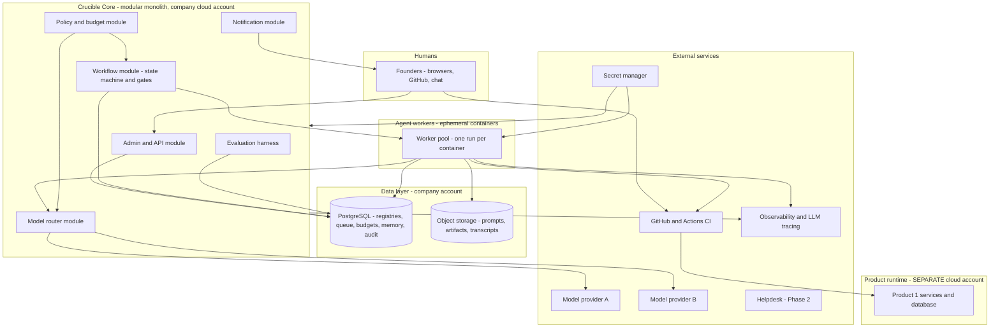
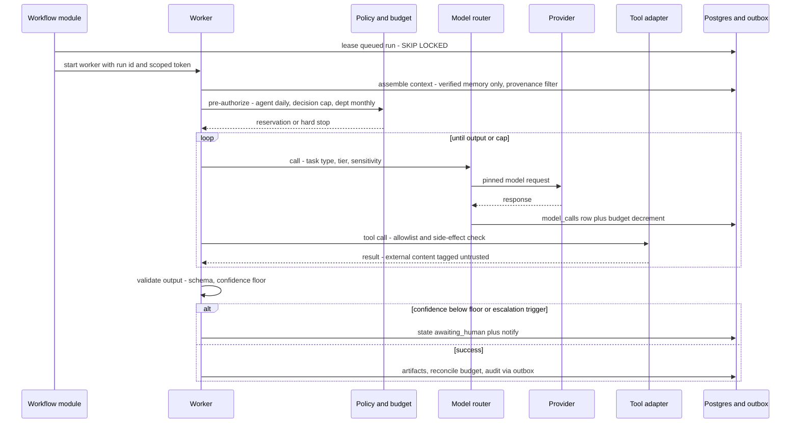
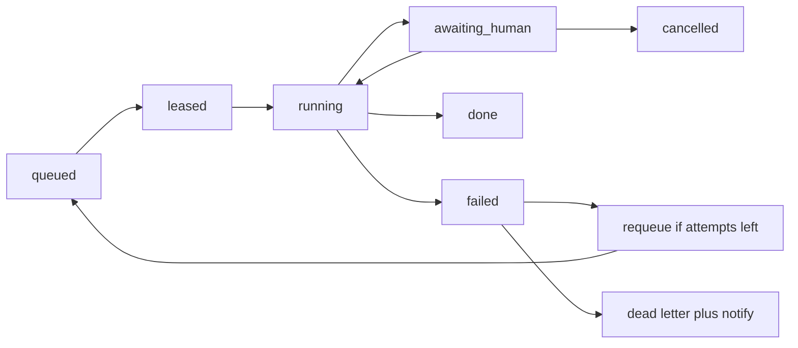
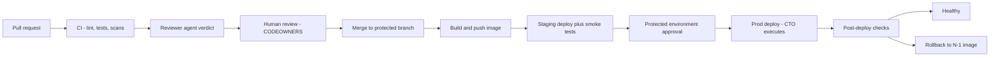

# Part 3 — Technical Design

**Crucible Systems** (working name) · Companion to Parts 1–2
Version 0.1 — Draft for founder review · Labeling convention from Part 1 applies ([Fact] / [Assumption] / [Recommendation] / [Experiment] / [Decision] / [Open question])

**Scope of this part:** the concrete design of the company's internal operating platform ("Crucible Core") — architecture and ADRs, component catalog, data schemas, data flows, agent orchestration, model routing, the security model in depth, memory implementation, deployment strategy, observability and evaluation, and the Phase 1 build sequence. Product-side architecture is produced per product at Factory Gate 4 (Part 4); this part is the platform those products are built *with*.

---

## 1. Architectural Principles

1. **The platform must never be able to take a customer product down.** Company platform and product runtimes live in **separate cloud accounts/projects** with independent credentials, billing, and blast radius. A platform outage pauses agents; customers notice nothing. **[Recommendation — non-negotiable]**
2. **Control points live in the data layer, not in prompts.** Budgets, tool scopes, approval gates, and audit are enforced by the database, the policy module, and cloud IAM — things a prompt change cannot bypass.
3. **Boring, evaluated, reversible.** Modular monolith + Postgres + object storage + containers + IaC. Every architectural choice below is an ADR with consequences stated; microservices, event buses, and vector stores wait for measured pain (Part 1 two-needs rule).
4. **Interface-first plumbing.** The queue, router, and workflow modules hide behind narrow interfaces so a durable-workflow engine, dedicated queue, or new provider can replace them without touching agent logic.
5. **Fail closed where it matters.** Review/security roles and gates never silently degrade to a weaker model or an empty check; they stop and summon a human.

---

## 2. Architecture Decision Records (launch set)

| ADR | Status | Context → Decision | Consequences (incl. risks) |
|---|---|---|---|
| **ADR-001 — Modular monolith + ephemeral worker pool** | Accepted | 1–2 builders, 8–12 weeks, low ops budget → one deployable "Crucible Core" (API/admin, workflow, policy, router, eval, notification modules) plus stateless containerized agent workers | Fast to build/operate; single deploy. Risk: scaling ceiling and module-boundary erosion — mitigated by enforced module interfaces; split only per §1.3 |
| **ADR-002 — PostgreSQL as the operational spine** | Accepted | Registries, queue, audit, memory, budgets all need transactions and one source of truth → one managed Postgres; job queue via `SELECT … FOR UPDATE SKIP LOCKED`; FTS for retrieval | One backup/restore story; transactional gates. Risk: SPOF — mitigated by PITR backups, quarterly restore drills, degraded-mode runbook (agents pause; products unaffected per §1.1) |
| **ADR-003 — Adopt-not-build orchestration, behind an interface** | Accepted | A custom orchestrator was **rejected** in Part 1 → launch = in-monolith state machine + PG queue (thin, ~boring); adopt a durable-workflow engine at Phase 3 if parallel Tribunal orchestration or retries prove painful twice | Zero new infra now; honest risk: the thin state machine could creep into the rejected custom orchestrator — mitigated by a hard LOC/feature budget and the two-needs rule |
| **ADR-004 — GitHub protected environments as the human approval portal** | Accepted | Building an approval UI in Phase 1 was rejected → PR review + CODEOWNERS + protected branches/environments gate all code and prod deploys; non-code approvals via notification + registry `approvals` row | Battle-tested, auditable, free. Risk: GitHub outage blocks gates — break-glass runbook (human-only, dual-logged); non-code approvals stay slightly clunky until the Growth-phase portal |
| **ADR-005 — Thin multi-provider routing library, pinned versions** | Accepted | ≥2 providers required (separation of duties, resilience) → config-driven routing module (open-source routing lib acceptable), models pinned by exact version; changes are T2 with regression evals | Cheap switching, honest cost metering. Risk: abstraction hides provider-specific features — allowed escape hatch per role spec |
| **ADR-006 — Transactional outbox for audit events** | Accepted | Audit must never block or lose events → audit rows written in the same DB transaction as the action, relayed asynchronously to the hash-chained log and off-site copy | Guaranteed capture with low latency impact. Risk: relay lag — monitored with an outbox-age alert |

---

## 3. System Architecture

### 3.1 Container view (C4 level 2, launch state)



**Diagram explanation:** Founders interact through the thin admin/API surface, GitHub, and chat notifications — there is no bespoke portal at launch (ADR-004). The workflow module advances FORGE stages, enforces gates, and leases queued runs to ephemeral worker containers — one run per container, so a compromised or runaway run has nothing persistent to inhabit. Workers reach models only through the router (which consults the policy/budget module before every call), reach the world only through allowlisted tool adapters, and write artifacts to object storage and state to Postgres. **The only path from agents to the customer product is through GitHub/CI and its human-approved protected environments** — workers hold no product-account credentials, ever. Secrets are injected at runtime from the secret manager; the evaluation harness runs golden sets and canary defects against agent roles on schedule. The product runtime sits in a separate cloud account: platform failure pauses the company, not the product.

### 3.2 Component catalog — every spec §9 component, mapped

| Spec component | Launch implementation | Status |
|---|---|---|
| Agent Orchestrator | Run executor inside workflow module + worker pool | Build (thin) |
| Workflow Engine | Explicit state machine + PG queue (ADR-003) | Build (thin); durable engine Phase 3 if earned |
| Agent Registry | `agents` table + role specs versioned in git | Build (table) |
| Model Router | Routing module / OSS routing lib + config | Adopt + configure |
| Prompt Registry | Prompts in git (reviewed like code) + `prompts` index table | Build (index only) |
| Tool Registry | `tools` table: adapter, scopes, side-effect class | Build (table) |
| Policy Engine | Policy/budget module reading policy tables | Build (thin) |
| IAM | Cloud IAM + app roles; humans via SSO/password-manager + mandatory 2FA | Adopt |
| Secret Management | Cloud secret manager; per-env, per-role scoping | Adopt |
| Knowledge Base | Postgres FTS + object storage with provenance columns | Build (schema) |
| Vector Search | **Deferred** — pgvector only after a retrieval need appears twice | Deferred |
| Relational Database | Managed PostgreSQL, PITR enabled | Adopt |
| Event Bus | **Deferred** — outbox + queue suffice at launch (honest: an event bus at this scale is cosplay) | Deferred |
| Job Queue | PG `SKIP LOCKED` pattern + dead-letter table | Build (thin) |
| Artifact Repository | Object storage + container registry | Adopt |
| Source-Control Integration | GitHub adapter (PRs, checks, environments) | Adopt |
| CI/CD Integration | GitHub Actions pipelines | Adopt |
| Observability Platform | Hosted logs/metrics/errors + an LLM-tracing tool | Adopt |
| Cost Tracking | `model_calls` + `budgets` + dashboard; monthly reconciliation vs provider invoices | Build (thin) |
| Evaluation Service | Eval harness module: golden sets, canary defects, regression runs | Build |
| Audit Logging | Append-only, hash-chained `audit_log` + off-site copy (ADR-006) | Build |
| Decision Registry | `decisions` + evidence/assumption tables + templates | Build |
| Human Approval Portal | GitHub protected environments + notifications (ADR-004); custom portal = Growth | Adopt now |
| Notification Service | Chat + email webhooks | Adopt |
| Customer Support Integration | Helpdesk adapter (read + draft) | Phase 2 |
| Product Analytics Integration | Analytics adapter | Phase 2 |

---

## 4. Data Architecture

### 4.1 Core schema (illustrative launch DDL — final form via migrations; every table carries `created_at TIMESTAMPTZ NOT NULL DEFAULT now()`)

```sql
-- Agent registry: the spec is law; prompts live in git, indexed here
CREATE TABLE agents (
  id            TEXT PRIMARY KEY,          -- e.g. AGT-REV-001
  name          TEXT NOT NULL,
  role_group    TEXT NOT NULL,             -- discover|build|assure|run|steer|tribunal
  version       INT  NOT NULL,
  spec          JSONB NOT NULL,            -- full Part 2 §8.1 template
  model_tier    TEXT NOT NULL,             -- T1..T4 (routing tiers, §6)
  status        TEXT NOT NULL DEFAULT 'active',  -- active|suspended|retired
  human_owner   TEXT NOT NULL
);

CREATE TABLE prompts (
  id TEXT PRIMARY KEY, agent_id TEXT REFERENCES agents(id),
  version INT NOT NULL, git_ref TEXT NOT NULL, content_hash TEXT NOT NULL
);

CREATE TABLE tools (
  id TEXT PRIMARY KEY, name TEXT NOT NULL,
  adapter TEXT NOT NULL, scopes JSONB NOT NULL,
  side_effect TEXT NOT NULL CHECK (side_effect IN ('read','write','irreversible'))
);

-- Decision Registry (Part 2 §7.7 record)
CREATE TABLE decisions (
  id TEXT PRIMARY KEY,                     -- DR-2026-014
  title TEXT NOT NULL, tier TEXT NOT NULL CHECK (tier IN ('T0','T1','T2','T3')),
  status TEXT NOT NULL,                    -- open|deciding|approved|approved_cond|
                                           -- needs_evidence|escalated|rejected|deferred|expired
  owner_human TEXT NOT NULL, deadline DATE,
  outcome JSONB, consensus_score NUMERIC(4,3), confidence NUMERIC(3,2),
  conditions JSONB, dissent JSONB,
  expires_at DATE, reopen_triggers JSONB, decided_at TIMESTAMPTZ
);

CREATE TABLE decision_evidence (
  id BIGSERIAL PRIMARY KEY, decision_id TEXT REFERENCES decisions(id),
  claim TEXT NOT NULL, source_ref TEXT NOT NULL,
  verification TEXT NOT NULL CHECK (verification IN ('unverified','verified','expired')),
  expires_at DATE, added_by TEXT NOT NULL   -- agent or human id
);

-- Runs: one row per agent task execution; also serves as the job queue
CREATE TABLE runs (
  id UUID PRIMARY KEY, agent_id TEXT REFERENCES agents(id), agent_version INT,
  parent_run_id UUID, decision_id TEXT REFERENCES decisions(id),
  task_type TEXT NOT NULL, state TEXT NOT NULL,      -- queued|leased|running|awaiting_human|
                                                     -- done|failed|escalated|cancelled
  input_ref TEXT, output_ref TEXT,                   -- object-storage keys
  tokens_in BIGINT DEFAULT 0, tokens_out BIGINT DEFAULT 0,
  cost_usd NUMERIC(12,4) DEFAULT 0, attempts INT DEFAULT 0,
  lease_until TIMESTAMPTZ, failure_reason TEXT, ended_at TIMESTAMPTZ
);
-- queue lease: SELECT ... WHERE state='queued' FOR UPDATE SKIP LOCKED LIMIT 1;
-- poison runs: attempts >= max -> state='failed', copy to dead_letter table

CREATE TABLE model_calls (
  id BIGSERIAL PRIMARY KEY, run_id UUID REFERENCES runs(id),
  provider TEXT, model TEXT, model_version TEXT,
  tokens_in BIGINT, tokens_out BIGINT, cost_usd NUMERIC(12,4),
  latency_ms INT, cache_hit BOOLEAN DEFAULT false
);

CREATE TABLE budgets (
  id TEXT PRIMARY KEY,
  scope TEXT NOT NULL CHECK (scope IN ('company','department','agent','decision','governance')),
  scope_id TEXT NOT NULL, period TEXT NOT NULL,      -- daily|monthly|case
  cap_usd NUMERIC(12,2) NOT NULL, spent_usd NUMERIC(12,4) NOT NULL DEFAULT 0,
  hard_stop BOOLEAN NOT NULL DEFAULT true
);

CREATE TABLE approvals (
  id BIGSERIAL PRIMARY KEY, subject_type TEXT, subject_id TEXT,
  gate TEXT NOT NULL, approver_human TEXT NOT NULL,
  verdict TEXT NOT NULL CHECK (verdict IN ('approved','rejected')), note TEXT
);

-- Memory with provenance and expiry (spec §9.2)
CREATE TABLE memory_entries (
  id BIGSERIAL PRIMARY KEY,
  layer TEXT NOT NULL CHECK (layer IN ('task','project','product','org','decision','policy','lesson')),
  classification TEXT NOT NULL,             -- public|internal|customer_min|restricted
  verification TEXT NOT NULL DEFAULT 'unverified'
      CHECK (verification IN ('unverified','verified','expired','retracted')),
  content TEXT NOT NULL, source_ref TEXT NOT NULL,
  version INT NOT NULL DEFAULT 1, superseded_by BIGINT,
  expires_at DATE, access_level TEXT NOT NULL, created_by TEXT NOT NULL
);

-- Append-only, hash-chained audit (ADR-006); relay copies off-site
CREATE TABLE audit_log (
  seq BIGSERIAL PRIMARY KEY, occurred_at TIMESTAMPTZ NOT NULL DEFAULT now(),
  actor_type TEXT NOT NULL,                 -- human|agent|system
  actor_id TEXT NOT NULL, action TEXT NOT NULL,
  subject_type TEXT, subject_id TEXT, payload JSONB,
  prev_hash TEXT NOT NULL, hash TEXT NOT NULL
);
REVOKE UPDATE, DELETE ON audit_log FROM PUBLIC;  -- plus a trigger raising on UPDATE/DELETE
```

**Notes:** (1) `runs` doubles as the job queue — one fewer moving part (ADR-002); a `dead_letter` copy table plus an `attempts` cap handles poison tasks. (2) The unverified→verified transition on `memory_entries` may be performed **only** by a human approval or an audited pipeline (e.g., a passing production measurement) — never by the authoring agent; the Tribunal's Evidence Validator queries `verification='verified'` exclusively. (3) An `evals` table (role, golden-set version, score, model_version) backs the evaluation harness; omitted above for brevity. (4) Retention **[Assumption]**: transcripts 24 months, audit 7 years, memory until expiry/retraction.

### 4.2 Primary data flow — one agent run with budget enforcement



**Diagram explanation:** Nothing reaches a model without a prior reservation against every applicable budget scope; the hard stop fires *before* the call, not after the invoice. Every model call writes a metered row in the same transaction as the budget decrement, and monthly reconciliation compares `model_calls` totals to provider invoices — the control that catches silent under-counting. Tool results carrying external content (tickets, web pages, third-party code) enter the context wrapped as untrusted data (§7.3). Output validation is structural (schema) and epistemic (confidence floor from the role spec); failures route to `awaiting_human`, never to silent retry-until-it-passes — retries are capped by `attempts`, and review-class roles fail closed.

---

## 5. Agent Orchestration

### 5.1 Run lifecycle



**Diagram explanation:** The state machine is deliberately small. `awaiting_human` is a first-class state, not an error — it is how gates, low confidence, and escalation triggers appear in the system, and its queue *is* the founders' work list (surfaced via notifications and the weekly gate sync from Part 2 §9). Requeue happens only within the attempts cap and only for retryable failures (timeouts, provider errors); logic failures go straight to dead-letter with a notification, because retrying a wrong answer produces a confident wrong answer.

### 5.2 Orchestration patterns (the parts that make Part 2's rules mechanical)

| Pattern | Implementation |
|---|---|
| **Blind review isolation** | Tribunal Round 2 critics run as sibling `runs` sharing a `parent_run_id`; the context assembler refuses to load sibling outputs until all siblings reach `done` — enforced in code, asserted into `audit_log` |
| **Budget enforcement** | Reservation → metered decrement → reconciliation (§4.2); governance pool is one `budgets` row (scope `governance`) checked by every Tribunal run |
| **Human gate** | `awaiting_human` + `approvals` row required to proceed; code/deploy gates delegate to GitHub protected environments (ADR-004) |
| **Fallback chains** | Per role spec: primary family → secondary family same tier → for generator roles, degrade one tier **with a flag**; for review/security roles, **fail closed** |
| **Idempotency** | Every side-effecting tool call carries `run_id` + step key; adapters de-duplicate on replay |
| **Checkpointing** | Long builds emit intermediate artifacts to object storage; a hard budget stop resumes from the last checkpoint after human top-up, instead of restarting |
| **Repetition detector** | Judge compares round summaries; a recurring objection-response pair triggers the Part 2 escalation rule |

### 5.3 Workflow-engine evaluation (per spec §9.1 — evaluate, don't auto-adopt)

| Criterion | In-monolith state machine + PG queue (launch) | Durable-workflow engine (e.g., Temporal-class) | Managed cloud workflow service |
|---|---|---|---|
| Ops burden now | None new | New cluster/service to run or buy | Low, but lock-in |
| Durability/retries | Adequate via `runs` + attempts | Excellent | Good |
| Parallel fan-out (Tribunal) | Fine at our scale | Excellent | Good |
| Versioning long flows | Manual care | Built-in | Partial |
| Cost | ~$0 | Infra + learning curve | Per-execution fees |
| **Verdict** | **Adopt for Phase 1 [Recommendation]** | Re-evaluate at Phase 3 under the two-needs rule | Considered; lock-in not yet justified |

**Guardrail against ADR-003's stated risk:** the workflow module carries a feature budget — states listed in §5.1, patterns listed in §5.2, and nothing else. A request to add cron DSLs, sub-workflow graphs, or generic signals is the "second need" that triggers adopting a real engine rather than growing our own.

---

## 6. Model Routing and Intelligence Layer

### 6.1 Routing tiers mapped to task types (spec §6.2, operationalized)

| Tier | Purpose | Typical tasks | Default fallback chain |
|---|---|---|---|
| **T1 — Low-cost** | Classification, extraction, triage | Ticket triage, alert dedup, tagging, metadata extraction | Provider A small → Provider B small → queue + flag |
| **T2 — General** | Drafting and analysis | Support drafts, docs, research synthesis, content | A mid → B mid → T1 **with flag** |
| **T3 — Advanced** | Reasoning, architecture, coding | Implementation, ADR drafts, PRDs, test generation | A frontier → B frontier → **stop + human** (no silent tier drop for build work) |
| **T4 — Critical cross-check** | High-stakes independent review | Security review, T3-decision critique, prod-touching code review | **Two independent families in parallel; disagreement → human.** Fail closed |
| **Local tier** | Sensitive-data processing | **Deferred [Assumption]:** capable local hosting carries real GPU cost (hundreds+ USD/month) unjustified at launch; until then, data minimization + provider DPAs/no-training flags | n/a |

**Routing inputs** (spec §6.1) evaluated per call: task type, required accuracy/reasoning, context size, **data sensitivity ceiling from the role spec**, latency class, cost, availability, tool-use/coding/language/vision needs, provider reliability, regional constraints. Sensitivity is a hard filter (a `customer_min` payload can only reach providers with a signed DPA and no-training configuration); everything else is preference ordering.

### 6.2 Version pinning, caching, context discipline

Models are pinned by exact version; any change is a **T2 decision requiring a green regression-eval run** (Part 2 §7.1). Cost levers, in order of impact **[Recommendation]**: (1) provider prefix caching on stable system prompts and role specs; (2) our own response cache keyed by `(prompt_hash, model_version)` for deterministic T1 tasks; (3) context summarization at checkpoints instead of full-history resends; (4) reuse of validated artifacts from the registry rather than regeneration. The router adds < 50 ms overhead target **[Assumption]** and never logs prompt contents at info level (§7.2).

### 6.3 API-key security (spec §6.3, enforced posture)

Keys live **only** in the secret manager; injected into workers at start; scoped per role and environment; dev and prod keys separate; rotation quarterly and on suspicion; per-key provider quotas; usage anomaly alerts (Cost Sentinel); emergency revocation runbook (human-only). Keys never appear in source, prompts, logs, configs, frontends, or model responses — an output redaction filter scans worker I/O for key patterns and entropy spikes, and **canary secrets** (fake keys planted in contexts) alert on any exfiltration path. **[Recommendation]**

---

## 7. Security Model in Depth

### 7.1 Identity and access

Humans: password-manager + mandatory 2FA everywhere; cloud SSO when team > 3. Agents: one service identity per role per environment, holding **short-lived, task-scoped tokens** minted at run start — never long-lived credentials, never product-account credentials (§1.1). Cloud IAM enforces platform↔product separation; access-control changes are T3, human-only, witnessed for critical systems (Part 2 §7.1).

### 7.2 Secrets, logging, and redaction

Secret manager as sole source (§6.3). Logs are structured; prompt/response bodies go to the LLM-tracing store with restricted access, not to general logs; the redaction filter runs on both directions of model I/O; CI secret-scanning blocks commits containing credentials.

### 7.3 Prompt-injection posture **[Recommendation — permanent]**

All content not authored by our humans or our agents-within-policy is **data, never instructions**: tickets, web pages, third-party code and READMEs, customer records, email. Mechanically: (1) untrusted content enters context inside typed wrappers the system prompt disclaims as non-authoritative; (2) **write- or irreversible-class tool calls may not be triggered in a turn whose new information is solely untrusted content** — the policy module checks tool-call provenance; (3) support/research roles have no write tools at all; (4) canary secrets and egress allowlists catch and contain exfiltration attempts; (5) injection attempts are logged as security events and fed to the eval harness as new test cases.

### 7.4 Platform threat model (STRIDE-lite summary; full model is a Gate-4 artifact for the platform itself)

| Threat | Vector | Mitigations |
|---|---|---|
| Prompt injection → unauthorized action | Ticket/repo/web content | §7.3 controls; fail-closed review roles |
| Secret exfiltration | Model output, logs, compromised dep | Redaction, canary secrets, secret-manager-only, scanning |
| Over-scoped agent | Misconfigured role spec | Scoped short-lived tokens, tool allowlists, egress allowlist, spec review = T2 |
| Audit tampering | Attacker or bug hides actions | Append-only + hash chain + off-site relay; cross-audit sampling |
| Supply chain | Malicious/compromised dependency | Lockfiles, pinned versions, dependency scanning, license checks; SBOM at Phase 3 |
| Provider-side data exposure | Provider breach/training use | DPAs, no-training flags, data minimization, sensitivity routing; local tier later |
| Runaway spend (as attack or bug) | Loop, injection, mispricing | Reservation-first budgets, hard stops, invoice reconciliation, freeze alert |
| Founder error / insider | Fat-finger, coercion | Cross-audit, dual-control on key mgmt, break-glass dual-logging, backups |

### 7.5 Data classification → handling

`public` → any approved provider · `internal` → approved providers, standard logging · `customer_min` → DPA+no-training providers only, minimized fields, restricted traces · `restricted` (secrets, keys, credentials) → never enters model context at all. Classification is a column on memory and an attribute on tool outputs; the router enforces it (§6.1).

---

## 8. Memory Implementation (spec §9.2)

| Layer | Backing | Written by | Verified by | Expiry default |
|---|---|---|---|---|
| Working | Worker process only | Agent | n/a — discarded | End of run |
| Task / Project | `memory_entries` (task/project) + artifacts | Agents | Human or audited pipeline | 90 days / project end **[Assumption]** |
| Product | `memory_entries` (product) | Agents + humans | Human | 12 months, review on release |
| Organizational knowledge | Curated docs + `memory_entries` (org) | Humans (agents propose) | Human only | 12–24 months |
| Decision history | `decisions` + evidence | Tribunal/judge | Evidence Validator + human | Per-record expiry triggers |
| Approved policies | Git-versioned policy docs + policy tables | Humans only | Founders | Annual review |
| Lessons learned | `memory_entries` (lesson) | Post-incident/post-launch reviews | Human sign-off | 24 months |

Correction = new version row + `superseded_by`; deletion = `retracted` state (content nulled where legally required) with the tombstone preserved for audit; retrieval **always** filters `verification='verified'` and unexpired for decision contexts — the schema-level implementation of "unverified AI claims never become organizational truth."

---

## 9. Deployment Strategy

**Environments:** dev → staging → prod for the platform; per-product staging/prod in the product account. **IaC from day one** (declarative, reviewed via PR like all code). **Pipeline:** lint → unit/integration tests → SAST + secret scan + dependency scan → build image → deploy staging → smoke tests → Reviewer-agent verdict attached → human review → merge → **protected-environment approval → CTO-executed prod deploy** → post-deploy checks → rollback path (N−1 image retained; deploys are versioned; feature flags for risky paths arrive with Growth). **Schema changes:** expand→migrate→contract discipline; migrations are T2 with a reversibility note. **Backups:** managed-Postgres PITR + daily snapshots, cross-region copy; quarterly restore drills (Part 2 calendar). **DR posture at launch [Assumption]:** RTO 24 h / RPO 24 h for the *platform* (honest for a company this size — agents pause, products unaffected); product RTO/RPO set per product at Gate 4 and tightened in Phase 3.



**Diagram explanation:** Two independent verdicts precede every merge — the Reviewer agent (different model family than the author) and a human — and neither can be skipped by configuration an agent can reach, because branch protection lives in GitHub settings owned by humans. Staging is not ceremonial: smoke tests must pass before the protected-environment approval even becomes available. The rollback path is rehearsed, not theoretical: the N−1 image redeploy is part of the quarterly drill.

---

## 10. Observability and the Evaluation Service

**Observability:** structured logs, metrics, error tracking, LLM traces (restricted access), uptime checks on products. **Launch dashboards:** run throughput and failure/escalation rates · spend vs budgets by scope (incl. governance pool) · gate latency (time in `awaiting_human`) · outbox age · product SLOs (Part 5) · eval scores over time. **Alert matrix** lives in Part 5; platform-side alerts at launch: budget ≥ 80%/100%, outbox lag, dead-letter arrivals, audit-relay failure, provider error spikes.

**Evaluation service [Recommendation]:** per-role **golden sets** (30–50 cases each at launch **[Assumption]**) with scoring rubrics; runs triggered by prompt-version change, model-version change (mandatory green before the T2 switch), and weekly cron; **canary defects** injected monthly into review pipelines, feeding the Part 2 accuracy factors; injection attempts and escaped defects are recycled into the sets. Eval results are the empirical backbone of agent authority — no green evals, no authority expansion.

---

## 11. Phase 1 Build Sequence (8–12 weeks, priority order **[Assumption]**)

| Weeks | Deliverable | Cut-scope fallback |
|---|---|---|
| 1–2 | Accounts (platform + product, separated), IaC skeleton, CI, secret manager, 2FA, managed PG | None — this is the floor |
| 3–4 | Core schema (§4.1), outbox + hash-chain relay, budgets + reservation check, thin router with pinned models | Router = direct SDK calls behind the interface |
| 5–6 | Run executor + worker containers, tool adapters (git, CI-read, sandboxed workspace), Engineer + Reviewer roles live | One combined worker binary |
| 7–8 | Decision Registry + mini-tribunal flow + blind-review isolation + GitHub gate wiring + notifications | Tribunal via templated sequential runs |
| 9–10 | Observability wiring, eval harness v0 + first golden sets, cost dashboards, remaining launch roles | Dashboards = SQL views |
| 11–12 | **M2: full FORGE cycle on a real internal deliverable**; hardening; restore drill #1; buffer | The buffer *is* the fallback |

**Standing rule (Part 1):** if week 12 arrives incomplete, cut to queue + budgets + audit + GitHub gates and proceed to Phase 2 — the platform must never block the product.

---

## 12. Self-Review of Part 3 (per spec §11)

### 12.1 Recommendation Review

| Item | Assessment |
|---|---|
| **Strongest reason to adopt** | Every control that matters — budgets, gates, audit, tool scopes, sensitivity routing — is enforced in the data layer and cloud IAM, where no prompt change can bypass it; and the whole design is buildable by one strong builder plus agents inside the timebox with boring components. |
| **Strongest reason to reject** | One Postgres and one monolith are a genuine scaling ceiling and platform SPOF; the thin DIY queue/state machine risks becoming the custom orchestrator Part 1 rejected. |
| **Main unproven assumption** | The 8–12 week build estimate with ~1–2 human builders (A1's platform-side corollary). |
| **Most dangerous hidden risk** | A quiet bug in the budget/audit path — under-counted spend or dropped events would corrupt exactly the evidence the company steers by. Mitigated by reservation-first accounting, the transactional outbox, and monthly invoice reconciliation, but it deserves its named place here. |
| **Cheapest viable alternative** | No platform: scripts, provider dashboards, a spreadsheet registry, GitHub alone. Honest note: the §11 cut-scope floor is deliberately within sight of this. |
| **More scalable alternative** | Durable-workflow engine + event bus + split services from day one — rejected now per the two-needs rule, pre-approved as the Phase 3 path if the triggers fire. |
| **Evidence still required** | Actual build-time vs plan; router overhead measurement; invoice-vs-metering reconciliation match; eval-harness catch rate on canary defects; restore-drill success. |
| **Confidence level** | ~7/10 in the design; ~5/10 in the timebox — hence the cut-scope floor is part of the design, not an apology. |
| **Final recommendation** | Build in the stated priority order, interfaces first, with the feature budget on the workflow module enforced in review. |

### 12.2 Red-team findings and embedded countermeasures

Platform scope creep → feature budget + weekly scope check against §11 · Postgres SPOF → PITR, drills, degraded-mode runbook, product-account isolation · DIY queue edge cases → SKIP LOCKED + attempts cap + dead-letter + idempotent adapters · audit loss → transactional outbox + off-site relay + reconciliation · silent router degradation → fail-closed policy for review roles, flags for generator downgrades · secrets in logs → redaction filter + restricted trace store + CI scanning + canary secrets · GitHub outage blocking gates → break-glass runbook, dual-logged, human-only.

### 12.3 Scores (spec §11.2)

Practicality 8 · Cost efficiency 8 · Security 8 · Scalability 6 (accepted ceiling, exit pre-planned) · Maintainability 7 · Customer value 6 (indirect) · Time to market 7 · Regulatory readiness 6 · Human controllability 9 · Innovation 7.

---

## 13. Open Questions and Next Steps

**[Open question]** Cloud provider + region (waits on Part 1 A6 and target-market residency) · which OSS routing library vs in-house thin module (spike in week 3) · LLM-trace retention length vs storage cost · exact provider pair (waits on Phase 0 legal review A5) · whether the admin surface is a minimal web page or CLI-only in Phase 1.

**What Part 4 — SaaS Product Factory — will deliver:** the full Gate 1–10 lifecycle with entry/exit criteria, required artifacts and their templates (problem statement, validation evidence pack, PRD/BRD, architecture pack with C4 + threat model, design pack, build/QA/assurance reports, launch pack, operating pack, evolve-or-retire review), how FORGE tiers and the Tribunal bind to each gate, agent-vs-human responsibility per gate, per-gate cost envelopes, and a worked end-to-end example of one hypothetical product moving through the factory.

---

*End of Part 3. The platform exists to make Part 2's rules physical: budgets before calls, gates before production, provenance before memory, and a hash-chained record of all of it.*
