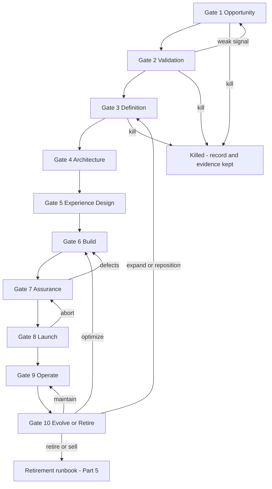

# Part 4 — SaaS Product Factory

**Crucible Systems** (working name) · Companion to Parts 1–3
Version 0.1 — Draft for founder review · Labeling convention from Part 1 applies ([Fact] / [Assumption] / [Recommendation] / [Experiment] / [Decision] / [Open question])

**Scope of this part:** the repeatable ten-gate lifecycle every product passes through — entry/exit criteria, required artifacts, agent-vs-human responsibility, FORGE/Tribunal binding, per-gate cost envelopes, the core artifact templates, and a worked end-to-end illustrative example. Post-launch operations (the day-to-day content of Gates 9–10) are Part 5's scope; this part defines the gates themselves.

---

## 1. Factory Principles

1. **Evidence before build; kill early, kill cheap.** Gates 1–5 together cost days and hundreds of dollars; Gate 6 costs weeks and thousands. The factory's economic job is to make sure bad ideas die on the cheap side of that line. Killed products keep their registry records — exploration cost amortizes across the portfolio.
2. **Gates are decisions, not paperwork.** Every gate produces a registered decision (Part 2 record format) with an owner, conditions, dissent, and expiry. An artifact that doesn't change a decision is deleted from the required list, not padded.
3. **Pre-registered thresholds.** Every experiment (Gate 2 especially) states its metric, threshold, sample, duration, and decision rule **before** it runs. We do not cite "industry-average conversion rates" — benchmarks vary too wildly to be honest evidence — we register our own bar and hold ourselves to it. **[Recommendation — anti-rationalization rule]**
4. **Payment intent outranks applause.** The demand-evidence hierarchy at Gate 2: paid pre-orders or signed paid-pilot commitments ≻ activated trial usage ≻ landing-page conversion vs pre-registered threshold ≻ interview enthusiasm. Interviews alone never pass Gate 2. **[Recommendation]**
5. **WIP limit: one product in Gates 3–8 at a time** until Phase 4 cells exist (Part 1 roadmap M7/M8). Parallel exploration is allowed only at Gates 1–2, where it is cheap. **[Recommendation]**
6. **Launch-product constraints inherited from Part 1 (A8):** no regulated domains, low data sensitivity, web + API only, business-hours support expectations, niche reachable at 60–170 customers for the $29–99/month sanity check.

---

## 2. Factory Flow

**Diagram explanation:** The happy path runs 1→10 left to right, but the valuable edges are the others. Kill exits from Gates 1–3 are successes of the system, not failures of the idea's sponsors — the record is kept so the same idea isn't re-explored from zero. Gate 2 can loop back to Gate 1 when the signal is weak rather than absent (reframe, don't force). Gate 7 loops to Gate 6 until assurance passes — there is no "ship with known criticals" edge, by construction. Gate 8 can abort back to assurance. Gate 10 is a rotary, not a terminus: expand and reposition re-enter at Definition (scope changes need re-deciding), optimize re-enters at Build, maintain orbits Operate, and retire/sell hands off to the Part 5 retirement runbook. The loop G9→G10→G3/G6 *is* FORGE's Evaluate-feeds-Frame promise made physical.

---

## 3. FORGE and Tribunal Binding per Gate

| Gate | FORGE phase | Gate decision tier | Decider (per Part 2 authority matrix) |
|---|---|---|---|
| 1 Opportunity | Frame | T2 (mini-tribunal optional below threshold) | CEO |
| 2 Validation | Oppose (Investigate + Challenge) | **T2 mandatory** — go/no-go with pre-registered evidence | CEO |
| 3 Definition | Resolve | T2 | CEO (CTO consulted) |
| 4 Architecture | Resolve | T2; **T3 for foundational choices** (stack, data model, build-vs-buy with lock-in) | CTO |
| 5 Experience | Generate (design) | T1–T2 | CEO |
| 6 Build | Generate | T1 per change; T2 for schema/dependencies (Part 2 matrix) | CTO |
| 7 Assurance | Generate (verify) | T2 sign-off set | CTO (CEO for legal items) |
| 8 Launch | Generate (release) | **T3** | CEO + CTO jointly |
| 9 Operate | Evaluate (observe) | Continuous; incidents per Part 5 | CTO / Ops |
| 10 Evolve or Retire | Evaluate (evolve) | T2 quarterly; **T3 for retire, sell, merge, reposition** | CEO |

---

## 4. Per-Gate Cost Envelopes **[Assumption — calibrated in Phase 2; re-approval required at 125% of cap]**

| Gate | AI spend | Human hours | Calendar | Other cash |
|---|---|---|---|---|
| 1 | $30–80 | 4–8 h | 3–5 days | — |
| 2 | $50–150 | 15–30 h (humans conduct interviews) | 2–4 weeks | $500–2,000 experiments (Part 1 budget line) |
| 3 | $80–200 | 6–10 h | ~1 week | — |
| 4 | $100–250 | 8–12 h | ~1 week | — |
| 5 | $60–150 | 6–10 h | ~1 week | $100–300 usability-test incentives |
| 6 | $800–2,500 | 15–30 h | 4–8 weeks | — |
| 7 | $150–400 | 10–20 h | 1–2 weeks | $3,000–8,000 external pentest (first product; risk-based after) |
| 8 | $50–150 | 8–15 h | 3–5 days | — |
| 9 | $150–400 / month | 4–8 h / week | ongoing | infra per product |
| 10 | $30–80 per review | 3–5 h | quarterly | — |
| **Through launch (G1–G8)** | **≈ $1,300–3,900** | **≈ 70–125 h** | **≈ 12–20 weeks** | experiments + pentest |

Consistent with Part 1's Phase 2 duration and monthly AI envelope. The Gate 6 cap is the one that bites: crossing 125% of the approved envelope freezes the build and forces a scope-cut-or-re-approve decision (T2) — the anti-sunk-cost mechanism.

---

## 5. Gate Specifications

Format per gate: purpose · entry · required artifacts (spec §8, unabridged) · exit criteria · who does what · kill/loop triggers. Agent/human assignments follow the Part 2 RACI exactly.

### Gate 1 — Opportunity

| Field | Content |
|---|---|
| Purpose | Decide whether a problem deserves two weeks of validation money |
| Entry | An idea framed via the Opportunity One-Pager (template §6.1) |
| Artifacts | Problem statement · customer segment · market evidence (source-tagged or explicitly `[Assumption]`) · competitor analysis · initial revenue hypothesis (the 60–170-customer sanity check) · strategic fit note |
| Exit | CEO-approved T2 record: proceed to validation with a named experiment budget |
| Agents / Humans | Research + PM agents draft (R); CEO decides (A); CTO informed |
| Kill triggers | Segment unreachable by founders' channels · violates A8 constraints · revenue hypothesis fails arithmetic |

### Gate 2 — Validation

| Field | Content |
|---|---|
| Purpose | Buy evidence of demand before buying a build |
| Entry | Approved Gate 1 record + **pre-registered experiment plan** (template §6.2) filed *before* any experiment runs |
| Artifacts | Customer interview synthesis (interviews conducted by humans, guides and synthesis by agents) · landing-page experiment results vs pre-registered threshold · demand evidence per the §1.4 hierarchy · pricing experiment · risk analysis · go/no-go recommendation |
| Exit | T2 go/no-go by CEO. **Go requires at least one payment-intent signal** (pre-order, signed paid-pilot LOI, or paid deposit) or an explicitly recorded, Tribunal-reviewed exception with reasons **[Recommendation]** |
| Agents / Humans | Research agent (R evidence pack); Docs agent (R landing copy, CEO-approved before publish); CEO (A, conducts interviews); Cost Sentinel meters experiment spend |
| Kill / loop | Threshold missed → kill or one reframe loop to Gate 1 (max one) · interviews contradict problem framing → Gate 1 · **no rationalizing a miss after the fact — the pre-registered rule decides** |

### Gate 3 — Definition

| Field | Content |
|---|---|
| Purpose | Freeze what the MVP is — and, more importantly, what it is not |
| Entry | Go decision from Gate 2 |
| Artifacts | Product vision · business requirements document · product requirements document (skeleton §6.3) · user stories · use cases · acceptance criteria · non-functional requirements (starter checklist §6.4) · **MVP boundary doc (binding; changes are T2)** · success metrics wired to Gate 9 SLOs/analytics |
| Exit | CEO approves PRD pack (T2, CTO consulted); every story has acceptance criteria; every metric has a planned instrument |
| Agents / Humans | PM agent (R); QA agent (C — testability review of acceptance criteria); CEO (A); CTO (C) |
| Kill triggers | MVP cannot fit the Gate 6 cost envelope → descope or kill |

### Gate 4 — Architecture

| Field | Content |
|---|---|
| Purpose | Choose the smallest architecture that serves the MVP, with lock-in eyes open |
| Entry | Approved PRD pack |
| Artifacts | System context diagram · container diagram · component diagram · deployment diagram · data model · API design · security architecture · **threat model** · build-vs-buy decisions (each a registry record with exit path — cf. worked example DR-2026-014 in Part 2 §7.8) · ADRs |
| Exit | CTO approval; T3 Tribunal for foundational choices; threat model has an owner per unmitigated item; product runs in the **product cloud account** (Part 3 §1.1) with its own Gate-4-set RTO/RPO |
| Agents / Humans | Architect agent (R); Security agent (C, may block); CTO (A); Tribunal for T3 items |
| Kill / loop | Architecture cannot meet NFR cost-per-customer ceiling → back to Gate 3 |

### Gate 5 — Experience Design

| Field | Content |
|---|---|
| Purpose | A usable product without pretending we have a design department |
| Entry | Approved architecture pack |
| Artifacts | User journeys · information architecture · wireframes (PM agent + established design system, per Part 2 §3.1) · design-system selection note · **accessibility requirements (WCAG 2.1 AA target [Recommendation])** · clickable prototype · usability-test findings (3–5 external testers **[Assumption]**, incentives budgeted) |
| Exit | CEO approves (T1–T2); usability tasks pass with the pre-registered success rate; accessibility requirements enter the QA plan |
| Agents / Humans | PM agent (R); Docs agent (C copy); CEO (A); human testers |
| Loop | Task-success below bar → revise and retest once; twice → revisit Gate 3 scope |

### Gate 6 — Build

| Field | Content |
|---|---|
| Purpose | Implement the frozen MVP through the Part 3 pipeline, measuring the company's central bet (A1) |
| Entry | Approved design pack; repo + CI scaffolded per Part 3 §9 |
| Artifacts | Development plan (feature slices) · repository structure & coding standards · branching strategy (**trunk-based, short-lived branches [Recommendation]**) · implemented features · unit + integration tests · developer and user documentation |
| Exit | All MVP stories done per acceptance criteria; pipeline green; **rework % and human-hours-per-feature recorded per slice** (feeds A1 and M5) |
| Agents / Humans | Engineer agents (R); Code Reviewer agent (R review, different model family); CTO (A, merge gate); schema/dependency changes T2 |
| Kill / loop | 125% envelope rule (§4) → freeze, descope or re-approve · MVP-boundary change requests → T2, logged against scope-creep metric |

### Gate 7 — Assurance

| Field | Content |
|---|---|
| Purpose | Independent verification before anything meets a customer |
| Entry | Build exit met |
| Artifacts | QA report vs acceptance criteria · security review (SAST, dependency + secret scans, threat-model recheck, **external pentest for product #1**; risk-based thereafter) · performance report vs NFR budgets · privacy review (data map, retention, deletion path works end-to-end) · accessibility review (automated + manual sample vs the WCAG 2.1 AA **target, with gaps documented** — full conformance is a Growth item, per Part 7 FLAG-5) · operational readiness (runbooks, alerts configured, backups **tested**, support macros drafted) · legal review where required (ToS, privacy policy, DPA posture live; A5 provider-terms closure confirmed) |
| Exit | CTO sign-off set complete (T2); CEO signs legal items; **zero known critical or high defects — no "ship with criticals" path exists** |
| Agents / Humans | QA + Security agents (R); pentest vendor; CTO (A); counsel (C) |
| Loop | Any critical/high → Gate 6, re-verify changed areas |

### Gate 8 — Launch

| Field | Content |
|---|---|
| Purpose | Controlled, reversible entry into the market |
| Entry | Assurance sign-offs complete; launch checklist (§6.5) green |
| Artifacts | Deployment plan · rollback plan (rehearsed) · monitoring dashboards live · alerting rules active · support procedures + macros · customer communication · release notes · incident contacts |
| Exit | **T3 joint CEO+CTO decision.** Staged rollout: design partners → public **[Recommendation]**; CTO executes the deploy per Part 2 authority |
| Agents / Humans | DevOps agent (R prep); Docs agent (R comms, CEO-approved); Ops Monitor armed; CEO+CTO (A) |
| Abort | Any checklist item red at go/no-go → abort to Gate 7; aborts are logged, not shamed |

### Gate 9 — Operate

| Field | Content |
|---|---|
| Purpose | Run the product as a measured system (full detail: Part 5) |
| Entry | Launched |
| Artifacts (living) | SLOs + SLIs (e.g., availability 99.5%, p95 latency budget, support first-response ≤ 1 business day **[Assumption]**) · support metrics · cost metrics incl. cost-per-customer · product analytics vs Gate 3 success metrics · security monitoring · customer feedback stream into the registry · monthly reliability report |
| Exit | Not an exit — a cadence: weekly ops review (Part 2 calendar), monthly reliability report, quarterly Gate 10 |
| Agents / Humans | Ops Monitor, Support, Cost Sentinel agents (R); CTO/Ops (A); incidents per Part 5 |

### Gate 10 — Evolve or Retire

| Field | Content |
|---|---|
| Purpose | Force an explicit portfolio decision every quarter — drift is not an option |
| Entry | Quarterly, or on an evidence-expiry trigger, or on sustained SLO/finance breach |
| Artifacts | Quarterly product review: metric trends vs Gate 3 targets, unit economics, churn analysis, feature adoption (kill unused features — they are attack surface and maintenance load), feedback synthesis, cost trajectory |
| Outcomes | **Expand · Optimize · Reposition · Merge · Maintain · Sell · Retire** — each a registered decision; retire/sell/merge/reposition are T3 (CEO) and hand to the Part 5 retirement/migration runbook with customer-respecting notice, export, and refund terms |
| Agents / Humans | PM + Cost Sentinel + Ops Monitor (R evidence); Tribunal for T3; CEO (A) |

---

## 6. Core Artifact Templates

### 6.1 Opportunity One-Pager (Gate 1)

Problem statement (one paragraph, in the customer's words where possible) · Who has it (segment, reachable how, roughly how many — source or `[Assumption]`) · How they cope today (competitors/workarounds, with links) · Why now · Initial revenue hypothesis (price point × plausible customer count vs the 60–170 sanity check) · Strategic fit (A8 constraint check) · Top three assumptions with proposed validation · Requested Gate 2 experiment budget · Confidence (0–1) and what would change it.

### 6.2 Experiment Pre-Registration (Gate 2 — filed before running anything)

Hypothesis · Metric · **Threshold (the bar, chosen now)** · Sample / audience and how sourced · Duration · Decision rule ("≥ threshold → proceed; below → kill or one reframe") · Budget · What would make this result untrustworthy (confounds) · Registered by / date. *One form per experiment; the go/no-go record must cite these forms and may not reinterpret a miss.*

### 6.3 PRD Skeleton (Gate 3)

1 Vision & problem recap → 2 Users & jobs-to-be-done → 3 Success metrics (each mapped to a Gate 9 instrument) → 4 Scope: user stories — `As a <role>, I want <capability>, so that <outcome>` — each with acceptance criteria in `Given / When / Then` → 5 **Out of scope (the binding MVP boundary)** → 6 Non-functional requirements (§6.4) → 7 Dependencies & integrations → 8 Risks & open questions → 9 Release definition (what "MVP done" means, verbatim testable).

### 6.4 NFR Starter Checklist (Gate 3, verified at Gate 7)

Availability target & maintenance-window policy · performance budgets (p95 per key action) · capacity assumptions (tenants, data volume) · security baseline (authN/Z model, encryption in transit/at rest, audit of admin actions) · privacy (data map, retention, deletion SLA, DPA posture) · accessibility (WCAG 2.1 AA target; gaps documented — Part 7 FLAG-5) · observability (SLIs instrumented from day one) · supportability (admin tools, feature flags where risky) · **cost ceiling per customer at target price [Recommendation — an NFR, not an afterthought]** · data export (customer's data is exportable — required for honest Gate 10 retirement).

### 6.5 Launch Readiness Checklist (Gate 8 — all boxes or no launch)

☐ Assurance sign-offs on record (QA, security, performance, privacy, accessibility, ops, legal) ☐ Rollback rehearsed on staging ☐ Dashboards + alerts live and tested with a synthetic incident ☐ Backups + restore verified on prod infrastructure ☐ Support inbox, macros, and escalation path staffed for business hours ☐ ToS/privacy published; billing tested end-to-end incl. refund path ☐ Release notes + customer comms approved ☐ Incident contacts + on-call schedule (founders) posted ☐ Status-page or notification channel ready ☐ Go/no-go T3 record signed by CEO + CTO.

---

## 7. Worked Example — One Product Through the Factory

> **Entirely illustrative (reality-first rule 2.3).** "RenewBase" and every number below are placeholders demonstrating the *required shape* of evidence and records — not real market data, not a product recommendation. The real product #1 earns its way through these gates in Phase 2.

**Concept:** RenewBase — renewal tracking for small managed-IT providers (MSPs): client software licenses, renewal dates, and margin per renewal. Fits A8: B2B, low-sensitivity business data, web + API, business-hours support, niche plausibly reachable at 60–170 customers.

| Gate | Illustrative passage |
|---|---|
| 1 | One-pager filed; revenue hypothesis $49/mo × 150 MSPs; competitors = spreadsheets + two horizontal tools; DR-2026-021 approves a $900 validation budget |
| 2 | Pre-registered: landing conversion ≥ 4% of qualified visitors; ≥ 3 paid-pilot LOIs from 12 CEO-conducted interviews. Result: 5.1% and 4 LOIs at $39–59 tolerance → **go**, DR-2026-024, with condition: pilot pricing $49 revisited at 25 customers; dissent preserved (Cost Controller: churn risk if tool is seasonal) |
| 3 | PRD v1: 11 stories; boundary doc excludes PSA integrations, multi-currency, and reseller tiers from MVP; success metrics: 30-day activation ≥ 60% of pilots, weekly-active ≥ 40% **[illustrative thresholds]** |
| 4 | Modular monolith in the product account; managed Postgres; auth = managed provider per the pattern of DR-2026-014 (exit path documented); threat model: top risks = tenant isolation, CSV-import injection, notification abuse — all with owners; RTO 8h/RPO 4h set |
| 5 | Design-system reuse; prototype tested with 4 MSP operators; task success 3/4 on first pass, nav relabeled, retest 4/4 |
| 6 | 6 weeks; 9 slices; measured rework 22% of agent PRs required human-directed changes (A1 within target); one T2 schema change; envelope 92% consumed |
| 7 | QA green; pentest: 0 critical, 2 medium (fixed, re-verified); deletion path demo recorded; accessibility manual sample passed; ops runbooks + tested backups; ToS/DPA live |
| 8 | Soft launch to the 4 LOI pilots (converted to paid), two weeks, then public; T3 go signed CEO+CTO; rollback rehearsed |
| 9 | SLOs met in month 1 except one 40-min incident (postmortem filed); cost-per-customer $3.10 vs $6 ceiling; activation 58% — just under target, flagged |
| 10 | Quarter 1 review: **Optimize** — fix activation funnel before any expansion; two unused features scheduled for removal; decision expires in one quarter or at 50 customers |

**What the example is for:** every row corresponds to a registry record a future audit could pull; the numbers show where thresholds live, not what they will be.

---

## 8. Portfolio Rules (pre-Phase 4)

One product in Gates 3–8 (§1.5) · a second product may enter Gate 3 only after product #1 reaches M7 (positive contribution margin, Part 1 roadmap) · Gate 1–2 explorations capped at two concurrent, from the marketing-experiment budget · every killed idea's registry record is linked from any future similar Gate 1 (the anti-re-litigation rule) · Gate 10 outcomes are portfolio decisions and may reallocate the whole envelope.

---

## 9. Self-Review of Part 4 (per spec §11)

### 9.1 Recommendation Review

| Item | Assessment |
|---|---|
| **Strongest reason to adopt** | It attacks the highest-likelihood risk in the whole company (R8, market risk) at the cheapest point: Gates 1–5 cost days and hundreds of dollars; the payment-intent rule and pre-registration make the go/no-go resistant to founder self-persuasion. |
| **Strongest reason to reject** | Gate overhead for a 2–3 person team; disciplined indie builders sometimes win by shipping fast and iterating in public, eating higher kill costs in exchange for speed. |
| **Main unproven assumption** | That small-n validation (a dozen interviews, one landing test, a few LOIs) predicts 90-day revenue in our niches. Small samples mislead; pre-registration reduces self-deception, not variance. |
| **Most dangerous hidden risk** | Evidence laundering — agent-synthesized "market evidence" acquiring false authority in the registry. Mitigations: provenance rules, human-conducted interviews, verifiable-source-or-`[Assumption]` labeling, Evidence Validator citing verified entries only. |
| **Cheapest viable alternative** | No formal gates: build in two weeks, launch, watch. Honest note: at Gate-1-idea scale this is sometimes rational; it is rejected here because Gate 6 for us is a four-figure, multi-week commitment whose failures also pollute the A1 measurement. |
| **More scalable alternative** | A formal design-partner program and validation tooling (Phase 3), plus per-cell factory instances (Phase 4). |
| **Evidence still required** | Predictive validity: track each product's Gate 2 signal against its actual 90-day revenue and 6-month retention, building the portfolio's own calibration curve. |
| **Confidence level** | ~7/10 in the gate structure; ~5/10 in small-sample validation predictiveness — which is exactly why kill thresholds are pre-registered and envelopes capped. |
| **Final recommendation** | Adopt. Enforce the payment-intent rule without exception-creep; keep Gates 1 and 3–5 measured in days; let Gate 2 take the weeks it needs. |

### 9.2 Red-team findings and embedded countermeasures

Gate theater (artifacts to pass, not to decide) → every gate exit is a registry decision with expiry; artifact lists trimmed to decision-changing items · post-hoc rationalization of weak experiments → pre-registration rule; the form decides, not the mood · signup vanity metrics → payment-intent hierarchy; conversion counts only against a pre-registered bar · sunk-cost creep in Build → 125% freeze rule; scope changes are T2 and counted · scope creep via "small additions" → binding MVP boundary doc; adoption review at Gate 10 removes unused features · designer gap → design-system reuse + external usability testers as the compensating control · founder-interview bias → structured guides, recorded synthesis, dissent preserved in the go/no-go record.

### 9.3 Scores (spec §11.2)

Practicality 8 · Cost efficiency 8 · Security 7 · Scalability 7 · Maintainability 7 · **Customer value 8** (this part is the company's customer-value engine) · Time to market 7 · Regulatory readiness 6 · Human controllability 9 · Innovation 7.

---

## 10. Open Questions and Next Steps

**[Open question]** Ratify the Gate 2 payment-intent rule's exact bar (LOI count / pre-order value) · usability-tester sourcing channel and incentive level · whether Gate 5 prototypes are clickable mockups or thin live builds (spike in product #1) · pentest vendor shortlist (ties to Part 1 one-time budget) · the two Gate 1–2 exploration slots' selection criteria for Phase 0's candidate list.

**What Part 5 — Operations and Maintenance — will deliver:** the Product Continuity and Evolution division in full — monitoring plan and alert matrix, incident management with severity ladder and postmortem template, problem/bug/patch/dependency-update policies with SLAs, support model and escalation paths, SLA/SLO frameworks per product, capacity and cost management, feedback and knowledge-base loops, backup validation and DR testing cadence, and the product retirement and data-migration runbooks that Gate 10 hands into.

---

*End of Part 4. The factory's job is to make killing cheap ideas cheap, building good ones measured, and operating launched ones the subject of Part 5.*
