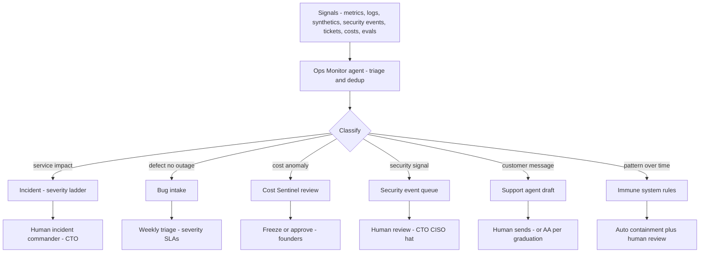

# Part 5 — Operations and Maintenance

**Crucible Systems** (working name) · Companion to Parts 1–4
Version 0.1 — Draft for founder review · Labeling convention from Part 1 applies ([Fact] / [Assumption] / [Recommendation] / [Experiment] / [Decision] / [Open question])

**Scope of this part:** the Product Continuity and Evolution division in operating detail — monitoring and alerting, SLOs/SLAs and error budgets, incident/problem/bug management, patching and dependency policy, release management after launch, capacity and cost management, support and customer success, analytics and feedback loops, backup validation and DR testing, the Organizational Immune System MVP, and the retirement and data-migration runbooks Gate 10 hands into. This is Gate 9 and Gate 10 as a daily reality.

---

## 1. Operating Principles

1. **Most of a product's life is after launch.** The division exists because Evaluate is a phase equal to Build (Part 3's loop), not a tail. Maintenance work is scheduled, budgeted, and measured like feature work.
2. **Sell less than you measure.** External SLA commitments sit below internal SLOs (e.g., commit 99.0% while targeting 99.5% **[Assumption]**). A 2–3 person company that sells 24/7 support is lying; we sell business-hours support and staff a best-effort SEV1 pager after hours — stated plainly in the SLA. (24/7 was a Rejected Concept in Part 1 §3.)
3. **The automation ladder.** Every operational task climbs: *observe → draft → act-with-approval → act-with-sampling* — and each rung is granted per category by evidence (eval scores, acceptance rates), never by optimism, and every rung has an auto-recall path back down.
4. **Every alert has an action and an owner, or it is a report, not an alert.** **[Recommendation — the anti-fatigue rule]** Alert precision (pages that led to action ÷ pages) is itself a monthly metric; alerts below the bar are retuned or demoted.
5. **Drills are the proof.** Backups count when restores succeed; rollbacks count when rehearsed; runbooks count when a drill executed them. Job-success logs are not evidence.

---

## 2. Division at Work — Signal Routing

**Diagram explanation:** Everything the company can sense flows through one triage point (the Ops Monitor agent) so duplicates collapse before humans see them. Classification routes to six queues, and the human hand appears exactly where Part 2's authority matrix demands it: incidents always get a human commander; security signals always reach the CISO hat; cost anomalies can auto-freeze an agent's spend but a human decides resumption; support drafts are sent by humans until a category graduates (§8.2); slow-burn patterns feed the Immune System's threshold rules (§11), whose containment actions (suspend a role, pause a release train) are reversible and always paired with human review. Nothing in this diagram grants an agent a new authority — it only moves work to the right queue faster.

---

## 3. Monitoring Plan

**Per product:** availability synthetics (external probe on the golden path), error rates, p95 latency per key action, saturation (DB, queue depth), billing-webhook health, auth anomalies, dependency CVE feed, backup-verification job, cert expiry, cost per customer. **Platform (from Part 3 §10):** run failure/escalation rates, budget consumption, `awaiting_human` latency, outbox age, dead-letter arrivals, eval-score trends. **Instrumentation is a Gate-3 NFR** — SLIs exist from day one, not retrofitted. Dashboards: one per product (SLOs, funnel, cost), one platform, one spend. Security monitoring: cloud audit logs, WAF/rate-limit events, admin-action audit — reviewed weekly, alerted on thresholds below.

## 4. Alert Matrix (launch set — thresholds **[Assumption]**, tuned monthly per §1.4)

| Signal | Threshold | Sev | First responder | Escalates to | Target response |
|---|---|---|---|---|---|
| Golden-path synthetic fails | 2 consecutive probes | SEV1 | Ops Monitor pages | CTO (commander) | 15 min bus. hrs / 60 min after-hrs best-effort |
| Error rate | > 5% of requests, 10 min | SEV2 | Ops Monitor | CTO | 1 business hour |
| p95 latency | > 2× budget, 30 min | SEV3 | Ops Monitor | DevOps agent → CTO | Next business day |
| Data-loss or breach indicator | any | SEV1 | Ops Monitor pages | CTO + CEO (+counsel per Part 2) | Immediate |
| Backup-verify job fails | 1 failure | SEV2 | DevOps agent retry + report | CTO | Same business day |
| Billing webhook failures | > 3 in 1 h | SEV2 | Ops Monitor | Ops lead | 1 business hour |
| Critical CVE in a dependency | CVSS ≥ 9 | SEV2 | Security agent drafts patch PR | CTO | Patch clock starts (§7) |
| Agent daily spend | > 2× trailing 14-day median | — | Cost Sentinel auto-freezes that agent | Founders | Resume is a human decision |
| Governance pool | ≥ 80% / 100% monthly | — | Cost Sentinel | Founders | Review / hard stop |
| Cert expiry | < 14 days | SEV3 | DevOps agent renews | CTO | 2 business days |
| Support first-response SLA breach risk | Queue age > 75% of SLA | — | Support agent re-prioritizes | Ops lead | Same day |
| Eval score drop (any role) | > 10% vs baseline | — | Eval harness | Role's human owner | 3 business days |

## 5. SLO / SLA Framework and Error Budgets

**Per product at launch [Assumption, set finally at Gate 3/8]:** SLO availability 99.5% monthly (≈ 3.6 h budget), external SLA 99.0% with service credits; p95 latency budgets per key action; support first response ≤ 1 business day (SLA) with internal target of 4 business hours; business-hours definition and holidays published. **Error-budget policy [Recommendation]:** when a product's monthly error budget is exhausted, the release train (§9) carries reliability work only, until burn returns under budget; early unfreeze is a T2 decision with reasons on record. SLA reviews quarterly (Part 2 calendar); credits issued proactively when we notice before the customer does — cheaper than churn and honest besides.

---

## 6. Incident, Problem, and Bug Management

### 6.1 Severity ladder

| Sev | Definition | Response target | Command |
|---|---|---|---|
| SEV1 | Product down, data-loss risk, or suspected breach | 15 min business hours; 60 min after-hours best-effort pager **[honest capacity, stated in SLA]** | CTO is incident commander; CEO joins for customer/disclosure decisions |
| SEV2 | Major feature broken or significant degradation | 1 business hour | CTO or Ops lead |
| SEV3 | Minor impairment, workaround exists | Next business day | Weekly triage |
| SEV4 | Cosmetic | Backlog | Triage |

**During an incident:** a human commands, always (Part 2). Agents work for the commander: Ops Monitor maintains the live timeline and correlates signals; DevOps agent prepares (never executes) mitigations; Docs agent drafts status updates — **customer-facing incident comms are human-approved; breach disclosure is CEO + counsel, T3** (Part 2 authority matrix). Status channel updated at a stated cadence even when the update is "still investigating."

### 6.2 Post-incident review (blameless; due ≤ 5 business days)

Template fields: incident ID · severity · duration · customer impact (accounts, minutes, data) · agent-drafted timeline (human-verified) · contributing causes (systems and conditions, not names) · what worked / what didn't · **detection gap** (why didn't we see it sooner?) · action items — each a registry record with owner, due date, and expiry · lessons → `memory_entries(layer='lesson')`, verified by human sign-off per Part 3 §8. SEV1/SEV2 reviews are mandatory; a skipped review is itself a policy violation the Immune System flags.

### 6.3 Problem management

Same alert or incident signature 3× in 7 days **[Assumption]** → auto-opened problem record linking the incidents; problems get root-cause work on the release train ahead of features; monthly report lists open problems by age — an aging problem list is a leading indicator the Immune System watches.

### 6.4 Bug management

Intake from support, monitoring, agents, and customers converges in one tracker. Triage SLAs: critical (data integrity/security) — immediate, patch clock starts; high — into the current train; medium — within 2 trains; low — quarterly sweep or Gate-10 removal candidate. **Escaped-defect rate** (bugs found in prod per release) is the M6 metric and feeds reviewer-agent accuracy factors (Part 2 §7.6). Weekly bug review is part of the ops review, not a separate ceremony.

---

## 7. Patch, Dependency, and Security-Update Policy

| Class | Policy | Clock **[Assumption]** |
|---|---|---|
| Security patch, CVSS ≥ 9 or actively exploited | Emergency path: patch PR (Security agent) → Reviewer → human merge → expedited release; workaround/mitigation immediately if patch unavailable | ≤ 48 h |
| Security patch, CVSS 7–8.9 | Current release train | ≤ 7 days |
| Security patch, CVSS 4–6.9 | Next train | ≤ 30 days |
| Low severity | Batched | Next monthly batch |
| Routine dependency updates (patch/minor) | DevOps agent opens weekly batch PRs; green CI + Reviewer approval = T1 merge | Weekly batch |
| Major-version dependency upgrades | T2 with migration note and rollback plan | Scheduled deliberately |
| Model/provider version changes | T2 + mandatory green regression evals (Part 3 §6.2) | As needed |

Pinned versions and lockfiles everywhere; the CVE feed is monitored continuously, not quarterly. Patch compliance (actual vs clock) is a monthly report line.

---

## 8. Release Management After Launch, and Support

### 8.1 Release trains

Weekly standard train **[Assumption]** through the full Part 3 pipeline (agent review + human gate — unchanged forever for prod). Expedited (SEV2 fixes) and emergency (SEV1/security) paths exist with the same approvals, compressed. Change freeze: error-budget exhaustion (§5), active SEV1, or founder unavailability below deputy coverage. Rollback rehearsal quarterly (Parts 2–3 drills). Feature flags for risky paths arrive with Growth (Part 3) — until then, risky changes ship as staged releases to a pilot cohort first.

### 8.2 Customer support model

Channels: email + in-app; hours: business hours in the product's stated timezone; language(s): set per product's target market at Gate 3 **[Open question until product #1 is chosen]**. Ladder per §1.3: KB self-serve → **AI-drafted, human-sent** (launch) → **AI-sent with 10% sampling** per category. **Graduation criteria [Recommendation]:** a category graduates to AI-sent only after ≥ 100 tickets with ≥ 95% draft acceptance without major edits **[Assumption]**; sampling continues forever; acceptance dropping below 90% auto-recalls the category to draft-only. **Never AI-sent regardless of stats:** security reports, legal threats, billing disputes, cancellation saves, anything touching the Part 2 escalation list. Refunds per authority matrix (Ops ≤ $200). CSAT measured per resolved ticket; support→product loop: every ticket carries a product-area tag feeding Gate 10 reviews.

### 8.3 Customer success and knowledge base

Success at launch scale = an onboarding checklist per account, activation monitoring against the Gate-3 metric, a churn-risk signal list (usage drop, billing failure, unresolved SEV impact), and founder-led save conversations. KB loop: Support agent proposes articles from resolved tickets → human approves → article deflection tracked; stale articles (product changed) are flagged by release notes diffing. Formal success tooling is Phase 3.

---

## 9. Performance, Availability, Capacity, and Cost Management

Monthly review (Part 2 calendar) covers: SLO attainment and error-budget burn · p95 trends vs budgets · capacity headroom (DB storage, connections, queue depth) with a forecast trigger at 70% sustained **[Assumption]** · unit infrastructure cost per customer vs the Gate-3 NFR ceiling · rightsizing actions (DevOps agent proposes, T1/T2 by size) · AI-spend per product and per agent vs budgets. Performance optimization work enters the train through the same gates as features — measured before/after, no vibes-based tuning.

---

## 10. Production Analytics, Adoption, Churn, and Feedback

Monthly product review pack (feeds Gate 10): funnel and activation vs Gate-3 targets · feature-adoption table — **features unused by < 5% of active accounts for two consecutive quarters become removal candidates [Recommendation]** (unused features are attack surface plus maintenance load, per Part 4 G10) · churn: count, cohort, stated reasons (exit survey), preventable-vs-not classification · revenue and expansion signals · feedback synthesis: support tags + interviews + in-app signals, clustered by the PM agent with provenance links, entering the registry as `[Assumption]`-class evidence until validated. Nothing in this pack is agent-invented: every claim links a query, a ticket, or a recorded conversation.

## 11. Backup Validation and DR Testing

Daily automated backup **verification** (restore-to-temporary + checksum + row counts — not just job success, per §1.5) · quarterly full restore drill on production-like infrastructure with timed RTO/RPO vs the Gate-4 targets, results in the registry · annual DR scenario test per product (region loss tabletop + platform-loss live test — platform loss must demonstrably leave products running, Part 3 §1.1) · restore credentials and runbooks tested by the *deputy*, not just the primary — the bus-factor control · game days with injected failures are **[Experiment]** until Phase 3.

## 12. Organizational Immune System — MVP (spec §12.3, made boring on purpose)

Launch implementation = scheduled queries + threshold rules over data we already collect. The ML/behavioral version stays **[Experiment]**.

| Signal | Detector (MVP) | Automatic containment | Human follow-up |
|---|---|---|---|
| Repeated failures | Same incident/alert signature 3× / 7 days | Problem record auto-opened | Root cause on the train (§6.3) |
| Cost anomaly | Agent spend > 2× trailing median; pool ≥ thresholds | Freeze that agent's spend | Founders decide resumption |
| Policy violations | Tool-call denials by the policy engine, 3× same agent | Suspend role to draft-only | Owner review ≤ 3 business days |
| Hallucination pattern | Eval-score drop > 10%; citation-to-nonexistent-source detections | Role to draft-only; outputs quarantined `unverified` | Owner review; golden-set update |
| Declining quality | Escaped defects rising 2 consecutive releases | Release train pauses features | Gate-10-style review |
| Suspicious behavior | Egress denials, out-of-scope tool attempts | Kill the run; rotate its token | Security review same day |
| Governance drift | Escalation rate outside the 5–15% band (Part 2) | — | Re-tier thresholds at the monthly council |

Every containment above is **reversible** and paired with review — the immune system may pause and quarantine; it may never fire anyone, delete anything, or expand any authority.

## 13. Product Retirement and Data Migration Runbooks

### 13.1 Retirement (entered only via a Gate-10 T3 decision, CEO + counsel check of contractual commitments)

```mermaid
flowchart LR
    DEC[T3 retire decision plus legal check] --> PREP[Prep - export tools verified, FAQ, migration guide, alternatives list]
    PREP --> ANN[Announce - 90 days notice, stop new signups, stop renewals beyond sunset]
    ANN --> MIG[Migration window - priority support, export SLA 5 business days]
    MIG --> REF[Pro-rata refunds for prepaid periods beyond sunset]
    REF --> SUN[Sunset day - read-only 30 days]
    SUN --> DEL[Deletion per schedule plus deletion record]
    DEL --> TEAR[Infra teardown, sunset page 12 months]
    TEAR --> LL[Lessons review to registry, code and docs archived]
```

**Diagram explanation:** The runbook's non-negotiables — ≥ 90 days notice **[Assumption; longer if contracts say so]**, working self-serve export from day one (a Gate-3 NFR precisely so retirement can be honest), pro-rata refunds, and a read-only grace period — exist because a badly run retirement converts a contained product failure into a reputation failure across the whole portfolio. Deletion is executed by a human, dual-logged (Part 2 authority matrix), with a written deletion record retained; legally required records are excluded from deletion and listed explicitly. The lessons review asks one question with registry teeth: which Gate 1–2 evidence did production contradict, and what does that recalibrate?

### 13.2 Data migration (retirement-to-successor or product merge)

Schema-mapping document (human-approved) → dry-run migration with row-count and checksum validation → pilot cohort dual-run window → cutover with a rollback point and a stated abort rule → post-cutover reconciliation report → customer comms at every stage drafted by Docs agent, human-approved. Migrations are T2 minimum, T3 when irreversible.

## 14. The Maintenance Calendar (everything above, as one honest schedule)

| Cadence | Work |
|---|---|
| Daily (automated) | Backup verify, synthetics, CVE feed, cost rollups, eval smoke set |
| Weekly | Dependency batch PRs · bug triage · release train · ops review (SLOs, queues, spend) |
| Monthly | Reliability report · cost/capacity review · canary defects (Part 2) · alert-precision pruning (§1.4) · immune-system rule review · KB sample audit |
| Quarterly | Restore drill · rollback rehearsal · Gate 10 per product · access review · SLA review · risk register (Part 2) |
| Annually | External pentest · DR scenario test · policy and provider-terms review |

Total recurring human load target at one product: ≤ 6 h/week across founders **[Assumption — measured against A3]**.

---

## 15. Self-Review of Part 5 (per spec §11)

### 15.1 Recommendation Review

| Item | Assessment |
|---|---|
| **Strongest reason to adopt** | It makes the truth of a 2–3 person company operable: honest SLAs, an automation ladder with earned rungs and auto-recall, and drills as the only accepted proof — the place most small SaaS quietly rots is exactly here. |
| **Strongest reason to reject** | Cadence load: for one small product, this calendar can consume the founders; several policies exist before the conditions they govern do. |
| **Main unproven assumption** | Support-draft acceptance reaches the 95% graduation bar in real categories, and the alert thresholds are anywhere near right before tuning. |
| **Most dangerous hidden risk** | Alert fatigue burying a real SEV1 — mitigated by the actionability rule and monthly precision pruning, but it remains the classic small-team killer. |
| **Cheapest viable alternative** | An uptime monitor, an inbox, and manual everything. Honest note: pre-revenue, that *is* the plan — this part activates progressively with customer count, and §14's load target enforces that. |
| **More scalable alternative** | Dedicated incident tooling, on-call rotation software, and follow-the-sun support — Phase 4 questions, possibly never for niche B2B. |
| **Evidence still required** | MTTA/MTTR actuals · alert precision · draft-acceptance rates per category · restore-drill timings vs RTO/RPO · error-budget consumption patterns · measured weekly ops hours vs the ≤ 6 h target. |
| **Confidence level** | ~7/10 in the framework; ~5/10 in every specific threshold — all are labeled tunable and reviewed monthly. |
| **Final recommendation** | Adopt with progressive activation: §§3–6 at launch day one; §8.2 graduation only on evidence; §§11–12 rules from day one because they are cheap; tune everything monthly against the calendar's own metrics. |

### 15.2 Red-team findings and embedded countermeasures

Alert fatigue → actionability rule + monthly precision pruning + severity honesty · runbook rot → drills execute runbooks; each has an owner and review date · hero ops (CTO hand-fixes everything) → agents-first triage, measured human ops hours, deputy-run restore drills · support-AI overreach → graduation thresholds, permanent sampling, auto-recall, never-AI categories · silent SLA breach → error-budget dashboard in the weekly review, proactive credits · backup theater → §1.5, restore is the test · retirement done badly → non-negotiables in the runbook, T3 with counsel · dependency-update flood → weekly batching, risk-tiered majors · immune-system overreach → containment reversible-only, no authority expansion ever.

### 15.3 Scores (spec §11.2)

Practicality 8 · Cost efficiency 8 · Security 8 · Scalability 7 · Maintainability 8 · Customer value 8 · Time to market 7 · Regulatory readiness 6 · Human controllability 9 · Innovation 7.

---

## 16. Open Questions and Next Steps

**[Open question]** Product timezone/language for support (waits on product #1) · pager tooling choice for the after-hours SEV1 path · exact error-budget window (calendar month vs rolling 30 days) · whether SEV1 after-hours best-effort is acceptable to the first target segment (test in Gate 2 interviews) · alert-precision bar for demotion (start 50%?).

**What Part 6 — Financial and Implementation Plan — will deliver:** the full financial model — startup costs and monthly operating detail consolidated from Parts 1–5, the AI-API cost model with per-agent and per-gate assumptions, cloud cost model, staffing scenarios and assumptions, the SaaS pricing model, revenue forecast scenarios with explicit drivers, break-even analysis, unit economics (CAC, LTV, payback), cash-flow assumptions, milestone-gated spending tied to the Part 1 roadmap, and the measurable success metrics per phase.

---

*End of Part 5. Operations is where the company's promises become measurable — the division's job is to keep them cheap to keep.*
