# Part 6 — Financial and Implementation Plan

**Crucible Systems** (working name) · Companion to Parts 1–5
Version 0.1 — Draft for founder review · Labeling convention from Part 1 applies ([Fact] / [Assumption] / [Recommendation] / [Experiment] / [Decision] / [Open question])

**Scope of this part:** the consolidated financial model — startup and monthly costs from Parts 1–5, the AI-API and cloud cost models, staffing scenarios, pricing model, revenue scenarios with explicit drivers, unit economics, break-even, cash flow and capital plan, milestone-gated spending, the Phase-2 measurement set, and financial controls. **Every number in this part is [Assumption] unless tagged otherwise.** Currency: USD.

---

## 1. Modeling Rules

1. **Ranges and scenarios, never points.** A point forecast for a pre-revenue company is fiction with decimals. Three scenarios (Conservative / Base / Ambitious) carry explicit drivers; the *Conservative* scenario is the planning floor for cash decisions. **[Recommendation]**
2. **No benchmark laundering.** We do not import "industry average" conversion, churn, or CAC figures as evidence (reality-first rule 2.3). Driver values below are placeholders that show the model's structure; Gate 2 experiments and Gate 9 actuals replace them, and the model is **reforecast monthly** from the finance pack.
3. **Payroll is the honest variable.** Founder compensation is location- and life-dependent; the model runs Scenario A (sweat equity, ~$0–1k/mo) as baseline and shows Scenario B as a parameter, with two illustrative values — not salary advice.
4. **Milestone-gated spending.** Budget lines unlock on evidence milestones (M0–M8), never on the calendar (§8).
5. **Default-alive orientation.** The plan aims at covering non-payroll burn from gross profit within ~18 months of start; a **reserve rule** (§7) forces a decision before cash decides for us.

---

## 2. Startup (One-Time) Costs — consolidated from Part 1 §10.1

| Item | Range | Timing |
|---|---|---|
| Incorporation + initial legal (entity, ToS/privacy/DPA templates, provider-terms review — A5/A6) | $2,000–8,000 | Phase 0 |
| Cloud/tooling setup, domains, trademark search | $300–1,000 | Phase 0–1 |
| External pentest, product #1 | $3,000–8,000 | **At Gate 7 only** (≈ month 6–7) |
| Contingency (15% of the above) | $800–2,600 | Held, not spent |
| **Total one-time** | **≈ $6,100–19,600** | |

---

## 3. Monthly Operating Costs by Phase (non-payroll)

| Category | Phase 0 (mo 0–1.5) | Phase 1 (mo 1.5–4.5) | Phase 2 (mo 4–8) | Phase 3 (mo 8–15) |
|---|---|---|---|---|
| AI APIs (all agents + governance) | $200–500 | $800–2,000 | $1,200–3,000 (spikes to $5,000 in heavy build months) | $1,000–2,500 |
| Cloud (platform + product accounts) | $50–150 | $200–500 | $300–900 | $400–1,200 |
| Dev tools & SaaS, observability | $100–200 | $150–400 | $200–500 | $200–500 |
| Legal + accounting (amortized; incl. cross-border entity admin if A6 lands there) | $300–600 | $400–800 | $500–1,200 | $500–1,500 |
| Marketing & experiments | $0 | $0–300 | $500–2,000 (Gate 2 + launch windows) | $1,000–2,500 |
| Insurance (cyber/E&O) | — | — | from first paying customer | $150–500 |
| **Monthly non-payroll burn** | **≈ $0.7–1.5k** | **≈ $1.6–4.0k** | **≈ $2.7–7.6k** | **≈ $3.3–8.7k** |

Consistent with Part 1's $2.5–8.5k envelope for the operating phases; Phase 0 is cheaper because nothing is being built yet.

---

## 4. AI API Cost Model

### 4.1 Per-agent daily caps (ceilings, not spend — Part 3 budgets table enforces them)

| Agent | Daily cap | Agent | Daily cap |
|---|---|---|---|
| Engineer pool | $80 | DevOps | $15 |
| Code Reviewer | $30 | Ops Monitor | $10 |
| QA | $20 | Support | $15 |
| Security Reviewer | $20 | Docs/Content | $10 |
| Architect | $15 | Cost Sentinel | $5 |
| PM | $15 | Research | $15 |
| **Governance pool (all Tribunal cases)** | **≤ 5% of monthly AI budget ≈ $50–150/mo** (Part 1 rule) | Per-decision caps | T1 ≤ $2 · T2 ≤ $15 · T3 ≤ $75 |

Sum of daily caps ≈ $250; **expected utilization 15–40%** of ceilings ⇒ $1,000–3,000/month in active phases — which is why caps alone are not the forecast; metering is (Part 3 §4).

### 4.2 Per-gate envelopes (recap of Part 4 §4)

G1 $30–80 · G2 $50–150 · G3 $80–200 · G4 $100–250 · G5 $60–150 · G6 $800–2,500 · G7 $150–400 · G8 $50–150 · G9 $150–400/mo · G10 $30–80/review. **Through launch ≈ $1,300–3,900** plus experiments and pentest.

### 4.3 Cost levers and sensitivity

Levers in force (Part 3 §6.2): prefix caching on stable role specs, response cache for deterministic T1 work, checkpoint summarization, artifact reuse. Assumed blended savings 25–40% versus naive usage **[Assumption — measured by cache-hit rate]**. **Sensitivity:** provider prices +50% or usage 2× moves the AI line to $2,000–6,000/mo — absorbed by caps + slower cadence, not by unplanned spend; both trigger a T2 budget review (Part 2 authority matrix). Reconciliation of metered spend vs provider invoices monthly (Part 3) is the integrity check on this entire section.

---

## 5. Cloud Cost Model and Staffing

### 5.1 Cloud

Platform account $150–400/mo (small containers, managed Postgres with PITR, object storage, egress) · product account per product $150–800/mo scaling with customers · observability $0–300 (free tiers first). **Unit guardrail:** infrastructure cost per active customer ≤ $6 (Gate-3 NFR ceiling, Part 4), expected $2–4 at launch scale.

### 5.2 Staffing assumptions

| Phase | Humans | Payroll model |
|---|---|---|
| 0–2 | 2–3 founders + fractional counsel/accountant/pentest | Scenario A: sweat equity ($0–1k/mo stipends) — the baseline plan |
| 3 | +1–2 (first hire only after M7, §8) | Scenario B: founders set salaries S; illustrative parameter values S = $6k/mo and S = $15k/mo total are used in §6.4 purely to show the math **[not advice; location-dependent]** |
| 4 | 8–15 per Part 2 §8.4 | Funded from contribution margin or a deliberate raise — a T3 decision |

---

## 6. Pricing, Revenue Scenarios, Unit Economics, Break-Even

### 6.1 SaaS pricing model **[Recommendation, tested at Gate 2]**

Value metric at launch: **flat per-account tiers** ($29 / $59 / $99 shape) — simplest billing, honest for tools whose value doesn't scale per seat; move to per-seat or usage only if Gate 9 data shows value tracks that metric. 14-day free trial (credit-card decision made at Gate 2/3 from experiment data, not ideology). Annual plan = 10 × monthly. **No lifetime deals — ever** (they mortgage the maintenance obligations Part 5 exists to honor). Price changes: T2/T3 per Part 2; existing customers grandfathered ≥ 6 months on rises. Payment processing + billing fees modeled at ~3–5% of revenue (higher end if cross-border entity per A6).

### 6.2 Revenue scenario model (drivers explicit; months are post-launch)

Formula: customers(m) ≈ new/mo × (1 − (1 − churn)^m) / churn · MRR = customers × ARPA.

| Driver | Conservative | Base | Ambitious |
|---|---|---|---|
| Qualified trials /mo | 20 | 50 | 100 |
| Trial→paid | 15% | 20% | 22% |
| New customers /mo | 3 | 10 | 22 |
| ARPA | $49 | $55 | $59 |
| Monthly logo churn | 4% | 3% | 2.5% |
| **Customers @ m6 / m12 / m18** | 16 / 29 / 36 | 56 / 102 / 141 | 122 / 231 / 322 |
| **MRR @ m6 / m12 / m18** | $0.8k / $1.4k / $1.8k | $3.1k / $5.6k / $7.7k | $7.2k / $13.6k / $19.0k |

Readings: **Conservative never covers burn** — it exists to trigger the Part 1 kill/pivot machinery, not to be survived politely. **Base** crosses non-payroll break-even ≈ month 12 post-launch at ~100 customers — inside Part 1's 60–170 sanity band. **Ambitious** exceeds a 150-customer niche assumption by month 9 — it is the trigger for product #2 exploration or a deliberate up-market move, not free money.

### 6.3 Unit economics (Base drivers; cash basis)

Cash CAC = marketing $1,000/mo ÷ 10 new = **$100** (founder selling time tracked but not cash-costed — see honesty note). Gross margin = (ARPA − infra $3–4 − serve AI/support $2–3 − payment fees ~$2) / ARPA ≈ **82–84%**. LTV = $55 × 0.82 / 0.03 ≈ **$1,500**. LTV:CAC ≈ **15:1 cash**; payback ≈ **2.2 months**. **Honesty note [Recommendation]:** these numbers flatter because founder labor is free in them; a loaded CAC (imputing founder hours from A3 time-tracking) is recomputed at Phase 3 and will compress the ratio substantially — decisions about paid-channel scaling use the loaded figure.

### 6.4 Break-even

| Basis | Monthly need | Customers needed (@ $45 gross profit each) | Base-case timing |
|---|---|---|---|
| Non-payroll burn (Phase 3 mid ≈ $4.5k) | $4.5k | ≈ 100 | ≈ month 12 post-launch (company month ~19) |
| + Scenario B payroll S=$6k | $10.5k | ≈ 233 | **Beyond a single 150-customer niche** → requires product #2, up-market ARPA, or Ambitious drivers |
| + Scenario B payroll S=$15k | $19.5k | ≈ 433 | Multi-product territory (Phase 4) |

**Structural finding [Recommendation]:** the sweat-equity phase is not a preference, it is arithmetic — full salaries before a second product or materially higher ARPA would require the Ambitious case to hold, and plans that require the best case are not plans. This is stated now so nobody discovers it at month 14.

---

## 7. Cash Flow and Capital Plan (Scenario A payroll; Base revenue; mid-range costs — illustrative **[Assumption]**)

Starting capital shown: $60,000. Quarterly view, company months 1–18 (launch ≈ month 7):

| Quarter (months) | Cash out (opex + one-times) | Cash in (revenue) | Net | Cumulative cash |
|---|---|---|---|---|
| Q1 (1–3): Phase 0→1, incorporation | $11.5k | $0 | −$11.5k | $48.5k |
| Q2 (4–6): platform + Gates 1–5 | $12.0k | ~$0.3k (pilot deposits) | −$11.7k | $36.8k |
| Q3 (7–9): build tail, pentest, launch | $20.0k | $2.5k | −$17.5k | $19.3k |
| Q4 (10–12) | $16.5k | $7.8k | −$8.7k | $10.6k |
| Q5 (13–15) | $16.5k | $11.9k | −$4.6k | $6.0k |
| Q6 (16–18) | $16.5k | $15.6k | −$0.9k | **$5.1k (trough)** |

**Readings.** (1) $60k start survives *only if Base drivers hold* — the trough is thin. **$75–90k is the comfortable Scenario-A raise; $40k funds only a fast-kill Conservative test.** (2) The **reserve rule [Recommendation]** — runway ≥ 6 months at current net burn, else discretionary spend freezes and a raise/pivot decision is forced (T3) — fires around month 9–10 in this table *by design*: that is the moment Gate-2/9 evidence exists to decide with. (3) Annual-prepay cash is welcome but recognized monthly — deferred revenue is a liability, not a bonus (no cash mirage). (4) Revenue concentration alert: any customer > 20% of MRR is flagged in the finance pack.

---

## 8. Milestone-Gated Spending

```mermaid
flowchart LR
    M0[M0 entity, banking, providers, budget signed] --> U1[Unlock Phase 1 platform budget]
    U1 --> M2[M2 full FORGE cycle done]
    M2 --> U2[Unlock Gate 1-2 exploration and experiment budget]
    U2 --> M3[M3 Gate 2 passed with payment intent]
    M3 --> U3[Unlock Gate 6 build envelope]
    U3 --> G7[Gate 7 reached] --> U4[Release pentest spend]
    U4 --> PRE[Before first paying customer] --> U5[Insurance activates]
    U5 --> M4[M4 first paying customer]
    M4 --> U6[Unlock ongoing marketing 1 to 2.5k per month]
    U6 --> M7[M7 positive contribution margin]
    M7 --> U7[Unlock hire number 1 and product 2 exploration]
    RSV[Reserve rule breach at any time] --> FRZ[Freeze discretionary spend, force T3 decision]
```

**Diagram explanation:** Money follows evidence, not the calendar. Each unlock is a registered decision citing the milestone's artifacts — the build envelope cannot open without a Gate-2 pass that includes payment intent (Part 4 rule), the pentest is bought when there is something real to test, insurance begins when there is a customer to protect, sustained marketing begins when there is a working funnel to feed, and the first hire waits for the product to pay its own infrastructure. The reserve rule is the standing exception path: it can freeze any of this at any time, and unfreezing is a human T3 decision with the finance pack on the table.

---

## 9. Measurable Metrics per Phase (the spec's Phase-2 measurement set, operationalized)

| Metric | Instrument | Target **[Assumption]** |
|---|---|---|
| Delivery time | Gate 3 → Gate 8 elapsed | 12–20 weeks (product #1) |
| Defect rate | Escaped defects per release (M6) | < 1 across 3 consecutive releases |
| API cost | $/feature slice; monthly vs budget; reconciliation match | Within envelopes; invoice match ≥ 99% |
| Cloud cost | $/active customer | ≤ $6 ceiling, $2–4 expected |
| Human effort | Hours/feature; gate-hours/release (M5 ≤ 4h); governance h/wk (A3 ≤ 10) | Tracked from week 1 |
| Customer satisfaction | CSAT per resolved ticket; post-onboarding survey | ≥ 4/5 |
| Revenue | MRR vs scenario bands | Within Base band; Conservative band triggers review |
| Agent accuracy | Rework % (A1 ≤ 30%); reviewer canary catch rate | Canary catch ≥ 90% |
| **Debate usefulness** | **Decision-delta rate** (Tribunal outcomes materially different from the advocate's initial proposal) + condition-fire rate + reversal rate | Delta 20–50% (lower = theater, higher = weak proposals); reversals < 10% |

---

## 10. Financial Controls and Reporting

Monthly close ≤ 10 business days (Part 2 KPI) · finance pack contents: burn vs budget by category, runway at current net burn, MRR/ARPA/churn cohort table, unit-economics update, AI spend by agent + cache-hit rate + invoice reconciliation, cloud per-customer, concentration flags, reforecast deltas with reasons · budget changes follow the Part 2 authority matrix (recurring > $200/mo → CEO; > $5k → both founders; caps changes T2) · Cost Sentinel drafts everything; the CEO owns the pack; the accountant closes the books — estimator never approves (separation of duties, Part 2 §8.4).

---

## 11. Consolidated Roadmap with Financial Overlays

| Company months | Phase | Financial events | Kill / pivot triggers (finance view) |
|---|---|---|---|
| 0–1.5 | 0 Discovery | Incorporation spend; providers contracted; budget ratified (M0) | No payment-rail path (A6) → stop before real money |
| 1.5–4.5 | 1 Platform | Platform budget open; burn ≈ $1.6–4k/mo | Week-12 cut-scope rule (Part 3) — never buy more platform |
| 4–8 | 2 First product | Experiment budget (M2) → build envelope (M3) → pentest (G7) → launch; **M4 first revenue mo 6–9** | Gate-2 fails twice → new space; A1 rework > 50% sustained → services pivot or stop |
| 8–15 | 3 Stability | Marketing sustained (M4); insurance live; reserve rule likely fires ~mo 9–10 → raise/hold decision on evidence | MRR below Conservative band at mo 12–15 → Gate-10 hard review |
| 15–30 | 4 Multi-product | M7 unlocks hire #1 + product #2; payroll transition begins per §6.4 arithmetic | Product #2 fails Gates 1–2 repeatedly → deepen product #1 |
| 30+ | 5 Advanced ops | Experiments carry their own micro-budgets (Part 1 §11) | Any experiment failing its metric is retired |

---

## 12. Self-Review of Part 6 (per spec §11)

### 12.1 Recommendation Review

| Item | Assessment |
|---|---|
| **Strongest reason to adopt** | The model is falsifiable on purpose: explicit drivers, pre-committed bands, a reserve rule that forces the hard conversation at month ~9–10 when evidence exists, and spending that unlocks on milestones rather than optimism. |
| **Strongest reason to reject** | Every driver is a placeholder; the arithmetic is only as good as Gate-2/9 actuals, and small-n B2B churn is lumpy enough to make monthly rates noisy for the first year. |
| **Main unproven assumption** | The Base driver set (50 trials/mo, 20% conversion, 3% churn) — nothing validates it but the market itself. |
| **Most dangerous hidden risk** | Founder-labor invisibility: cash unit economics look spectacular while the true loaded cost hides in unpaid hours; scaling paid channels on the flattering number would burn cash on a false signal. Mitigated by the loaded-CAC recomputation rule. |
| **Cheapest viable alternative** | No model: a spreadsheet of burn and a bank balance. Rejected — but the monthly reforecast deliberately keeps this model only one layer above that. |
| **More scalable alternative** | Proper FP&A tooling and cohort analytics at Phase 3–4, driven by real billing data. |
| **Evidence still required** | Gate-2 conversion and pricing actuals · month-1–6 churn cohorts · cache-hit and invoice-reconciliation rates · measured founder hours (A3) for loaded CAC · trough depth vs the table. |
| **Confidence level** | ~7/10 in the structure and control rules; ~4/10 in any specific revenue number — which is what the scenario bands are for. |
| **Final recommendation** | Ratify the control rules (reserve, unlock gates, no-LTD, grandfathering, loaded-CAC recomputation), raise $75–90k for Scenario A comfort or accept the $60k thin-trough plan knowingly, and let the monthly reforecast eat the placeholders. |

### 12.2 Red-team findings and embedded countermeasures

Spreadsheet fantasy → ranges + scenarios + monthly reforecast replacing assumptions with actuals · churn underestimation → Conservative floor for cash planning, cohort tracking from customer #1 · CAC honeymoon (founder network exhausts) → channel-diversification test required by post-launch month 3 · hidden labor cost → loaded-CAC rule before scaling paid spend · FX/banking friction on a cross-border entity → 3–5% fee line + A6 legal path · AI price volatility → §4.3 sensitivity + hard caps · annual-prepay cash mirage → deferred-revenue discipline · concentration risk → 20% MRR flag · runway optimism → reserve rule with an automatic freeze, unfreeze only by T3 decision.

### 12.3 Scores (spec §11.2)

Practicality 8 · Cost efficiency 8 · Security 7 · Scalability 7 · Maintainability 8 · Customer value 6 (indirect) · Time to market 7 · Regulatory readiness 6 · Human controllability 9 · Innovation 7.

---

## 13. Open Questions and Next Steps

**[Open question]** Founder capital commitment and the $60k-vs-$75–90k decision · Scenario-B salary parameter and its start trigger · billing provider choice (fees, payout rails compatible with the A6 entity) · credit-card-on-trial policy (decide from Gate-2 data) · whether pilot deposits are charged at LOI or launch · accountant selection and close calendar.

**What Part 7 — Risk and Critical Review — will deliver:** the consolidated risk register scored across all six parts; what could fail and how we'd know early; what is too ambitious and gets delayed or removed; the items requiring legal review, security validation, and named human ownership; the cross-part consistency audit; and the final revised recommendation for the whole blueprint — including the honest case against proceeding at all.

---

*End of Part 6. The plan's job is not to predict the future — it is to make sure the company notices the future early, cheaply, and on the record.*
