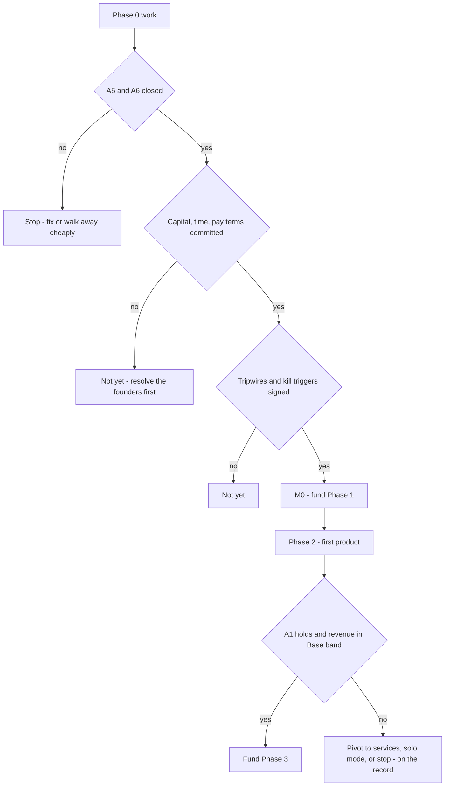

# Part 7 — Risk and Critical Review

**Crucible Systems** (working name) · Capstone to Parts 1–6
Version 0.1 — Draft for founder review · Labeling convention from Part 1 applies ([Fact] / [Assumption] / [Recommendation] / [Experiment] / [Decision] / [Open question])

**Scope of this part:** the adversarial audit of the whole blueprint — the consolidated risk register, the failure sequences and their tripwires, what is too ambitious (delayed or removed), the items that require legal review, independent security validation, and named human ownership, the cross-part consistency audit (including the inconsistencies this review itself caught), the honest case **against** proceeding, and the final revised recommendation with a founder go/no-go checklist. This part treats Parts 1–6 as the proposal and plays every Tribunal role against them.

---

## 1. Consolidated Risk Register

Scoring: Likelihood × Impact, each 1–5, **residual** (after the controls already designed in Parts 1–6). Sorted by score. Review cadence: quarterly (Part 2 calendar), or on any early-warning trip.

| ID | Risk | L | I | Score | Early-warning signal | Primary controls (part refs) | Owner |
|---|---|---|---|---|---|---|---|
| RK-01 | Market: product nobody pays for | 4 | 4 | **16** | Gate-2 threshold miss; activation below target; months 1–3 churn cohort | P4 gates, payment-intent rule, pre-registration, kill triggers | CEO |
| RK-02 | Silent quality debt in agent output | 3 | 4 | **12** | Rework % trend; canary catch < 90%; escaped defects rising | Cross-family review, human merge gate, evals, M6 metric (P1–P3) | CTO |
| RK-03 | Founder bottleneck / burnout / bus factor | 4 | 3 | **12** | Gate-hours and `awaiting_human` latency climbing; governance > 10 h/wk | Risk tiering, deputies, break-glass, load targets (P2, P5) | CEO |
| RK-04 | Legal/entity/payment-rails failure (A5/A6) | 3 | 4 | **12** | Counsel flags; processor rejections | Phase-0 closure **before** real spend (P1, P6 M0 gate) | CEO |
| RK-05 | Security incident via agent toolchain | 2 | 5 | **10** | Injection attempts; egress denials; pentest highs | P3 §7 posture, canary secrets, tool provenance rule, pentest | CTO |
| RK-06 | Cost runaway (tokens, debates, retries) | 3 | 3 | **9** | Cap hits; cache-hit rate falling; reconciliation drift | Reservation-first budgets, freezes, governance ≤ 5% (P1, P3, P6) | CEO |
| RK-07 | Provider dependency / model regression | 3 | 3 | **9** | Eval drop on pin change; pricing notices | Two providers, pinned versions + regression evals (P3) | CTO |
| RK-08 | Review theater / RACI fiction | 3 | 3 | **9** | Decision-delta outside 20–50%; canaries slipping through; near-zero gate time | Canary defects, cross-audit, delta metric (P2, P5, P6) | Founders |
| RK-09 | Platform navel-gazing | 3 | 3 | **9** | Week-12 status; platform tasks displacing product tasks | Cut-scope floor, two-needs rule (P1, P3) | CEO |
| RK-10 | Knowledge pollution / evidence laundering | 3 | 3 | **9** | Unverified citations detected in decision contexts | Provenance schema, Evidence Validator, expiry (P2, P3) | CTO |
| RK-11 | Alert fatigue → missed SEV1 | 3 | 3 | **9** | Alert-precision metric falling | Actionability rule, monthly pruning (P5) | CTO |
| RK-12 | AI-landscape shift (price/capability, either direction) | 3 | 3 | **9** | Sensitivity triggers in reforecast | Router abstraction, monthly reforecast, caps (P3, P6) | CTO |
| RK-13 | Small-n churn noise misleading decisions | 4 | 2 | **8** | Cohort variance; single-account swings | Conservative planning floor, cohort discipline (P6) | CEO |
| RK-14 | Hidden-labor unit-economics illusion | 4 | 2 | **8** | Loaded-vs-cash CAC gap widening | Loaded-CAC recomputation before paid scaling (P6) | CEO |
| RK-15 | Scale ceiling (monolith + single Postgres) | 2 | 3 | **6** | Capacity trigger at 70% sustained | Pre-planned Phase-3 exits (P3 ADRs) | CTO |
| RK-16 | Botched retirement → portfolio reputation damage | 2 | 3 | **6** | None until the event — which is why the runbook is pre-committed | Non-negotiables: notice, export, refunds (P5 §13) | CEO |

**Reading:** nothing on this list is exotic. The top of the register is the same as any startup's (market, quality, founders, legal) — the AI-native design changes the *mitigations*, not the fundamental risks. The genuinely novel exposures (RK-05, RK-08, RK-10) are exactly where Parts 2–3 spent their controls.

---

## 2. Failure Sequences — How This Company Actually Dies, and the Tripwires

| # | Sequence | Earliest tripwire | Pre-committed response **[Decision — sign these in Phase 0]** |
|---|---|---|---|
| F1 | **Quality-debt spiral:** A1 misses → rework balloons → dates slip → founders hand-fix → gates rubber-stamped → escaped defects → trust loss | Rework % > 40% for 3 consecutive slices, or canary catch < 90% | Pause the train; re-scope roles to draft-only in the failing area; if rework > 50% sustained across a gate: services pivot or stop (P1 kill trigger) |
| F2 | **Quiet cash death:** burn creep + revenue lag inside "almost there" months | Reserve rule: runway < 6 months at current net burn (~month 9–10 by design, P6) | Automatic discretionary freeze; T3 raise/cut/pivot decision with the finance pack — no extensions without new evidence |
| F3 | **Governance ossification:** gates slow everything; founders burn out; work routes around the system | Governance > 10 h/wk/founder for a month; escalation rate > 15%; `awaiting_human` p95 > 2 business days | Re-tier thresholds at the monthly council — the mandated response is *recalibrate*, never quietly skip gates |
| F4 | **Market mirage:** Gate 2 false positive → build → launch → activation and retention undershoot | Activation < target at 30 days; months-1–3 cohort churn > 2× plan | Gate-10 hard review out of cycle; Optimize-or-Reposition decision with expiry; second miss → retire per runbook |
| F5 | **Security incident before reputation exists:** injection or exfil through agent tooling → customer-visible breach | Injection attempts trending; any egress denial on a write-scoped run; pentest high | Kill-and-rotate (P5 immune rules); incident command human-only; disclosure CEO + counsel (T3); postmortem feeds golden sets |
| F6 | **Founder event:** illness, dispute, departure — with 2–3 humans holding all authority | None reliable — which is the point | Signed founder agreement with vesting + deadlock clause (Phase 0 legal item); documented deputies; break-glass drills run by the deputy (P5 §11) |

The register says *what*; this table says *when we would know* and *what we already agreed to do*. A tripwire without a pre-signed response is just a dashboard; the signatures in Phase 0 are what make these controls real.

---

## 3. Too Ambitious — Delayed and Removed

### 3.1 Delayed (with the trigger that revisits each)

| Item | Earliest phase | Revisit trigger |
|---|---|---|
| Agent reputation / apprenticeship ladder | 3 | ≥ 6 months of human-audited outcome data exists |
| Custom human-approval portal | 3 | Non-code approvals measurably bottleneck GitHub-based gates (two incidents) |
| Durable workflow engine | 3 | Two demonstrated orchestration pains (ADR-003 guardrail) |
| Local model tier | 3–4 | A product whose data sensitivity justifies GPU hosting cost |
| Vector search / RAG | Growth | A retrieval need Postgres FTS fails twice |
| Product cells + shared platform group | 4 | M7/M8 achieved |
| AI-sent support (per category) | 2+ | ≥ 100 tickets at ≥ 95% acceptance (P5 graduation) |
| Governance councils as distinct bodies | 3–4 | Headcount or external members exist |
| Event bus; feature-flag platform; game days | 3+ | Measured need, per the two-needs rule |
| Decision Digital Twin beyond spreadsheet scenarios | 5 | Only as a budgeted [Experiment] with its own metric |

### 3.2 Removed / permanently rejected (confirming Parts 1–6)

Full 23-role Tribunal on every case · autonomous high-risk production deployment · agent-controlled money, contracts, or people decisions · 24/7 support SLA at this headcount · microservices at launch · building a custom orchestrator, billing system, or approval UI in Phase 1 · lifetime deals · internal AI marketplace as anything but a Phase-5 experiment · treating the full department map as a hiring plan.

---

## 4. Items Requiring Legal Review **[Open questions until counsel closes them]**

| Item | When | Owner |
|---|---|---|
| Entity jurisdiction + payment rails (A6), banking, cross-border admin | Phase 0, before M0 | CEO + counsel |
| Provider commercial terms: output ownership, data processing, no-training configuration (A5) | Phase 0 | CEO + counsel |
| Founder agreement: vesting, IP assignment, deadlock, departure | Phase 0 | CEO + counsel |
| ToS, privacy policy, DPA + subprocessor list for product #1 | Gate 7 | CEO + counsel |
| Data-protection regime of the chosen target market (e.g., GDPR if EU customers) | Gate 1 constraint check + Gate 7 | CEO + counsel |
| SLA/credit terms enforceability; refund policy | Gate 7 | CEO + counsel |
| Incident/breach disclosure obligations by jurisdiction | Before launch; invoked at SEV1-breach | CEO + counsel |
| Insurance adequacy (cyber/E&O) at first customer | Pre-M4 | CEO |
| Cross-border compliance screening where applicable to the chosen entity/markets | Phase 0 | Counsel |

## 5. Items Requiring Independent Security Validation (never self-certified)

| Item | Method | Cadence | Owner |
|---|---|---|---|
| Product #1 application security | External pentest | Gate 7 + annually | CTO |
| Platform configuration (IAM, account separation, egress) | External or tool-assisted config audit | Before first customer data; annually | CTO |
| Injection resistance of the agent toolchain | Seeded red-team attack set through real tool paths | Before Gate 8; refreshed from incidents | CTO |
| Secrets + break-glass procedures | Live drill executed by the **deputy** | Quarterly (P5 §11) | CTO |
| Backup/restore + DR | Timed drills vs RTO/RPO | Quarterly / annually | CTO |
| Audit-chain integrity | Hash-chain recomputation vs off-site copy | Monthly automated + quarterly check | CTO |
| Canary program (defects + secrets) operating | Evidence in monthly audit note | Monthly | Founders (cross-audit) |
| Provider DPA / no-training configuration | Documented verification of account settings | Phase 0 + on provider change | CTO |

## 6. Human Ownership Register (non-delegable, consolidated from Part 2)

| Asset / decision class | Owner | Deputy | Proof of ownership |
|---|---|---|---|
| Strategy, money, contracts, hiring, disclosure, pricing, launch/kill | CEO | CTO (break-glass, execution only) | Signed T3 records; finance pack; contract log |
| Production, deploys, security, access control, keys, incident command | CTO | CEO (break-glass, execution only) | Deploy approvals; access-review log; drill results |
| Support outcomes, refunds ≤ limit, published content, billing ops | Ops lead (or split per P2 §4.1) | CEO | Support metrics; refund log |
| Every agent role's KPIs and authority | Named human owner per spec (P2 §8) | — | Monthly owner review notes |
| Customer-data deletion; database destruction | Human executor, dual-logged | Second founder witness | Deletion records |

---

## 7. Completeness Audit — the Spec vs the Delivered Blueprint

**Innovation inventory (spec §12 asked for ≥ 10 additional realistic innovations).** Delivered — embedded where they do work rather than as a gallery:

| # | Innovation | Problem solved | MVP form | Human control | Success metric |
|---|---|---|---|---|---|
| 1 | Risk-tiered FORGE (T0–T3) | Governance cost scaling with ambition | Policy table + routing | Humans set tiers; T3 human-decided | Escalation band 5–15%; governance ≤ 5% |
| 2 | Agents-as-roles reframe | Fantasy "agent headcount" | Versioned specs, instantiated on demand | Owner per spec; authority in spec | Idle cost ≈ 0; spec-change auditability |
| 3 | Evidence provenance + expiry | Stale/false knowledge steering decisions | Schema columns + auto-reopen triggers | Verification human-only | Expired-decision hit rate |
| 4 | Canary defects + canary secrets | Review theater; silent exfil | Monthly seeded tests | Cross-audit reviews results | Catch ≥ 90%; zero canary exfil |
| 5 | Cross-audit rule | No independent audit at 2–3 people | Each founder samples the other's domain | Inherent | Monthly audit note exists |
| 6 | Blind-review mechanical isolation | Groupthink in multi-agent critique | Context assembler withholds siblings | Audit log asserts isolation | Isolation violations = 0 |
| 7 | Pre-registered experiments | Post-hoc rationalization | Filed form decides | CEO signs go/no-go citing forms | Zero reinterpreted misses |
| 8 | Payment-intent Gate 2 | Applause mistaken for demand | LOI/pre-order requirement | CEO owns exceptions on record | Gate-2 predictive validity curve |
| 9 | Decision-delta metric | "Was the debate useful?" unmeasurable | Outcome-vs-proposal diff | Council reviews band | 20–50% delta; reversals < 10% |
| 10 | Automation ladder + auto-recall | One-way autonomy creep | Category-level graduation rules | Thresholds human-set | Acceptance ≥ 95%; recalls fire correctly |
| 11 | Milestone-gated spending + reserve rule | Calendar-driven burn | Unlock table + freeze trigger | T3 to unfreeze | Trough vs plan; freeze fired on time |
| 12 | Immune-system boring MVP | Anomaly detection without ML fantasy | Threshold rules over existing data | Containment reversible-only | Contained events; false-positive rate |

Fully elaborated per-innovation sheets (cost/risks/advanced version per spec §12) are an **optional addendum** — say the word.

**Cross-part consistency audit.** Green: tiers and caps (P1§7.3 = P2§7.4 = P6§4.1) · governance ≤ 5% everywhere · burn envelopes (P1§10 = P6§3) · 60–170-customer sanity = P6's ~100-customer break-even · business-hours support (P1 rejection = P5 SLA) · quarterly drills (P2=P3=P5) · pentest at Gate 7 (P1=P4=P6) · first revenue month 6–9 (P1 = P6 M4) · week-12 cut-scope (P1=P3=P6). **Flags this review caught and resolves:**

| Flag | Finding | Resolution |
|---|---|---|
| FLAG-1 | P2's Support spec allowed AI-sent "from Phase 2 with 10% sampling"; P5 added the ≥100-ticket/95% graduation bar | **P5 controls**; P2 spec amended to cite it |
| FLAG-2 | P1's 12-role roster had no designer; Gate 5 needs design | Resolved in P2 §3.1 (Designer agent, Phase 2) + design-system reuse as the compensating control |
| FLAG-3 | Spec §12's ten-innovation catalog was delivered inline, not as sheets | Inventory above; addendum optional |
| FLAG-4 | M5 (≤ 4 gate-hours/release) and A3 (≤ 10 governance h/wk) are compatible but thin during launch weeks | Monitor jointly; launch weeks may breach M5 without penalty — A3 is the binding constraint |
| FLAG-5 | "WCAG 2.1 AA" as an MVP claim overreaches | Restated honestly: **AA-target with documented gaps** at launch (automated + manual sample); full conformance is Growth |

---

## 8. The Case Against Proceeding (steelman — read it before the verdict)

1. **The premise may simply be false.** If oversight + rework costs exceed the cost of one or two strong engineers using ordinary AI coding tools, the entire operating model is an elaborate way to spend more for less. Nothing validates A1 but contact with reality.
2. **The solo-builder alternative may dominate at this scale.** A disciplined founder with off-the-shelf AI tooling, a checklist, and a spreadsheet ships faster with near-zero platform cost — and Parts 1–6 concede this repeatedly by keeping the cut-scope floor within sight of exactly that.
3. **All this machinery does not make product #1 good.** RK-01 is the top risk and no Tribunal reduces it; the factory only makes failure cheaper and faster to see.
4. **Founder opportunity cost is real.** Twelve-plus months at Scenario-A pay against the market value of the same people is the largest unbooked cost in Part 6 — deliberately surfaced there, still true here.
5. **The landscape may move under the plan.** Model prices, capabilities, and terms can shift in either direction within the plan's horizon; a favorable shift strands the platform investment (why build controls if the tools become trivially reliable?), an unfavorable one breaks the cost model.
6. **Process can calcify.** A two-person company that spends its creativity operating its own governance is a bureaucracy cosplaying as a startup — F3 is listed as a failure sequence because this review considers it likely without active resistance.

**Why proceed anyway (the response):** the cost of learning the truth is bounded and small (~$40–90k and 12–18 months at Scenario-A); the design is *instrumented for falsifiability* — A1, the reserve rule, and the pre-signed tripwires convert "believe" into "measure"; the pivot options (services, solo-mode fallback) are preserved and pre-approved rather than improvised; and even the failure path yields durable assets — the registry, the eval data, the calibration curve — that most failed startups never collect. The bet is not "this will work"; the bet is "finding out is worth this much."

---

## 9. Final Revised Recommendation

### 9.1 Verdict

**Proceed — as a bounded, instrumented experiment through Phases 0–2, with the conditions below. Do not proceed as a leap of faith, and do not fund Phase 3+ today.** Confidence: **~6.5–7/10 for Phases 0–2** (slightly firmer than Part 1's 6.5, because the kill criteria, tripwires, and financial arithmetic are now explicit); **~4/10 for Phase 4+ as specified** — deliberately, since those phases are options purchased by evidence, not commitments.

### 9.2 Conditions of proceeding **[Decision — founders]**

1. A5 and A6 closed by counsel **before** any material spend (M0 gate).
2. Capital: **$75–90k committed**, or the $60k thin-trough plan accepted in writing with eyes open (P6 §7).
3. Scenario-A compensation accepted for ≥ 12 months — the payroll arithmetic (P6 §6.4) is structural, not motivational.
4. The tripwire responses in §2 and the kill/pivot triggers in P1/P6 **signed**, not merely read.
5. The five load-bearing rules ratified as standing policy: **(a)** risk-tiered gates with a human Accountable everywhere; **(b)** payment-intent evidence at Gate 2; **(c)** milestone-gated spending + the reserve rule; **(d)** independent cross-family review with canary programs; **(e)** evidence provenance and expiry. Everything else in Parts 1–6 is adjustable; these five are the company.

### 9.3 Founder go/no-go checklist (the last artifact)

☐ A6 entity + payment-rails path confirmed by counsel ☐ A5 provider terms reviewed ☐ Two model providers contracted ☐ Capital committed per §9.2.2 ☐ Founder time commitments stated in writing ☐ Scenario-A pay accepted ≥ 12 months ☐ Founder agreement with vesting + deadlock signed ☐ Authority-matrix limits and thresholds ratified (P2 §7.1, P6 controls) ☐ Tripwire responses signed (§2) ☐ 3–5 candidate product spaces listed as Gate-1 one-pagers. **All boxes → M0 → fund Phase 1. Any box open → not yet.**

**Diagram explanation:** The go/no-go is sequenced so the cheapest exits come first: legal/rails failure costs almost nothing if discovered in Phase 0; founder-commitment failure costs only conversations; and the expensive question — does A1 hold, does anyone pay — is reached only with the tripwires already armed. The right-hand exits are not failure states of the people involved; they are the system working. Every edge on this diagram terminates in a registry record either way.

### 9.4 What the seven-part process itself changed (evidence the challenge-criticize-simplify loop ran)

Launch roster cut 40+ → 12 roles (P1 red-team) · Designer role added when Gate 5 exposed the gap (P2) · support autonomy tightened from a phase label to an evidence bar with auto-recall (P5 over P2 — FLAG-1) · the payroll arithmetic surfaced and made structural (P6) · the reserve rule timed to land when evidence exists, not when cash runs out (P6) · consensus math demoted from oracle to calibratable instrument (P2) · every operational threshold labeled tunable with a review cadence (P5) · accessibility claim corrected to an honest AA-target (FLAG-5) · the innovation catalog consolidated and audited (P7).

### 9.5 Final blueprint scorecard (mean of Parts 1–6 scores, spec §11.2)

Practicality **7.7** · Cost efficiency **8.0** · Security **7.5** · Scalability **6.8** · Maintainability **7.3** · Customer value **6.7** · Time to market **6.8** · **Regulatory readiness 5.8 — the weakest line, fixed only by the Phase-0 legal items** · Human controllability **9.0** · Innovation **7.2**.

### 9.6 First ten actions of Phase 0 (start tomorrow, no platform required)

1 Engage counsel on A6/A5 · 2 Draft the founder agreement (vesting, deadlock, IP) · 3 Select and contract the two model providers · 4 Validate the banking/PSP path end-to-end with a test entity plan · 5 Write 3–5 Gate-1 one-pagers from the candidate spaces · 6 Ratify the budget, authority limits, and the five load-bearing rules · 7 Stand up accounts + password manager + 2FA baseline · 8 Run the name/trademark search (retire "Crucible Systems" if taken) · 9 Open DR-0001 in a plain shared doc — the Decision Registry exists before the platform does · 10 Put the weekly gate sync on the calendar.

---

*End of Part 7 — and of the seven-part blueprint. The objective was never to maximize agents; it was a profitable, secure, maintainable company where agents reduce human workload without removing human accountability. The blueprint's honest claim is smaller and stronger: for $75–90k and twelve months at founder pay, you can find out whether that company exists — with tripwires that tell you early, records that survive either answer, and no step that bets the people on the best case.*
