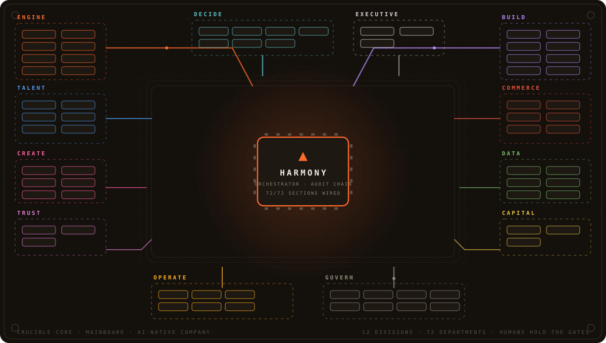
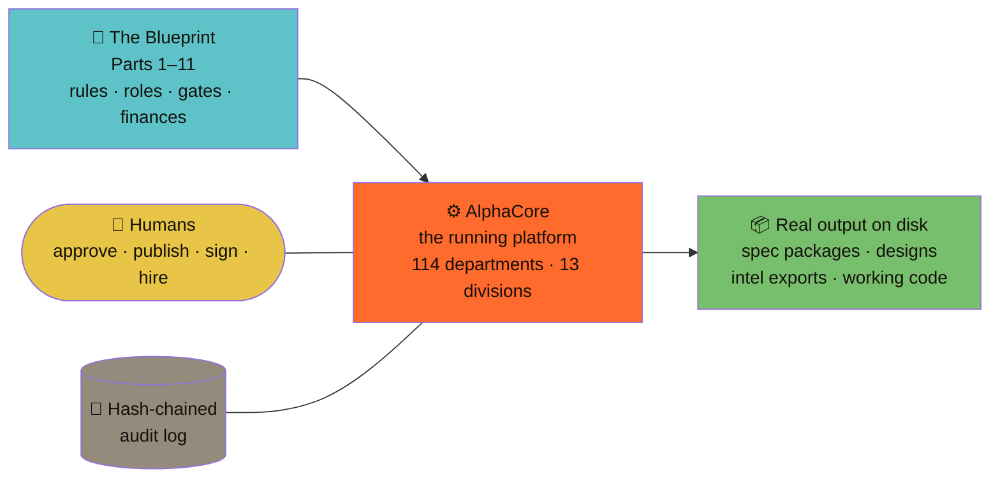

# Crucible Systems — Complete Blueprint Package

**Working name** for the company in these documents (trademark search pending — Part 11 action 8). The platform built from them ships as **AlphaCore**. · An AI-native SaaS company operated by 2–3 human founders and a growing AI workforce under the FORGE method.

  

**Package status: complete draft, v0.1 — awaiting founder decisions.** Every document is ready for review; nothing is ratified until the Part 11 §2 seed decision (DR-0001) is signed and the M0 go/no-go passes. Labeling convention throughout: [Fact] · [Assumption] · [Recommendation] · [Experiment] · [Decision] · [Open question].

---

## Package Map

| Part | Document | What it delivers | Status |
|---|---|---|---|
| 1 | [Executive Blueprint](Part-1-Executive-Blueprint.md) | Concept, scope, assumptions, risks, FORGE summary, org, architecture, budget, roadmap | Complete |
| 2 | [Company Operating Model](Part-2-Company-Operating-Model.md) | Departments, RACI, authority matrix, the Deliberation Tribunal, agent spec template + 2 worked examples | Complete (amended per Part 7 FLAG-1) |
| 3 | [Technical Design](Part-3-Technical-Design.md) | "AlphaCore" platform (drafted under the working name Crucible Core): ADRs, architecture, schemas, orchestration, routing, security, build sequence | Complete |
| 4 | [SaaS Product Factory](Part-4-SaaS-Product-Factory.md) | The ten-gate product lifecycle, cost envelopes, artifact templates, worked example | Complete (amended per Part 7 FLAG-5) |
| 5 | [Operations and Maintenance](Part-5-Operations-and-Maintenance.md) | Post-launch reality: monitoring, incidents, SLOs, support ladder, immune system, retirement runbooks | Complete |
| 6 | [Financial and Implementation Plan](Part-6-Financial-and-Implementation-Plan.md) | Cost models, pricing, revenue scenarios, break-even, cash plan, milestone-gated spending | Complete |
| 7 | [Risk and Critical Review](Part-7-Risk-and-Critical-Review.md) | Consolidated risk register, failure sequences + tripwires, the case against, final verdict + conditions | Complete |
| 8 | [Agent Role Specification Library](Part-8-Agent-Role-Specification-Library.md) | Full specs for all 12 launch roles + Tribunal pack + planned Designer (completes Part 2 §4.2) | Complete |
| 9 | [Templates and Artifact Pack](Part-9-Templates-and-Artifact-Pack.md) | Fill-in forms for every gate, ritual, and record in Parts 2–5 | Complete |
| 10 | [Innovation Addendum](Part-10-Innovation-Addendum.md) | The 12 elaborated innovation sheets (the addendum Part 7 §7 offered) | Complete |
| 11 | [Phase 0 Starter Kit](Part-11-Phase-0-Starter-Kit.md) | DR-0001, first ten actions, founder-agreement checklist, provider scorecard, A6 matrix, tripwire signature sheet, week-by-week plan | Complete — **start here to act** |

## Working Software

**[crucible-core/](crucible-core/README.md)** — **AlphaCore**, the platform, built from Part 3 and expanded far past it into a complete AI-native company:

- **114 departments across 13 divisions** (Engine, The World, Build, Decide, Data, Marketing, Commerce, Capital, Operate, Talent, Trust, Executive, Govern) — agents are the workforce, humans hold every gate.
- **Login + fine-grained RBAC**: 204 atomic permissions (a user can hold exactly one), superadmin console for users and provider keys, server-side identity on every audited action.
- **One map, two depths**: the whole company as trees growing from a core, then one district with its departments as marked chips — zooming between them is the explanation. Every relationship a real database join with a live count, click-to-open, right-click connection ledger with hop-by-hop flow tracing, and a real-time ticker.
- **Warm paper, one skin**: ink on bone, a light serif at wide tracking carrying the identity, one hairline border weight, and colour held back until you point at something.
- **One guarded door to the outside world**: ten integrations plus any HTTP API you describe, MCP in both directions, the open web, and a single egress gate that checks scope, allowlist, quota and a machine-enforced constitution before anything leaves — with eight attacks run against it on a timer.
- **The engine room**: multi-provider router (Claude subscription first — zero marginal cost — then Claude API, OpenAI, DeepSeek, Gemini, or a $0 mock), reservation-first budgets, run queue with a first-class human gate, blind-critic tribunal, FORGE pipelines producing real files on disk, hash-chained append-only audit log, immune system, and cross-department autopilot reflexes.
- **The company grows itself**: Recruiting drafts, trials, and — on a human "hire" — registers new AI employees; the Academy closes measured eval gaps; the Security SOC sweeps real runs; the weekly bulletin writes itself from the audit chain.

**Run it:** double-click **`Start-AlphaCore.bat`** (checks Node ≥ 22.5, installs, opens the browser) or `cd crucible-core && npm install && npm start` → http://localhost:8484. First run creates an owner account and prints its password to the console **once** — that account can do nothing but change it. Full instructions: **[docs/INSTALL.md](crucible-core/docs/INSTALL.md)**.

## Reading Paths

- **Founder, 30 minutes:** Part 1 → Part 7 §§8–9 → Part 11. Everything else is reference until a decision needs it.
- **Counsel:** Part 7 §4 (legal review list) → Part 1 §4 (A5/A6) → Part 11 §§3–5.
- **Builder (Phase 1):** Part 3 (all) → Part 8 → Part 2 §§7–8.
- **The skeptic:** Part 7 §8 — the case against proceeding — first, on purpose.

## The Five Load-Bearing Rules (Part 7 §9.2.5 — everything else is adjustable; these are the company)

1. Risk-tiered gates (T0–T3) with exactly one accountable human everywhere.
2. Payment-intent evidence required at Gate 2 — applause never passes.
3. Milestone-gated spending + the 6-month reserve rule.
4. Independent cross-family review + canary programs (defects and secrets).
5. Evidence provenance and expiry — unverified claims never become organizational truth.

## Verdict (Part 7 §9.1)

**Proceed as a bounded, instrumented experiment through Phases 0–2** — conditions in Part 7 §9.2, signatures in Part 11 §7. Confidence ~6.5–7/10 for Phases 0–2; Phase 3+ are options purchased by evidence, not commitments. Cost of learning the truth: ~$40–90k and 12–18 months at founder pay, with tripwires that report early and records that survive either answer.

## Next Physical Step

Sign **DR-0001** (Part 11 §2) and send the counsel engagement email (Part 11 §1, action 1). The platform build (Part 3 §11) begins only after M0.

---

*Package completed 2026-08-04. The objective was never to maximize agents; it was a profitable, secure, maintainable company where agents reduce human workload without removing human accountability.*
