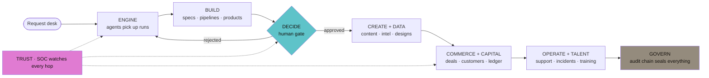
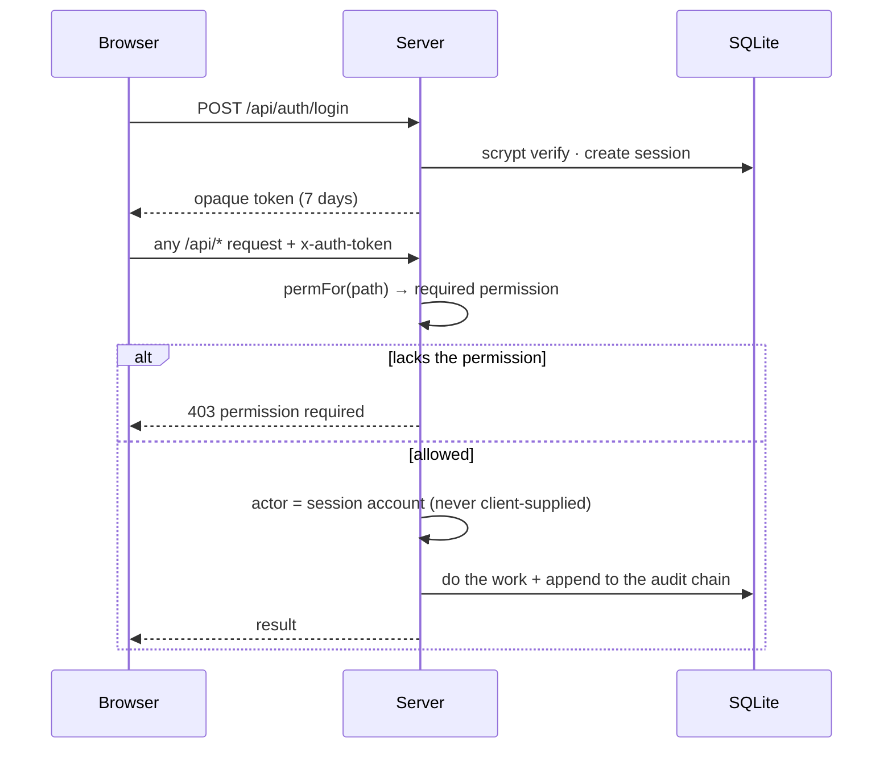
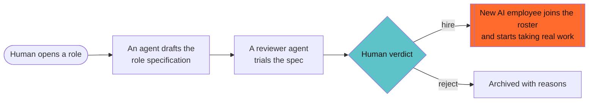
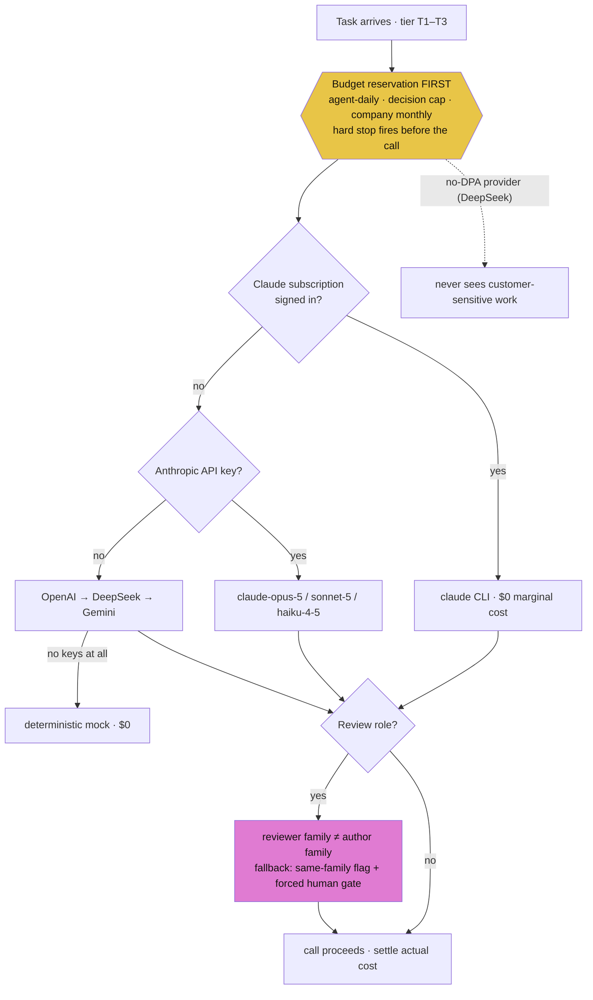
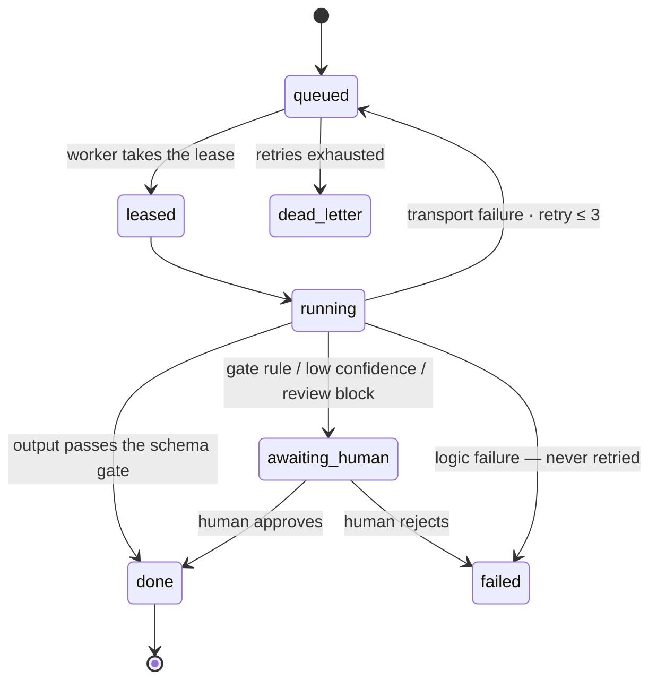
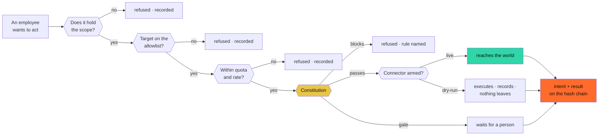

<div align="center">

# ⚙️ CRUCIBLE CORE

### The company that runs itself — and proves every move on a hash chain.

**An entire AI-native company inside a single Node process.**
Ninety-five departments across thirteen divisions, staffed by an AI workforce that drafts, builds,
researches, sells, supports, **hires its own new employees** — and now reaches the real world
through one guarded door — while humans hold every gate that matters: approving, publishing,
signing, and ruling.


*No frameworks. No build step. One process, one SQLite file, and a living circuit-board map
where you literally watch the company work.*

</div>

---

**What makes it different:** most "AI agent" projects are a chat loop with tools. Crucible Core is an **operating company** — money is reserved before any model is called, reviewers are forced onto a different model family than authors, low-confidence work stops at a human gate, incidents demand postmortems, every produced file lands on disk through an explicit human apply, and the whole story is sealed into an append-only SHA-256 hash chain you can verify from the dashboard header. The AI does the work; the humans keep the authority; the chain keeps them both honest.

And when it reaches outside — Gmail, GitHub, Slack, Stripe, the open web, any API you describe — **every single attempt passes one gate** that checks the employee's scope, the allowlist, the quota, and a constitution written in a form a machine can enforce. The intent is recorded *before* the call is made. A new integration runs in dry-run until a person deliberately arms it. And eight attacks run against all of it on a timer, because the day an employee can read a page and then send an email, a hostile page becomes a command channel.

Born as the working implementation of **Part 3 — Technical Design** of the Crucible blueprint (see the repository root), then expanded far past it. Built with Node's standard library, `node:sqlite`, and a vanilla-JS dashboard.

<p align="center">
  
</p>

## The company at a glance

```mermaid
flowchart TD
  CORE(("▲ HARMONY<br/>orchestrator +<br/>audit chain"))
  ENGINE["ENGINE · 9<br/>requests · agents · runs"] --> CORE
  WORLD["THE WORLD · 6<br/>integrations · the gate<br/>vault · web · MCP · queue"] --> CORE
  BUILD["BUILD · 9<br/>specs · products · lab"] --> CORE
  DECIDE["DECIDE · 9<br/>gates · budgets · shadow company"] --> CORE
  DATA["DATA · 7<br/>intel · archive · knowledge graph"] --> CORE
  CREATE["CREATE · 7<br/>content · design · brand"] --> CORE
  COMMERCE["COMMERCE · 8<br/>sales · CRM · revenue loop"] --> CORE
  CAPITAL["CAPITAL · 5<br/>finance · treasury · money desk"] --> CORE
  OPERATE["OPERATE · 7<br/>incidents · support · contact centre"] --> CORE
  TALENT["TALENT · 10<br/>HR · memory · the floor · skills"] --> CORE
  TRUST["TRUST · 5<br/>SOC · provenance · red team"] --> CORE
  EXEC["EXECUTIVE · 3<br/>board · IR · comms"] --> CORE
  GOVERN["GOVERN · 10<br/>oversight · constitution · time machine"] --> CORE
  classDef c1 fill:#ff6b2c,color:#14100c,stroke:none
  classDef c2 fill:#b78bff,color:#14100c,stroke:none
  classDef c3 fill:#5ec3c9,color:#14100c,stroke:none
  classDef c4 fill:#78bf6d,color:#14100c,stroke:none
  classDef c5 fill:#ff5fa2,color:#14100c,stroke:none
  classDef c6 fill:#e5533d,color:#14100c,stroke:none
  classDef c7 fill:#e8c547,color:#14100c,stroke:none
  classDef c8 fill:#ffb020,color:#14100c,stroke:none
  classDef c9 fill:#4f9cf0,color:#14100c,stroke:none
  classDef c10 fill:#e07bd2,color:#14100c,stroke:none
  classDef c11 fill:#d8d8d8,color:#14100c,stroke:none
  classDef c12 fill:#948b7d,color:#14100c,stroke:none
  classDef c13 fill:#2fd6a8,color:#14100c,stroke:none
  classDef core fill:#1d1812,color:#ff6b2c,stroke:#ff6b2c,stroke-width:2px
  class WORLD c13
  class ENGINE c1
  class BUILD c2
  class DECIDE c3
  class DATA c4
  class CREATE c5
  class COMMERCE c6
  class CAPITAL c7
  class OPERATE c8
  class TALENT c9
  class TRUST c10
  class EXEC c11
  class GOVERN c12
  class CORE core
```



## How an order moves through the company



---

## Quick start

**Windows, one double-click:** run `Start-Crucible.bat` in the repository root. It checks Node, installs dependencies on first run, seeds demo data, opens the browser, and starts the server. If the server is already running it just opens the dashboard.

**Manually:**

```powershell
cd crucible-core
npm install
npm run seed     # optional: sample agents, runs, one tribunal case (mock, $0)
npm start        # http://localhost:8484
```

Requires **Node ≥ 22.5** (built-in `node:sqlite`; the npm scripts pass the flag).

**First sign-in: `admin` / `crucible` — change it immediately** (Admin → Users). The seeded account is the superadmin: every permission, the owner powers, and the kill switches.

**Going live:** paste provider API keys in **Settings** (stored locally in SQLite, never echoed back, effective immediately) or copy `.env.example` → `.env`. With zero keys the router runs a deterministic **mock mode** — the entire platform is demoable at $0.

## Authentication & fine-grained permissions



- Session login (scrypt-hashed passwords, opaque 7-day tokens). Every `/api/*` route is authenticated; anonymous requests get 401.
- **188 atomic permissions** in `section.action` form (`support.view`, `decisions.decide`, `security.manage`, …). A user can be granted **exactly one permission** and nothing else; navigation and pages gate themselves accordingly.
- **Identity is never client-supplied.** The server stamps every action with the session's account; the audit chain records who really acted.
- The superadmin manages users (create, disable, reset password, edit grants) and provider connections from the UI.

## The living map — two designs, one for each question

The Overview page renders the whole company from live data (`/api/map`): every department, every relationship as a **real database join with its live count**, zero orphans (enforced by a connectivity audit). A picker in the panel header switches between them; the choice persists.

| Map | Answers | How it reads |
|---|---|---|
| **The Hive** | *What is this company, and how is it joined together?* | One hexagonal cell per department, cells packed into the district that owns them, Harmony in the middle. Relationships stay **hidden until you point at a cell** — two hundred lines at once is noise; seven lines is an answer. |
| **The Stream** | *Where is the work right now?* | Six stages — intake, produce, peer review, audit, human gate, landed — with pillar heights and ribbon widths carrying real volume, plus the two arcs that are **not** progress: work sent back to be improved, and rulings a person made. |

One interaction engine drives both: **click** opens the department · **right-click** opens a real window over the map (the map underneath stops taking the pointer) listing everything it touches, with hop-by-hop **Trace flow** that survives closing the window · **clicking a relationship line** explains what kind of movement it is and how that mechanism works · drag/wheel pans and zooms · clicking a district name isolates it. A **live ticker** narrates the audit chain and departments **flash** the moment something happens in them.

## The company — 13 divisions, 95 departments

| Division | Departments |
|---|---|
| **ENGINE** | Request desk (writes route themselves department-to-department), Agents, Workforce load board, Run queue, Pipelines (FORGE chains), Providers, Artifacts, Capacity planning |
| **BUILD** | System design (full spec packages), Infrastructure plans, Products (ten-gate factory), Journeys, Projects, Tasks (delegable to agents), The Lab (A/B experiments), Releases (auto-drafted changelogs) |
| **DECIDE** | Human gate, Decisions registry + tribunal, Budgets, Risks, Quality, Evals & canaries, PMO stage gates |
| **DATA** | Intelligence (multi-pass collection + web enrichment, Arabic/English exports), Segments, Datasets, Archive, Knowledge, Insights (company analytics) |
| **CREATE** | Localization (AR ⇄ EN), Social media, Content studio, Design studio, Marketing, Brand studio |
| **COMMERCE** | Pricing, Customer success, Market watch, Sales, Customers (CRM), Relations (partners/investors/government), Procurement (human-approved spend) |
| **CAPITAL** | Finance, Financial reports, FinOps (cost per agent, waste detection, tier advice) |
| **OPERATE** | Incidents (SEV lifecycle + enforced postmortems), Support, Assets, Legal (human-signed contracts), Vendors, Objectives (OKRs) |
| **TALENT** | People (HR), Org & personas, The society (how agent colleagues get on), Disputes, **Recruiting — the company hires its own AI employees** (spec → trial → human decision → live on the roster), Academy (training that closes measured eval gaps), Enablement |
| **TRUST** | Security SOC (real sweeps: injection phrasing in run inputs, secret-shaped strings in outputs, no-DPA vendors, over-broad grants), Compliance (DPA posture, data register, attestations), Sustainability (energy/carbon from live token meters) |
| **EXECUTIVE** | Board room (packet from live numbers, human-signed resolutions), Investor relations, Internal comms (the weekly bulletin writes itself from real events) |
| **GOVERN** | Harmony (the orchestrator), Autopilot (cross-department reflexes), Governance (rituals + immune system), Oversight (approvals ledger), Scorecard, Users & roles, Settings, Audit chain, **The constitution**, **Time machine** |
| **THE WORLD** | **Integrations** (ten services + any HTTP API you describe), **The gate** (every outbound attempt, allowed or refused, with the rule that decided), **The vault** (credentials encrypted at rest), **The open web** (fetch, search, real browser), **MCP** (tools in, this company out), **The queue** (durable outbound work) |

Plus, folded into the divisions that own them: **Revenue loop** (Commerce), **Provenance** and **Red team** (Trust), **Shadow company** (Decide), **Skill market** (Talent), **Knowledge graph** (Data), **Treasury**, **Money desk**, **Contact centre**, **Agent memory**, **The floor**.

Everything is cross-linked: 258 declared relationships, each a live SQL count, zero orphans, plus the universal rules — *everything ends on the audit chain; produced items freeze into the archive.*

**The company hires its own workforce** (Talent → Recruiting):



## The engine room

**Where a model call goes** — the budget is reserved before anything else happens:



**A run's life** — `awaiting_human` is a first-class state, and logic failures never retry:



- **Model router** — five backends behind one router; tier chains are config (`config/providers.json`), **subscription-first**: Claude Pro/Max via the CLI (zero marginal cost) → Anthropic API (`claude-opus-5` / `claude-sonnet-5` / `claude-haiku-4-5`) → OpenAI → DeepSeek → Gemini → mock. **Family separation** (a reviewer never shares the author's model family — enforced in the router; degradation to same-family review carries a flag and forces a human gate). **Sensitivity ceilings**: no-DPA providers never see customer data. Review roles fail closed.
- **Reservation-first budgets** — the hard stop fires **before** the model call. Scopes: per-agent daily, per-decision (T1 $2 / T2 $15 / T3 $75), company monthly, governance pool ≤ 5%. Freezes are one click and audited.
- **Run queue** — small state machine; `awaiting_human` is a first-class state; logic failures never retry; transport failures requeue then dead-letter.
- **Mini-tribunal** — advocate → **blind parallel critics** (isolation asserted in the audit) → judge synthesis; T3 adds a validator round and a red team. Judges recommend; **humans decide**.
- **Pipelines (FORGE)** — templated multi-agent chains producing **real files on disk** under `workspace/`; an Engineer run's files are written only by an explicit human apply. Paths are sandboxed.
- **Audit chain** — SHA-256 hash-linked, append-only (SQL triggers block UPDATE/DELETE), verifiable end-to-end from the dashboard header.
- **Immune system** — reversible containment on real signals: spend spikes → freeze, eval regressions → suspend, failure clusters → problems, stale gates, overdue risk reviews, renewal windows.
- **Autopilot** — idempotent cross-department reflexes (incident→risk, won deal→customer, failing eval→training task, big segment→campaign, …), each firing once per subject and logged.

## The outside world

For most of its life this company was complete on the inside and sealed on the
outside: a post was "published" into a table, an email was drafted and never
sent. Everything below is the machinery that lets it reach anything real —
and the machinery that keeps that honest.



**The gate** is the only door. Every outbound effect — an email, a commit, a
post, a payment, an HTTP call to somebody else's API — passes `egress.attempt()`,
and it is deliberately suspicious. Failure is closed: anything unrecognised is
refused, and the **intent is written before the call is made**, so a crash
mid-flight still leaves evidence of what was about to happen.

| Piece | What it is |
|---|---|
| **Integrations** | Ten drivers — Gmail, Google Calendar, GitHub, Slack, Telegram, X, LinkedIn, Stripe, Notion — plus a generic driver that turns **any HTTP API into a connector from a JSON description**, no code. A connector starts *disconnected*; a credential moves it to *dry-run* (everything executes, nothing leaves); arming it is a separate deliberate act by a person. |
| **The vault** | Credentials sealed with AES-256-GCM under a master key kept **outside the database**, so a copied `.db` is not a copied set of keys. The value goes in and never comes back out — listings show the last four characters. |
| **Agent scopes** | Each employee holds named grants (`gmail.send` limited to one domain, `pr.create` limited to one repository). No wildcards. Revoking takes effect on the next call. |
| **The queue** | Outbound work with attempts, exponential backoff and idempotency keys, so a retry can never double-send and a dead job is shelved for a person instead of repeated forever. |
| **The open web** | Three graded abilities — fetch, search, browse (real Chromium over CDP) — behind the SSRF guard. Every page is kept with the **hash of what it actually said**, so a claim traces back to its source. Text that tries to give instructions is flagged, filed as an attack, and never obeyed. |
| **MCP, both ways** | Register any MCP server and its tools become things the workforce can do. Crucible is *also* an MCP server at `POST /mcp` — point Claude Code at it with your own token and drive the company from outside, with exactly the permissions your account holds. |
| **The constitution** | Ten founding rules with two halves each: the sentence a person reads and a machine form the gate evaluates. Money needs a person, no unrequested bulk contact, no credential ever leaves, fetched text is data and never instruction. Amending requires the owner and leaves the old version in the record. |
| **The red team** | Eight attacks run on a timer against our own machinery — prompt injection (English *and* Arabic), secret exfiltration, unscoped egress, bulk contact, autonomous payment, audit tampering, vault read-back, SSRF. A breach is a finding, not an incident. This is how the Arabic injection gap was found and closed. |
| **Provenance** | An Ed25519 receipt for every artifact: content hash, chain entry, model, reviewers, cost. Anyone holding the public key verifies it offline, forever, without asking us anything. |
| **Time machine** | The chain is append-only, so the past is readable. Stand at any entry, replay a stretch, reopen a decision with what is known now — the original is never edited. |
| **Shadow company** | Fork the database, pull a lever (budgets, headcount, demand, price, churn), run it forward and compare the numbers. A simulated employee *cannot* send an email — not by policy, but because the file it works in is connected to nothing. |
| **Skill market** | An employee that has done the same work ten times is asked to write down its method. The method is scored against the incumbent by someone who did not write it, and adopted only if it wins. Model tournaments re-rank providers per task type from measured quality and cost. |
| **Knowledge graph** | Entities and edges built from the rows that already exist, with local hashed-trigram embeddings (Arabic-folded, no key, no network) — "everything we know about Basra Oil Company" in one hop. |
| **Revenue loop** | Sourced → contacted → replied → meeting → proposal → agreed → invoiced → paid → delivering → delivered. Every hop that touches somebody outside goes through the gate; the two that cannot be undone stop for a person. |
| **Live presence** | A WebSocket (hand-rolled, no dependency) feeding the chain to every open page, plus who else is looking at what. |

**Sovereign mode.** Ollama is a first-class provider cleared for every
sensitivity level, because the data never leaves the machine. With the line cut,
the company keeps working on local models — which in Iraq is the difference
between a company that runs and one that waits.

## Factory reset (superadmin only)

Settings → **Danger zone**. Three locks: superadmin role + typed phrase `WIPE ALL DATA` + password re-entry. Two levels — data wipe (operational records cleared; users, sessions, provider settings survive; defaults re-seeded; the audit chain restarts with a genesis entry naming who wiped) and **full factory reset** (users/sessions/settings go too; `admin`/`crucible` restored). An extra checkbox also deletes produced workspace files.

## Layout

```
crucible-core/
├─ config/            providers, budgets, agents, pipelines, golden sets, rituals (all config, not code)
├─ src/
│  ├─ server.js       one process: HTTP + static + workers + scheduled ticks
│  ├─ api.js          route table + path→permission resolver (~390 endpoints)
│  ├─ auth.js         sessions, scrypt, the permission catalog (188 keys)
│  ├─ db.js           node:sqlite schema (~130 tables) + append-only audit triggers
│  ├─ router.js       tier chains, family separation, sensitivity, fallbacks
│  ├─ policy.js       reservation-first budget engine
│  ├─ workflow.js     run queue + workers
│  ├─ links.js        the relationship resolver: section catalog, edges, live activity feed
│  ├─ expansion.js    TRUST / CAPITAL / TALENT / EXEC departments
│  ├─ egress.js       THE GATE — the only door out of this machine
│  ├─ vault.js        credentials, encrypted at rest
│  ├─ connectors/     one driver contract, ten services, plus any-HTTP-API
│  ├─ jobs.js         durable queue: attempts, backoff, idempotency
│  ├─ web.js          fetch / search / browse, SSRF-guarded, injection-scanned
│  ├─ mcp.js          MCP client and MCP server, both directions
│  ├─ constitution.js the rules, in a form the gate can evaluate
│  ├─ redteam.js      eight attacks we run on ourselves
│  ├─ provenance.js   Ed25519 receipts for everything produced
│  ├─ timemachine.js  snapshots, replay, reopening a decision
│  ├─ simulation.js   the shadow company
│  ├─ skills.js       the skill market and model tournaments
│  ├─ graph.js        knowledge graph with local embeddings
│  ├─ revenue.js      the closed loop, intel to invoice
│  ├─ live.js         WebSocket presence, hand-rolled
│  ├─ wipe.js         the factory reset
│  └─ …               tribunal, pipelines, intel, maestro, nexus, immune, and the rest
├─ public/            vanilla-JS dashboard (app.js: 2 map builders + 1 interaction engine)
├─ workspace/         real produced files: blueprints, designs, exports, project workspaces
└─ data/              SQLite (gitignored — never commit live database files)
```

## Tests & maintenance

```powershell
npm test                       # audit integrity, budget hard-stop, lifecycle, family separation, tribunal,
                               # the gate, the vault, the constitution, the queue, provenance, the red team
npm run prove                  # the same walls, proved against the LIVE database, with the numbers printed
node --experimental-sqlite scripts/seed.js           # demo data (forced mock)
node --experimental-sqlite scripts/rechain-audit.js  # audit-chain repair (content-preserving, self-recording)
```

The test suites name their own database file (`CRUCIBLE_DB`) and delete it on
start. They used to delete `data/crucible.db` — which is the running company —
so the file is now nameable and the default is never the one that gets wiped.

**Git hygiene for the database:** `data/` DB files are gitignored — including `-wal`/`-shm`. Never force-add them; a WAL copied between machines corrupts the database. Stop the server before committing anything near `data/`.

## Design decisions on top of the blueprint

- **ADR-007 (this repo): SQLite in dev.** Same schema as Part 3's Postgres DDL, one file, zero setup. Postgres remains the production target per ADR-002.
- The Claude-subscription provider shares the `anthropic` family, so it can never pose as an "independent" reviewer against the Claude API — separation is enforced in the router, not by convention.
- Model prices in `config/providers.json` were entered 2026-08 — verify before production (the blueprint's own rule).
