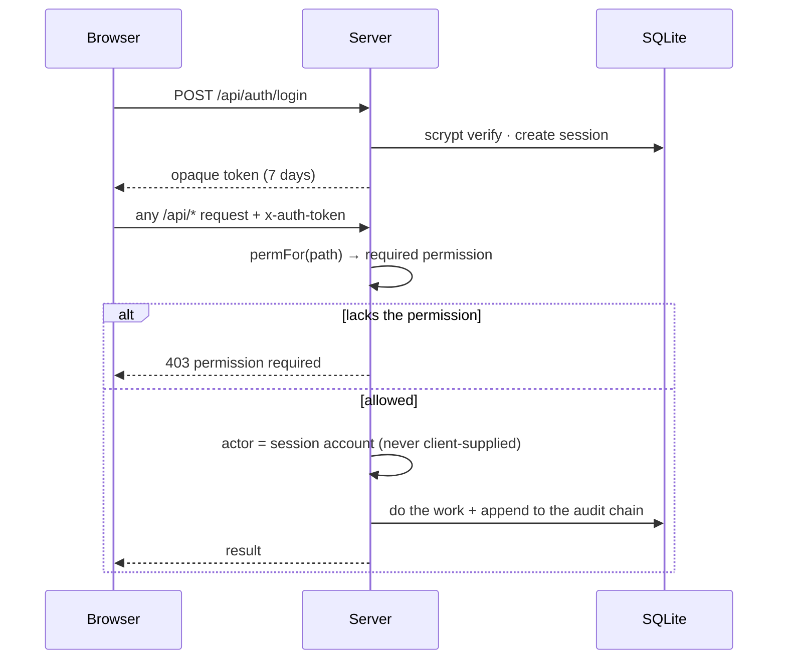
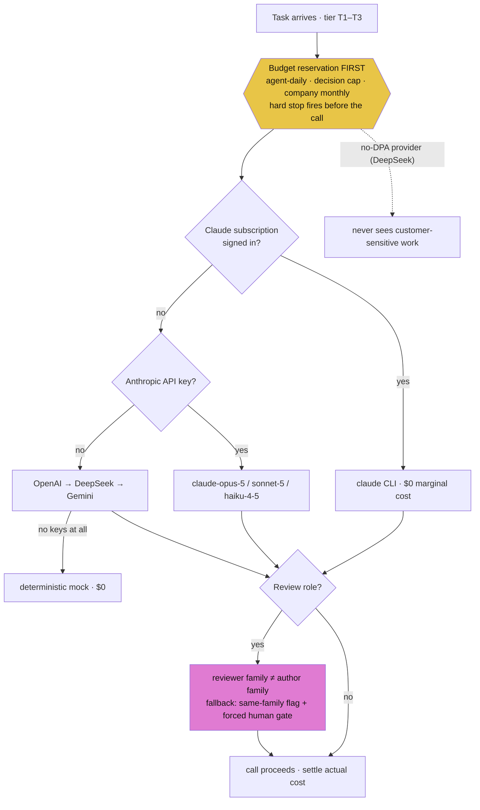
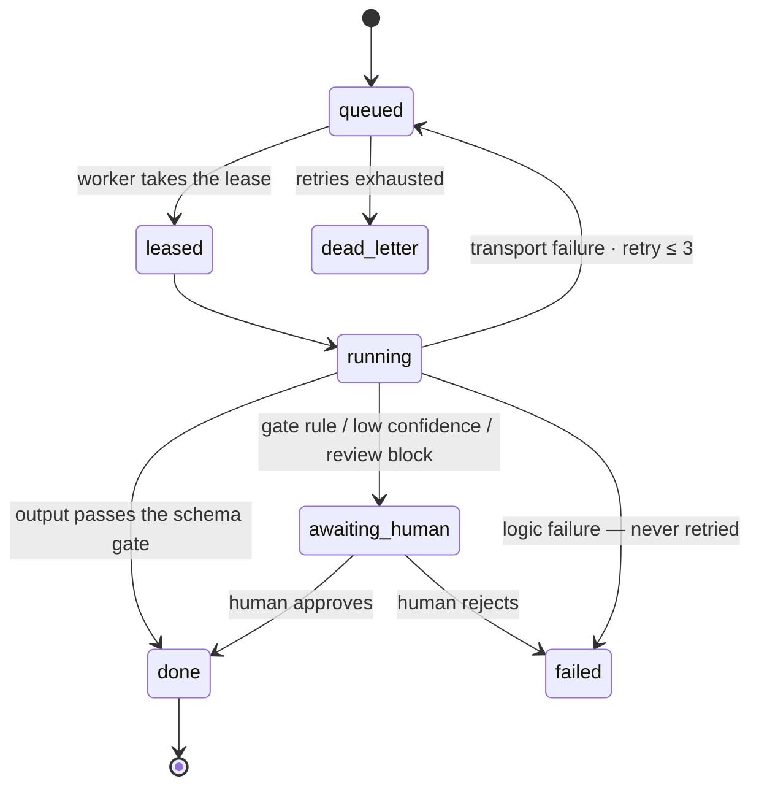

# Crucible Core — the AI-Native Company Platform

A complete company in one process: **72 departments across 12 divisions, run day-to-day by an AI workforce, governed by humans at the gates.** Agents draft, build, research, review, and route; humans approve, publish, sign, hire, and rule. Every action from either side lands on a hash-chained, append-only audit log.

Built as the working implementation of **Part 3 — Technical Design** of the Crucible blueprint (see the repository root), then expanded far past it. Zero frameworks: Node's standard library, `node:sqlite`, and a vanilla-JS dashboard.

<p align="center">
  
</p>

## The company at a glance

```mermaid
flowchart TD
  CORE(("▲ HARMONY<br/>orchestrator +<br/>audit chain"))
  ENGINE["ENGINE · 8<br/>requests · agents · runs"] --> CORE
  BUILD["BUILD · 8<br/>specs · products · lab"] --> CORE
  DECIDE["DECIDE · 7<br/>gates · budgets · risks"] --> CORE
  DATA["DATA · 6<br/>intel · archive · insights"] --> CORE
  CREATE["CREATE · 6<br/>content · design · brand"] --> CORE
  COMMERCE["COMMERCE · 7<br/>sales · CRM · procurement"] --> CORE
  CAPITAL["CAPITAL · 3<br/>finance · reports · finops"] --> CORE
  OPERATE["OPERATE · 6<br/>incidents · support · legal"] --> CORE
  TALENT["TALENT · 7<br/>HR · recruiting · academy"] --> CORE
  TRUST["TRUST · 3<br/>SOC · compliance · energy"] --> CORE
  EXEC["EXECUTIVE · 3<br/>board · IR · comms"] --> CORE
  GOVERN["GOVERN · 8<br/>oversight · users · audit"] --> CORE
  classDef c1 fill:#ff6b2c,color:#14100c,stroke:none
  classDef c2 fill:#b78bff,color:#14100c,stroke:none
  classDef c3 fill:#5ec3c9,color:#14100c,stroke:none
  classDef c4 fill:#78bf6d,color:#14100c,stroke:none
  classDef c5 fill:#ff5fa2,color:#14100c,stroke:none
  classDef c6 fill:#e5533d,color:#14100c,stroke:none
  classDef c7 fill:#e8c547,color:#14100c,stroke:none
  classDef c8 fill:#ffb020,color:#14100c,stroke:none
  classDef c9 fill:#4f9cf0,color:#14100c,stroke:none
  classDef c10 fill:#e07bd2,color:#14100c,stroke:none
  classDef c11 fill:#d8d8d8,color:#14100c,stroke:none
  classDef c12 fill:#948b7d,color:#14100c,stroke:none
  classDef core fill:#1d1812,color:#ff6b2c,stroke:#ff6b2c,stroke-width:2px
  class ENGINE c1
  class BUILD c2
  class DECIDE c3
  class DATA c4
  class CREATE c5
  class COMMERCE c6
  class CAPITAL c7
  class OPERATE c8
  class TALENT c9
  class TRUST c10
  class EXEC c11
  class GOVERN c12
  class CORE core
```



## How an order moves through the company


---

## Quick start

**Windows, one double-click:** run `Start-Crucible.bat` in the repository root. It checks Node, installs dependencies on first run, seeds demo data, opens the browser, and starts the server. If the server is already running it just opens the dashboard.

**Manually:**

```powershell
cd crucible-core
npm install
npm run seed     # optional: sample agents, runs, one tribunal case (mock, $0)
npm start        # http://localhost:8484
```

Requires **Node ≥ 22.5** (built-in `node:sqlite`; the npm scripts pass the flag).

**First sign-in: `admin` / `crucible` — change it immediately** (Admin → Users). The seeded account is the superadmin: every permission, the owner powers, and the kill switches.

**Going live:** paste provider API keys in **Settings** (stored locally in SQLite, never echoed back, effective immediately) or copy `.env.example` → `.env`. With zero keys the router runs a deterministic **mock mode** — the entire platform is demoable at $0.

## Authentication & fine-grained permissions



- Session login (scrypt-hashed passwords, opaque 7-day tokens). Every `/api/*` route is authenticated; anonymous requests get 401.
- **~95 atomic permissions** in `section.action` form (`support.view`, `decisions.decide`, `security.manage`, …). A user can be granted **exactly one permission** and nothing else; navigation and pages gate themselves accordingly.
- **Identity is never client-supplied.** The server stamps every action with the session's account; the audit chain records who really acted.
- The superadmin manages users (create, disable, reset password, edit grants) and provider connections from the UI.

## The living map — four switchable designs

The Overview page renders the whole company from live data (`/api/map`): every department, every relationship as a **real database join with its live count**, zero orphans (enforced by a connectivity audit). A picker in the panel header switches styles; the choice persists.

| Style | Metaphor | Best for |
|---|---|---|
| **Mainboard** | The company as a motherboard: chips with activity LEDs, copper traces with bus lanes, data packets riding the busiest nets, Harmony as the CPU | *What is happening right now, and where?* |
| **Orbit** | One ring, twelve coloured division arcs, radial clock-hand labels | Structure and division balance at a glance |
| **Metro** | Twelve transit lines, sections as stations, all terminating at the Harmony interchange; cross-division joins as transfer arcs | Who belongs to what, where lines meet |
| **Flow** | The value stream: divisions as columns in the order work actually moves, joins as ribbons — intake enters left, governance seals right | How an order passes through the whole company |

One interaction engine drives all four: **click** opens the department · **right-click** opens its full connection ledger with hop-by-hop **Trace flow** · drag/wheel pans and zooms · clicking a division name isolates it · hovering isolates a neighbourhood. A **live ticker** narrates the audit chain in real time and departments **flash** the moment something happens in them — the map is a monitoring console, not a picture.

## The company — 12 divisions, 72 departments

| Division | Departments |
|---|---|
| **ENGINE** | Request desk (writes route themselves department-to-department), Agents, Workforce load board, Run queue, Pipelines (FORGE chains), Providers, Artifacts, Capacity planning |
| **BUILD** | System design (full spec packages), Infrastructure plans, Products (ten-gate factory), Journeys, Projects, Tasks (delegable to agents), The Lab (A/B experiments), Releases (auto-drafted changelogs) |
| **DECIDE** | Human gate, Decisions registry + tribunal, Budgets, Risks, Quality, Evals & canaries, PMO stage gates |
| **DATA** | Intelligence (multi-pass collection + web enrichment, Arabic/English exports), Segments, Datasets, Archive, Knowledge, Insights (company analytics) |
| **CREATE** | Localization (AR ⇄ EN), Social media, Content studio, Design studio, Marketing, Brand studio |
| **COMMERCE** | Pricing, Customer success, Market watch, Sales, Customers (CRM), Relations (partners/investors/government), Procurement (human-approved spend) |
| **CAPITAL** | Finance, Financial reports, FinOps (cost per agent, waste detection, tier advice) |
| **OPERATE** | Incidents (SEV lifecycle + enforced postmortems), Support, Assets, Legal (human-signed contracts), Vendors, Objectives (OKRs) |
| **TALENT** | People (HR), Org & personas, The society (how agent colleagues get on), Disputes, **Recruiting — the company hires its own AI employees** (spec → trial → human decision → live on the roster), Academy (training that closes measured eval gaps), Enablement |
| **TRUST** | Security SOC (real sweeps: injection phrasing in run inputs, secret-shaped strings in outputs, no-DPA vendors, over-broad grants), Compliance (DPA posture, data register, attestations), Sustainability (energy/carbon from live token meters) |
| **EXECUTIVE** | Board room (packet from live numbers, human-signed resolutions), Investor relations, Internal comms (the weekly bulletin writes itself from real events) |
| **GOVERN** | Harmony (the orchestrator), Autopilot (cross-department reflexes), Governance (rituals + immune system), Oversight (approvals ledger), Scorecard, Users & roles, Settings, Audit chain |

Everything is cross-linked: ~95 declared relationships, each a live SQL count, plus the universal rules — *everything ends on the audit chain; produced items freeze into the archive.*

**The company hires its own workforce** (Talent → Recruiting):


## The engine room

**Where a model call goes** — the budget is reserved before anything else happens:



**A run's life** — `awaiting_human` is a first-class state, and logic failures never retry:



- **Model router** — five backends behind one router; tier chains are config (`config/providers.json`), **subscription-first**: Claude Pro/Max via the CLI (zero marginal cost) → Anthropic API (`claude-opus-5` / `claude-sonnet-5` / `claude-haiku-4-5`) → OpenAI → DeepSeek → Gemini → mock. **Family separation** (a reviewer never shares the author's model family — enforced in the router; degradation to same-family review carries a flag and forces a human gate). **Sensitivity ceilings**: no-DPA providers never see customer data. Review roles fail closed.
- **Reservation-first budgets** — the hard stop fires **before** the model call. Scopes: per-agent daily, per-decision (T1 $2 / T2 $15 / T3 $75), company monthly, governance pool ≤ 5%. Freezes are one click and audited.
- **Run queue** — small state machine; `awaiting_human` is a first-class state; logic failures never retry; transport failures requeue then dead-letter.
- **Mini-tribunal** — advocate → **blind parallel critics** (isolation asserted in the audit) → judge synthesis; T3 adds a validator round and a red team. Judges recommend; **humans decide**.
- **Pipelines (FORGE)** — templated multi-agent chains producing **real files on disk** under `workspace/`; an Engineer run's files are written only by an explicit human apply. Paths are sandboxed.
- **Audit chain** — SHA-256 hash-linked, append-only (SQL triggers block UPDATE/DELETE), verifiable end-to-end from the dashboard header.
- **Immune system** — reversible containment on real signals: spend spikes → freeze, eval regressions → suspend, failure clusters → problems, stale gates, overdue risk reviews, renewal windows.
- **Autopilot** — idempotent cross-department reflexes (incident→risk, won deal→customer, failing eval→training task, big segment→campaign, …), each firing once per subject and logged.

## Factory reset (superadmin only)

Settings → **Danger zone**. Three locks: superadmin role + typed phrase `WIPE ALL DATA` + password re-entry. Two levels — data wipe (operational records cleared; users, sessions, provider settings survive; defaults re-seeded; the audit chain restarts with a genesis entry naming who wiped) and **full factory reset** (users/sessions/settings go too; `admin`/`crucible` restored). An extra checkbox also deletes produced workspace files.

## Layout

```
crucible-core/
├─ config/            providers, budgets, agents, pipelines, golden sets, rituals (all config, not code)
├─ src/
│  ├─ server.js       one process: HTTP + static + workers + scheduled ticks
│  ├─ api.js          route table + path→permission resolver (~135 endpoints)
│  ├─ auth.js         sessions, scrypt, the permission catalog
│  ├─ db.js           node:sqlite schema (~45 tables) + append-only audit triggers
│  ├─ router.js       tier chains, family separation, sensitivity, fallbacks
│  ├─ policy.js       reservation-first budget engine
│  ├─ workflow.js     run queue + workers
│  ├─ links.js        the relationship resolver: section catalog, edges, live activity feed
│  ├─ expansion.js    TRUST / CAPITAL / TALENT / EXEC departments
│  ├─ wipe.js         the factory reset
│  └─ …               tribunal, pipelines, intel, maestro, nexus, immune, and the rest
├─ public/            vanilla-JS dashboard (app.js: 4 map builders + 1 interaction engine)
├─ workspace/         real produced files: blueprints, designs, exports, project workspaces
└─ data/              SQLite (gitignored — never commit live database files)
```

## Tests & maintenance

```powershell
npm test                       # audit integrity, budget hard-stop, lifecycle, family separation, tribunal
node --experimental-sqlite scripts/seed.js           # demo data (forced mock)
node --experimental-sqlite scripts/rechain-audit.js  # audit-chain repair (content-preserving, self-recording)
```

**Git hygiene for the database:** `data/` DB files are gitignored — including `-wal`/`-shm`. Never force-add them; a WAL copied between machines corrupts the database. Stop the server before committing anything near `data/`.

## Design decisions on top of the blueprint

- **ADR-007 (this repo): SQLite in dev.** Same schema as Part 3's Postgres DDL, one file, zero setup. Postgres remains the production target per ADR-002.
- The Claude-subscription provider shares the `anthropic` family, so it can never pose as an "independent" reviewer against the Claude API — separation is enforced in the router, not by convention.
- Model prices in `config/providers.json` were entered 2026-08 — verify before production (the blueprint's own rule).
