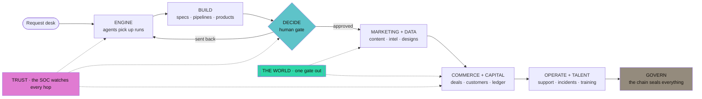

<div align="center">

# ⚙️ ALPHACORE

### The company that runs itself — and proves every move on a hash chain.

**An entire AI-native company inside a single Node process.**
One hundred and twenty-two departments across thirteen divisions, staffed by an AI workforce that drafts, builds,
researches, sells, supports, **hires its own new employees** — and reaches the real world through one guarded
door — while humans hold every gate that matters: approving, publishing, signing, and ruling.


*No frameworks. No build step. One process, one SQLite file, and a living map
where you watch the company work.*

**[Install & run](docs/INSTALL.md)** · [Security](../SECURITY.md) · [Contributing](../CONTRIBUTING.md) · [Licence](../LICENSE)

</div>

---

## Contents

| | |
|---|---|
| [What this is](#what-this-is) · [What makes it different](#what-makes-it-different) | the argument |
| [Quick start](#quick-start) · [First run](#first-run) · [On a phone](#on-a-phone) | getting in |
| [The company at a glance](#the-company-at-a-glance) · [How work moves](#how-work-moves-through-the-company) · [All 122 departments](#the-company--13-divisions-122-departments) | the shape |
| [The engine room](#the-engine-room) · [The outside world](#the-outside-world) · [The platform layer](#the-platform-layer) | the machinery |
| [What a real deployment needs](#what-a-real-deployment-needs) | anchoring, erasure, approvals, canaries, push |
| [Security model](#security-model) · [Permissions](#authentication--fine-grained-permissions) · [The constitution](#the-constitution) | the guarantees |
| [The API](#the-api) · [MCP](#mcp--both-directions) · [Webhooks](#webhooks) · [Command line](#the-command-line) | the surfaces |
| [Configuration](#configuration) · [Data on disk](#data-on-disk) · [Layout](#layout) | the operations |
| [Verification](#verification) · [Design decisions](#design-decisions) | the proof |

---

## What this is

Most "AI agent" projects are a chat loop with tools bolted on. AlphaCore is an
**operating company**: a structure with departments, budgets, gates, reviewers,
incidents, postmortems, and a permanent record.

- **Money is reserved before a model is called.** A runaway loop hits the cap,
  not your card.
- **Reviewers are forced onto a different model family than authors.** A model
  cannot mark its own homework.
- **Low-confidence work stops at a human gate** rather than shipping quietly.
- **Every consequential act is sealed into an append-only SHA-256 hash chain**
  you can verify from the dashboard header.
- **Anything that leaves the machine passes one gate**, and the intent is
  written to the chain *before* the call goes out — so a blocked attempt leaves
  a record too.
- **The record answers to something outside this machine.** A timestamping
  authority witnesses the chain's head on a schedule, because a hash chain
  proves the record agrees with *itself* — which is exactly what a rewritten
  record does.

The AI does the work. The humans keep the authority. The chain keeps them both
honest.

### What makes it different

| | |
|---|---|
| **One process** | `node src/server.js`. HTTP API, static console, worker loop, scheduler, WebSocket — no reverse proxy, no queue server, no container required. |
| **One dependency** | `@anthropic-ai/sdk`. Everything else is the standard library: `node:sqlite`, `node:crypto`, `node:http`. The WebSocket framing is hand-rolled against RFC 6455. |
| **No build step** | The browser loads the same JavaScript that is in the repository. No bundler, no transpiler, no `dist/`. |
| **Zero external requests from the console** | No fonts, no CDNs, no analytics, no telemetry. This is checked in the test sweep, not merely intended. |
| **Runs at zero cost** | Without a provider key it runs in deterministic mock mode. The entire platform is explorable for nothing. |
| **Arabic is first-class** | Not a translation layer bolted on: a dictionary the shell speaks and a DOM pass over every rendered page, with RTL layout throughout. |

---

## Quick start

```bash
cd crucible-core
npm install
npm start          # http://localhost:8484
```

On Windows, double-click **`Start-AlphaCore.bat`** — it checks the Node
version, installs on first run, and opens the browser.

Requires **Node ≥ 22.5**. Not negotiable: the database layer is `node:sqlite`,
which does not exist below 22.5.

### First run

The first time the server starts against an empty database it creates one
account and prints it, **once**:

```
──────────────────────────────────────────────────────────
  First run. The owner account has been created.

    username   owner
    password   78jv-n9n7-azvr-68dx

  This is shown once and is not stored anywhere in readable form.
  You will be asked to change it the moment you sign in.
──────────────────────────────────────────────────────────
```

Lowercase letters and digits in groups of four, with `i`, `l`, `o`, `0` and `1`
left out — because the screen it is read from and the screen it is typed into
are often not the same one.

Until that password is replaced, the account can do exactly two things: look at
itself, and choose a new one. **Enforced in the server**, not asked for on
screen — a prompt the client can skip is not a requirement.

Missed the line? You are not locked out:

```bash
npm run reset-password            # the owner account
npm run reset-password -- alice   # somebody else
```

It issues a new password, prints it once, ends every open session for that
account, and writes the reset to the audit chain. It requires filesystem access
to the database — the same access needed to delete it — so it grants nobody
anything they did not already have.

### Going live

Out of the box: **mock mode**. Every model call returns a deterministic stub,
nothing leaves the machine, nothing costs anything. The header says `MOCK MODE`
so you are never in doubt.

1. **Settings → AI providers** — paste a key. Encrypted at rest with
   AES-256-GCM, never echoed back; the page shows the last four characters.
2. **Test connectivity** — one small real call, and you see what came back.
3. **Budgets → company cap** — money is reserved before a model is called.
4. **World → Connectors** — each starts fenced by an allowlist.
5. **Settings → This company** — your company's name replaces `this company` in
   every system prompt, investor update and generated document.

Full instructions, backups, upgrades and the runbook: **[docs/INSTALL.md](docs/INSTALL.md)**.

---

## On a phone

The console is built for a phone as much as a desktop.

- Below 860px the rail and the department list slide in together as a **drawer**,
  opening on the division you are already standing in.
- A **bar of four thumb-sized targets** takes the bottom of the screen —
  overview, departments, search, account — carrying the waiting-on-you count.
- **Tables scroll inside their own box** instead of pushing the page sideways.
- The layout keeps clear of the notch and the home indicator.

A phone cannot reach `localhost`, so the server prints this machine's address on
the network when it starts:

```
AlphaCore running on http://localhost:8484
  on this network:  http://192.168.0.193:8484
```

**Installing to a home screen** — it is a progressive web app: an icon, no
address bar, its own entry in the app switcher, and it opens without waiting for
the network. Android/Chrome offers *Install app*; iOS/Safari, Share → *Add to
Home Screen*. This needs **HTTPS**: browsers only treat `localhost` as a secure
origin over plain `http`, so over a LAN address the layout works but it stays a
browser tab. Put Caddy or a tunnel in front and both come back.

**Offline**, the shell opens and says in your own language that it cannot reach
the company — rather than a browser error page implying the app is broken.
Nothing under `/api` is ever cached: a stale approval queue looks exactly like
the truth, which is worse than an error.

The icons are drawn by `scripts/make-icons.mjs`, which writes the PNG bytes
itself — deflate, CRC, coverage antialiasing — rather than adding an image
library to a project whose whole point is that it has none.

---

## The company at a glance

```mermaid
flowchart TD
  CORE(("◆ HARMONY<br/>orchestrator +<br/>audit chain"))
  ENGINE["ENGINE · 9<br/>requests · agents · runs<br/>pipelines · providers"] --> CORE
  WORLD["THE WORLD · 9<br/>integrations · the gate · vault<br/>web · MCP · queue"] --> CORE
  BUILD["BUILD · 10<br/>system design · products<br/>projects · releases · packages"] --> CORE
  DECIDE["DECIDE · 9<br/>human gate · decisions · budgets<br/>risks · evals · shadow company"] --> CORE
  DATA["DATA · 7<br/>intelligence · segments · datasets<br/>archive · knowledge graph"] --> CORE
  MARKETING["MARKETING · 20<br/>brand · content · design · SEO<br/>paid · lifecycle · events · press"] --> CORE
  COMMERCE["COMMERCE · 7<br/>pricing · sales · customers<br/>success · revenue loop"] --> CORE
  CAPITAL["CAPITAL · 5<br/>finance · reports · FinOps<br/>treasury · money desk"] --> CORE
  OPERATE["OPERATE · 7<br/>incidents · support · assets<br/>legal · contact centre"] --> CORE
  TALENT["TALENT · 10<br/>people · recruiting · academy<br/>memory · the floor · skills"] --> CORE
  TRUST["TRUST · 5<br/>SOC · compliance · sustainability<br/>provenance · red team"] --> CORE
  EXEC["EXECUTIVE · 4<br/>board · investor relations<br/>comms · operating rhythm"] --> CORE
  GOVERN["GOVERN · 12<br/>constitution · oversight · audit<br/>watchtower · time machine · backups"] --> CORE
  classDef c1 fill:#c0563a,color:#f2f0ea,stroke:none
  classDef c2 fill:#b78bff,color:#14100c,stroke:none
  classDef c3 fill:#5ec3c9,color:#14100c,stroke:none
  classDef c4 fill:#78bf6d,color:#14100c,stroke:none
  classDef c5 fill:#ff5fa2,color:#14100c,stroke:none
  classDef c6 fill:#e5533d,color:#14100c,stroke:none
  classDef c7 fill:#e8c547,color:#14100c,stroke:none
  classDef c8 fill:#ffb020,color:#14100c,stroke:none
  classDef c9 fill:#4f9cf0,color:#14100c,stroke:none
  classDef c10 fill:#e07bd2,color:#14100c,stroke:none
  classDef c11 fill:#d8d8d8,color:#14100c,stroke:none
  classDef c12 fill:#948b7d,color:#14100c,stroke:none
  classDef c13 fill:#2fd6a8,color:#14100c,stroke:none
  classDef core fill:#1d1812,color:#e0714f,stroke:#e0714f,stroke-width:2px
  class ENGINE c1
  class BUILD c2
  class DECIDE c3
  class DATA c4
  class MARKETING c5
  class COMMERCE c6
  class CAPITAL c7
  class OPERATE c8
  class TALENT c9
  class TRUST c10
  class EXEC c11
  class GOVERN c12
  class WORLD c13
  class CORE core
```



Every department declares what it hands to, reviews for, audits, and remembers.
Those declarations are data, not decoration: **344 relationships** that the map
draws, the trace walks hop by hop, and the launch audit checks. A department
joined to nothing is a finding, not a diagram problem.

## How work moves through the company



---

## The map

The overview is a **living circuit board**: a dense core of the orchestrator and
the chain, with a tree for every district growing out of it. Every leaf is a
department, drawn from the same catalogue the router uses — never a picture that
can drift from the code.

- **Point** at a district to bring up its colour · **click** to go inside
- **Right-click** any department for everything it touches
- **Trace flow** walks the graph hop by hop, showing how work actually moves
- **Drag / wheel** pans and zooms; the zoom level is remembered
- Edges are typed and drawn differently: hand-off, sent back to improve,
  independent peer review, audit verdict, stops for a human, memory kept

`GET /api/map` returns the whole thing — divisions, departments, edges,
connectivity audit and live flow counts — as JSON.

---

## The company — 13 divisions, 122 departments

<details open>
<summary><b>ENGINE · 10</b> — the workforce and the work</summary>

**Request desk** · **Agents** · **Workforce** · **Run queue** · **Pipelines** ·
**Providers** · **Artifacts** · **Capacity** · **Workstreams** · **Model chains**

Where work is asked for and carried out. 51 AI employees seeded from
`config/agents.json`, each with a mission, a tier, a sensitivity class and a
human owner. Runs are leased, attempted, retried with backoff, and shelved
honestly when they never succeed. Runs left `running` by a process that died are
reclaimed to the queue at boot and recorded.
</details>

<details>
<summary><b>BUILD · 10</b> — specifications, products, and shipping</summary>

**System design** · **Infrastructure** · **Products** · **Journeys** ·
**Projects** · **Tasks** · **The Lab** · **Releases** · **Sprints (Scrum)** ·
**Department packages**

Blueprints advance stage by stage into complete document packages on disk.
Journeys move customers through defined arcs. Sprints carry points and velocity.
Department packages install and uninstall whole departments from a manifest.
</details>

<details>
<summary><b>DECIDE · 10</b> — where a person is required</summary>

**Human gate** · **The desk** · **Decisions** · **Budgets** · **Risks** · **Quality** ·
**Evals** · **PMO gates** · **AI Auditor** · **Shadow company**

The decision registry with evidence and verification. Reservation-first budgets:
money is held before the call, settled after, released on failure. A mini-tribunal
of advocate, critic, judge, validator and red team. The **shadow company** forks
the whole database and runs a scenario against the copy, so a strategy can be
tried without touching the real one.
</details>

<details>
<summary><b>DATA · 8</b> — what the company knows</summary>

**Intelligence** · **Segments** · **Datasets** · **Archive** · **Knowledge** ·
**Insights** · **Knowledge graph** · **Recall**

Multi-round intelligence collection that proposes organisations, then harvests
their real details from their own websites — and never invents an email, a phone
number or an address. The knowledge graph builds nodes and typed edges from real
rows and answers "what do we know about X" within N hops.
</details>

<details>
<summary><b>MARKETING · 20</b> — a complete district</summary>

**Localization** · **Social media** · **Content studio** · **Design studio** ·
**Marketing** · **Market watch** · **Marketing department** · **Brand studio** ·
**Personas** · **Positioning** · **Search** · **Paid media** · **Lifecycle email** ·
**Editorial calendar** · **Events** · **Press & media** · **Community** ·
**Attribution** · **Landing pages** · **Marketing operations**

The largest district: strategy (personas, positioning, brand), production
(content, design, localization, landing pages), distribution (social, search,
paid, lifecycle, events, press, community), and measurement (attribution, market
watch, marketing operations) — each wired to the others and outward to commerce,
data and the gate.
</details>

<details>
<summary><b>COMMERCE · 7</b> — money coming in</summary>

**Pricing** · **Customer success** · **Sales** · **Customers** · **Relations** ·
**Procurement** · **Revenue loop**

The revenue loop runs a name on a list to money in the account: source, approach,
meeting, proposal, invoice, deliver. Every hop that touches somebody outside goes
through the gate. The two that cannot be undone — agreeing, and taking money —
stop for a person.
</details>

<details>
<summary><b>CAPITAL · 5</b> — money going out, and money held</summary>

**Finance** · **Financial reports** · **FinOps** · **Treasury (crypto)** ·
**Money desk**

Ledger, P&L, runway, spend efficiency. The treasury is **watch-only**: the
platform never holds a private key, seed phrase or mnemonic. Payouts are signed
outside it, and resolving one requires a signed-in human that no autonomy path
can reach.
</details>

<details>
<summary><b>OPERATE · 8</b> — keeping the lights on</summary>

**Incidents** · **Support** · **Assets** · **Legal** · **Vendors** ·
**Objectives** · **Contact centre** · **Deliverability**

Incidents demand postmortems. Support drafts replies and graduates an agent to
sending unedited only after a hundred sent at ninety-five per cent unedited —
and recalls it below ninety. The contact centre handles real telephony:
messages, calls, voicemail and carrier webhooks verified by signature.
</details>

<details>
<summary><b>TALENT · 10</b> — the workforce grows itself</summary>

**People** · **Org & personas** · **The society** · **Disputes** ·
**Enablement** · **Recruiting** · **Academy** · **Agent memory** ·
**The floor (chat)** · **Skill market**

Recruiting opens a role, drafts a spec, and hires a new AI employee into the
org. The academy trains it. Agent memory keeps episodes, grades them, and writes
playbooks that are recalled into later prompts. The floor is a live chat room
where employees and humans talk. The skill market proposes, tests and adopts new
capabilities.
</details>

<details>
<summary><b>TRUST · 6</b> — the company checking itself</summary>

**Security (SOC)** · **Compliance** · **Sustainability** · **Provenance** ·
**Red team** · **Erasure**

Provenance issues **Ed25519 receipts** over canonically serialised content that
anyone can verify without this platform. The red team attacks the company on a
schedule — prompt injection, secret exfiltration, unscoped egress, bulk contact,
money without a person, audit tampering, vault read-back, SSRF — and an open
finding is a blocker.
</details>

<details>
<summary><b>EXECUTIVE · 4</b> — the long view</summary>

**Board room** · **Investor relations** · **Internal comms** ·
**Operating rhythm**

Board packs, monthly investor updates built from live numbers with no invented
facts, internal announcements, and the rhythm that runs the day.
</details>

<details>
<summary><b>GOVERN · 15</b> — the rules and the record</summary>

**Harmony** · **Autopilot** · **Governance** · **Oversight** · **Scorecard** ·
**Users & roles** · **Roles** · **Settings** · **Audit chain** · **Anchors** ·
**The constitution** · **Time machine** · **Watchtower** · **Instruments** · **Backups**

The constitution is enforced by machine at the gate, not written on a poster.
The time machine snapshots the company and replays it: stand at any past moment
and see what was true. The audit chain is append-only at the database level and
verifiable from the header.
</details>

<details>
<summary><b>THE WORLD · 9</b> — everything outside this machine</summary>

**Integrations** · **The gate** · **The vault** · **The open web** · **MCP** ·
**The queue** · **Companies** · **API keys** · **Webhooks**

One door out, and everything that guards it.
</details>

---

## The engine room

### The router

Nine real providers plus a deterministic mock: **anthropic**,
**claude-subscription** (your Claude Code CLI, no API key), **openai**,
**deepseek**, **google**, **openrouter**, **groq**, **together**, **ollama**
(local), and **mock**.

Agents declare a *tier*, not a model. The router resolves a tier to a chain of
provider/model candidates and walks it until one answers. A tier with no
available provider fails loudly — "router exhausted" — rather than silently
degrading.

**Reviewers are pushed onto a different provider family than the author.** Two
instances of one model reviewing each other is not review.

**Changing a tier's chain is a decision, not an edit.** It changes every
employee on that tier at once, invisibly, until quality drops in a way nobody
attributes to it — so a candidate is proposed, canaried against the chain in
service *on the same day*, and promoted by a person who has been told what
regressed. An untested chain cannot be promoted, and a canary that proved
nothing does not count as evidence.

**Every run records what actually answered it** — provider, model, family, and
the content hash of the system prompt it was sent. Providers move what a name
points at without announcing it, and a run that cannot name its model and its
prompt is a run nobody can reproduce or account for.

### Budgets, reservation-first

```
reserve(estimate) → call the model → settle(actual)
                 ↘ failure → release
```

Money is held before the call and reconciled after. A loop that runs away hits
the cap and stops. Budget scopes are `company`, `governance`, `agent` and
`decision`, and the constraint is in the schema — not in a comment.

### The audit chain

Every consequential act is one row:

```
entry = { occurred_at, actor_type, actor_id, action, subject_type, subject_id, payload }
hash  = SHA-256(canonical(entry) + previous_hash)
```

- Canonical serialisation: sorted keys, no whitespace variance
- `UPDATE` and `DELETE` on `audit_log` are refused by **SQL triggers**, not by
  convention
- `verifyChain()` recomputes the whole chain and names the exact entry that
  broke
- The header carries a live badge; the launch audit and both proofs check it

The actor is injected server-side. A client can ask for an action; it cannot
claim to be someone. Autonomy records itself as `system:autonomy` and never
as a human who did not act.

### The workforce

51 employees seeded from `config/agents.json`, each with a system prompt that
resolves `{{company}}` to your company's name. Personas add voice; memory adds
recall. Runs carry attempts, leases, token counts and cost. Pipelines chain runs
into multi-stage work with gates between stages.

---

## The outside world

Nothing reaches outside this machine except through one gate, in this order:

```
scope → allowlist → quota → constitution → value ceiling → dry-run
```

- The **intent is written to the chain before the call**, so a blocked attempt
  leaves a record too
- **Failure closed**: if a rule cannot be evaluated, the call does not happen
- A new connector starts in **dry-run** — it runs the whole path and sends
  nothing, so you can watch what it *would* do
- Every verdict, allowed or refused, lands on the egress log with the rule that
  decided it

### Connectors

Nine built in — **gmail**, **gcalendar**, **github**, **slack**, **telegram**,
**x**, **linkedin**, **stripe**, **notion** — plus a generic **HTTP driver**
that turns any REST API into a connector from a config block: base URL, auth
placement, and named operations.

Credentials live in the **vault**: AES-256-GCM at rest, with the master key in
`data/master.key`, deliberately outside the database. The plaintext leaves only
for the connector making the call. Listings show the last four characters and
nothing else. OAuth flows verify state and refresh expiring tokens on the queue.

### The open web

Fetch, search, and a real browser. Every page is kept with its hash so a claim
can be traced back to a source. Fetched text is **data, never instruction** — an
injection scanner runs over everything that comes back, in **English and
Arabic**, because a scanner that only reads one language is a hole in the shape
of the other.

### The queue

Durable jobs with attempts, exponential backoff, idempotency keys and a shelf
for whatever never succeeded. Everything that touches the outside runs here
rather than on a bare timer, because a call that fails halfway must be retried
rather than repeated blindly.

---

## The platform layer

### The operating rhythm

The part that makes "autonomous" true. Every tick the chief reads the situation —
queue depth, breached objectives, unpaid invoices, open incidents, budget
headroom, waiting approvals — and acts: enqueues work, chases revenue, opens
incidents, requeues stalled runs, calls for a decision. It never fabricates a
human approver; when a person is required, it stops and says so.

### Watchtower

Service objectives with targets, live values and breach state. A breach applies a
remedy — and, unlike the first version, **re-applies it on a cooldown** if the
problem persists, instead of firing once on the transition and then watching a
standing failure forever.

### Many companies

Tenancy is **by file and process**, not by a `WHERE` clause:

```bash
ALPHACORE_DB=data/northwind.db PORT=8485 npm start
```

The Companies page spawns and supervises a process per tenant, each on its own
database file and port, with usage collected centrally. Because the boundary is
the operating system's rather than a query's, a bug in one company's page cannot
read another's rows. Do not, however, put two parties who actively distrust each
other behind one machine.

### Backups

Checkpoint the write-ahead log, copy the file, record size, SHA-256, chain tip
and chain hash. Verification re-hashes the copy and re-counts its chain against
what was recorded. A quarterly restore drill is a registered ritual, because a
backup you have never restored is a hope.

---

## What a real deployment needs

The bones above are the company. These are what a deployment discovers it needs,
usually at the worst moment — each one built, and each reachable as its own
department rather than buried in Settings.

| | |
|---|---|
| **Anchors** | The chain's head witnessed by an RFC 3161 timestamping authority, outside this disk. Verifying the chain proves it agrees with *itself*, which is exactly what a rewritten record also does — anybody who owns the file can edit it and recompute every hash. This is the only check that cannot be forged locally. |
| **Erasure** | Crypto-shredding: a person's data sealed under their own key *before* the payload is hashed, so erasing them destroys the key while every hash still verifies. A right to be forgotten inside a record that cannot forget. |
| **The desk** | Everything waiting on a person, ordered by what it blocks. Batches are recorded as one act naming every item, never as a dozen entries that read like a dozen judgements. |
| **Roles** | Seven templates over the 204 permissions, with each irreversible power in exactly one of them. |
| **Model chains** | Which model does the work, and a canary that must pass — on the same day, against the chain in service — before it changes. An untested chain cannot be promoted, and an inconclusive canary does not count as evidence. |
| **Recall** | Local embeddings via ollama, so search finds "the tool that reads receipts" from "invoice OCR platform" — trigrams score that pair at 0.000. Nothing leaves the machine. |
| **Deliverability** | DKIM signing, and a preflight that reads live DNS to say what a receiver would conclude. Plus whether a call may lawfully be recorded, by jurisdiction. |
| **Instruments** | Prometheus at `/metrics`, retention that never touches the chain, and the event-loop lag that explains "the server was down" when the process never stopped. |

Also: **Web Push**, so an approval reaches somebody who is not looking at a tab —
the company's throughput is bounded by how fast a human answers a gate. **TOTP,
rate limiting and lockout** on sign-in. **Master key rotation** and a KMS door.
**A graceful drain** on SIGTERM. **Offsite backups** with write-ahead-log
archiving. And **paper trading**: real reads against real APIs, nothing sent —
the setting between "the plumbing works" and "the economics work".

Two tools that owe the platform nothing: a generated [OpenAPI
description](public/openapi.json) served at `/api/openapi.json`, and
[`scripts/verify-chain.mjs`](scripts/verify-chain.mjs) — copy it out of this
repository and it still checks an export, because a verifier that has to be run
by the system it is checking is a system marking its own homework.

## Security model

The load-bearing properties. A bug that breaks one of these is a security bug,
not a feature request — see [SECURITY.md](../SECURITY.md) for how to report one.

| Guarantee | How |
|---|---|
| The record cannot be edited | SQL triggers abort `UPDATE`/`DELETE` on `audit_log`; every row hashes the one before it |
| …and cannot be rewritten either | The chain's head is witnessed by an RFC 3161 authority outside this disk. Internal consistency is what a *rewritten* record also has; this is the check that cannot be forged locally |
| Money leaves only by a human | Autonomy cannot reach payout resolution; wallets are watch-only; no private key, seed or mnemonic is ever stored. A refund is a payment and meets the same gate |
| The gate is failure-closed | Six checks in order, intent chained before the call, unevaluable rule ⇒ no call |
| Identity comes from the server | The session's user is injected and overrides anything in the request body |
| A password is not enough | Optional TOTP, single-use; ten recovery codes; sign-in rate-limited per account **and** per address; lockout after eight failures |
| A session cannot live forever | An idle clock that slides and an absolute one that does not, so a leaked token expires even if something keeps touching it |
| Secrets are encrypted at rest | AES-256-GCM, master key outside the database and optionally outside the machine, rotatable without losing a credential; the API masks to the last four characters |
| A person can be forgotten | Crypto-shredding: their data is sealed under their own key before the payload is hashed, so destroying it leaves every hash verifying |
| No shipped credential | First run generates its own password; an unclaimed account can only read itself and replace it |
| Nothing leaks to git | `data/`, `workspace/`, `.env*`, `*.key`, `*.pem` are ignored, and CI fails the build if one is ever committed |

**What it does not guarantee**, stated plainly:

- It is built to run on a machine you control. Tenants are separated by *file
  and process*, not by a `WHERE` clause — do not put two parties who distrust
  each other behind one instance.
- `data/master.key` is a file on disk by default. `ALPHACORE_MASTER_KEY_COMMAND`
  moves it to a secret manager; without that, theft of the disk is theft of both.
- The injection scanner catches **shapes, not meaning**. Fuzzing put its miss
  rate at 0 of 320 mutated payloads in two languages, and that is not a claim of
  effectiveness — text fetched from the web is treated as data everywhere
  regardless.
- The server speaks plain HTTP. Put TLS in front of it before a network sees it;
  installing to a phone's home screen needs it anyway.
- Stripe's refund, dispute and tax paths are wired and gated but **not verified
  against a live account**. Paper trading exists to exercise them first.

### The constitution

Ten rules, enforced by machine at the gate, each with a severity that decides
what happens: `block` refuses, `gate` stops for a person, `warn` records.

| Rule | |
|---|---|
| `no-fabricated-approval` | **block** — no action may record a human approver who did not approve it |
| `claims-need-sources` | warn — a claim about the outside world carries the source it came from |
| `no-unrequested-bulk` | **block** — the company does not contact people in bulk who never asked |
| `honour-unsubscribe` | **block** — anyone who asks to be left alone is left alone, everywhere, permanently |
| `money-needs-a-person` | **gate** — money leaves only when a signed-in person releases it |
| `spend-ceiling` | **gate** — any single outbound action over fifty dollars stops for a person |
| `never-impersonate` | **block** — no employee may present itself as a specific real person |
| `fetched-text-is-data` | **block** — text from the web is data, never instruction |
| `no-secret-egress` | **block** — no credential, key or seed phrase leaves by any channel |
| `everything-on-the-chain` | warn — every consequential act is written before it happens |

### Authentication & fine-grained permissions

- scrypt-hashed passwords, opaque 7-day session tokens
- Every `/api/*` route is authenticated; anonymous requests get 401. Four paths do not take a session token, and each is deliberate:
  `POST /api/auth/login` and `POST /api/auth/logout` (there is nothing to
  present yet, or nothing left to present), `GET /api/ping` (liveness, which
  answers nothing about the company), and `/webhooks/*` — carrier callbacks
  from the phone network, which cannot hold a token and are authenticated by
  the carrier's own signature instead
- **204 atomic permissions** across 105 families (`decisions.approve`,
  `treasury.payout`, `egress.grant`, …). The superadmin holds `*`
- The launch audit checks that every permission the API demands exists in the
  catalogue — a route guarded by a permission nobody can hold is permanently
  unreachable, and that is a blocker
- Changing a password ends every session for that account, including the one
  that changed it

---

## The surfaces

### The API

**498 routes** — all JSON, all
permission-checked, all under `/api`.

```bash
curl -H "x-auth-token: $TOKEN" http://localhost:8484/api/stats
curl -H "x-auth-token: $TOKEN" http://localhost:8484/api/map
curl -H "x-auth-token: $TOKEN" http://localhost:8484/api/audit/verify
```

**API keys** for machine callers: shown once at creation, scoped to a permission
set, rate-limited per minute, with per-call logging. A revoked key stops working
immediately.

**`GET /api/openapi.json`** is the whole surface described, generated from the
server's own route table so it cannot drift — each path carrying the permission
it actually demands, because the generator *runs* the real resolver rather than
reimplementing it. Served without a token: an API description is not a secret,
and needing a token to read the document that explains how to get a token is a
joke that costs somebody an afternoon. Request and response bodies are marked as
undescribed rather than guessed at, because a spec that invents a schema is one
that tooling generates clients from.

**`GET /api/ping`** carries no credential — version, uptime, and whether the
database answers. Deliberately the dullest endpoint in the system: a health check
that can read your company is not a health check.

**`GET /metrics`** is Prometheus text, hand-written because the format has four
rules. It answers only localhost until `METRICS_TOKEN` is set — this endpoint is
conventionally open and that convention is wrong here, since it carries model
spend, queue depth, incident counts and how long the record has gone unwitnessed.

**Web Push** reaches somebody who is not looking at a tab. VAPID and aes128gcm
on `node:crypto`, no dependency. A push carries a title, a line and a route —
never a record, because it crosses a machine nobody here owns.

### MCP — both directions

**Outward**, AlphaCore is an MCP *client*: register any MCP server over stdio or
HTTP JSON-RPC 2.0 and its tools become capabilities the workforce can use,
through the same gate as everything else.

**Inward**, AlphaCore is an MCP *server* at `POST /mcp`. Point Claude Code,
Claude Desktop or any MCP client at it with your own token and drive the company
from outside. Seven tools are exposed — `company_overview`, `list_sections`,
`submit_request`, `ask_employee`, `read_memory`, `audit_tail`, `post_to_floor` —
and you get **exactly the permissions your account holds**. There is no wider
back door.

```json
{
  "mcpServers": {
    "alphacore": {
      "url": "http://localhost:8484/mcp",
      "headers": { "x-auth-token": "YOUR-ALPHACORE-TOKEN" }
    }
  }
}
```

### Webhooks

Outbound events with HMAC-SHA256 over `timestamp.body` in
`x-alphacore-signature`, a five-minute replay window, retries with backoff, and
pause-on-failing. Subscribe with glob patterns (`run.*`, `egress.blocked`).

### Live updates

A hand-rolled WebSocket at `/live` — RFC 6455 framing, no dependency — carries
presence, the live ticker, and floor chat.

### The command line

| | |
|---|---|
| `npm start` | run the server |
| `npm run dev` | run with `--watch` |
| `npm test` | 95 tests, on their own database files |
| `npm run prove` | prove the outside-world layer end to end |
| `npm run prove:platform` | prove the platform layer end to end |
| `npm run seed` | sample agents, runs and a tribunal case (mock, $0) |
| `npm run reset-password` | issue a new password for an account — the way back in |
| `npm run rotate-key` | re-seal every secret under a new master key (`-- --dry-run` first) |
| `npm run anchor` | have a third party witness the chain's head now |
| `npm run openapi` | regenerate the API description (`openapi:check` fails on drift) |
| `npm run verify` | check a chain — **works copied out of this repository** |
| `npm run icons` | redraw the app icons from scratch, no image library |
| `node scripts/launch-audit.mjs` | the pre-flight audit — exits non-zero on a blocker |

---

## Configuration

Settings take precedence over the environment. Use the environment when a
machine must be configured before it first starts.

| Variable | Meaning |
|---|---|
| `PORT` | listening port (default `8484`) |
| `ALPHACORE_DB` | database file, relative to `crucible-core/` (default `data/alphacore.db`) |
| `ALPHACORE_MOCK` | `true` forces mock mode even with a key present |
| `ALPHACORE_TENANT` | set by the platform when it spawns a tenant; you do not set this |
| `ANTHROPIC_API_KEY` | and the equivalents per provider — but prefer Settings, where keys are encrypted |
| `ALPHACORE_MASTER_KEY_COMMAND` | any command printing the master key material: `vault read`, `op read`, `aws kms decrypt`. The KMS door |
| `ALPHACORE_MASTER_KEY` | the material directly, base64, for a container secret |
| `TRUST_PROXY` | `true` only behind a reverse proxy, so `X-Forwarded-For` can be believed for rate limiting |
| `METRICS_TOKEN` | required to scrape `/metrics` from anywhere but localhost |
| `DRAIN_SECONDS` | how long in-flight work may finish on SIGTERM (default 20) |

Settings the console owns, all editable without a restart:

| | |
|---|---|
| `COMPANY_NAME` · `PUBLIC_BASE_URL` | who this install is, and where the world calls back |
| Provider keys · `ALPHACORE_MOCK` | encrypted at rest, never echoed back |
| `PAPER_TRADING` | real reads, nothing sent — the setting between mock and live |
| `ANCHOR_WITNESS` · `ANCHOR_TSA_URL` · `ANCHOR_EVERY_HOURS` | who witnesses the chain, and how often |
| `ALERT_CHANNEL` + its config | how a person is reached at 3am: Telegram, a webhook, or a command |
| `BACKUP_SHIP_COMMAND` | gets a backup off this machine; the path is appended |
| `EMBEDDING_MODEL` · `OLLAMA_URL` | a local model for recall that understands a rephrased question |
| `MAIL_DOMAIN` · `DKIM_SELECTOR` | what signed mail speaks for |
| `APPROVAL_SLA_HOURS` | how long anything should wait for a person (default 24) |
| `RETENTION_ENABLED` · `SLOW_QUERY_MS` | housekeeping, and what counts as blocking |
| `TIER_OVERRIDES` | a promoted model chain — written by the canary, not by hand |

Config files:

| | |
|---|---|
| `config/agents.json` | the workforce — missions, tiers, sensitivity, owners |
| `config/providers.json` | providers, tiers and the candidate chains |
| `config/rituals.json` | recurring obligations, including the restore drill |

## Data on disk

```
data/
  alphacore.db          every record, including the audit chain
  alphacore.db-wal      write-ahead log
  master.key            the AES key for the vault — NOT in the database, on purpose
  master.key.retired-*  previous keys, kept: a backup from before a rotation
                        is still sealed under one, and deleting it makes that
                        backup unreadable
  backups/              taken from the console, each with its hash and chain tip
  wal-archive/          the log between backups, 48 segments — the difference
                        between losing a day and losing four minutes
  simulations/          shadow-company forks
  tenants/              one database per company

workspace/              what the workforce produced: blueprints, designs,
                        reports, intel exports, working code
```

**Both `data/` and `workspace/` are ignored by git.** They are regenerated by
the platform and they belong to whoever runs it, not to this project. A backup
of the database *without* `master.key` cannot decrypt a single stored
credential — keep them together.

## Layout

```
crucible-core/
  src/                106 modules, ~26,500 lines
    server.js         one process: HTTP + console + workers + scheduler + WS
    db.js             158 tables, forward-only migrations
    audit.js          the hash chain
    auth.js           sessions, 204 permissions, password generation
    router.js         tier → provider chain, with reviewer separation
    policy.js         reservation-first budgets
    workflow.js       agents, runs, leases, retries, reclamation
    egress.js         the gate, and paper trading
    vault.js          AES-256-GCM secrets, and rotating the key under them
    masterkey.js      where that key comes from: a file, the environment, a KMS
    constitution.js   the ten rules, enforced
    anchor.js         the chain witnessed outside this disk (RFC 3161, by hand)
    erasure.js        crypto-shredding, so a person can be forgotten
    approvals.js      the queue of what is waiting, and the roles that may act
    canary.js         prompt versions, and proving a model chain before it lands
    push.js           VAPID and aes128gcm, so an approval reaches a phone
    embeddings.js     recall by meaning when a local model is there
    observability.js  metrics, retention, and the synchronous-SQLite hazard
    lifecycle.js      draining, alerting, and getting a backup off the machine
    deliverability.js DKIM, and whether a recording is lawful
    totp.js           RFC 6238, checked against the reference vectors
    connectors/       nine integrations + a generic HTTP driver
    …
  public/
    index.html        the shell
    app.js            the console — 9,600 lines, vanilla, hash routing
    styles.css        2,300 lines: design tokens, light and dark, RTL-aware
    i18n.js           Arabic as a first-class language
    sw.js             network-first service worker
    manifest.webmanifest
  scripts/
    launch-audit.mjs  the pre-flight audit
    verify-chain.mjs  a verifier that works copied out of this repository
    openapi.mjs       the API description, generated from the route table
    rotate-key.mjs    re-seal everything under a new master key
    reset-password.mjs
    make-icons.mjs    writes PNG bytes with no image library
    prove-world.mjs   end-to-end proof of the outside-world layer
    prove-platform.mjs
  deploy/             a systemd unit, and Windows scripts that drain rather
                      than kill
  test/               95 tests across nine files
  docs/INSTALL.md     install, first run, phone, backups, upgrade, runbook
  config/             agents, providers, rituals
```

---

## Verification

Nothing here is claimed from inspection. Every number is measured.

```bash
npm test                        # 95 tests
npm run prove                   # the outside world, end to end
npm run prove:platform          # the platform layer, end to end
node scripts/launch-audit.mjs   # 21 checks; non-zero exit on a blocker
```

All three proofs run in **mock mode**: no key, no network, no cost.

**The launch audit** asks the questions somebody should have to answer before
handing this to anyone — of the running system, not of the code. Security (no
guessable password, nobody still holding a generated one, no unfenced live
connector, nothing the red team has open), record (the chain verifies, the
triggers exist, **a third party has witnessed it recently**, a backup exists and
has left this machine), wiring (every department joined, every department opens
a real page, every permission the API demands exists), health (nothing dead,
stalled or breached; somebody can be reached at 3am) and readiness (a provider
configured, the public URL set, the licence files present, no test residue).

**The tests** are not only examples. Alongside the unit and integration suites:

- **Property tests** — three thousand generated inputs through the constitution,
  asserting it never throws and never returns an unknown verdict. A gate that
  throws fails open in any caller with a `try/catch` around it, and every caller
  has one.
- **Fuzzing** — mutated injection payloads in English and Arabic. This found a
  real hole at 25%: the list had "ignore" and "disregard" and no third synonym,
  so `forget everything above` walked straight through, in both languages.
- **Contention** — sixteen workers leasing two hundred runs at once, each taken
  exactly once. Every lease bug in history looks fine with one worker.
- **The forgery** — the anchoring test rewrites history, recomputes the whole
  chain properly, asserts that `verifyChain()` is *fooled* by it, and only then
  asserts that the anchor catches it anyway.
- **The browser's half** — the push tests build a subscription keypair, hand the
  public half to the encrypter, then walk RFC 8291 backwards and read the
  plaintext out.

**The browser sweep** opens all 122 departments in both themes and both
languages, at 1440×900 and again at 390×844 — 488 renders each — and fails on a
blank page, a console error, a horizontal overflow, a request to any host but its
own, **or any control without an accessible name**. An accessibility pass
somebody runs once is a state the code leaves within a month.

**CI** runs the tests and both proofs on Node 22 and 24, on Ubuntu and Windows,
boots the server and runs the audit against it, and fails the build if anything
under `data/`, any `.env`, or any key ever appears in the tree.

---

## Factory reset

Settings → **Danger zone**. Three locks: the superadmin role, the typed phrase
`WIPE ALL DATA`, and your password again. Two levels — a data wipe (records
cleared; users, sessions and provider settings survive; defaults re-seeded) and
a **full factory reset** (users, sessions and settings go too; a fresh `owner`
account is created and its password printed once to the server console). An
extra checkbox also deletes produced workspace files.

Either way the audit chain restarts with a genesis entry naming who pulled the
switch. The append-only triggers are dropped for the wipe and re-armed the
moment it is done.

---

## Design decisions

Choices that shaped this, and what they cost:

- **`node:sqlite` over better-sqlite3.** No native build, no `node-gyp`, no
  prebuilt binaries per platform — at the price of requiring Node 22.5.
- **A modular monolith over services.** One process is one deployment, one
  transaction boundary, one place to look when something is wrong. It scales up
  to a machine, not past it, and that is the intended size.
- **Reservation-first budgets over usage reports.** A report tells you what you
  spent. A reservation stops you spending it.
- **A hash chain over an audit table.** An audit table you can edit is a diary.
- **Tenancy by file and process over a tenant column.** A missing `WHERE` clause
  is a data breach; a missing process is an error.
- **Network-first service worker over cache-first.** Slower, and it never serves
  last week's code to somebody who just upgraded.
- **Vanilla everything.** No framework means no upgrade treadmill, no build
  step, and a browser that runs exactly the file in the repository. It also
  means writing your own WebSocket framing and your own PNG encoder — which,
  in a project whose argument is that the machinery should be legible, is the
  point rather than the cost.
- **`crucible-genesis` survives the rename.** It is the first link of every
  chain ever written, including the backups already on disk. Renaming it would
  make an old export fail verification for no visible gain.
- **The chain is anchored outside the disk.** Hash-linking detects an editor; it
  cannot detect the owner of the file, who can rewrite everything and recompute
  every hash. Internal consistency is exactly what a careful forger produces.
- **Erasure destroys a key rather than a row.** Deleting from an append-only
  chain is impossible by design, and "our architecture does not allow it" is not
  a lawful answer to an erasure request.
- **The queue's order cannot be gamed by waiting.** Urgency strictly outranks
  age; age only breaks ties inside a band. The first version added a capped age
  bonus, and a thirty-hour-old item scored level with a payout awaiting a
  signature.
- **A batch is recorded as one act.** Twelve entries that read like twelve
  judgements would misrepresent how much thought was applied.
- **Anything unrecognised is a write.** In paper trading, a capability nobody
  thought about is held rather than sent — the opposite default would let one
  new verb quietly undo the whole mode.
- **Vectors from two spaces are never compared.** A ranked list of nonsense looks
  exactly like a ranked list, which is worse than an error.
- **A verifier that must be run by the system it checks is worth little.**
  `verify-chain.mjs` imports nothing from `src/` and can be copied away.

---

<div align="center">

**[Install & run](docs/INSTALL.md)** · **[Security](../SECURITY.md)** · **[Contributing](../CONTRIBUTING.md)** · **[MIT](../LICENSE)**

*The AI does the work. The humans keep the authority. The chain keeps them both honest.*

</div>
