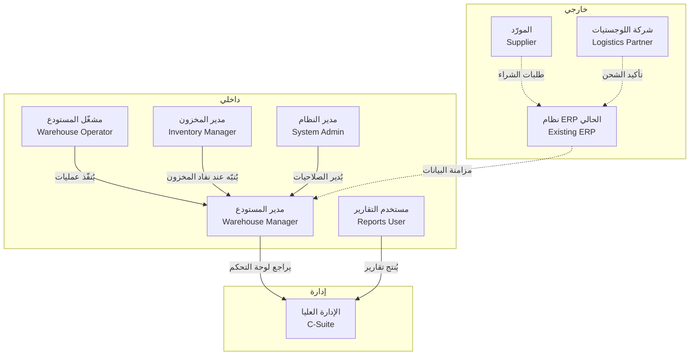
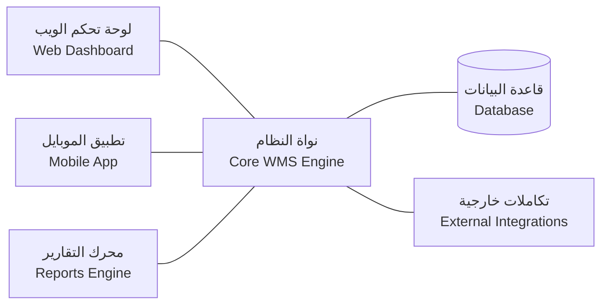
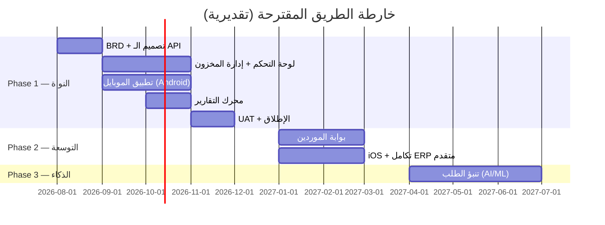

# Vision & Problem Statement — منصة إدارة المخازن (WMS)

# Vision & Problem Statement
## منصة إدارة المخازن الشاملة

**رقم الوثيقة:** WMS-VPS-001  
**الإصدار:** 1.0  
**التاريخ:** 2026-08-07  
**الحالة:** مسودة للمراجعة الهندسية

---

## 1. ملخص تنفيذي

تُعاني المستودعات ومراكز التوزيع متوسطة الحجم من ثغرات تشغيلية ناتجة عن الاعتماد على جداول بيانات يدوية أو أنظمة منفصلة غير متكاملة. تُقدّم هذه الوثيقة المشكلة وأصحاب المصلحة ومعايير النجاح القابلة للقياس لبناء منصة WMS موحّدة تشمل لوحة تحكم ويب، وتطبيق موبايل، ومحرك تقارير.

---

## 2. المشكلة

### 2.1 البيان الجوهري للمشكلة

المستودعات متوسطة الحجم (10,000 – 100,000 وحدة تخزين SKU) تفقد ما يتراوح بين 8% و15% من إيراداتها السنوية بسبب: نفاد المخزون غير المُبرَّر، والعدّ اليدوي المُعيب، وغياب الرؤية الفورية عبر الفروع. [Assumption: النسبة المئوية للخسارة مأخوذة من متوسطات صناعية عامة — يجب التحقق منها بدراسة ميدانية لدى العميل.]

### 2.2 الأعراض الموثّقة

| # | العَرَض | الأثر التشغيلي |
|---|---------|----------------|
| S-01 | الجرد اليدوي يستغرق 2–4 أيام في نهاية الشهر | توقّف جزئي للشحن |
| S-02 | لا يوجد تتبّع فوري لحركة البضاعة بين المناطق | قرارات إعادة الطلب مبنية على بيانات عمرها 24–48 ساعة |
| S-03 | التقارير تُنتَج يدوياً في Excel | معدل خطأ مرتفع، وتأخر في وصول المعلومة للإدارة |
| S-04 | العاملون الميدانيون لا يملكون أدوات محمولة مخصّصة | إعادة إدخال البيانات مرتين (ورقة ثم نظام) |
| S-05 | لا يوجد تنبيه آلي عند الوصول لمستوى إعادة الطلب | نفاد مفاجئ للمنتجات الحرجة |

---

## 3. المستخدمون وأصحاب المصلحة

### 3.1 ملفات أصحاب المصلحة

| المعرّف | الدور | الهدف الأساسي | نقطة الألم الرئيسية |
|---------|-------|---------------|---------------------|
| STK-01 | مدير المستودع | رؤية شاملة فورية | التقارير تصله متأخرة |
| STK-02 | مشغّل المستودع | إنجاز المهام بسرعة ودقة | العمل بأوراق ورقية وإعادة إدخال |
| STK-03 | مدير المخزون | صحة بيانات المخزون | الاكتشاف المتأخر للنفاد |
| STK-04 | مستخدم التقارير (محاسبة/مبيعات) | تقارير موثوقة وسريعة | إنتاج يدوي مُضيّع للوقت |
| STK-05 | مدير النظام | سيطرة على الأذونات | لا يوجد نظام مركزي للصلاحيات |
| STK-06 | الإدارة العليا | مؤشرات أداء فورية | غياب لوحة KPI موحّدة |

---

## 4. لماذا الآن؟

| عامل | التفاصيل |
|------|----------|
| ضغط السوق | تنامي التجارة الإلكترونية يزيد وتيرة الطلبات ودورات المخزون [Assumption] |
| تكلفة التأخير | كل ربع سنة إضافية بدون نظام تعني خسائر مستمرة في الكفاءة |
| نضج التقنية | توافر أدوات تطوير Flutter/React وBaaS بتكاليف معقولة يجعل المشروع ممكناً الآن |
| الاستعداد التنظيمي | [Open question: هل صدر قرار تنظيمي أو توجيه إداري يفرض التحديث؟ من يُقرّر؟] |

---

## 5. الرؤية والهدف

> **الرؤية:** منح كل عامل في المستودع — من المشغّل الميداني إلى المدير التنفيذي — رؤية فورية ودقيقة للمخزون وحركته، وتمكينهم من اتخاذ القرار بضغطة واحدة.

### 5.1 النتائج المستهدفة

| المعرّف | النتيجة | المقياس الكمّي | الإطار الزمني |
|---------|---------|----------------|---------------|
| OBJ-01 | تقليل وقت الجرد الدوري | من يومين إلى أقل من 4 ساعات | خلال 3 أشهر من الإطلاق |
| OBJ-02 | تحسين دقة المخزون | من <92% إلى ≥98.5% | خلال 6 أشهر |
| OBJ-03 | تقليص حوادث النفاد | بنسبة 70% أو أكثر | خلال 6 أشهر |
| OBJ-04 | تقليل وقت إنتاج التقارير | من يوم عمل كامل إلى أقل من 10 دقائق | فور الإطلاق |
| OBJ-05 | تبنّي التطبيق الميداني | 80% من المشغّلين يستخدمونه يومياً | خلال شهر من الإطلاق |

[Assumption: الأرقام الأساسية (92% دقة، يومان للجرد) مُشتقّة من أنماط صناعية نموذجية — يجب قياسها فعلياً عند العميل قبل تثبيت OBJ-02.]

---

## 6. المكوّنات المطلوبة (النطاق الداخلي)

### 6.1 المكوّنات المُدرجة في النطاق

| المعرّف | المكوّن | الوصف الموجز |
|---------|---------|---------------|
| SCOPE-01 | لوحة تحكم الويب | واجهة مديرين: مخزون، حركة، تنبيهات، KPI |
| SCOPE-02 | تطبيق الموبايل | واجهة مشغّلين: استقبال، صرف، نقل، جرد بالباركود |
| SCOPE-03 | محرك التقارير | تقارير مجدولة وفورية قابلة للتصدير (PDF, Excel) |
| SCOPE-04 | إدارة المستخدمين والأدوار | RBAC: أدوار مُعرَّفة مسبقاً وأذونات قابلة للتخصيص |
| SCOPE-05 | نظام التنبيهات | إشعارات فورية (push, email) عند حدود المخزون |
| SCOPE-06 | إدارة المواقع والرفوف | هيكل هرمي: مستودع > منطقة > رف > خانة |
| SCOPE-07 | API داخلية | REST API تربط كل المكوّنات وتدعم التكامل المستقبلي |

---

## 7. ما هو خارج النطاق (Explicit Out of Scope)

| المعرّف | ما هو مُستبعَد | السبب / الملاحظة |
|---------|----------------|------------------|
| OOS-01 | نظام نقاط البيع (POS) | منظومة منفصلة — تكامل مستقبلي محتمل |
| OOS-02 | المحاسبة والفوترة | من اختصاص ERP أو نظام مالي مخصّص |
| OOS-03 | إدارة الموردين (portal كامل) | نطاق Phase 2 [Open question: هل يُدرج بوابة مورّد مبسّطة في v1؟] |
| OOS-04 | التخطيط التنبؤي للطلب (AI/ML) | يتطلب بيانات تاريخية كافية — نطاق Phase 3 |
| OOS-05 | تكامل أجهزة الجرد التلقائي (روبوت/RFID) | يتطلب تقييم بنية تحتية منفصل |
| OOS-06 | تطبيق iOS في الإصدار الأول | [Open question: هل المشغّلون يستخدمون iOS أم Android؟ من يُقرّر؟] |
| OOS-07 | تعدد العملات | [Assumption: العمليات بعملة واحدة في v1] |

---

## 8. معايير النجاح القابلة للقياس

### 8.1 مؤشرات الأداء الرئيسية (KPIs)

| المعرّف | المؤشر | الخط الأساسي | الهدف | طريقة القياس |
|---------|---------|--------------|--------|---------------|
| KPI-01 | دقة المخزون | [Open question: يُقاس قبل الإطلاق] | ≥98.5% | مقارنة الجرد الفعلي بسجلات النظام شهرياً |
| KPI-02 | وقت معالجة طلب الاستلام | [Open question] | ≤15 دقيقة للطلب | متوسط مدة المعاملة من النظام |
| KPI-03 | وقت إنتاج التقرير الشهري | ~8 ساعات [Assumption] | ≤10 دقائق | تتبع وقت طلب التقرير حتى التسليم |
| KPI-04 | حوادث نفاد المخزون | [Open question] | انخفاض 70% | عدد الـ stockout events/شهر |
| KPI-05 | معدل تبني التطبيق الميداني | 0% | ≥80% من المشغّلين نشطون يومياً | DAU من analytics النظام |
| KPI-06 | وقت تشغيل النظام (uptime) | غير مُطبَّق | ≥99.5% شهرياً | مراقبة خارجية (uptime monitor) |
| KPI-07 | متوسط زمن الاستجابة (API) | غير مُطبَّق | ≤500ms عند P95 | APM dashboard |

### 8.2 تعريف "مكتمل" للإصدار الأول (v1 Definition of Done)

- [ ] جميع متطلبات SCOPE-01 إلى SCOPE-07 مُختبرة وقابلة للتوثيق.
- [ ] KPI-06 محقّق في بيئة الإنتاج لمدة 30 يوماً.
- [ ] 5 مستخدمين من كل دور أتمّوا اختبار القبول (UAT) بنسبة نجاح ≥95%.
- [ ] لا توجد ثغرات أمنية بمستوى Critical أو High في نتائج فحص OWASP.
- [ ] التوثيق التقني والمستخدم مُسلَّم.

---

## 9. القيود والمتطلبات غير الوظيفية على مستوى الرؤية

| المعرّف | القيد | التفاصيل |
|---------|-------|----------|
| NFR-V-01 | اللغة | العربية أساساً مع دعم الإنجليزية [Open question: هل يلزم دعم لغات أخرى؟] |
| NFR-V-02 | التوافق | متصفحات حديثة (Chrome, Firefox, Edge آخر إصدارين) |
| NFR-V-03 | الموبايل | Android 10+ [Assumption]؛ يُراجع iOS في Phase 2 |
| NFR-V-04 | الاتصال | التطبيق يعمل في وضع offline محدود (قراءة الباركود + تخزين مؤقت) |
| NFR-V-05 | البيانات | يجب الاحتفاظ بسجلات المعاملات لمدة ≥5 سنوات [Assumption: متطلب قانوني شائع] |
| NFR-V-06 | الأمان | المصادقة بـ JWT + MFA للمديرين؛ تشفير البيانات في النقل (TLS 1.2+) وفي التخزين |
| NFR-V-07 | الحجم | يدعم 50 مستخدماً متزامناً و500,000 SKU في v1 [Assumption] |

---

## 10. الافتراضات الحرجة الموحّدة

| المعرّف | الافتراض |
|---------|----------|
| ASM-01 | لدى العميل بنية تحتية سحابية أو استعداد للانتقال إليها (IaaS/PaaS) |
| ASM-02 | الأجهزة الميدانية (هواتف/أجهزة لوحية) يوفّرها العميل |
| ASM-03 | يوجد شخص مسؤول من جانب العميل (Product Owner) يملك صلاحية اتخاذ القرار |
| ASM-04 | البيانات التاريخية الحالية قابلة للتصدير واستيرادها في النظام الجديد |
| ASM-05 | تكامل ERP الخارجي — إن وُجد — سيُوفَّر له موصّل (connector) أو API من الطرف الآخر |

---

## 11. الأسئلة المفتوحة الحرجة

| المعرّف | السؤال | صاحب القرار | التأثير إذا لم يُحسم |
|---------|---------|-------------|----------------------|
| OQ-01 | ما حجم المستودع (عدد SKU، عدد الموظفين، عدد الفروع) في البيئة المستهدفة؟ | العميل | يؤثر في متطلبات الأداء والترخيص |
| OQ-02 | هل يُشترط التكامل مع ERP قائم؟ وأيّ ERP؟ | العميل + هندسة | يحدد وجود SCOPE-07 وتعقيده |
| OQ-03 | ما نظام التشغيل المستخدم على الأجهزة الميدانية (Android أم iOS)؟ | العميل | يحدد OOS-06 |
| OQ-04 | هل هناك متطلبات امتثال قانوني محلية (حماية بيانات، تقارير ضريبية)؟ | فريق قانوني العميل | يؤثر في NFR-V-05 وبنية البيانات |
| OQ-05 | من الجهة المُشغِّلة للنظام (in-house DevOps أم managed cloud)؟ | العميل | يحدد متطلبات النشر والمراقبة |
| OQ-06 | ما الميزانية والجدول الزمني للإصدار الأول؟ | العميل / إدارة المشروع | يحدد نطاق Phase 1 مقابل Phase 2 |
| OQ-07 | هل يُشترط دعم iOS في v1 أم يُؤجَّل؟ | العميل | يغيّر OOS-06 |

---

## 12. خارطة الطريق على مستوى الرؤية

[Assumption: الجدول الزمني تقديري ومبني على حجم وظيفي نموذجي لفريق مؤلف من 4–6 مطوّرين. يُعدَّل بعد تأكيد OQ-06.]

---

## 13. توقيعات الاعتماد

| الدور | الاسم | التاريخ | التوقيع |
|-------|-------|---------|----------|
| صاحب المنتج (Product Owner) | [Open question: OQ-03] | | |
| مدير المشروع | | | |
| المهندس المعماري | | | |
| ممثل العميل | | | |

---

*الوثيقة صادرة عن: AGT-BA-001 — Business Analyst Agent*  
*مرجع الطلب الأصلي: #7 — بناء منصة كاملة لإدارة المخازن*  
*الوثيقة التالية في الحزمة: WMS-BRD-001 — متطلبات العمل التفصيلية*