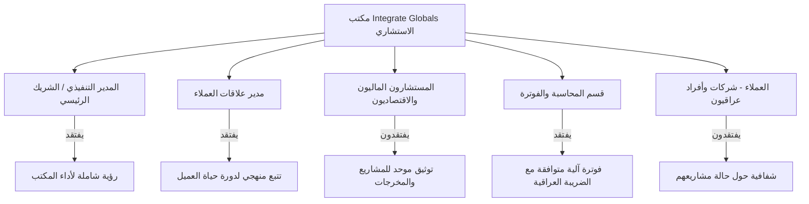
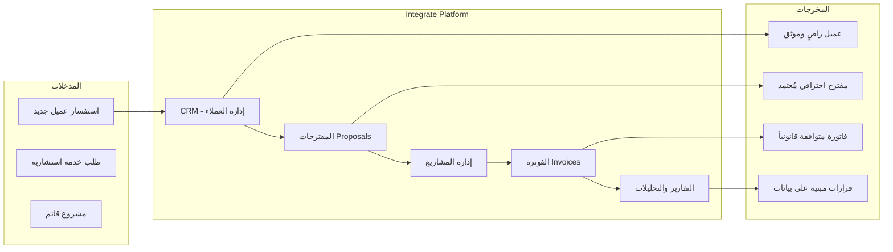
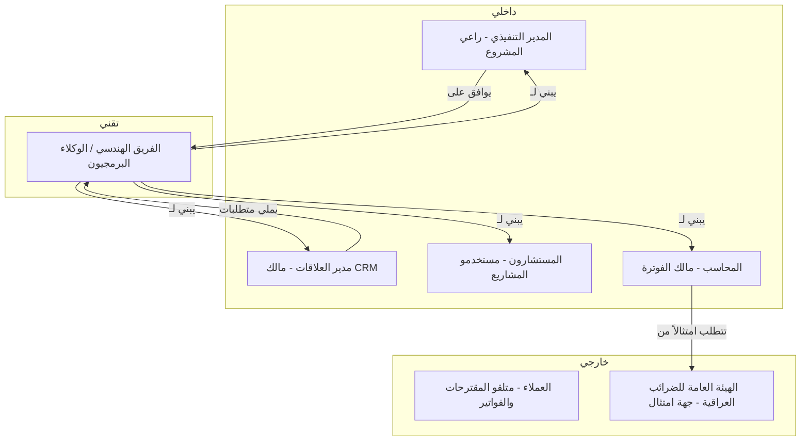

# Integrate – Vision & Problem Statement

# Integrate – وثيقة الرؤية وبيان المشكلة

**الإصدار:** 1.0  
**التاريخ:** 2026-08-06  
**الجمهور المستهدف:** Integrate Globals – الفريق الهندسي والإدارة العليا  
**اللغة:** العربية  
**الامتثال التنظيمي:** المتطلبات العراقية (قانون الشركات العراقي، ضريبة القيمة المضافة، متطلبات الفوترة المحلية)

---

## 1. ملخص تنفيذي

**Integrate** منصة برمجية متكاملة لإدارة المكاتب الاستشارية المتخصصة في الخدمات المالية والاقتصادية وإدارة الأعمال. تحل المنصة إشكالية التشتت الإداري التي تعانيها مكاتب الاستشارات الصغيرة والمتوسطة العاملة في العراق، من خلال توحيد إدارة العملاء، والمشاريع، والمقترحات، والفوترة في بيئة عمل واحدة متماسكة.

---

## 2. بيان المشكلة

### 2.1 السياق

مكاتب الاستشارات المالية والاقتصادية في العراق تعمل في بيئة تتسم بـ:
- غياب منظومة رقمية متكاملة مصممة خصيصاً للسوق العراقي.
- الاعتماد على أدوات منفصلة (Excel، WhatsApp، بريد إلكتروني) لإدارة العملاء والمشاريع.
- متطلبات امتثال ضريبية ومحاسبية محلية لا تدعمها الأنظمة الدولية الجاهزة.
- ضعف تتبع دورة حياة العميل من الاستفسار الأول حتى الفوترة النهائية.

### 2.2 المشكلة الجوهرية

| # | المشكلة | الأثر | الشدة |
|---|---------|-------|-------|
| P-01 | تشتت بيانات العملاء عبر قنوات متعددة غير مترابطة | فقدان فرص البيع وضعف متابعة العملاء المحتملين | عالية |
| P-02 | إعداد المقترحات يدوياً دون قوالب موحدة | استهلاك وقت مرتفع وعدم اتساق الصورة المهنية | عالية |
| P-03 | غياب نظام فوترة يدعم متطلبات الضريبة العراقية | مخاطر امتثال ضريبي وتأخر في الدفعات | عالية |
| P-04 | عدم وجود لوحة تحكم لمتابعة المشاريع ومراحلها | صعوبة إدارة الموارد وتقديم تقارير دقيقة للعملاء | متوسطة |
| P-05 | استحالة قياس ربحية العميل أو المشروع بشكل فوري | قرارات تسعير مبنية على تخمين لا بيانات | متوسطة |
| P-06 | التواصل الداخلي والخارجي مفكك وغير موثق | تضارب المعلومات وضعف المساءلة | منخفضة |

### 2.3 من يعاني من المشكلة؟

**المستخدمون الأوليون [Assumption]:**

| المستخدم | الدور | الحجم المتوقع |
|---------|-------|---------------|
| المدير التنفيذي | مراقبة الأداء والموافقة على المقترحات | 1 مستخدم |
| مدير علاقات العملاء | إدارة CRM والمقترحات | 1 مستخدم |
| المستشارون | تنفيذ المشاريع وتوثيق المخرجات | 2 مستخدمين [Assumption] |
| محاسب | إصدار الفواتير وتتبع المدفوعات | 1 مستخدم [Assumption] |

**إجمالي المستخدمين الابتدائيين: ~5 مستخدمين (Scale: 4 - صغير)**

---

## 3. لماذا الآن؟

### 3.1 المحفزات الخارجية

| # | المحفز | التأثير |
|---|--------|----------|
| DR-01 | نمو قطاع الاستشارات في العراق بعد انفتاح اقتصادي متصاعد [Assumption] | زيادة الطلب على الخدمات الاستشارية المنظمة |
| DR-02 | ضغوط الامتثال الضريبي العراقي المتزايدة | ضرورة أنظمة فوترة متوافقة قانونياً |
| DR-03 | تنامي توقعات العملاء لمستوى الاحترافية الرقمية | الحاجة لمقترحات وتقارير احترافية رقمية |
| DR-04 | محدودية الميزانية (صفر) تُلزم بحل مبني داخلياً | فرصة لبناء ميزة تنافسية بدون تكاليف اشتراك خارجية |

### 3.2 تكلفة عدم التصرف

- **P-01+P-02:** كل مقترح يُعَد يدوياً يستغرق [Open question: كم ساعة في المتوسط؟] — يحدده مدير العمليات.
- **P-03:** مخالفات ضريبية محتملة ناتجة عن فواتير غير متوافقة مع متطلبات الهيئة العامة للضرائب العراقية.
- **P-05:** قرارات تسعير خاطئة قد تؤثر على هامش الربحية الإجمالي للمكتب.

---

## 4. الرؤية

> **"أن يتمكن فريق Integrate Globals من إدارة دورة حياة العميل كاملة — من أول تواصل حتى إغلاق الفاتورة — من منصة واحدة، باللغة العربية، بما يتوافق مع متطلبات السوق العراقي، دون الحاجة لأي اشتراك خارجي مدفوع."**

### 4.1 نموذج القيمة

---

## 5. معايير النجاح القابلة للقياس

### 5.1 مؤشرات الأداء الرئيسية (KPIs)

| # | المؤشر | الخط الأساسي [Assumption] | الهدف (6 أشهر) | طريقة القياس |
|---|--------|--------------------------|-----------------|---------------|
| KPI-01 | متوسط وقت إعداد المقترح | 4 ساعات | ≤ 1 ساعة | سجلات الاستخدام في المنصة |
| KPI-02 | نسبة الفواتير المُصدرة ضمن 48 ساعة من إتمام الخدمة | 30% [Assumption] | ≥ 90% | تقارير النظام |
| KPI-03 | نسبة بيانات العملاء الموثقة في النظام | 0% (لا يوجد نظام حالياً) | 100% من العملاء النشطين | لوحة CRM |
| KPI-04 | وقت استرجاع معلومات عميل محدد | > 5 دقائق | ≤ 30 ثانية | اختبار مستخدم مباشر |
| KPI-05 | نسبة رضا المستخدمين الداخليين | غير مقاس | ≥ 80% (استبيان شهري) | استبيان NPS داخلي |
| KPI-06 | عدد الفواتير المتأخرة > 30 يوم بدون متابعة | [Open question: ما الرقم الحالي؟] | 0 | تقارير الاستحقاق |

### 5.2 تعريف النجاح في مرحلة الإطلاق (MVP)

**النظام يُعتبر ناجحاً عند:**
- VS-01: تسجيل 100% من العملاء الحاليين في نظام CRM خلال 30 يوماً من الإطلاق.
- VS-02: إصدار أول فاتورة متوافقة مع متطلبات الضريبة العراقية من داخل النظام.
- VS-03: إنشاء أول مقترح باستخدام قوالب النظام وإرساله للعميل.
- VS-04: اعتماد 100% من فريق العمل (5 مستخدمين) للنظام كأداة عمل يومية لمدة 30 يوماً متواصلة.

---

## 6. نطاق المنتج

### 6.1 ضمن النطاق (In Scope)

| # | المجال | الوصف |
|---|--------|--------|
| IS-01 | إدارة علاقات العملاء (CRM) | ملفات العملاء، سجل التواصل، مراحل دورة الحياة، تصنيف العملاء |
| IS-02 | إدارة المقترحات (Proposals) | إنشاء المقترحات بقوالب، التتبع، الموافقة، الأرشفة |
| IS-03 | الفوترة (Invoices) | إصدار الفواتير بالدينار العراقي والدولار [Assumption]، دعم ضريبة القيمة المضافة العراقية، تتبع المدفوعات |
| IS-04 | إدارة المشاريع (Projects) | ربط المشاريع بالعملاء، مراحل المشروع، تعيين المهام للفريق |
| IS-05 | التقارير الأساسية | تقارير الإيرادات، العملاء، المشاريع، الفواتير المعلقة |
| IS-06 | إدارة المستخدمين والصلاحيات | أدوار متعددة (مدير، مستشار، محاسب) |
| IS-07 | دعم اللغة العربية | واجهة كاملة باللغة العربية، دعم الاتجاه RTL |

### 6.2 خارج النطاق (Out of Scope)

| # | ما هو مستثنى | السبب |
|---|--------------|--------|
| OS-01 | المحاسبة المزدوجة والقيود المحاسبية الكاملة | تعقيد خارج نطاق MVP — يُعاد تقييمه في الإصدار 2 |
| OS-02 | تكامل مع أنظمة حكومية عراقية (الضريبة، التجارة) | [Open question: هل توجد APIs حكومية متاحة؟] |
| OS-03 | تطبيق موبايل | أولوية الويب في المرحلة الأولى [Assumption] |
| OS-04 | بوابة دفع إلكتروني مدمجة | غياب بنية تحتية للدفع الإلكتروني موثوقة في السوق العراقي [Assumption] |
| OS-05 | الذكاء الاصطناعي وتحليل البيانات المتقدمة | خارج نطاق MVP والميزانية الصفرية |
| OS-06 | دعم تعدد المكاتب أو الفروع | المستخدم الهدف: مكتب واحد |
| OS-07 | تكامل مع منصات تواصل اجتماعي | خارج النطاق الحالي |

---

## 7. المتطلبات العالية المستوى

### 7.1 متطلبات الأعمال

| # | المتطلب | الأولوية | الفئة |
|---|---------|----------|-------|
| BR-01 | يجب أن يدعم النظام دورة حياة العميل الكاملة من الاستفسار حتى الفاتورة المُسددة | Must Have | CRM |
| BR-02 | يجب أن تكون الفواتير متوافقة مع قانون ضريبة القيمة المضافة العراقي النافذ | Must Have | امتثال |
| BR-03 | يجب أن تدعم المنصة اللغة العربية كلغة أساسية مع اتجاه RTL | Must Have | واجهة |
| BR-04 | يجب أن يتضمن النظام نظام صلاحيات يمنع المستشارين من الوصول لبيانات الفوترة الحساسة [Assumption] | Must Have | أمن |
| BR-05 | يجب أن تُنشئ المقترحات من قوالب قابلة للتخصيص تحمل هوية المكتب البصرية | Should Have | مقترحات |
| BR-06 | يجب أن يُرسل النظام تنبيهات تلقائية للفواتير المستحقة قبل تاريخ الاستحقاق | Should Have | فوترة |
| BR-07 | يجب أن تكون البيانات محفوظة ومُصدَّرة بصيغ قياسية (PDF، Excel) | Must Have | بيانات |
| BR-08 | يجب أن يعمل النظام بميزانية تشغيلية صفر (استخدام أدوات مفتوحة المصدر فقط) | Must Have | تقني |

---

## 8. خريطة أصحاب المصلحة

| أصحاب المصلحة | الاهتمام الرئيسي | مستوى التأثير | مستوى الاهتمام |
|---------------|-----------------|---------------|----------------|
| المدير التنفيذي | رؤية شاملة للأداء والربحية | عالٍ | عالٍ |
| مدير العلاقات | لا يضيع أي عميل محتمل | عالٍ | عالٍ |
| المستشارون | وضوح مهام المشاريع | متوسط | متوسط |
| المحاسب | فوترة سريعة ومتوافقة | عالٍ | عالٍ |
| العملاء | مقترحات وفواتير واضحة احترافية | متوسط | منخفض |
| الهيئة العامة للضرائب | امتثال ضريبي كامل | عالٍ | منخفض |

---

## 9. الافتراضات والقيود

### 9.1 الافتراضات

| # | الافتراض | المالك الذي يؤكده |
|---|---------|------------------|
| ASM-01 | المكتب يعمل بمستخدمين 4-5 في المرحلة الأولى | المدير التنفيذي |
| ASM-02 | العملة الرئيسية هي الدينار العراقي مع دعم ثانوي للدولار الأمريكي | المحاسب |
| ASM-03 | لا يوجد نظام رقمي حالي — الانتقال من الصفر | مدير العلاقات |
| ASM-04 | لا يُطلب تطبيق موبايل في MVP | المدير التنفيذي |
| ASM-05 | الفريق الهندسي يملك صلاحية اختيار التقنيات المفتوحة المصدر | المدير التنفيذي |
| ASM-06 | البيانات تُخزن محلياً أو على خادم يتحكم فيه المكتب (لا cloud خارجي مدفوع) | المدير التنفيذي |

### 9.2 القيود

| # | القيد | الأثر |
|---|-------|--------|
| CON-01 | الميزانية صفر — لا اشتراكات خارجية مدفوعة | يُلزم باختيار مكدس مفتوح المصدر بالكامل |
| CON-02 | الامتثال للقانون العراقي النافذ | يُلزم بتدقيق قانوني لمتطلبات الفوترة الضريبية |
| CON-03 | النطاق: مكتب واحد، Scale: 4 | لا حاجة لهندسة متعددة المستأجرين في MVP |

---

## 10. الأسئلة المفتوحة

| # | السؤال | من يقرر؟ | الأثر إذا لم يُحسم |
|---|--------|----------|--------------------|
| OQ-01 | ما متطلبات الفوترة الضريبية العراقية التفصيلية (أرقام ضريبية، صيغة الفاتورة المعتمدة)؟ | مستشار قانوني / محاسب | قد تكون الفواتير المصدرة غير معتمدة قانونياً |
| OQ-02 | هل تتطلب الهيئة العامة للضرائب العراقية تقديماً رقمياً للفواتير أو تكاملاً مع أنظمتها؟ | مستشار قانوني | تغيير جوهري في معمارية الفوترة |
| OQ-03 | ما متوسط عدد العملاء النشطين حالياً وإجمالي قاعدة العملاء؟ | المدير التنفيذي | يؤثر على تصميم هيكل البيانات وأداء النظام |
| OQ-04 | ما أنواع الخدمات الاستشارية المقدمة وهل لكل نوع نموذج تسعير مختلف؟ | مدير العلاقات | يؤثر على بنية المقترحات والفواتير |
| OQ-05 | هل يُشارك العملاء في النظام (بوابة عميل) أم أن التفاعل يتم خارجياً فقط؟ | المدير التنفيذي | يُحدد ما إذا كانت هناك حاجة لـ client portal في MVP |
| OQ-06 | ما الخادم أو البنية التحتية المتاحة لاستضافة النظام؟ | الفريق التقني | يحدد خيارات النشر والتقنيات المناسبة |
| OQ-07 | هل يحتاج النظام لدعم اللغة الإنجليزية بجانب العربية؟ | المدير التنفيذي | يؤثر على حجم عمل الواجهة بشكل كبير |
| OQ-08 | ما السياسة المتبعة للنسخ الاحتياطي وحماية البيانات؟ | المدير التنفيذي | ضروري لضمان استمرارية الأعمال |