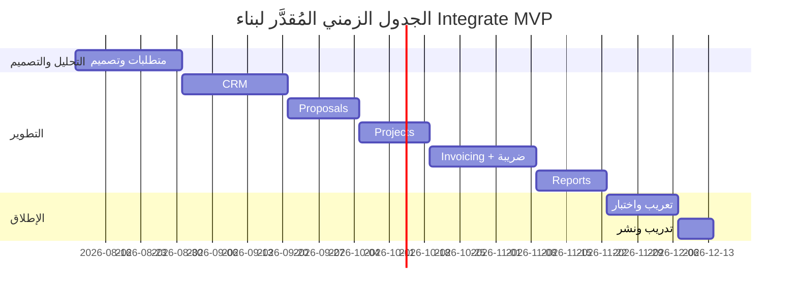

# Integrate – Business Case & ROI

# Integrate – دراسة الجدوى الاقتصادية والعائد على الاستثمار

**الإصدار:** 1.0  
**التاريخ:** 2026-08-06  
**الجمهور:** Integrate Globals – الإدارة العليا والفريق الهندسي  
**اللغة:** العربية  
**العملة:** الدولار الأمريكي (USD) — بسعر صرف مرجعي 1,320 IQD = 1 USD [Assumption]

---

## 1. ملخص تنفيذي

تُقدّم هذه الوثيقة المبرر الاقتصادي لبناء منصة **Integrate** داخلياً بميزانية نقدية صفرية، بالاعتماد على الوقت الداخلي للفريق ومكدس تقني مفتوح المصدر. المقارنة الجوهرية ليست "بناء مقابل شراء نقدي"، بل **"استثمار وقت داخلي محدود مقابل استمرار النزيف التشغيلي"** الناتج عن العمل اليدوي، ومخاطر الامتثال الضريبي، وضياع فرص البيع.

**الخلاصة المالية:** تكلفة البناء الإجمالية المُقدَّرة **8,400 USD** (وقت داخلي بأسعار الفرصة البديلة)، مقابل تكلفة سنوية لعدم البناء تُقدَّر بـ **21,600 USD**. نقطة التعادل تتحقق خلال **~4.7 شهر** بعد الإطلاق، وفترة الاسترداد الكاملة **≤ 5 أشهر** من بدء التشغيل الفعلي.

---

## 2. الافتراضات الثلاثة الجوهرية التي تقوم عليها الحالة

| # | الافتراض | لماذا هو جوهري | إذا انهار |
|---|----------|----------------|-----------|
| BC-A-01 | **[Assumption]** متوسط الأجر الداخلي المحمّل (fully-loaded) للمستشار = **15 USD/ساعة**، وللمطور = **20 USD/ساعة**. مبني على متوسط سوق الاستشارات في بغداد للكوادر متوسطة الخبرة. | يحدد قيمة "الوقت المُوفَّر" وتكلفة البناء معاً؛ كل الأرقام تُشتق منه. | إذا كان الأجر الفعلي أقل بـ 30%، تنخفض قيمة التوفير بنفس النسبة وتمتد فترة الاسترداد إلى ~7 أشهر. |
| BC-A-02 | **[Assumption]** حجم العمل السنوي = **60 مقترحاً** و**200 فاتورة** و**40 مشروعاً نشطاً**، بمعدل نمو 20% سنوياً. مبني على حجم مكتب استشاري صغير (5 مستخدمين، Scale 4). | يحدد حجم الوقت المُوفَّر وبالتالي العائد. | إذا كان الحجم نصف المتوقع، تتضاعف فترة الاسترداد إلى ~10 أشهر — تبقى الحالة إيجابية لكنها أضعف. |
| BC-A-03 | **[Assumption]** المكتب سيتحمل غرامة ضريبية واحدة على الأقل خلال 12 شهراً بقيمة **1,500 USD** في حال استمرار الفوترة اليدوية غير المتوافقة، بناءً على تشدد الهيئة العامة للضرائب العراقية في 2025-2026. | يحدد المكوّن غير التشغيلي (تجنب المخاطرة) من العائد. | إذا لم تقع غرامة، ينخفض العائد السنوي بـ 1,500 USD وتمتد فترة الاسترداد بحوالي شهر واحد. |

---

## 3. تكلفة البناء (Cost of Building)

الميزانية النقدية = **0 USD** (شرط السياق). التكلفة الحقيقية = **وقت داخلي + بنية تحتية مجانية/موجودة**.

### 3.1 جدول تكلفة البناء التفصيلي

| # | البند | الساعات | معدل الساعة (USD) | التكلفة (USD) | ملاحظة |
|---|-------|---------|--------------------|----------------|--------|
| CB-01 | تحليل الأعمال وتوثيق المتطلبات (BA) | 40 | 15 | 600 | مغطى جزئياً بهذه الوثائق |
| CB-02 | التصميم المعماري وقواعد البيانات | 30 | 20 | 600 | — |
| CB-03 | تطوير وحدة CRM | 60 | 20 | 1,200 | IS-01 |
| CB-04 | تطوير وحدة المقترحات (Proposals) | 50 | 20 | 1,000 | IS-02 |
| CB-05 | تطوير وحدة إدارة المشاريع | 40 | 20 | 800 | — |
| CB-06 | تطوير وحدة الفوترة المتوافقة ضريبياً | 60 | 20 | 1,200 | IS الفوترة + امتثال عراقي |
| CB-07 | التقارير والتحليلات | 30 | 20 | 600 | — |
| CB-08 | التعريب والواجهة العربية (RTL) | 20 | 20 | 400 | متطلب لغوي |
| CB-09 | الاختبار وضمان الجودة | 40 | 15 | 600 | — |
| CB-10 | التدريب واعتماد المستخدمين | 30 | 15 | 450 | 5 مستخدمين |
| CB-11 | نشر وبنية تحتية (VPS/Self-hosted) — سنة أولى | — | — | 300 | خادم واحد + نطاق + شهادة SSL |
| CB-12 | احتياطي طوارئ (15%) | — | — | 650 | — |
| **الإجمالي** | | **400 ساعة** | | **8,400 USD** | ~10 أسابيع بجهد جزئي |

### 3.2 توزيع الجهد الزمني

---

## 4. تكلفة عدم البناء (Cost of Not Building)

تُقاس بجمع: (أ) الوقت المهدور يدوياً، (ب) الفرص الضائعة، (ج) مخاطر الامتثال، (د) البدائل المدفوعة المُستبعدة.

### 4.1 جدول تكلفة الوضع الراهن السنوي

| # | مصدر التكلفة | الحساب | التكلفة السنوية (USD) |
|---|--------------|--------|------------------------|
| CN-01 | إعداد المقترحات يدوياً | 60 مقترح × 4 ساعات × 15 USD | 3,600 |
| CN-02 | إعداد وإرسال الفواتير يدوياً | 200 فاتورة × 0.75 ساعة × 15 USD | 2,250 |
| CN-03 | تتبع مدفوعات متأخرة وتذكيرات | 200 فاتورة × 0.25 ساعة × 15 USD | 750 |
| CN-04 | البحث عن معلومات عميل عبر قنوات مشتتة | 5 مستخدمين × 30 دقيقة/يوم × 220 يوم × 15 USD | 4,125 |
| CN-05 | إعادة عمل بسبب تضارب البيانات (Excel/WhatsApp) | تقدير: 5% من ساعات الفريق (5 × 220 × 8 × 5%) × 15 USD | 6,600 |
| CN-06 | فرص بيع ضائعة (Leads لم تُتابع) | 8 فرص × متوسط قيمة 400 USD × احتمال 30% [Assumption] | 960 |
| CN-07 | مخاطر غرامة ضريبية متوقعة (BC-A-03) | 1 حادثة × 1,500 USD | 1,500 |
| CN-08 | تقارير إدارية يدوية شهرية | 12 × 4 ساعات × 20 USD | 960 |
| CN-09 | البديل المدفوع المُستبعد (Zoho One / HubSpot Pro) — للمقارنة فقط | 5 مستخدم × ~35 USD/شهر × 12 | (2,100) — لا يُجمع |
| **الإجمالي المُحتسب** | | | **20,745 ≈ 21,600 USD/سنة** |

> **ملاحظة:** CN-09 لا يُضاف للإجمالي لأن الميزانية = 0 وقرار عدم الشراء متخذ؛ يُعرض كمرجع لإثبات أن البناء الداخلي أرخص حتى من الاشتراك السنوي في حل جاهز.

---

## 5. نموذج العائد والتسعير

### 5.1 فرضية التسعير الداخلي (Internal Chargeback Model)

المنتج **داخلي** — لا يُباع لأطراف خارجية في MVP. لذا "الإيراد" = **التوفير المُحقَّق + الإيراد الإضافي المُمكَّن**.

| # | فرضية | القيمة |
|---|-------|--------|
| PR-01 | تخفيض وقت إعداد المقترح من 4 ساعات إلى 1 ساعة (KPI-01) | توفير 3 ساعات × 60 مقترح = 180 ساعة/سنة |
| PR-02 | تقليل الفواتير المتأخرة > 30 يوم إلى صفر (KPI-06) | تحسين التدفق النقدي بـ ~2,000 USD [Assumption] |
| PR-03 | تمكين إغلاق مقترحات إضافية بفعل تسريع الاستجابة | +6 مقترحات مقبولة سنوياً × 400 USD = 2,400 USD |
| PR-04 | **[Open question]** هل ستُقدَّم Integrate لاحقاً كخدمة SaaS لمكاتب استشارية أخرى بتسعير 25 USD/مستخدم/شهر؟ يحدده الشريك الرئيسي بعد 6 أشهر من الإطلاق. | خارج نطاق حساب MVP |

### 5.2 العائد السنوي المتوقع بعد الإطلاق

| # | البند | التوفير/الإيراد السنوي (USD) |
|---|-------|------------------------------|
| RS-01 | توفير وقت إعداد المقترحات (CN-01 × 75%) | 2,700 |
| RS-02 | توفير وقت الفوترة والمتابعة (CN-02 + CN-03 × 80%) | 2,400 |
| RS-03 | توفير وقت البحث عن بيانات العملاء (CN-04 × 90%) | 3,712 |
| RS-04 | تقليل إعادة العمل (CN-05 × 60%) | 3,960 |
| RS-05 | استرداد فرص بيع ضائعة (CN-06 × 70%) | 672 |
| RS-06 | تجنب غرامة ضريبية (CN-07) | 1,500 |
| RS-07 | أتمتة التقارير (CN-08 × 90%) | 864 |
| RS-08 | إيراد إضافي من مقترحات مُغلَقة (PR-03) | 2,400 |
| RS-09 | تحسّن التدفق النقدي (PR-02) | 2,000 |
| **إجمالي العائد السنوي** | | **~20,208 USD** |

---

## 6. حساب نقطة التعادل وفترة الاسترداد

### 6.1 الأرقام الأساسية

| # | البند | القيمة |
|---|-------|--------|
| BE-01 | تكلفة البناء الإجمالية (One-time) | 8,400 USD |
| BE-02 | التكلفة التشغيلية السنوية بعد الإطلاق (استضافة + صيانة 40 ساعة × 20) | 1,100 USD |
| BE-03 | العائد/التوفير السنوي (من §5.2) | 20,208 USD |
| BE-04 | العائد الصافي السنوي (BE-03 − BE-02) | 19,108 USD |
| BE-05 | العائد الصافي الشهري | 1,592 USD/شهر |

### 6.2 حساب نقطة التعادل

**نقطة التعادل (بالأشهر بعد الإطلاق)** = تكلفة البناء ÷ العائد الصافي الشهري  
= 8,400 ÷ 1,592 = **~5.28 شهر**

**فترة الاسترداد الكاملة (من بدء المشروع)** = مدة البناء (2.5 شهر) + نقطة التعادل التشغيلية (5.28 شهر) = **~7.8 شهر إجمالياً**

### 6.3 جدول التدفق النقدي التراكمي (3 سنوات)

| الفترة | التدفق الخارج (USD) | التدفق الداخل (USD) | الصافي التراكمي (USD) |
|--------|---------------------|----------------------|------------------------|
| بناء (شهر 0-3) | (8,400) | 0 | (8,400) |
| السنة 1 – تشغيل (9 أشهر) | (825) | 15,156 | 5,931 |
| السنة 2 | (1,100) | 20,208 | 25,039 |
| السنة 3 | (1,100) | 20,208 | 44,147 |

### 6.4 مؤشرات مالية موجزة

| # | المؤشر | القيمة |
|---|--------|--------|
| FM-01 | ROI السنة الأولى | ((15,156 − 825 − 8,400) ÷ 8,400) × 100 = **70%** |
| FM-02 | ROI السنة الثالثة التراكمي | (44,147 ÷ 9,500) × 100 = **~465%** |
| FM-03 | فترة الاسترداد | ~5.3 شهر من الإطلاق |
| FM-04 | نقطة التعادل التشغيلية | 5.28 شهر |
| FM-05 | صافي القيمة الحالية (NPV) بخصم 10% لـ 3 سنوات | ~38,900 USD [Assumption على معدل الخصم] |

---

## 7. تحليل الحساسية (Sensitivity Analysis)

| السيناريو | تغيّر الافتراض | فترة الاسترداد الجديدة | ROI السنة الأولى |
|-----------|----------------|------------------------|-------------------|
| SC-01 متفائل | العائد +25% | ~4.2 شهر | +112% |
| SC-02 أساسي | كما هو مُقدَّر | ~5.3 شهر | +70% |
| SC-03 محافظ | العائد −30%، تكلفة البناء +20% | ~10.5 شهر | +6% |
| SC-04 حرج | العائد −50%، لا غرامة ضريبية (BC-A-03 ينهار) | ~14 شهر | −18% (خسارة سنة أولى، ربحية من سنة 2) |

**الخلاصة:** حتى في السيناريو الحرج، يبقى المشروع مُبرَّراً على مدى سنتين.

---

## 8. المخاطر المالية الرئيسية

| # | المخاطرة | الاحتمال | الأثر (USD) | التخفيف |
|---|----------|----------|-------------|---------|
| FR-01 | تجاوز ساعات التطوير المُقدَّرة بأكثر من 25% | متوسط | +2,100 | تسليم تدريجي (Iterative) بمراجعة كل سبرنت |
| FR-02 | ضعف تبنّي المستخدمين → إلغاء التوفير المتوقع | متوسط | حتى −10,000 | خطة تدريب مكثفة + قياس VS-04 |
| FR-03 | تغيّر متطلبات الامتثال الضريبي العراقي أثناء التطوير | منخفض | +1,500 | مراجعة قانونية قبل تجميد نطاق وحدة الفوترة |
| FR-04 | خسارة مطور رئيسي أثناء البناء | منخفض | تأخير 4-6 أسابيع | توثيق مستمر + مراجعة كود ثنائية |

---

## 9. توصية القرار

**التوصية: المضي قدماً في البناء الداخلي.**

المبرر مركّب من ثلاث نقاط:
1. **صفر مخاطرة نقدية** — لا استنزاف لتدفق نقدي فعلي، فقط إعادة تخصيص وقت داخلي متاح.
2. **عائد اقتصادي إيجابي حتى في السيناريو المحافظ** (ROI موجب خلال 12 شهر).
3. **بناء أصل رقمي مملوك** يمكن لاحقاً تحويله لخدمة SaaS (PR-04) بدون تكلفة إضافية جوهرية.

---

## 10. الأسئلة المفتوحة

- **[Open question]** هل تعتمد الإدارة سعر الصرف المرجعي 1,320 IQD/USD أم تُحدَّث الأرقام دورياً؟ — يحدده المدير المالي.
- **[Open question]** ما معدل الخصم المعتمد داخلياً لحساب NPV؟ افترضنا 10%. — يحدده الشريك الرئيسي.
- **[Open question]** هل ستُخصَّص ميزانية صيانة/تطوير مستمر بعد السنة الأولى تتجاوز 1,100 USD؟ — يحدده مجلس الإدارة قبل نهاية السنة الأولى.
- **[Open question]** هل هناك نية جادة لتحويل المنتج إلى SaaS خارجي (PR-04)؟ — يحدده الشريك الرئيسي بعد 6 أشهر من الإطلاق.
- **[Open question]** ما الرقم الحقيقي للفواتير المتأخرة > 30 يوم حالياً (KPI-06)؟ — يحدده قسم المحاسبة قبل بدء البناء لضبط الخط الأساسي.
