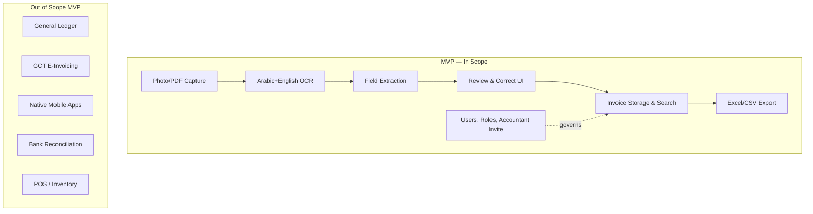
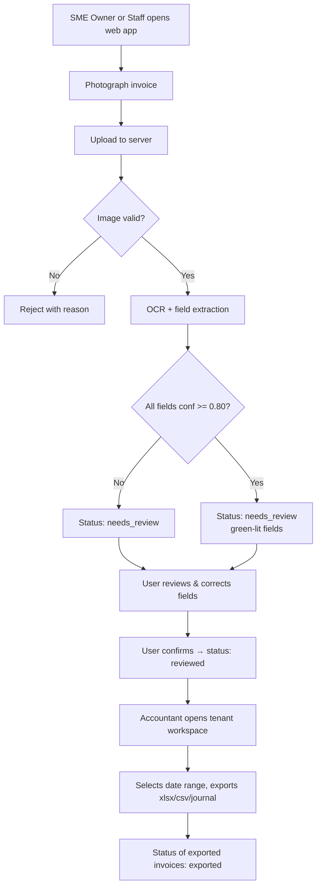
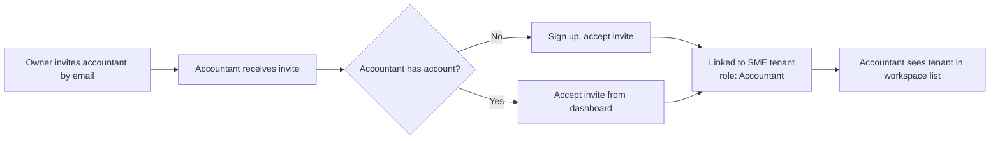
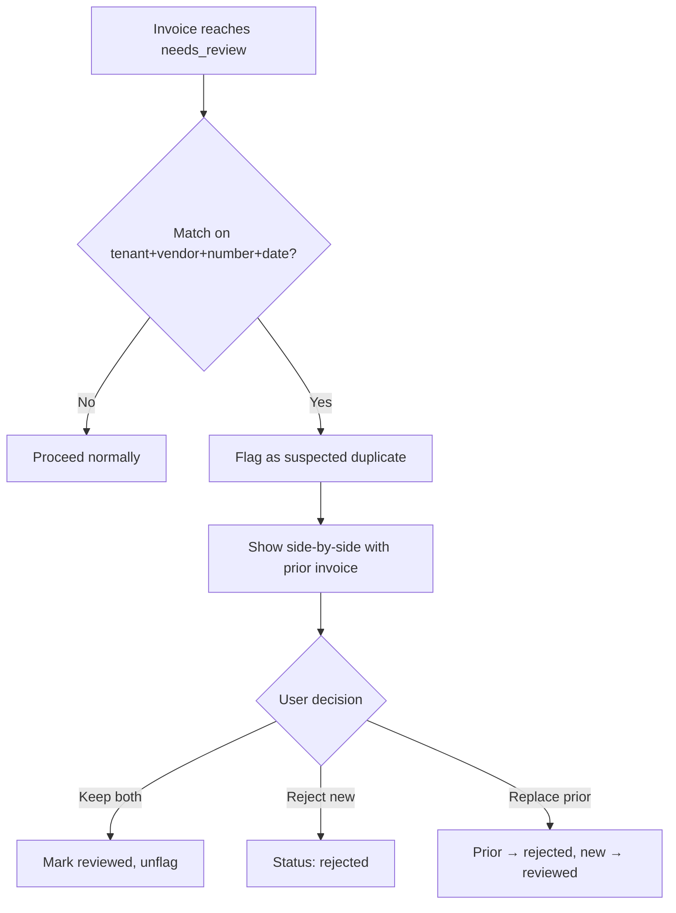
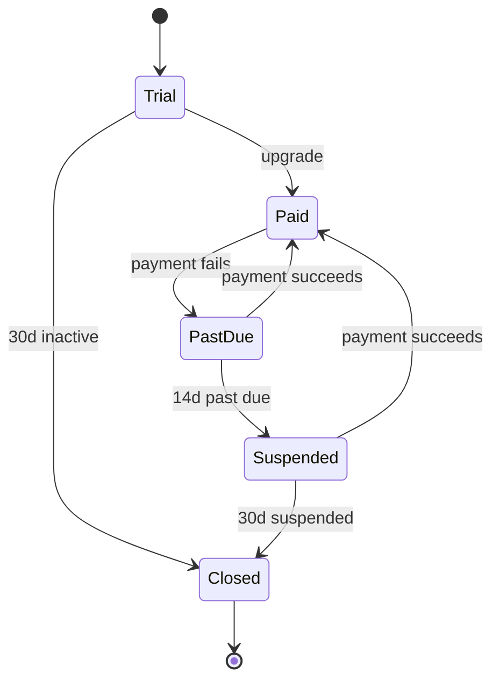
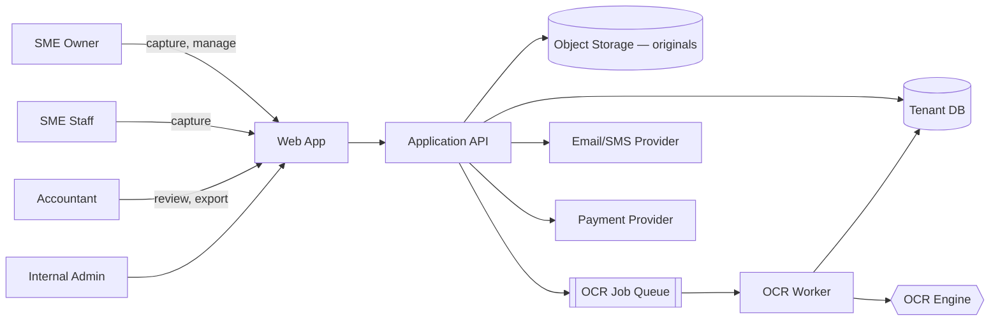
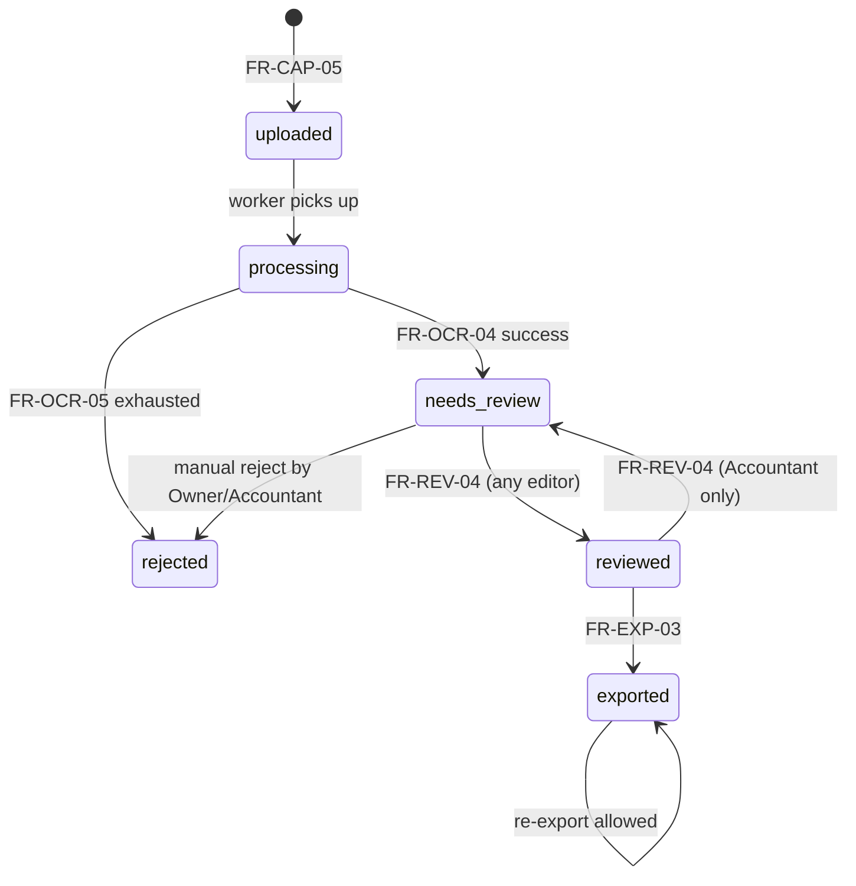

# Invoice OCR platform — Complete Design Package

**Goal:** A web app that lets Iraqi SMEs photograph supplier invoices and get structured accounting entries, with Arabic OCR and export to their accountant.
**Documents:** 3/6 · **Generated:** 2026-08-06

This package was produced by Crucible Core. Each document was written with its
dependencies in context, so the architecture, requirements and operations sections
are consistent with one another. Hand the final section to an AI coding agent to
build the system, or hand the whole file to an engineering team.

## Contents
1. [Vision & Problem Statement](#vision-problem-statement)
2. [Business Requirements Document (BRD)](#business-requirements-document-brd)
3. [Software Requirements Specification (SRS)](#software-requirements-specification-srs)

## Open questions across the package
- **Vision & Problem Statement:** OQ-01: Which SME segment is beachhead — retail, restaurants, or contractors? (Product Lead + Sales, by Week 2)
- **Vision & Problem Statement:** OQ-02: Which OCR vendor — Azure, Google, or hybrid with open-source fallback? (Eng Lead + Product, by Week 3)
- **Vision & Problem Statement:** OQ-03: Is cloud-only storage of invoice images legally sufficient under Iraqi tax retention rules? (External tax/legal advisor, by Week 3)
- **Vision & Problem Statement:** OQ-04: Which payment processor for subscriptions in Iraq (FastPay, Zain Cash, other)? (Product + Finance, by Week 4)
- **Vision & Problem Statement:** OQ-05: Pricing model — freemium with invoice cap, per-user subscription, or per-invoice? (Product Lead, by Week 4)
- **Vision & Problem Statement:** OQ-06: Hosting region — Iraq, Turkey, UAE, EU? Affects latency, cost, and data-residency claim (Eng Lead, by Week 3)
- **Vision & Problem Statement:** OQ-07: Do we support Kurdish (Sorani) UI at launch given Erbil market? (Product, by Week 2)
- **Vision & Problem Statement:** OQ-08: Multi-user per SME account in MVP or defer to v2? (Product, by Week 2)
- **Vision & Problem Statement:** OQ-09: What SLA / uptime commitment do we publish to users? (Product + Eng, by Week 4)
- **Vision & Problem Statement:** OQ-10: Support channel — WhatsApp only, in-app chat, or email? (Product + Ops, by Week 5)
- **Vision & Problem Statement:** Named owner for this document itself is not yet assigned (§ header).
- **Business Requirements Document (BRD):** Named Product Owner for the BRD (OQ-01) — decided by Founder
- **Business Requirements Document (BRD):** Segment prioritization: confirm retail shops + accountants as beachhead (OQ-02) — Product Lead + Sales
- **Business Requirements Document (BRD):** Cloud region / data residency choice within 500 USD/mo cap (OQ-03, C-05) — Eng Lead
- **Business Requirements Document (BRD):** FX source and cadence for IQD/USD conversion under BR-09 (OQ-04) — Product Lead
- **Business Requirements Document (BRD):** Pricing tiers and monthly quotas (OQ-05, BR-18, BRQ-21) — Product + Finance
- **Business Requirements Document (BRD):** Timing and feasibility of GCT e-filing integration post-MVP (OQ-06, SC-OUT-03) — Product + tax advisor
- **Business Requirements Document (BRD):** Behavior when tenant exceeds plan quota: queue vs block (OQ-07, BRQ-21) — Product
- **Business Requirements Document (BRD):** Whether MVP requires SMS OTP in addition to email OTP (OQ-08, BRQ-27) — Product + Eng
- **Business Requirements Document (BRD):** Support staffing model and response-time SLA (OQ-09, BRQ-38) — Founder
- **Business Requirements Document (BRD):** Confirmation of 7-year invoice retention requirement (OQ-10, SC-IN-10, BR-07, C-09) — Tax advisor
- **Business Requirements Document (BRD):** Backup retention window vs 30-day deletion SLA (OQ-11, AC-10) — Eng + Legal
- **Software Requirements Specification (SRS):** Name the Product Lead and Engineering Lead owners of this SRS.
- **Software Requirements Specification (SRS):** Confirm 7-year retention (SC-IN-10 / FR-RET-01 / NFR-C-01) with a qualified Iraqi tax advisor.
- **Software Requirements Specification (SRS):** Choose OCR sourcing: managed API vs. self-hosted engine, within NFR-P-05 (500 USD/month at baseline).
- **Software Requirements Specification (SRS):** Select hosting region (candidates: Frankfurt, Bahrain, Dubai) balancing latency to Iraq, cost, and residency.
- **Software Requirements Specification (SRS):** Select payment provider given Stripe's lack of Iraq presence; local gateway vs. workaround.
- **Software Requirements Specification (SRS):** Confirm data residency stance: may Iraqi SME data be stored outside Iraq? (NFR-C-03).
- **Software Requirements Specification (SRS):** Confirm legal-hold policy that may block hard-delete in FR-RET-02.
- **Software Requirements Specification (SRS):** Approve API versioning and path scheme (FR-OBS-01 / §7.2).
- **Software Requirements Specification (SRS):** Approve default chart-of-accounts mapping for journal-entry export (Appendix B).
- **Software Requirements Specification (SRS):** Validate multi-page PDF = single invoice assumption (FR-CAP-04) with design-partner accountants.

---

# Vision & Problem Statement — Iraqi SME Invoice OCR Platform

# Vision & Problem Statement

**Product:** Invoice OCR Platform for Iraqi SMEs
**Document:** Vision & Problem Statement (Blueprint 1 of N)
**Audience:** Product, Engineering, QA, Autonomous coding agents
**Status:** Draft v1.0
**Owner:** Product Lead [Open question: name owner]

---

## 1. Executive Summary

Iraqi small and medium enterprises (SMEs) receive supplier invoices predominantly on paper, in mixed Arabic/English, in inconsistent layouts, often handwritten or thermal-printed. Owners and their accountants spend hours per week manually keying these into spreadsheets or local accounting tools. This product is a web application that lets an SME owner photograph an invoice with a phone, receive a structured accounting entry within seconds, review and correct it, and export batches to their accountant in formats the accountant already uses (Excel, CSV, or a journal-entry file).

The MVP targets **5,000 active users** and **50 requests-per-second peak** within an operating budget of **500 USD/month**, which constrains architectural and vendor choices materially (see §10).

---

## 2. Problem Statement

### 2.1 The problem

Iraqi SMEs cannot cheaply or reliably convert supplier invoices into bookkeeping entries. Existing OCR products (a) do not read Arabic well, especially Iraqi-dialect vendor names and handwritten amounts, (b) do not understand Iraqi invoice conventions (IQD amounts without decimals, mixed Hijri/Gregorian dates, VAT-absent invoices, informal tax IDs), and (c) are priced per-page in USD, which is prohibitive for a shop processing 50–500 invoices/month.

The manual workflow today looks like:


### 2.2 Who has this problem

| Segment | Size [Assumption] | Pain intensity | Willingness to pay |
|---|---|---|---|
| Retail shops (grocers, pharmacies, electronics) | ~150,000 in Iraq [Assumption] | High — daily invoice volume | Low-medium (5–20 USD/mo) |
| Restaurants & cafés | ~40,000 [Assumption] | High — perishable supplier invoices daily | Medium |
| Small contractors / trading companies | ~25,000 [Assumption] | Very high — large invoices, VAT exposure | Medium-high (20–50 USD/mo) |
| External accountants serving SMEs | ~5,000 practitioners [Assumption] | Very high — bottleneck is data entry | High (per-seat) |

[Open question — decided by: Product Lead + Sales] Which segment do we prioritize for launch? This document assumes **retail shops + their external accountants** as the beachhead, because they generate the highest invoice volume per user and the accountant is a natural referral channel.

### 2.3 Why now

1. **Smartphone penetration** in Iraq exceeded 80% in 2024 [Assumption — cite GSMA or local telecom report before publishing]. Camera quality on sub-200-USD Android devices is now sufficient for OCR.
2. **Arabic OCR quality crossed a usability threshold** in 2024–2025 with transformer-based models (Azure Document Intelligence, Google Document AI, and open-source Qwen-VL/DeepSeek-VL). Iraqi handwriting remains hard but printed Arabic is solved.
3. **General Commission for Taxes (GCT) enforcement** of invoice retention has increased since 2024 [Assumption — verify with tax advisor]. SMEs face real penalties for missing records, creating urgency.
4. **No dominant local competitor.** Regional players (Foodics, Rewaa) target POS not invoice capture; global players (Dext, Hubdoc) do not support Arabic or Iraqi accounting conventions.

---

## 3. Vision Statement

> **In three years, every Iraqi SME captures every supplier invoice by phone the moment it arrives, and their accountant closes the books in hours, not weeks.**

The 12-month vision (MVP + first iteration): become the default invoice-capture tool for 5,000 SME/accountant pairs in Baghdad, Basra, and Erbil, processing >200,000 invoices/month, with a review-and-correct workflow that gets structured data into the accountant's hands within 24 hours of capture.

---

## 4. Goals (Business Objectives)

Numbered so they can be traced to requirements downstream.

| ID | Goal | Rationale |
|---|---|---|
| G-01 | Reduce SME time-to-record an invoice from ~5 minutes (manual entry) to <30 seconds (capture + review) | Core value proposition |
| G-02 | Achieve ≥90% field-level accuracy on printed Arabic invoices without user correction | Below this, users lose trust and revert to manual |
| G-03 | Support 5,000 monthly active users at ≤500 USD/month infrastructure cost | Budget constraint |
| G-04 | Enable accountants to export a full month of client invoices in one file, in the format their accounting software imports | Accountants are the referral engine |
| G-05 | Ship MVP within 4 months of engineering start [Assumption — decided by: Product + Eng leads] | Market timing |

---

## 5. Success Criteria (Measurable)

Each criterion has a metric, a target, a measurement method, and a review cadence.

| ID | Metric | Target (12 months post-launch) | Measurement method | Cadence |
|---|---|---|---|---|
| S-01 | Monthly Active Users (MAU) | ≥ 5,000 | Analytics: distinct user_id with ≥1 invoice upload in 30d | Monthly |
| S-02 | Invoices processed per month | ≥ 200,000 | DB count of invoices with status ∈ {processed, exported} | Monthly |
| S-03 | Field-level OCR accuracy (vendor, date, total, VAT, line items) | ≥ 90% on printed Arabic; ≥ 60% on handwritten | Weekly labeled sample of 200 invoices, human-scored | Weekly |
| S-04 | Median time from photo upload to structured entry displayed | ≤ 15 seconds (P50), ≤ 45 seconds (P95) | Server-side timing | Continuous, weekly review |
| S-05 | User correction rate per field | ≤ 15% of fields corrected before export | Compare OCR output vs user-edited output | Weekly |
| S-06 | Accountant export usage | ≥ 60% of active users export at least monthly | Feature usage log | Monthly |
| S-07 | Infrastructure cost per 1,000 invoices | ≤ 2.50 USD | Cloud + OCR API bill / invoice count | Monthly |
| S-08 | 30-day retention | ≥ 40% | Users active in month N who are still active in month N+1 | Monthly |
| S-09 | Net Promoter Score (NPS) among accountants | ≥ 30 | In-app survey, quarterly | Quarterly |
| S-10 | Uptime (API + web) | ≥ 99.5% monthly | Synthetic monitoring | Monthly |

---

## 6. Target Users & Personas

### 6.1 Primary persona — Abu Ahmed, retail shop owner

- 45 years old, owns a 3-employee electronics shop in Baghdad.
- Uses a mid-range Android phone. Comfortable with WhatsApp, uncomfortable with spreadsheets.
- Speaks Arabic (Iraqi dialect), reads basic English.
- Receives 20–60 supplier invoices/month, currently piles them in a drawer for his accountant.
- **Needs:** capture invoices in seconds without typing; not lose them; be able to find last month's invoice from a specific supplier.

### 6.2 Primary persona — Sarah, external accountant

- 32 years old, serves 15 SME clients from her home office.
- Uses Excel heavily; some clients use Al-Ameen or Onyx accounting software.
- Reads Arabic and English fluently.
- **Needs:** receive her clients' invoices in a structured, reviewable batch; export to a format her accounting software imports; catch missing invoices before month-end close.

### 6.3 Secondary persona — Employee cashier

- May be the one physically capturing invoices on behalf of Abu Ahmed. Needs a UI a non-owner staff member can use without training.

[Open question — decided by: Product] Do we support multiple users per SME account in the MVP, or single-user only? This document assumes **shared account with per-user activity log** for the MVP; role-based access deferred to v2.

---

## 7. Scope

### 7.1 In scope (MVP)

| ID | Capability |
|---|---|
| IN-01 | Web app, mobile-responsive, optimized for Android Chrome and iOS Safari |
| IN-02 | Camera capture + gallery upload of invoice images (JPEG, PNG, PDF single-page and multi-page) |
| IN-03 | Arabic + English OCR of printed invoices |
| IN-04 | Extraction of: vendor name, vendor tax ID (if present), invoice number, invoice date, currency, subtotal, VAT amount, total, line items (description, qty, unit price, line total), payment method (if present) |
| IN-05 | User review and correction UI, with the source image shown alongside the extracted fields |
| IN-06 | Iraqi Dinar (IQD) and USD as primary currencies; auto-detect currency from invoice |
| IN-07 | Gregorian and Hijri date parsing; store both, display user's preference |
| IN-08 | Invoice list, search by vendor/date/amount, filter by status (pending review, reviewed, exported) |
| IN-09 | Export to Excel (.xlsx) and CSV, one row per invoice and one sheet per month; separate line-item export |
| IN-10 | User accounts with email/phone + password; password reset by email |
| IN-11 | Two roles: owner and accountant; accountant can be invited to view/export an SME's invoices |
| IN-12 | Arabic and English UI, RTL layout for Arabic |
| IN-13 | Basic dashboard: invoice count this month, total spend by vendor, missing-invoice-number gaps |

### 7.2 Out of scope (MVP) — explicitly

| ID | Excluded | Rationale |
|---|---|---|
| OUT-01 | Handwritten invoice OCR beyond best-effort (no accuracy guarantee) | Iraqi handwriting requires custom training data we do not yet have |
| OUT-02 | Full accounting engine (general ledger, P&L, balance sheet) | We are a capture/export tool, not an accounting system |
| OUT-03 | Direct API integration with Iraqi accounting software (Al-Ameen, Onyx) | Export files sufficient for MVP; direct integration in v2 |
| OUT-04 | E-invoicing / GCT direct filing | Regulatory scope unclear [Open question — tax advisor] |
| OUT-05 | Native mobile apps (iOS/Android) | Web is sufficient and one codebase; native in v2 if data shows need |
| OUT-06 | Bank statement OCR / reconciliation | Separate product |
| OUT-07 | Multi-branch consolidation for chains | Beachhead is single-location SMEs |
| OUT-08 | Offline capture | 4G/5G coverage sufficient in target cities [Assumption] |
| OUT-09 | Payroll, inventory, POS features | Adjacent products, not this one |
| OUT-10 | Languages beyond Arabic and English (e.g., Kurdish Sorani) | Deferred to post-MVP based on Erbil demand signal |

### 7.3 Scope boundary diagram



---

## 8. Assumptions

Every assumption below is load-bearing — if it is wrong, a downstream requirement changes.

| ID | Assumption | Impact if false |
|---|---|---|
| A-01 | Target users have Android phones with ≥8 MP rear cameras | Would need image-quality fallback UX |
| A-02 | 4G coverage in Baghdad, Basra, Erbil is sufficient for 2–5 MB uploads in <10 seconds P95 | Would require aggressive compression or offline queue |
| A-03 | A managed OCR API (Azure Document Intelligence or Google Document AI) can meet ≥90% accuracy on printed Arabic invoices | Would require training our own model — schedule and budget change materially |
| A-04 | 500 USD/month covers ~200,000 invoices/month at target accuracy | If OCR API cost > 2 USD per 1,000 pages, budget breaks — see §10 |
| A-05 | Accountants will accept Excel/CSV export in MVP (no direct integration) | Would delay launch by 2–3 months for integrations |
| A-06 | Users will trust cloud storage of invoice images | Would require on-prem or in-country hosting; not currently planned |
| A-07 | Iraqi tax law permits digital-only invoice retention when the original paper exists | Legal review needed — see [Open question OQ-03] |
| A-08 | English-language documentation and admin tooling is acceptable; only end-user UI needs Arabic | If false, doubles doc effort |
| A-09 | Payment collection can use a regional processor (e.g., FastPay, Zain Cash) [Open question OQ-04] | Otherwise revenue collection is manual |

---

## 9. Open Questions

Each must be resolved before the referenced downstream document is finalized.

| ID | Question | Decided by | Needed before | Deadline [Assumption] |
|---|---|---|---|---|
| OQ-01 | Which SME segment is beachhead — retail, restaurants, or contractors? | Product Lead + Sales | Requirements Spec | Week 2 |
| OQ-02 | Which OCR vendor — Azure, Google, or hybrid with open-source fallback? | Eng Lead + Product | Architecture doc | Week 3 |
| OQ-03 | Is cloud-only storage of invoice images legally sufficient under Iraqi tax retention rules? | External tax/legal advisor | Data model doc | Week 3 |
| OQ-04 | Which payment processor for subscriptions? | Product + Finance | Business Case | Week 4 |
| OQ-05 | Pricing model — freemium with invoice cap, per-user subscription, or per-invoice? | Product Lead | Business Case | Week 4 |
| OQ-06 | Hosting region — Iraq, Turkey, UAE, EU? Affects latency, cost, and data-residency claim | Eng Lead | Architecture doc | Week 3 |
| OQ-07 | Do we support Kurdish (Sorani) UI at launch given Erbil market? | Product | Requirements Spec | Week 2 |
| OQ-08 | Multi-user per SME account in MVP or defer? | Product | Requirements Spec | Week 2 |
| OQ-09 | SLA / uptime commitment we will publish to users | Product + Eng | Business Case | Week 4 |
| OQ-10 | Support channel — WhatsApp only, in-app chat, or email? | Product + Ops | Ops plan | Week 5 |

---

## 10. Constraints

### 10.1 Budget constraint (hard)

**500 USD/month total operating cost** at 5,000 MAU / 50 rps peak. This forces the following early choices:

| Cost line | Budget ceiling (USD/mo) | Notes |
|---|---|---|
| OCR API calls | ≤ 300 | At ~200,000 invoices/mo, ceiling of 1.50 USD per 1,000 invoices. Azure Document Intelligence prebuilt-invoice list price is ~10 USD/1,000 pages — **materially over budget**. See §10.2. |
| Compute (web + API) | ≤ 80 | Single small VM or container per service; horizontal scale via burst only |
| Database + storage | ≤ 60 | Managed Postgres small tier + object storage for images with lifecycle policy |
| CDN + egress | ≤ 30 | Aggressive image compression required |
| Monitoring + email/SMS | ≤ 30 | |

### 10.2 Budget risk — flagged

At list prices, mainstream OCR APIs exceed the 300 USD/month OCR ceiling by roughly 5–7×. **Mitigations must be evaluated in the Architecture doc:**

1. Negotiate volume commit pricing with a single vendor.
2. Use an open-source multimodal model (Qwen-VL, InternVL, or Tesseract + layout model) self-hosted on a spot GPU, with managed API as fallback for low-confidence pages.
3. Cap free-tier users at N invoices/month; monetize heavy users to cross-subsidize OCR cost.

[Open question OQ-02] owns this.

### 10.3 Regulatory constraints

- Iraqi tax retention rules for invoices — see OQ-03.
- If handling payment data, PCI scope must be avoided by using a hosted payment page — see OQ-04.

### 10.4 Language & locale constraints

- Right-to-left layout is a first-class requirement, not an afterthought.
- Arabic numerals (٠١٢٣) and Western Arabic numerals (0123) both appear on Iraqi invoices — parser must handle both.
- IQD amounts routinely lack decimal separators and use commas or dots inconsistently — parser must normalize.

---

## 11. Non-Goals (for clarity)

These are things a reasonable reader might expect us to build but we deliberately will not, at any horizon in this vision:

| ID | Non-goal | Why |
|---|---|---|
| NG-01 | Replace the accountant | Accountants are our distribution channel and quality-control layer; we augment them |
| NG-02 | Serve enterprises with >500 invoices/day per user | Different product, different sales motion |
| NG-03 | Build a general-purpose document AI platform | We are a vertical product for a specific workflow |

---

## 12. Risks (Vision-Level)

Detailed risk register lives in a separate document; the vision-level risks are:

| ID | Risk | Likelihood | Impact | Early signal |
|---|---|---|---|---|
| R-01 | OCR accuracy on real Iraqi invoices falls below 90% at launch | Medium | High | Pilot with 50 real invoices in Week 6 |
| R-02 | Infrastructure cost exceeds 500 USD/mo at 5,000 MAU | Medium-High | High | Cost model reviewed monthly from Week 4 |
| R-03 | Accountants prefer status quo (Excel by hand) | Low-Medium | High | 10 accountant interviews before Week 2 |
| R-04 | Regulatory change requires GCT e-invoicing integration | Medium | Medium | Monitor GCT announcements quarterly |
| R-05 | Payment collection blocked by lack of local processor integration | Medium | Medium | Resolve OQ-04 by Week 4 |

---

## 13. Definition of Done — Vision Document

This document is complete when:

1. All Open Questions have named owners and deadlines (done above).
2. All Assumptions have an impact-if-false statement (done above).
3. Success criteria are measurable with named instruments (done above).
4. Scope in / out lists are exhaustive enough that an engineer can reject a feature request by pointing to this document.
5. Product Lead has signed off [Open question — needs sign-off].

---

## 14. Glossary

| Term | Meaning |
|---|---|
| SME | Small or Medium Enterprise; here, Iraqi businesses with 1–50 employees |
| GCT | General Commission for Taxes (Iraq) |
| IQD | Iraqi Dinar |
| OCR | Optical Character Recognition |
| MAU | Monthly Active User |
| RTL | Right-to-Left (text direction, for Arabic) |
| P50 / P95 | 50th / 95th percentile latency |
| Accountant | External bookkeeping professional serving multiple SME clients |


---

# Business Requirements Document — Iraqi SME Invoice OCR Platform

# Business Requirements Document (BRD)

**Product:** Invoice OCR Platform for Iraqi SMEs
**Document:** Business Requirements Document (Blueprint 2 of N)
**Audience:** Product, Engineering, QA, Autonomous coding agents, Business stakeholders
**Status:** Draft v1.0
**Owner:** Product Lead [Open question: name owner]
**Related documents:** Vision & Problem Statement (approved)

---

## 1. Background

Iraqi SMEs manually key supplier invoices into spreadsheets or hand them to external accountants who do the same. The Vision & Problem Statement (approved) establishes the market gap, the beachhead segment (retail shops + their external accountants), and the 12-month targets (5,000 MAU, 200,000 invoices/month, ≥90% field-level accuracy on printed Arabic, ≤500 USD/month infra).

This BRD translates that vision into numbered business requirements, rules, scope, constraints, assumptions, dependencies and business-level acceptance criteria. Functional and technical specification are out of scope for this document and will follow in the SRS and system design blueprints.

---

## 2. Business Objectives

Traced back to Vision goals G-01 through G-05.

| ID | Objective | Traces to | Measurable target |
|---|---|---|---|
| BO-01 | Cut per-invoice capture time from ~5 min to <30 sec | G-01 | S-04: P50 ≤ 15s upload→display |
| BO-02 | Deliver production-grade Arabic OCR for Iraqi invoices | G-02 | S-03: ≥90% printed, ≥60% handwritten |
| BO-03 | Operate within 500 USD/month at 5,000 MAU / 50 rps peak | G-03 | Monthly infra invoice ≤ 500 USD |
| BO-04 | Make the accountant the daily user, not just a recipient | G-04 | ≥ 60% of accounts have a linked accountant user [Assumption] |
| BO-05 | Ship MVP within 4 months of engineering start | G-05 | Date-based; tracked in program plan |
| BO-06 | Achieve trust: correction rate ≤15% per field | G-02 | S-05 |

---

## 3. Scope

### 3.1 In Scope (MVP)

| ID | Capability |
|---|---|
| SC-IN-01 | Web app (responsive, mobile-first) usable on sub-200-USD Android phones in Chrome |
| SC-IN-02 | Photo capture of a single invoice via device camera or file upload (JPEG, PNG, PDF up to 10 MB) |
| SC-IN-03 | Arabic + English OCR of printed supplier invoices |
| SC-IN-04 | Extraction of the fields defined in BR-10 (vendor, date, totals, VAT, line items, invoice number) |
| SC-IN-05 | Review-and-correct UI with per-field confidence indicators |
| SC-IN-06 | Batch export to Excel (.xlsx), CSV, and a generic journal-entry file for accountants |
| SC-IN-07 | Multi-tenant accounts: SME owner + one or more linked accountant users |
| SC-IN-08 | Role-based access (Owner, Staff, Accountant) — see BR-04 |
| SC-IN-09 | IQD as primary currency; USD as secondary; automatic detection from invoice |
| SC-IN-10 | Retention of original image + extracted data for ≥ 7 years (tax retention) [Assumption — confirm with tax advisor] |
| SC-IN-11 | Arabic (RTL) and English (LTR) UI |
| SC-IN-12 | Basic duplicate detection (same vendor + invoice number + date) |

### 3.2 Out of Scope (MVP)

| ID | Excluded capability | Rationale |
|---|---|---|
| SC-OUT-01 | Native mobile apps (iOS / Android) | Cost; web covers target devices |
| SC-OUT-02 | Full double-entry accounting / general ledger | Accountants keep their own tools |
| SC-OUT-03 | Direct integration with GCT e-filing | GCT API maturity unknown [Open question — decided by: Product + tax advisor] |
| SC-OUT-04 | Handwritten-invoice OCR guarantees | S-03 sets only a 60% floor; not a launch commitment |
| SC-OUT-05 | Payments / bank reconciliation | Separate product bet |
| SC-OUT-06 | Bulk supplier onboarding, e-invoicing (EDI) | Not the SME workflow today |
| SC-OUT-07 | Offline mode | Adds sync complexity; smartphones in target cities have adequate connectivity [Assumption] |
| SC-OUT-08 | Support for non-Arabic/English invoices (Kurdish, Farsi) | Post-MVP |

---

## 4. Stakeholders

| Stakeholder | Interest | Influence | Engagement |
|---|---|---|---|
| SME Owner (end user) | Fast capture, trustworthy data, low price | High | User research, beta |
| Accountant (end user) | Clean export in familiar format, per-client view | High | Design partner interviews |
| SME Staff | Simple capture workflow | Medium | Usability tests |
| Product Lead | Roadmap, prioritization | High | Owns this doc |
| Engineering Lead | Feasibility, delivery | High | Reviews & signs off |
| QA Lead | Test strategy, quality gates | Medium | Reviews acceptance criteria |
| Finance / Founder | Budget adherence (500 USD/mo) | High | Approves infra choices |
| Tax advisor (external) | Compliance with GCT retention & VAT rules | Medium | Consulted on BR-16, SC-IN-10 |
| OCR vendor(s) | SLA, pricing, Arabic quality | Medium | Contract negotiation |
| Hosting/cloud vendor | Cost, availability in-region | Medium | Contract |
| GCT (regulator, indirect) | Invoice retention, VAT accuracy | High (regulatory) | Monitor policy changes |

---

## 5. Business Rules

Business rules are policy-level; functional detail belongs in the SRS.

| ID | Rule |
|---|---|
| BR-01 | An account belongs to exactly one SME (tenant). All invoices, users, and exports are scoped to that tenant. |
| BR-02 | An accountant user may be linked to multiple SME tenants but must be invited by an Owner of each. |
| BR-03 | Only an Owner may invite users, change roles, or delete the account. |
| BR-04 | Roles: **Owner** (full), **Staff** (capture + review own uploads), **Accountant** (read all, export, correct, no user management, no delete). |
| BR-05 | Every invoice has one of: `uploaded`, `processing`, `needs_review`, `reviewed`, `exported`, `rejected`. Transitions are one-way except `reviewed` → `needs_review` (re-open by Accountant). |
| BR-06 | An invoice is billable to the tenant's plan quota on successful OCR completion (status → `needs_review` or later), not on upload. Failed OCR is free. |
| BR-07 | The original captured image is immutable and retained for ≥ 7 years [Assumption]. Extracted data may be edited; edits are versioned with user + timestamp. |
| BR-08 | Duplicate detection: same tenant + vendor tax ID (or vendor name if no tax ID) + invoice number + invoice date ⇒ flagged as suspected duplicate; not blocked. |
| BR-09 | Currency is inferred from the invoice; when ambiguous, defaults to tenant's primary currency (IQD). Amounts are stored in the invoice's currency plus a computed IQD value at the invoice-date FX rate [Open question — FX source: decided by Product Lead]. |
| BR-10 | Minimum extracted fields per invoice: `vendor_name`, `vendor_tax_id` (nullable), `invoice_number`, `invoice_date`, `currency`, `subtotal`, `vat_amount` (nullable), `total`, `line_items[]` (description, qty, unit_price, line_total). |
| BR-11 | VAT: if `vat_amount` is present, `subtotal + vat_amount` must equal `total` within ±1 minor unit; otherwise flagged. |
| BR-12 | Dates: accept Gregorian and Hijri; store as Gregorian ISO-8601; retain original string. |
| BR-13 | IQD amounts have no decimal places; the system must not introduce fractional IQD. |
| BR-14 | Field-level confidence < 0.80 forces the field into review before status can advance past `needs_review`. Threshold configurable per tenant by Owner (bounded 0.60–0.95). |
| BR-15 | Export files must include a per-row link back to the original image URL (signed, time-limited). |
| BR-16 | The system does not file or transmit anything to GCT on the user's behalf in MVP. |
| BR-17 | A tenant's data is deleted within 30 days of account closure, except records the tenant flags for tax retention. [Assumption — legal basis to be confirmed] |
| BR-18 | Free-trial tenants are capped at 30 invoices; paid plans have monthly quotas defined by the pricing table [Open question — pricing: decided by Product + Finance]. |
| BR-19 | All timestamps are stored in UTC and displayed in Asia/Baghdad. |
| BR-20 | PII (owner name, phone, tax ID) is encrypted at rest. |

---

## 6. Business Process Flows

### 6.1 Primary flow — Capture to Export



### 6.2 Accountant onboarding flow



### 6.3 Duplicate handling flow



### 6.4 Billing state flow



---

## 7. Constraints

| ID | Constraint | Source |
|---|---|---|
| C-01 | Total infrastructure + third-party OCR cost ≤ 500 USD/month at 5,000 MAU and 50 rps peak | Vision §10 / budget |
| C-02 | Web-only for MVP (no native mobile app) | SC-OUT-01 |
| C-03 | Must operate on sub-200-USD Android phones in Chrome | Vision §2.3 |
| C-04 | Arabic (RTL) and English (LTR) UI required at launch | Beachhead market |
| C-05 | Data residency: primary storage in a region with acceptable latency to Iraq; region choice must not violate 500 USD/mo cap [Open question — decided by: Eng Lead] | Regulatory + cost |
| C-06 | MVP delivery within 4 months of engineering start | BO-05 |
| C-07 | No dependency on GCT APIs (maturity unknown) | SC-OUT-03 |
| C-08 | OCR vendor pricing must scale sub-linearly with volume, or be replaced by self-hosted model when unit cost > 0.005 USD/invoice [Assumption] | Cost model |
| C-09 | Retention of invoice images for ≥ 7 years [Assumption — tax advisor] | BR-07 |
| C-10 | System availability target: 99.5% monthly (excludes planned maintenance) [Assumption] | Business commitment |

---

## 8. Assumptions

| ID | Assumption | Impact if wrong |
|---|---|---|
| A-01 | Retail shops + external accountants is the correct beachhead | Re-scope segmentation and pricing |
| A-02 | 80%+ smartphone penetration among target SMEs | Reduced TAM; revisit distribution |
| A-03 | Iraqi tax retention rules require ≥ 7 years for supplier invoices | Legal exposure; may reduce storage cost |
| A-04 | Chrome on Android is dominant enough to skip other browsers in MVP | Widen browser matrix |
| A-05 | An off-the-shelf OCR (Azure/Google/Qwen-VL) hits ≥90% on printed Arabic invoices | Must self-train earlier than planned; cost risk |
| A-06 | Accountants will accept .xlsx / CSV / generic journal export as sufficient | Need accounting-software-specific connectors sooner |
| A-07 | Target user tolerates a 15-second median wait for OCR result | Need faster path or async UX |
| A-08 | Payment processing (subscriptions) can be handled by a regional PSP acceptable to SMEs | Manual billing overhead |
| A-09 | Iraqi SMEs will pay 5–20 USD/month | Revenue model breaks |
| A-10 | Connectivity in Baghdad/Basra/Erbil is sufficient for online-only capture | Need offline sync (SC-OUT-07 reversed) |

---

## 9. Dependencies

| ID | Dependency | Type | Owner | Risk |
|---|---|---|---|---|
| D-01 | OCR vendor contract (Azure Document Intelligence or Google Document AI or self-hosted Qwen-VL) | External | Eng Lead | High — pricing & Arabic quality |
| D-02 | Cloud hosting account with in-region or near-region presence | External | Eng Lead | Medium |
| D-03 | Payment service provider supporting Iraqi cards / wallets | External | Finance | High — limited options |
| D-04 | Email/SMS provider for invites and OTP | External | Eng | Low |
| D-05 | Tax advisor sign-off on retention & VAT rules (BR-11, BR-16, SC-IN-10) | External | Product | Medium |
| D-06 | Design partner accountants (≥ 3 firms) for MVP feedback | Internal-external | Product | Medium |
| D-07 | Approved Vision doc (this BRD depends on it) | Internal | Product | Done |
| D-08 | Legal review of privacy policy and data-processing terms (Arabic + English) | External | Legal | Medium |
| D-09 | Domain, brand, Arabic UX writing | Internal | Product | Low |
| D-10 | Analytics / observability stack fitting inside 500 USD/mo | Internal | Eng | Medium |

---

## 10. Business Requirements

Business requirements state *what the business needs*. Functional detail (screens, endpoints, algorithms) belongs to the SRS.

### 10.1 Capture & Ingestion

| ID | Requirement | Priority |
|---|---|---|
| BRQ-01 | Users must be able to capture an invoice using a phone camera in ≤ 3 taps from opening the app | Must |
| BRQ-02 | The system must accept JPEG, PNG, and PDF up to 10 MB | Must |
| BRQ-03 | The system must return the extracted invoice for review within P50 ≤ 15s and P95 ≤ 45s | Must |
| BRQ-04 | The system must show upload progress and allow cancel | Should |
| BRQ-05 | The system must allow batch upload of up to 20 invoices in one action | Should |

### 10.2 Extraction & Review

| ID | Requirement | Priority |
|---|---|---|
| BRQ-06 | The system must extract the fields listed in BR-10 for every invoice | Must |
| BRQ-07 | The system must display per-field confidence and highlight fields below the tenant threshold (BR-14) | Must |
| BRQ-08 | Users must be able to correct any extracted field with keystrokes counted for S-05 | Must |
| BRQ-09 | The system must warn the user on math inconsistencies per BR-11 | Must |
| BRQ-10 | The system must flag suspected duplicates per BR-08 before status advances to `reviewed` | Must |

### 10.3 Export & Accountant Workflow

| ID | Requirement | Priority |
|---|---|---|
| BRQ-11 | Accountants must be able to export a date range of `reviewed` invoices for a tenant as .xlsx, .csv, and a generic journal-entry file | Must |
| BRQ-12 | Exports must include image links per BR-15 | Must |
| BRQ-13 | Exports must be re-runnable; a re-export does not change invoice status | Must |
| BRQ-14 | An accountant must be able to switch between linked tenants in ≤ 2 clicks | Should |
| BRQ-15 | Exports must be delivered in ≤ 60 seconds for up to 5,000 invoices | Should |

### 10.4 Users, Roles, Tenancy

| ID | Requirement | Priority |
|---|---|---|
| BRQ-16 | The system must support the roles defined in BR-04 | Must |
| BRQ-17 | Owners must be able to invite / remove users and reassign roles | Must |
| BRQ-18 | Accountants must be linkable to multiple tenants per BR-02 | Must |
| BRQ-19 | The system must enforce tenant isolation of all data | Must |

### 10.5 Billing & Plans

| ID | Requirement | Priority |
|---|---|---|
| BRQ-20 | The system must count billable invoices per BR-06 and expose the count to Owners | Must |
| BRQ-21 | The system must enforce plan quotas and prevent OCR beyond quota (queue or block, TBD by Product) [Open question — decided by: Product] | Must |
| BRQ-22 | The system must support at least one Iraqi-friendly payment method | Must |
| BRQ-23 | The system must generate a monthly VAT-compliant invoice to the tenant for their subscription [Assumption] | Should |

### 10.6 Language, Locale, Accessibility

| ID | Requirement | Priority |
|---|---|---|
| BRQ-24 | UI must be fully available in Arabic (RTL) and English (LTR); user may switch at any time | Must |
| BRQ-25 | All user-facing dates must display in Asia/Baghdad time (BR-19) | Must |
| BRQ-26 | UI must meet WCAG 2.1 AA for color contrast and keyboard navigation on desktop | Should |

### 10.7 Security & Privacy

| ID | Requirement | Priority |
|---|---|---|
| BRQ-27 | Authentication must require email + password with OTP for sensitive actions (invite user, delete account, export > 500 rows) | Must |
| BRQ-28 | PII must be encrypted at rest per BR-20 | Must |
| BRQ-29 | Image URLs must be signed and expire in ≤ 15 minutes | Must |
| BRQ-30 | Audit log must capture: login, role change, export, invoice edit, invoice deletion | Must |
| BRQ-31 | Users must be able to request account deletion; system honors within 30 days per BR-17 | Must |

### 10.8 Reliability & Performance

| ID | Requirement | Priority |
|---|---|---|
| BRQ-32 | System must sustain 50 rps peak on OCR submissions without exceeding P95 latency (BRQ-03) | Must |
| BRQ-33 | System monthly availability ≥ 99.5% per C-10 | Must |
| BRQ-34 | On OCR-vendor outage, uploads must queue and process on recovery; user informed | Must |
| BRQ-35 | Total run-cost must stay ≤ 500 USD/month at 5,000 MAU | Must |

### 10.9 Observability & Support

| ID | Requirement | Priority |
|---|---|---|
| BRQ-36 | The system must emit metrics for S-01 through S-05 continuously | Must |
| BRQ-37 | The system must retain application logs for ≥ 30 days | Must |
| BRQ-38 | Owners must have an in-app support channel (email or chat) with < 1 business day first response [Assumption — staffing] | Should |

---

## 11. Business-Level Acceptance Criteria

These are the conditions under which the business considers the MVP acceptable for launch. Detailed test cases will be in the Test Strategy document.

| ID | Acceptance criterion | How verified |
|---|---|---|
| AC-01 | A new SME Owner can sign up, capture their first invoice, and see structured fields in ≤ 3 minutes without any support contact | Timed usability test with 10 first-time users; ≥ 8 succeed |
| AC-02 | On a labeled set of 200 printed Arabic invoices, field-level extraction accuracy ≥ 90% (weighted across vendor, date, total, VAT, line-item totals) | QA-run weekly measurement (S-03) sustained for 4 consecutive weeks pre-launch |
| AC-03 | On the same set, P50 OCR latency ≤ 15s and P95 ≤ 45s | Load test at 50 rps sustained for 30 minutes |
| AC-04 | An accountant can export 1 month of invoices for a tenant as .xlsx and open the file in Microsoft Excel and LibreOffice without formatting errors, with image links resolvable | QA scripted test on 3 tenants |
| AC-05 | Monthly infrastructure + third-party OCR cost projected at 5,000 MAU stays ≤ 500 USD | Cost model + 1-month soak test at 20% scale, extrapolated |
| AC-06 | Tenant isolation verified: no cross-tenant data leakage in penetration test | Third-party or in-house security review, zero critical findings |
| AC-07 | Full Arabic RTL UI passes review by a native Arabic reviewer with ≤ 5 minor copy issues | UX review sign-off |
| AC-08 | All BRQ-**Must** requirements have a passing test in the QA suite | Traceability matrix in Test Strategy doc |
| AC-09 | Duplicate detection catches ≥ 95% of true duplicates on a labeled set of 100 duplicate pairs | QA measurement |
| AC-10 | Account deletion request completes within 30 days end-to-end (data purged, backups excluded per policy) | Manual timed test in staging |
| AC-11 | 99.5% availability sustained during the 30-day pre-launch soak | Uptime monitor |
| AC-12 | Legal-approved privacy policy and terms are live in Arabic and English | Legal sign-off (D-08) |

---

## 12. Open Questions

| ID | Question | Decided by |
|---|---|---|
| OQ-01 | Named Product Owner for this document | Founder |
| OQ-02 | Segment prioritization confirmation (retail-first) | Product Lead + Sales |
| OQ-03 | Cloud region / data residency choice | Eng Lead |
| OQ-04 | FX source and cadence for IQD/USD conversion (BR-09) | Product Lead |
| OQ-05 | Pricing tiers and quotas (BR-18, BRQ-21) | Product + Finance |
| OQ-06 | GCT integration timing post-MVP (SC-OUT-03) | Product + tax advisor |
| OQ-07 | Quota-exceeded behavior: queue vs block (BRQ-21) | Product |
| OQ-08 | Whether MVP includes SMS OTP in addition to email OTP (BRQ-27) | Product + Eng |
| OQ-09 | Support staffing model and hours (BRQ-38) | Founder |
| OQ-10 | Confirmation of 7-year retention requirement (SC-IN-10, BR-07, C-09) | Tax advisor |
| OQ-11 | Backup retention window and its interaction with deletion SLA (AC-10) | Eng + Legal |

---

## 13. Traceability Summary

| Vision Goal | Business Objective | Key BRQs | Acceptance |
|---|---|---|---|
| G-01 | BO-01 | BRQ-01, BRQ-03, BRQ-05 | AC-01, AC-03 |
| G-02 | BO-02, BO-06 | BRQ-06, BRQ-07, BRQ-08, BRQ-09 | AC-02 |
| G-03 | BO-03 | BRQ-32, BRQ-35 | AC-03, AC-05 |
| G-04 | BO-04 | BRQ-11–BRQ-15, BRQ-18 | AC-04 |
| G-05 | BO-05 | (program plan) | (program plan) |

---

*End of Business Requirements Document v1.0. Successor document: Software Requirements Specification (SRS).*


---

# Software Requirements Specification — Iraqi SME Invoice OCR Platform

# Software Requirements Specification (SRS)

**Product:** Invoice OCR Platform for Iraqi SMEs
**Document:** Software Requirements Specification
**Standard:** IEEE 830-style, adapted
**Status:** Draft v1.0
**Owner:** Engineering Lead [Open question: name owner]
**Related & upstream:** Vision & Problem Statement (approved), Business Requirements Document (approved)
**Audience:** Engineering, QA, autonomous coding agents, security reviewer, DevOps

---

## 1. Introduction

### 1.1 Purpose
This SRS specifies the functional and non-functional behavior the Invoice OCR Platform must exhibit for MVP delivery. Every functional requirement (FR) traces to a business rule (BR) or scope item (SC) from the approved BRD; every non-functional requirement (NFR) carries a hard number that QA can verify.

### 1.2 Document Conventions
- **FR-n** — functional requirement, MUST be implemented for MVP unless marked [Post-MVP].
- **NFR-n** — non-functional requirement, verified by measurement, not inspection.
- **[Assumption]** — the author took a position; product/business must correct if wrong.
- **[Open question — decided by: X]** — unresolved; names the decider.
- Keywords MUST, SHOULD, MAY follow RFC 2119.

### 1.3 Scope Summary
A multi-tenant web app that ingests photographed supplier invoices (JPEG/PNG/PDF), performs Arabic+English OCR, extracts structured fields, lets users review/correct, and exports to Excel/CSV/journal-entry files for external accountants. Full scope: BRD §3.1. Out of scope: BRD §3.2 — not repeated here.

### 1.4 References
- Vision & Problem Statement v1.0 (approved)
- Business Requirements Document v1.0 (approved)
- IEEE Std 830-1998 (adapted)
- WCAG 2.1 AA
- OWASP ASVS 4.0 Level 2

---

## 2. Overall Description

### 2.1 Product Perspective
Greenfield SaaS. Multi-tenant. Web-only (mobile-first responsive) per SC-IN-01. External dependencies: an OCR engine (managed API vs. self-hosted — [Open question — decided by: Engineering Lead + Finance, within cost envelope NFR-P-05]) and object storage for original images.

### 2.2 User Classes & Characteristics
| Class | Volume (Y1) | Tech skill | Primary device | Key needs |
|---|---|---|---|---|
| SME Owner | ~1,500 [Assumption] | Low | Sub-USD-200 Android, Chrome | Fast capture, trust, billing |
| SME Staff | ~2,500 [Assumption] | Low | Same | Capture only |
| Accountant | ~1,000 [Assumption] | Medium | Desktop Chrome/Edge | Bulk review, export |
| Admin (internal) | <10 | High | Desktop | Support, tenant ops |

### 2.3 Operating Environment
- **Client:** Chrome ≥ 100, Safari ≥ 15, Edge ≥ 100. Android 8+. iOS 14+. Screen widths 320px–1920px.
- **Server:** Linux x86_64. Containerized. Single region, closest low-cost region to Iraq [Open question — decided by: Engineering Lead; candidates: Frankfurt, Bahrain, Dubai].
- **Network:** Public internet, 3G-viable payloads (see NFR-P-03).

### 2.4 Assumptions & Dependencies
- [Assumption] Managed OCR API with Arabic support fits within NFR-P-05 at forecast volume.
- [Assumption] Object storage egress from chosen region to Iraq is unmetered or within budget.
- Dependency: SMS/email provider for OTP/invites (see FR-AUTH-04).
- Dependency: payment provider for plan billing [Open question — decided by: Founder; candidates: Stripe (no IQ presence), local gateway].

---

## 3. System Context



---

## 4. Functional Requirements

All FRs are MVP unless explicitly marked [Post-MVP]. "Trace" cites BRD BR-n / SC-n.

### 4.1 Authentication & Tenancy

| ID | Requirement | Trace | Acceptance |
|---|---|---|---|
| FR-AUTH-01 | The system MUST support account signup by an SME Owner using email + password OR phone + OTP. | BR-01, BR-03 | Given a valid new email/phone, when signup completes, then a tenant is created and the caller is assigned role Owner. |
| FR-AUTH-02 | Passwords MUST be ≥ 10 chars, MUST be stored using Argon2id (or bcrypt cost ≥ 12 if Argon2 unavailable). | Security | Password shorter than 10 chars is rejected with a specific error; DB row shows only a hash. |
| FR-AUTH-03 | OTP codes MUST be 6 digits, single-use, expire in 5 minutes, and be rate-limited to 5/hour/phone. | Security | 6th request in an hour returns HTTP 429. |
| FR-AUTH-04 | Owners MUST be able to invite users by email or phone and assign role Staff or Accountant. | BR-02, BR-03, BR-04 | Invitee receives link/OTP valid 72h; on accept, membership row is created with the specified role. |
| FR-AUTH-05 | An Accountant user MUST be able to belong to multiple tenants and switch tenant context without re-login. | BR-02 | UI shows tenant switcher when membership count > 1; API scoping changes on switch. |
| FR-AUTH-06 | Session tokens MUST expire after 30 days of inactivity and 90 days absolute. Logout MUST invalidate the token server-side. | Security | Token used after expiry returns 401. |
| FR-AUTH-07 | Only Owners MUST be able to change roles, remove users, or delete the tenant. | BR-03, BR-04 | Non-Owner call to those endpoints returns 403. |

### 4.2 Invoice Capture & Upload

| ID | Requirement | Trace | Acceptance |
|---|---|---|---|
| FR-CAP-01 | The web app MUST allow the user to capture a photo using the device camera on mobile browsers. | SC-IN-02 | On Android Chrome, tapping "Capture" opens the native camera and returns an image to the app. |
| FR-CAP-02 | The system MUST accept file uploads of JPEG, PNG, and PDF up to 10 MB per file. Other MIME types MUST be rejected with a user-visible error. | SC-IN-02 | 11 MB PDF is rejected with a specific error message; a 9 MB JPEG succeeds. |
| FR-CAP-03 | The client MUST client-side downscale images with the longest edge > 2000 px to 2000 px before upload, preserving EXIF orientation. | NFR-P-03 | 4000×3000 JPEG uploads as ≤ 2000 px on longest edge; upload payload ≤ 1.5 MB in P95. |
| FR-CAP-04 | Multi-page PDFs MUST be treated as one invoice per document (all pages of one PDF = one invoice record). | SC-IN-02 [Assumption] | 3-page PDF creates one invoice with 3 page images retained. |
| FR-CAP-05 | On successful upload, the system MUST create an Invoice row with status `uploaded`, enqueue an OCR job, and return its ID within 500 ms P95 after last byte received. | BR-05, NFR-P-01 | Response time measured server-side ≤ 500 ms P95. |
| FR-CAP-06 | The user MUST see upload progress and be able to cancel before completion. Cancelled uploads MUST NOT create an Invoice row. | Usability | Cancel at 50% leaves DB unchanged. |
| FR-CAP-07 | Duplicate detection: on OCR completion, if an existing non-rejected invoice in the same tenant has the same (vendor_normalized, invoice_number, invoice_date), the new invoice MUST be flagged `duplicate_of` and surfaced in the review UI. It MUST NOT be auto-rejected. | SC-IN-12 | Two identical uploads yield two rows; the second has `duplicate_of` populated. |

### 4.3 OCR & Extraction

| ID | Requirement | Trace | Acceptance |
|---|---|---|---|
| FR-OCR-01 | The OCR worker MUST process Arabic and English printed text in one pass and return per-token confidence. | SC-IN-03 | Sample bilingual invoice returns tokens tagged `ar`/`en` with 0–1 confidence. |
| FR-OCR-02 | The extractor MUST populate these fields per invoice: `vendor_name`, `vendor_tax_id`, `invoice_number`, `invoice_date`, `currency`, `subtotal`, `vat_amount`, `vat_rate`, `total`, `line_items[]` where each line item has `description`, `qty`, `unit_price`, `line_total`. Each field MUST carry a confidence score in [0,1]. | SC-IN-04 | JSON returned by extractor validates against the schema in Appendix A. |
| FR-OCR-03 | `currency` MUST default to IQD when detection confidence < 0.7; USD MUST be recognized when explicit ("USD", "$", "دولار"). | SC-IN-09 | Invoice with no currency string is stored as IQD; invoice with "$" is stored as USD. |
| FR-OCR-04 | On OCR success the invoice status MUST transition `uploaded` → `processing` → `needs_review`. On unrecoverable failure, `uploaded` → `processing` → `rejected` with a failure reason code. | BR-05 | Status log shows the transitions with timestamps. |
| FR-OCR-05 | OCR MUST be retried up to 2 times on transient errors (HTTP 5xx, timeout) with exponential backoff (2s, 8s). After the 2nd retry, invoice moves to `rejected` with reason `ocr_transient_failure`. | Reliability | Simulated 3× 500 responses yield `rejected` after ~10s. |
| FR-OCR-06 | An invoice MUST be billed to plan quota exactly once, at the transition into `needs_review` or later. Failed OCR MUST NOT consume quota. | BR-06 | Quota counter unchanged for `rejected` invoices. |
| FR-OCR-07 | End-to-end latency (last upload byte → status `needs_review`) MUST be ≤ 15 s P50 and ≤ 45 s P95 for single-page invoices ≤ 2 MB. | BO-01, NFR-P-02 | Load test reports meet thresholds. |

### 4.4 Review & Correction

| ID | Requirement | Trace | Acceptance |
|---|---|---|---|
| FR-REV-01 | The review UI MUST display the original image alongside the extracted fields, with click-to-highlight linking each field to its bounding box in the image. | SC-IN-05 | Clicking `total` highlights the corresponding region on the image. |
| FR-REV-02 | Fields with confidence < 0.85 MUST be visually flagged (color + icon), and the field MUST focus first when the user opens the invoice. | SC-IN-05, BO-06 | Field with 0.6 confidence is flagged; tab order starts there. |
| FR-REV-03 | Any user with role Owner, Staff (own uploads), or Accountant MUST be able to edit any extracted field. Edits MUST be persisted with editor ID, timestamp, and previous value (audit trail). | BR-04 | DB shows an edit history row per change. |
| FR-REV-04 | Saving edits MUST transition status `needs_review` → `reviewed`. Only an Accountant MAY transition `reviewed` → `needs_review`. | BR-05 | Staff attempting reopen gets 403. |
| FR-REV-05 | The system MUST validate totals: |subtotal + vat_amount − total| ≤ max(1 IQD, 0.5% × total). Violations MUST warn but not block save. | Data quality | Mismatched invoice saves with a visible warning banner. |
| FR-REV-06 | The UI MUST support Arabic (RTL) and English (LTR); user language preference MUST persist per user. | SC-IN-11, NFR-U-02 | Switching language flips layout direction and text; refresh preserves choice. |

### 4.5 Export

| ID | Requirement | Trace | Acceptance |
|---|---|---|---|
| FR-EXP-01 | Users MUST be able to export invoices filtered by date range, vendor, or status to (a) .xlsx, (b) .csv (UTF-8 with BOM), (c) a generic journal-entry .csv per the schema in Appendix B. | SC-IN-06 | All three files download; xlsx opens in Excel with Arabic legible. |
| FR-EXP-02 | Exports MUST include only invoices in status `reviewed` or `exported`. `needs_review` MUST be excluded by default, with an opt-in flag. | Data quality | Default export excludes unreviewed rows. |
| FR-EXP-03 | On successful export the invoice status MUST transition to `exported`. Re-exporting an `exported` invoice MUST be allowed and MUST NOT change status further. | BR-05 | Re-export leaves status = `exported`. |
| FR-EXP-04 | Exports MUST be capped at 10,000 invoices per file; larger requests MUST be split server-side and delivered as a .zip. | Performance | 12,000-invoice export yields a zip with 2 files. |
| FR-EXP-05 | Exports MUST be generated asynchronously when > 500 invoices; the user MUST be notified in-app when ready. | UX | 5000-invoice export completes in background; notification appears. |

### 4.6 Tenant, Billing & Quota

| ID | Requirement | Trace | Acceptance |
|---|---|---|---|
| FR-BIL-01 | Each tenant MUST have a plan with a monthly invoice quota. Quota consumption is per FR-OCR-06. | BR-06 | Quota view shows used/total. |
| FR-BIL-02 | When quota is reached, new uploads MUST be accepted only if the tenant is on a metered plan; otherwise uploads MUST be rejected with a specific error and a link to upgrade. | Business | 101st upload on 100-invoice plan is rejected with `quota_exceeded`. |
| FR-BIL-03 | The system MUST record a billing event per successful OCR completion, retained ≥ 24 months for reconciliation. | Finance | Billing table has one row per billed invoice. |

### 4.7 Retention, Audit, Admin

| ID | Requirement | Trace | Acceptance |
|---|---|---|---|
| FR-RET-01 | Original images and extracted data MUST be retained for ≥ 7 years from upload. [Assumption — confirm with tax advisor] | SC-IN-10 | Deletion job skips rows younger than 7 years. |
| FR-RET-02 | Owners MUST be able to request tenant deletion. Deletion MUST soft-delete for 30 days, then hard-delete all tenant data including images. Legal hold MAY prevent hard delete [Open question — decided by: Legal counsel]. | GDPR-analogue, BR-03 | 31 days after request, storage bucket contains 0 tenant objects. |
| FR-RET-03 | The system MUST maintain an audit log of: authentication events, role changes, invoice status transitions, edits, exports, deletions. Retention ≥ 24 months. | Security | Audit query returns all events for a given user in a range. |
| FR-RET-04 | An internal Admin role MUST be able to view (not edit) any tenant for support purposes; every Admin access MUST be audit-logged and visible to Owners in a "support access" log. | Trust | Support view creates a row visible to Owner within 5 min. |

### 4.8 Observability & Support (developer-facing)

| ID | Requirement | Trace | Acceptance |
|---|---|---|---|
| FR-OBS-01 | Every API response MUST carry a correlation ID header echoed in server logs. | Ops | grep by ID returns the request chain. |
| FR-OBS-02 | The system MUST emit metrics for: upload count, OCR success/failure, OCR latency (P50/P95), quota usage per tenant, active users. | Ops, NFR-A-02 | Dashboard shows the six series. |

---

## 5. Non-Functional Requirements

All NFRs are verified by measurement. "Baseline load" = 5,000 MAU, 50 rps peak, 200,000 invoices/month.

### 5.1 Performance (NFR-P)

| ID | Requirement | Verification |
|---|---|---|
| NFR-P-01 | API endpoints (excluding OCR) MUST respond ≤ 300 ms P50 and ≤ 800 ms P95 at baseline load. | k6 load test in staging. |
| NFR-P-02 | Upload-to-review latency MUST be ≤ 15 s P50, ≤ 45 s P95 for single-page invoices ≤ 2 MB (FR-OCR-07). | End-to-end synthetic test hourly. |
| NFR-P-03 | Initial page load MUST be ≤ 3.0 s on a simulated 3G connection (400 kbps, 400 ms RTT) with a cold cache; subsequent navigations ≤ 1.0 s. | Lighthouse CI. |
| NFR-P-04 | The system MUST sustain 50 rps average and 150 rps burst (60 s) without error rate > 0.5%. | Load test. |
| NFR-P-05 | Total monthly infra + OCR spend MUST be ≤ 500 USD at baseline load. | Monthly cost report; alert at 80%. |

### 5.2 Availability & Reliability (NFR-A)

| ID | Requirement | Verification |
|---|---|---|
| NFR-A-01 | Uptime MUST be ≥ 99.5% monthly for the web app and API (excludes scheduled maintenance ≤ 2 h/month announced 48 h ahead). | External uptime monitor. |
| NFR-A-02 | RPO ≤ 24 h; RTO ≤ 8 h. Backups: nightly full + hourly incremental of DB; object storage versioned. | Quarterly restore drill. |
| NFR-A-03 | OCR job queue MUST survive worker crashes; no invoice MUST be lost. At-least-once delivery is acceptable; idempotency by invoice ID MUST prevent double-billing. | Kill-worker chaos test. |
| NFR-A-04 | On OCR provider outage, uploads MUST continue to be accepted (status stays `uploaded`) and MUST drain automatically when the provider recovers. | Simulated outage. |

### 5.3 Scalability (NFR-S)

| ID | Requirement | Verification |
|---|---|---|
| NFR-S-01 | Architecture MUST scale horizontally to 3× baseline (150 rps, 15,000 MAU) by adding worker and API instances without schema change. | Design review + load test at 3×. |
| NFR-S-02 | Multi-tenant DB MUST partition or index such that a single tenant's queries do not degrade beyond 20% up to 100,000 invoices/tenant. | Query plan review + benchmark. |
| NFR-S-03 | Object storage MUST scale to ≥ 5 TB with linear cost. | Vendor SLA. |

### 5.4 Security (NFR-SEC)

| ID | Requirement | Verification |
|---|---|---|
| NFR-SEC-01 | All traffic MUST be HTTPS (TLS ≥ 1.2). HTTP MUST redirect. HSTS MUST be enabled. | SSL Labs A rating. |
| NFR-SEC-02 | Data at rest (DB and object storage) MUST be encrypted (AES-256 or provider default). | Vendor console. |
| NFR-SEC-03 | Tenant isolation MUST be enforced at the query layer; automated tests MUST verify no cross-tenant read/write is possible from any API endpoint. | CI test suite `tenant_isolation_*`. |
| NFR-SEC-04 | The system MUST meet OWASP ASVS 4.0 Level 2 for MVP. | Pre-launch pentest. |
| NFR-SEC-05 | Secrets MUST NOT be checked into source; MUST be loaded from a managed secret store. | Repo scan in CI. |
| NFR-SEC-06 | Failed login rate limiting: ≥ 6 failures in 15 min for an account MUST trigger a 15-min lockout and audit event. | Test. |

### 5.5 Usability (NFR-U)

| ID | Requirement | Verification |
|---|---|---|
| NFR-U-01 | A first-time SME Owner MUST complete signup + first invoice capture + first correction without external help in ≤ 5 minutes (median across 5 unmoderated tests). | Usability test round. |
| NFR-U-02 | Full RTL support in Arabic mode: layout mirror, numerals, date formats. No English string MUST appear in the Arabic UI outside of proper nouns and units. | i18n review checklist. |
| NFR-U-03 | Every user-facing error MUST be actionable: state cause and next step; MUST NOT expose stack traces or internal IDs. | Error-catalog review. |
| NFR-U-04 | The capture flow MUST be usable one-handed on a 5" phone (touch targets ≥ 44 px, key actions in bottom third of screen). | Design review + device test. |

### 5.6 Accessibility (NFR-ACC)

| ID | Requirement | Verification |
|---|---|---|
| NFR-ACC-01 | The web app MUST conform to WCAG 2.1 Level AA. | axe-core CI + manual audit. |
| NFR-ACC-02 | All interactive elements MUST be keyboard operable; visible focus MUST meet 3:1 contrast. | Manual audit. |
| NFR-ACC-03 | Color MUST NOT be the sole channel of information (e.g., low-confidence fields also carry an icon). | Design review. |
| NFR-ACC-04 | Text MUST meet 4.5:1 contrast; large text ≥ 3:1. | Automated + manual audit. |

### 5.7 Compliance & Data (NFR-C)

| ID | Requirement | Verification |
|---|---|---|
| NFR-C-01 | Invoice image and extracted data retention MUST be ≥ 7 years (FR-RET-01). [Assumption] | Retention job configuration. |
| NFR-C-02 | Personal data (user email, phone) MUST be deletable on Owner request per FR-RET-02, subject to legal hold. | Test. |
| NFR-C-03 | Data residency: [Open question — decided by: Legal counsel; whether Iraqi data may reside outside Iraq]. Default assumption: no residency restriction. | Legal sign-off. |

### 5.8 Maintainability & Portability (NFR-M)

| ID | Requirement | Verification |
|---|---|---|
| NFR-M-01 | The OCR engine MUST be behind an interface such that swapping providers requires no changes outside the OCR adapter module. | Code review. |
| NFR-M-02 | Infrastructure MUST be declared as code (IaC); no manual production changes. | Repo audit. |
| NFR-M-03 | Test coverage MUST be ≥ 70% line for backend and ≥ 60% for frontend on merge to main. | CI gate. |

---

## 6. State Model

Invoice lifecycle (per BR-05), authoritative:



---

## 7. External Interfaces

### 7.1 User Interfaces
Web, responsive 320–1920 px, Arabic RTL + English LTR, WCAG 2.1 AA (see §5.5–§5.6). Detailed screen inventory belongs in the UX spec, not here.

### 7.2 API Interfaces
Internal REST/JSON over HTTPS. Auth via bearer token (FR-AUTH-06). Correlation ID header required (FR-OBS-01). Full API contract defined in a separate OpenAPI spec [Open question — decided by: Engineering Lead — path/versioning scheme].

### 7.3 External Service Interfaces
- OCR provider: HTTPS API; adapter interface per NFR-M-01.
- Email/SMS: transactional provider; interface: send(to, template, vars).
- Payment provider: TBD [Open question — decided by: Founder].

### 7.4 File Formats
- Input: JPEG, PNG, PDF ≤ 10 MB (FR-CAP-02).
- Output: .xlsx, .csv (UTF-8 BOM), journal-entry .csv (Appendix B).

---

## 8. Data Requirements (summary)

Authoritative schema belongs in the system design blueprint. This SRS specifies only what FRs demand.

| Entity | Key fields | Notes |
|---|---|---|
| Tenant | id, name, plan_id, created_at, status | BR-01 |
| User | id, email, phone, password_hash, locale | FR-AUTH-02 |
| Membership | tenant_id, user_id, role | BR-04, FR-AUTH-05 |
| Invoice | id, tenant_id, uploader_id, status, image_ref, ocr_json, edited_json, duplicate_of, uploaded_at | BR-05, FR-CAP-07 |
| InvoiceEdit | invoice_id, field, previous_value, new_value, editor_id, at | FR-REV-03 |
| Export | id, tenant_id, requester_id, filter, format, file_ref, invoice_count, at | FR-EXP-* |
| BillingEvent | id, tenant_id, invoice_id, at | FR-BIL-03 |
| AuditLog | id, tenant_id, actor_id, action, target, at, metadata | FR-RET-03 |

---

## 9. Traceability Matrix

| BRD source | SRS requirement(s) |
|---|---|
| BR-01 tenant scoping | FR-AUTH-01, NFR-SEC-03 |
| BR-02 accountant multi-tenant | FR-AUTH-04, FR-AUTH-05 |
| BR-03 owner-only admin | FR-AUTH-04, FR-AUTH-07, FR-RET-02 |
| BR-04 roles | FR-AUTH-04, FR-AUTH-07, FR-REV-03 |
| BR-05 invoice states | FR-OCR-04, FR-REV-04, FR-EXP-03, §6 |
| BR-06 billing on OCR success | FR-OCR-06, FR-BIL-01, FR-BIL-03 |
| SC-IN-01 web/mobile-first | NFR-P-03, NFR-U-04, §2.3 |
| SC-IN-02 capture types | FR-CAP-01, FR-CAP-02, FR-CAP-04 |
| SC-IN-03 AR+EN OCR | FR-OCR-01 |
| SC-IN-04 field extraction | FR-OCR-02 |
| SC-IN-05 review UI | FR-REV-01, FR-REV-02 |
| SC-IN-06 exports | FR-EXP-01..05 |
| SC-IN-07/08 multi-tenant + roles | FR-AUTH-04, BR-04 |
| SC-IN-09 IQD/USD | FR-OCR-03 |
| SC-IN-10 7-yr retention | FR-RET-01, NFR-C-01 |
| SC-IN-11 AR/EN UI | FR-REV-06, NFR-U-02 |
| SC-IN-12 duplicates | FR-CAP-07 |
| BO-01 30 s capture | FR-OCR-07, NFR-P-02 |
| BO-02 ≥90% accuracy | FR-OCR-01, FR-REV-02 |
| BO-03 ≤ 500 USD/mo | NFR-P-05 |
| BO-06 ≤ 15% correction | FR-REV-02, FR-REV-03 |

---

## Appendix A — OCR Extraction JSON Schema (informative)

```json
{
  "invoice_id": "uuid",
  "vendor_name": {"value": "string", "confidence": 0.0},
  "vendor_tax_id": {"value": "string|null", "confidence": 0.0},
  "invoice_number": {"value": "string", "confidence": 0.0},
  "invoice_date": {"value": "YYYY-MM-DD", "confidence": 0.0},
  "currency": {"value": "IQD|USD", "confidence": 0.0},
  "subtotal": {"value": 0.0, "confidence": 0.0},
  "vat_rate": {"value": 0.0, "confidence": 0.0},
  "vat_amount": {"value": 0.0, "confidence": 0.0},
  "total": {"value": 0.0, "confidence": 0.0},
  "line_items": [
    {
      "description": {"value": "string", "confidence": 0.0},
      "qty": {"value": 0.0, "confidence": 0.0},
      "unit_price": {"value": 0.0, "confidence": 0.0},
      "line_total": {"value": 0.0, "confidence": 0.0}
    }
  ]
}
```

## Appendix B — Journal-Entry Export Schema (informative)

CSV, UTF-8 with BOM, columns:
`date,invoice_number,vendor,vendor_tax_id,account_debit,account_credit,amount,currency,vat_amount,description,source_invoice_id`

One row per booking line; a single invoice yields at minimum two rows (debit expense/asset, credit payables) plus a VAT row when `vat_amount > 0`. Account mapping is [Open question — decided by: Accountant advisory group; MVP defaults to generic `EXPENSE`, `PAYABLE`, `VAT_INPUT`].

---
