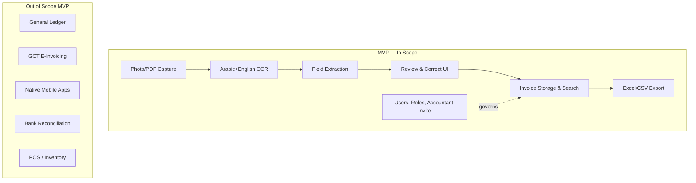

# Vision & Problem Statement — Iraqi SME Invoice OCR Platform

# Vision & Problem Statement

**Product:** Invoice OCR Platform for Iraqi SMEs
**Document:** Vision & Problem Statement (Blueprint 1 of N)
**Audience:** Product, Engineering, QA, Autonomous coding agents
**Status:** Draft v1.0
**Owner:** Product Lead [Open question: name owner]

---

## 1. Executive Summary

Iraqi small and medium enterprises (SMEs) receive supplier invoices predominantly on paper, in mixed Arabic/English, in inconsistent layouts, often handwritten or thermal-printed. Owners and their accountants spend hours per week manually keying these into spreadsheets or local accounting tools. This product is a web application that lets an SME owner photograph an invoice with a phone, receive a structured accounting entry within seconds, review and correct it, and export batches to their accountant in formats the accountant already uses (Excel, CSV, or a journal-entry file).

The MVP targets **5,000 active users** and **50 requests-per-second peak** within an operating budget of **500 USD/month**, which constrains architectural and vendor choices materially (see §10).

---

## 2. Problem Statement

### 2.1 The problem

Iraqi SMEs cannot cheaply or reliably convert supplier invoices into bookkeeping entries. Existing OCR products (a) do not read Arabic well, especially Iraqi-dialect vendor names and handwritten amounts, (b) do not understand Iraqi invoice conventions (IQD amounts without decimals, mixed Hijri/Gregorian dates, VAT-absent invoices, informal tax IDs), and (c) are priced per-page in USD, which is prohibitive for a shop processing 50–500 invoices/month.

The manual workflow today looks like:

### 2.2 Who has this problem

| Segment | Size [Assumption] | Pain intensity | Willingness to pay |
|---|---|---|---|
| Retail shops (grocers, pharmacies, electronics) | ~150,000 in Iraq [Assumption] | High — daily invoice volume | Low-medium (5–20 USD/mo) |
| Restaurants & cafés | ~40,000 [Assumption] | High — perishable supplier invoices daily | Medium |
| Small contractors / trading companies | ~25,000 [Assumption] | Very high — large invoices, VAT exposure | Medium-high (20–50 USD/mo) |
| External accountants serving SMEs | ~5,000 practitioners [Assumption] | Very high — bottleneck is data entry | High (per-seat) |

[Open question — decided by: Product Lead + Sales] Which segment do we prioritize for launch? This document assumes **retail shops + their external accountants** as the beachhead, because they generate the highest invoice volume per user and the accountant is a natural referral channel.

### 2.3 Why now

1. **Smartphone penetration** in Iraq exceeded 80% in 2024 [Assumption — cite GSMA or local telecom report before publishing]. Camera quality on sub-200-USD Android devices is now sufficient for OCR.
2. **Arabic OCR quality crossed a usability threshold** in 2024–2025 with transformer-based models (Azure Document Intelligence, Google Document AI, and open-source Qwen-VL/DeepSeek-VL). Iraqi handwriting remains hard but printed Arabic is solved.
3. **General Commission for Taxes (GCT) enforcement** of invoice retention has increased since 2024 [Assumption — verify with tax advisor]. SMEs face real penalties for missing records, creating urgency.
4. **No dominant local competitor.** Regional players (Foodics, Rewaa) target POS not invoice capture; global players (Dext, Hubdoc) do not support Arabic or Iraqi accounting conventions.

---

## 3. Vision Statement

> **In three years, every Iraqi SME captures every supplier invoice by phone the moment it arrives, and their accountant closes the books in hours, not weeks.**

The 12-month vision (MVP + first iteration): become the default invoice-capture tool for 5,000 SME/accountant pairs in Baghdad, Basra, and Erbil, processing >200,000 invoices/month, with a review-and-correct workflow that gets structured data into the accountant's hands within 24 hours of capture.

---

## 4. Goals (Business Objectives)

Numbered so they can be traced to requirements downstream.

| ID | Goal | Rationale |
|---|---|---|
| G-01 | Reduce SME time-to-record an invoice from ~5 minutes (manual entry) to <30 seconds (capture + review) | Core value proposition |
| G-02 | Achieve ≥90% field-level accuracy on printed Arabic invoices without user correction | Below this, users lose trust and revert to manual |
| G-03 | Support 5,000 monthly active users at ≤500 USD/month infrastructure cost | Budget constraint |
| G-04 | Enable accountants to export a full month of client invoices in one file, in the format their accounting software imports | Accountants are the referral engine |
| G-05 | Ship MVP within 4 months of engineering start [Assumption — decided by: Product + Eng leads] | Market timing |

---

## 5. Success Criteria (Measurable)

Each criterion has a metric, a target, a measurement method, and a review cadence.

| ID | Metric | Target (12 months post-launch) | Measurement method | Cadence |
|---|---|---|---|---|
| S-01 | Monthly Active Users (MAU) | ≥ 5,000 | Analytics: distinct user_id with ≥1 invoice upload in 30d | Monthly |
| S-02 | Invoices processed per month | ≥ 200,000 | DB count of invoices with status ∈ {processed, exported} | Monthly |
| S-03 | Field-level OCR accuracy (vendor, date, total, VAT, line items) | ≥ 90% on printed Arabic; ≥ 60% on handwritten | Weekly labeled sample of 200 invoices, human-scored | Weekly |
| S-04 | Median time from photo upload to structured entry displayed | ≤ 15 seconds (P50), ≤ 45 seconds (P95) | Server-side timing | Continuous, weekly review |
| S-05 | User correction rate per field | ≤ 15% of fields corrected before export | Compare OCR output vs user-edited output | Weekly |
| S-06 | Accountant export usage | ≥ 60% of active users export at least monthly | Feature usage log | Monthly |
| S-07 | Infrastructure cost per 1,000 invoices | ≤ 2.50 USD | Cloud + OCR API bill / invoice count | Monthly |
| S-08 | 30-day retention | ≥ 40% | Users active in month N who are still active in month N+1 | Monthly |
| S-09 | Net Promoter Score (NPS) among accountants | ≥ 30 | In-app survey, quarterly | Quarterly |
| S-10 | Uptime (API + web) | ≥ 99.5% monthly | Synthetic monitoring | Monthly |

---

## 6. Target Users & Personas

### 6.1 Primary persona — Abu Ahmed, retail shop owner

- 45 years old, owns a 3-employee electronics shop in Baghdad.
- Uses a mid-range Android phone. Comfortable with WhatsApp, uncomfortable with spreadsheets.
- Speaks Arabic (Iraqi dialect), reads basic English.
- Receives 20–60 supplier invoices/month, currently piles them in a drawer for his accountant.
- **Needs:** capture invoices in seconds without typing; not lose them; be able to find last month's invoice from a specific supplier.

### 6.2 Primary persona — Sarah, external accountant

- 32 years old, serves 15 SME clients from her home office.
- Uses Excel heavily; some clients use Al-Ameen or Onyx accounting software.
- Reads Arabic and English fluently.
- **Needs:** receive her clients' invoices in a structured, reviewable batch; export to a format her accounting software imports; catch missing invoices before month-end close.

### 6.3 Secondary persona — Employee cashier

- May be the one physically capturing invoices on behalf of Abu Ahmed. Needs a UI a non-owner staff member can use without training.

[Open question — decided by: Product] Do we support multiple users per SME account in the MVP, or single-user only? This document assumes **shared account with per-user activity log** for the MVP; role-based access deferred to v2.

---

## 7. Scope

### 7.1 In scope (MVP)

| ID | Capability |
|---|---|
| IN-01 | Web app, mobile-responsive, optimized for Android Chrome and iOS Safari |
| IN-02 | Camera capture + gallery upload of invoice images (JPEG, PNG, PDF single-page and multi-page) |
| IN-03 | Arabic + English OCR of printed invoices |
| IN-04 | Extraction of: vendor name, vendor tax ID (if present), invoice number, invoice date, currency, subtotal, VAT amount, total, line items (description, qty, unit price, line total), payment method (if present) |
| IN-05 | User review and correction UI, with the source image shown alongside the extracted fields |
| IN-06 | Iraqi Dinar (IQD) and USD as primary currencies; auto-detect currency from invoice |
| IN-07 | Gregorian and Hijri date parsing; store both, display user's preference |
| IN-08 | Invoice list, search by vendor/date/amount, filter by status (pending review, reviewed, exported) |
| IN-09 | Export to Excel (.xlsx) and CSV, one row per invoice and one sheet per month; separate line-item export |
| IN-10 | User accounts with email/phone + password; password reset by email |
| IN-11 | Two roles: owner and accountant; accountant can be invited to view/export an SME's invoices |
| IN-12 | Arabic and English UI, RTL layout for Arabic |
| IN-13 | Basic dashboard: invoice count this month, total spend by vendor, missing-invoice-number gaps |

### 7.2 Out of scope (MVP) — explicitly

| ID | Excluded | Rationale |
|---|---|---|
| OUT-01 | Handwritten invoice OCR beyond best-effort (no accuracy guarantee) | Iraqi handwriting requires custom training data we do not yet have |
| OUT-02 | Full accounting engine (general ledger, P&L, balance sheet) | We are a capture/export tool, not an accounting system |
| OUT-03 | Direct API integration with Iraqi accounting software (Al-Ameen, Onyx) | Export files sufficient for MVP; direct integration in v2 |
| OUT-04 | E-invoicing / GCT direct filing | Regulatory scope unclear [Open question — tax advisor] |
| OUT-05 | Native mobile apps (iOS/Android) | Web is sufficient and one codebase; native in v2 if data shows need |
| OUT-06 | Bank statement OCR / reconciliation | Separate product |
| OUT-07 | Multi-branch consolidation for chains | Beachhead is single-location SMEs |
| OUT-08 | Offline capture | 4G/5G coverage sufficient in target cities [Assumption] |
| OUT-09 | Payroll, inventory, POS features | Adjacent products, not this one |
| OUT-10 | Languages beyond Arabic and English (e.g., Kurdish Sorani) | Deferred to post-MVP based on Erbil demand signal |

### 7.3 Scope boundary diagram

---

## 8. Assumptions

Every assumption below is load-bearing — if it is wrong, a downstream requirement changes.

| ID | Assumption | Impact if false |
|---|---|---|
| A-01 | Target users have Android phones with ≥8 MP rear cameras | Would need image-quality fallback UX |
| A-02 | 4G coverage in Baghdad, Basra, Erbil is sufficient for 2–5 MB uploads in <10 seconds P95 | Would require aggressive compression or offline queue |
| A-03 | A managed OCR API (Azure Document Intelligence or Google Document AI) can meet ≥90% accuracy on printed Arabic invoices | Would require training our own model — schedule and budget change materially |
| A-04 | 500 USD/month covers ~200,000 invoices/month at target accuracy | If OCR API cost > 2 USD per 1,000 pages, budget breaks — see §10 |
| A-05 | Accountants will accept Excel/CSV export in MVP (no direct integration) | Would delay launch by 2–3 months for integrations |
| A-06 | Users will trust cloud storage of invoice images | Would require on-prem or in-country hosting; not currently planned |
| A-07 | Iraqi tax law permits digital-only invoice retention when the original paper exists | Legal review needed — see [Open question OQ-03] |
| A-08 | English-language documentation and admin tooling is acceptable; only end-user UI needs Arabic | If false, doubles doc effort |
| A-09 | Payment collection can use a regional processor (e.g., FastPay, Zain Cash) [Open question OQ-04] | Otherwise revenue collection is manual |

---

## 9. Open Questions

Each must be resolved before the referenced downstream document is finalized.

| ID | Question | Decided by | Needed before | Deadline [Assumption] |
|---|---|---|---|---|
| OQ-01 | Which SME segment is beachhead — retail, restaurants, or contractors? | Product Lead + Sales | Requirements Spec | Week 2 |
| OQ-02 | Which OCR vendor — Azure, Google, or hybrid with open-source fallback? | Eng Lead + Product | Architecture doc | Week 3 |
| OQ-03 | Is cloud-only storage of invoice images legally sufficient under Iraqi tax retention rules? | External tax/legal advisor | Data model doc | Week 3 |
| OQ-04 | Which payment processor for subscriptions? | Product + Finance | Business Case | Week 4 |
| OQ-05 | Pricing model — freemium with invoice cap, per-user subscription, or per-invoice? | Product Lead | Business Case | Week 4 |
| OQ-06 | Hosting region — Iraq, Turkey, UAE, EU? Affects latency, cost, and data-residency claim | Eng Lead | Architecture doc | Week 3 |
| OQ-07 | Do we support Kurdish (Sorani) UI at launch given Erbil market? | Product | Requirements Spec | Week 2 |
| OQ-08 | Multi-user per SME account in MVP or defer? | Product | Requirements Spec | Week 2 |
| OQ-09 | SLA / uptime commitment we will publish to users | Product + Eng | Business Case | Week 4 |
| OQ-10 | Support channel — WhatsApp only, in-app chat, or email? | Product + Ops | Ops plan | Week 5 |

---

## 10. Constraints

### 10.1 Budget constraint (hard)

**500 USD/month total operating cost** at 5,000 MAU / 50 rps peak. This forces the following early choices:

| Cost line | Budget ceiling (USD/mo) | Notes |
|---|---|---|
| OCR API calls | ≤ 300 | At ~200,000 invoices/mo, ceiling of 1.50 USD per 1,000 invoices. Azure Document Intelligence prebuilt-invoice list price is ~10 USD/1,000 pages — **materially over budget**. See §10.2. |
| Compute (web + API) | ≤ 80 | Single small VM or container per service; horizontal scale via burst only |
| Database + storage | ≤ 60 | Managed Postgres small tier + object storage for images with lifecycle policy |
| CDN + egress | ≤ 30 | Aggressive image compression required |
| Monitoring + email/SMS | ≤ 30 | |

### 10.2 Budget risk — flagged

At list prices, mainstream OCR APIs exceed the 300 USD/month OCR ceiling by roughly 5–7×. **Mitigations must be evaluated in the Architecture doc:**

1. Negotiate volume commit pricing with a single vendor.
2. Use an open-source multimodal model (Qwen-VL, InternVL, or Tesseract + layout model) self-hosted on a spot GPU, with managed API as fallback for low-confidence pages.
3. Cap free-tier users at N invoices/month; monetize heavy users to cross-subsidize OCR cost.

[Open question OQ-02] owns this.

### 10.3 Regulatory constraints

- Iraqi tax retention rules for invoices — see OQ-03.
- If handling payment data, PCI scope must be avoided by using a hosted payment page — see OQ-04.

### 10.4 Language & locale constraints

- Right-to-left layout is a first-class requirement, not an afterthought.
- Arabic numerals (٠١٢٣) and Western Arabic numerals (0123) both appear on Iraqi invoices — parser must handle both.
- IQD amounts routinely lack decimal separators and use commas or dots inconsistently — parser must normalize.

---

## 11. Non-Goals (for clarity)

These are things a reasonable reader might expect us to build but we deliberately will not, at any horizon in this vision:

| ID | Non-goal | Why |
|---|---|---|
| NG-01 | Replace the accountant | Accountants are our distribution channel and quality-control layer; we augment them |
| NG-02 | Serve enterprises with >500 invoices/day per user | Different product, different sales motion |
| NG-03 | Build a general-purpose document AI platform | We are a vertical product for a specific workflow |

---

## 12. Risks (Vision-Level)

Detailed risk register lives in a separate document; the vision-level risks are:

| ID | Risk | Likelihood | Impact | Early signal |
|---|---|---|---|---|
| R-01 | OCR accuracy on real Iraqi invoices falls below 90% at launch | Medium | High | Pilot with 50 real invoices in Week 6 |
| R-02 | Infrastructure cost exceeds 500 USD/mo at 5,000 MAU | Medium-High | High | Cost model reviewed monthly from Week 4 |
| R-03 | Accountants prefer status quo (Excel by hand) | Low-Medium | High | 10 accountant interviews before Week 2 |
| R-04 | Regulatory change requires GCT e-invoicing integration | Medium | Medium | Monitor GCT announcements quarterly |
| R-05 | Payment collection blocked by lack of local processor integration | Medium | Medium | Resolve OQ-04 by Week 4 |

---

## 13. Definition of Done — Vision Document

This document is complete when:

1. All Open Questions have named owners and deadlines (done above).
2. All Assumptions have an impact-if-false statement (done above).
3. Success criteria are measurable with named instruments (done above).
4. Scope in / out lists are exhaustive enough that an engineer can reject a feature request by pointing to this document.
5. Product Lead has signed off [Open question — needs sign-off].

---

## 14. Glossary

| Term | Meaning |
|---|---|
| SME | Small or Medium Enterprise; here, Iraqi businesses with 1–50 employees |
| GCT | General Commission for Taxes (Iraq) |
| IQD | Iraqi Dinar |
| OCR | Optical Character Recognition |
| MAU | Monthly Active User |
| RTL | Right-to-Left (text direction, for Arabic) |
| P50 / P95 | 50th / 95th percentile latency |
| Accountant | External bookkeeping professional serving multiple SME clients |
