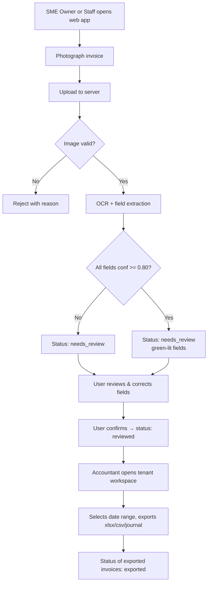
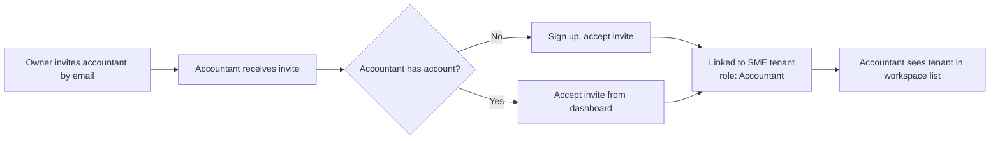
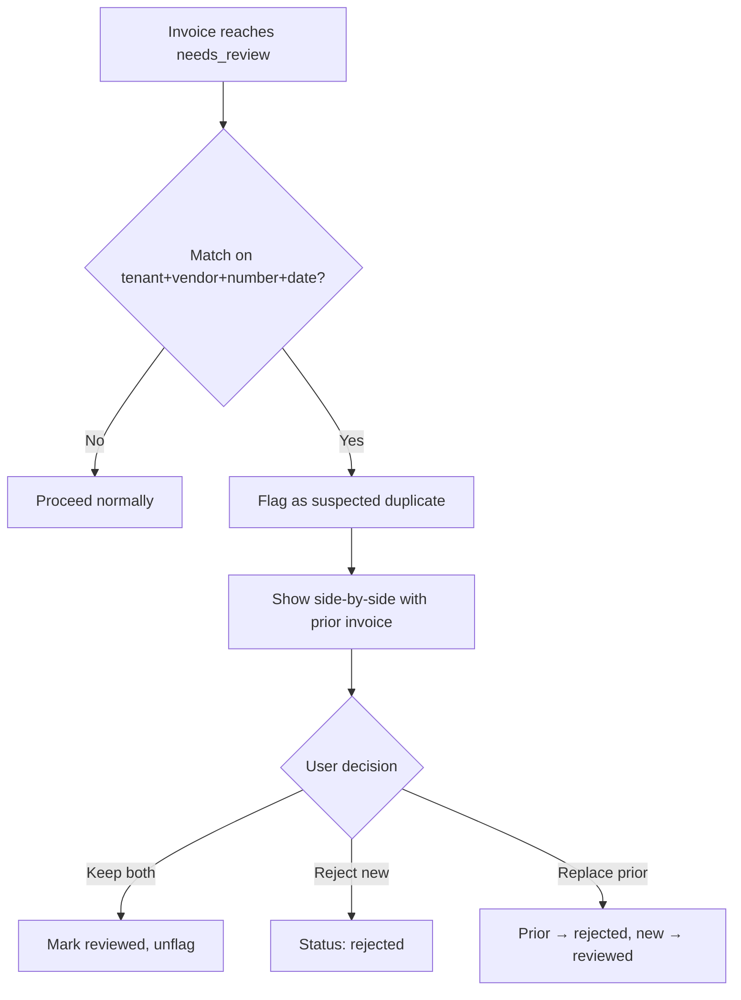
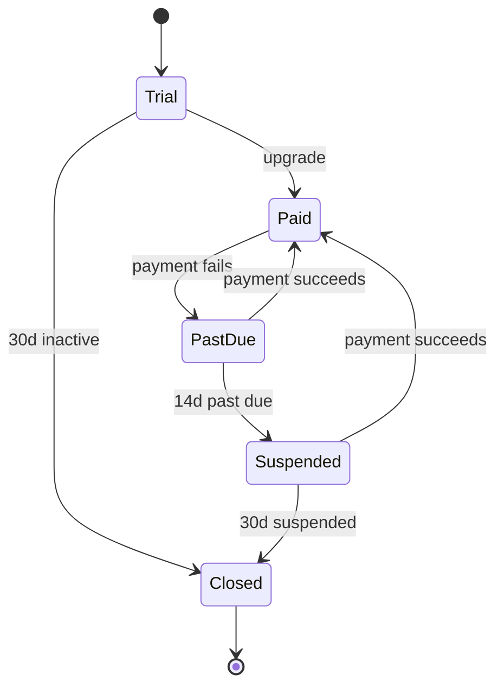

# Business Requirements Document — Iraqi SME Invoice OCR Platform

# Business Requirements Document (BRD)

**Product:** Invoice OCR Platform for Iraqi SMEs
**Document:** Business Requirements Document (Blueprint 2 of N)
**Audience:** Product, Engineering, QA, Autonomous coding agents, Business stakeholders
**Status:** Draft v1.0
**Owner:** Product Lead [Open question: name owner]
**Related documents:** Vision & Problem Statement (approved)

---

## 1. Background

Iraqi SMEs manually key supplier invoices into spreadsheets or hand them to external accountants who do the same. The Vision & Problem Statement (approved) establishes the market gap, the beachhead segment (retail shops + their external accountants), and the 12-month targets (5,000 MAU, 200,000 invoices/month, ≥90% field-level accuracy on printed Arabic, ≤500 USD/month infra).

This BRD translates that vision into numbered business requirements, rules, scope, constraints, assumptions, dependencies and business-level acceptance criteria. Functional and technical specification are out of scope for this document and will follow in the SRS and system design blueprints.

---

## 2. Business Objectives

Traced back to Vision goals G-01 through G-05.

| ID | Objective | Traces to | Measurable target |
|---|---|---|---|
| BO-01 | Cut per-invoice capture time from ~5 min to <30 sec | G-01 | S-04: P50 ≤ 15s upload→display |
| BO-02 | Deliver production-grade Arabic OCR for Iraqi invoices | G-02 | S-03: ≥90% printed, ≥60% handwritten |
| BO-03 | Operate within 500 USD/month at 5,000 MAU / 50 rps peak | G-03 | Monthly infra invoice ≤ 500 USD |
| BO-04 | Make the accountant the daily user, not just a recipient | G-04 | ≥ 60% of accounts have a linked accountant user [Assumption] |
| BO-05 | Ship MVP within 4 months of engineering start | G-05 | Date-based; tracked in program plan |
| BO-06 | Achieve trust: correction rate ≤15% per field | G-02 | S-05 |

---

## 3. Scope

### 3.1 In Scope (MVP)

| ID | Capability |
|---|---|
| SC-IN-01 | Web app (responsive, mobile-first) usable on sub-200-USD Android phones in Chrome |
| SC-IN-02 | Photo capture of a single invoice via device camera or file upload (JPEG, PNG, PDF up to 10 MB) |
| SC-IN-03 | Arabic + English OCR of printed supplier invoices |
| SC-IN-04 | Extraction of the fields defined in BR-10 (vendor, date, totals, VAT, line items, invoice number) |
| SC-IN-05 | Review-and-correct UI with per-field confidence indicators |
| SC-IN-06 | Batch export to Excel (.xlsx), CSV, and a generic journal-entry file for accountants |
| SC-IN-07 | Multi-tenant accounts: SME owner + one or more linked accountant users |
| SC-IN-08 | Role-based access (Owner, Staff, Accountant) — see BR-04 |
| SC-IN-09 | IQD as primary currency; USD as secondary; automatic detection from invoice |
| SC-IN-10 | Retention of original image + extracted data for ≥ 7 years (tax retention) [Assumption — confirm with tax advisor] |
| SC-IN-11 | Arabic (RTL) and English (LTR) UI |
| SC-IN-12 | Basic duplicate detection (same vendor + invoice number + date) |

### 3.2 Out of Scope (MVP)

| ID | Excluded capability | Rationale |
|---|---|---|
| SC-OUT-01 | Native mobile apps (iOS / Android) | Cost; web covers target devices |
| SC-OUT-02 | Full double-entry accounting / general ledger | Accountants keep their own tools |
| SC-OUT-03 | Direct integration with GCT e-filing | GCT API maturity unknown [Open question — decided by: Product + tax advisor] |
| SC-OUT-04 | Handwritten-invoice OCR guarantees | S-03 sets only a 60% floor; not a launch commitment |
| SC-OUT-05 | Payments / bank reconciliation | Separate product bet |
| SC-OUT-06 | Bulk supplier onboarding, e-invoicing (EDI) | Not the SME workflow today |
| SC-OUT-07 | Offline mode | Adds sync complexity; smartphones in target cities have adequate connectivity [Assumption] |
| SC-OUT-08 | Support for non-Arabic/English invoices (Kurdish, Farsi) | Post-MVP |

---

## 4. Stakeholders

| Stakeholder | Interest | Influence | Engagement |
|---|---|---|---|
| SME Owner (end user) | Fast capture, trustworthy data, low price | High | User research, beta |
| Accountant (end user) | Clean export in familiar format, per-client view | High | Design partner interviews |
| SME Staff | Simple capture workflow | Medium | Usability tests |
| Product Lead | Roadmap, prioritization | High | Owns this doc |
| Engineering Lead | Feasibility, delivery | High | Reviews & signs off |
| QA Lead | Test strategy, quality gates | Medium | Reviews acceptance criteria |
| Finance / Founder | Budget adherence (500 USD/mo) | High | Approves infra choices |
| Tax advisor (external) | Compliance with GCT retention & VAT rules | Medium | Consulted on BR-16, SC-IN-10 |
| OCR vendor(s) | SLA, pricing, Arabic quality | Medium | Contract negotiation |
| Hosting/cloud vendor | Cost, availability in-region | Medium | Contract |
| GCT (regulator, indirect) | Invoice retention, VAT accuracy | High (regulatory) | Monitor policy changes |

---

## 5. Business Rules

Business rules are policy-level; functional detail belongs in the SRS.

| ID | Rule |
|---|---|
| BR-01 | An account belongs to exactly one SME (tenant). All invoices, users, and exports are scoped to that tenant. |
| BR-02 | An accountant user may be linked to multiple SME tenants but must be invited by an Owner of each. |
| BR-03 | Only an Owner may invite users, change roles, or delete the account. |
| BR-04 | Roles: **Owner** (full), **Staff** (capture + review own uploads), **Accountant** (read all, export, correct, no user management, no delete). |
| BR-05 | Every invoice has one of: `uploaded`, `processing`, `needs_review`, `reviewed`, `exported`, `rejected`. Transitions are one-way except `reviewed` → `needs_review` (re-open by Accountant). |
| BR-06 | An invoice is billable to the tenant's plan quota on successful OCR completion (status → `needs_review` or later), not on upload. Failed OCR is free. |
| BR-07 | The original captured image is immutable and retained for ≥ 7 years [Assumption]. Extracted data may be edited; edits are versioned with user + timestamp. |
| BR-08 | Duplicate detection: same tenant + vendor tax ID (or vendor name if no tax ID) + invoice number + invoice date ⇒ flagged as suspected duplicate; not blocked. |
| BR-09 | Currency is inferred from the invoice; when ambiguous, defaults to tenant's primary currency (IQD). Amounts are stored in the invoice's currency plus a computed IQD value at the invoice-date FX rate [Open question — FX source: decided by Product Lead]. |
| BR-10 | Minimum extracted fields per invoice: `vendor_name`, `vendor_tax_id` (nullable), `invoice_number`, `invoice_date`, `currency`, `subtotal`, `vat_amount` (nullable), `total`, `line_items[]` (description, qty, unit_price, line_total). |
| BR-11 | VAT: if `vat_amount` is present, `subtotal + vat_amount` must equal `total` within ±1 minor unit; otherwise flagged. |
| BR-12 | Dates: accept Gregorian and Hijri; store as Gregorian ISO-8601; retain original string. |
| BR-13 | IQD amounts have no decimal places; the system must not introduce fractional IQD. |
| BR-14 | Field-level confidence < 0.80 forces the field into review before status can advance past `needs_review`. Threshold configurable per tenant by Owner (bounded 0.60–0.95). |
| BR-15 | Export files must include a per-row link back to the original image URL (signed, time-limited). |
| BR-16 | The system does not file or transmit anything to GCT on the user's behalf in MVP. |
| BR-17 | A tenant's data is deleted within 30 days of account closure, except records the tenant flags for tax retention. [Assumption — legal basis to be confirmed] |
| BR-18 | Free-trial tenants are capped at 30 invoices; paid plans have monthly quotas defined by the pricing table [Open question — pricing: decided by Product + Finance]. |
| BR-19 | All timestamps are stored in UTC and displayed in Asia/Baghdad. |
| BR-20 | PII (owner name, phone, tax ID) is encrypted at rest. |

---

## 6. Business Process Flows

### 6.1 Primary flow — Capture to Export

### 6.2 Accountant onboarding flow

### 6.3 Duplicate handling flow

### 6.4 Billing state flow

---

## 7. Constraints

| ID | Constraint | Source |
|---|---|---|
| C-01 | Total infrastructure + third-party OCR cost ≤ 500 USD/month at 5,000 MAU and 50 rps peak | Vision §10 / budget |
| C-02 | Web-only for MVP (no native mobile app) | SC-OUT-01 |
| C-03 | Must operate on sub-200-USD Android phones in Chrome | Vision §2.3 |
| C-04 | Arabic (RTL) and English (LTR) UI required at launch | Beachhead market |
| C-05 | Data residency: primary storage in a region with acceptable latency to Iraq; region choice must not violate 500 USD/mo cap [Open question — decided by: Eng Lead] | Regulatory + cost |
| C-06 | MVP delivery within 4 months of engineering start | BO-05 |
| C-07 | No dependency on GCT APIs (maturity unknown) | SC-OUT-03 |
| C-08 | OCR vendor pricing must scale sub-linearly with volume, or be replaced by self-hosted model when unit cost > 0.005 USD/invoice [Assumption] | Cost model |
| C-09 | Retention of invoice images for ≥ 7 years [Assumption — tax advisor] | BR-07 |
| C-10 | System availability target: 99.5% monthly (excludes planned maintenance) [Assumption] | Business commitment |

---

## 8. Assumptions

| ID | Assumption | Impact if wrong |
|---|---|---|
| A-01 | Retail shops + external accountants is the correct beachhead | Re-scope segmentation and pricing |
| A-02 | 80%+ smartphone penetration among target SMEs | Reduced TAM; revisit distribution |
| A-03 | Iraqi tax retention rules require ≥ 7 years for supplier invoices | Legal exposure; may reduce storage cost |
| A-04 | Chrome on Android is dominant enough to skip other browsers in MVP | Widen browser matrix |
| A-05 | An off-the-shelf OCR (Azure/Google/Qwen-VL) hits ≥90% on printed Arabic invoices | Must self-train earlier than planned; cost risk |
| A-06 | Accountants will accept .xlsx / CSV / generic journal export as sufficient | Need accounting-software-specific connectors sooner |
| A-07 | Target user tolerates a 15-second median wait for OCR result | Need faster path or async UX |
| A-08 | Payment processing (subscriptions) can be handled by a regional PSP acceptable to SMEs | Manual billing overhead |
| A-09 | Iraqi SMEs will pay 5–20 USD/month | Revenue model breaks |
| A-10 | Connectivity in Baghdad/Basra/Erbil is sufficient for online-only capture | Need offline sync (SC-OUT-07 reversed) |

---

## 9. Dependencies

| ID | Dependency | Type | Owner | Risk |
|---|---|---|---|---|
| D-01 | OCR vendor contract (Azure Document Intelligence or Google Document AI or self-hosted Qwen-VL) | External | Eng Lead | High — pricing & Arabic quality |
| D-02 | Cloud hosting account with in-region or near-region presence | External | Eng Lead | Medium |
| D-03 | Payment service provider supporting Iraqi cards / wallets | External | Finance | High — limited options |
| D-04 | Email/SMS provider for invites and OTP | External | Eng | Low |
| D-05 | Tax advisor sign-off on retention & VAT rules (BR-11, BR-16, SC-IN-10) | External | Product | Medium |
| D-06 | Design partner accountants (≥ 3 firms) for MVP feedback | Internal-external | Product | Medium |
| D-07 | Approved Vision doc (this BRD depends on it) | Internal | Product | Done |
| D-08 | Legal review of privacy policy and data-processing terms (Arabic + English) | External | Legal | Medium |
| D-09 | Domain, brand, Arabic UX writing | Internal | Product | Low |
| D-10 | Analytics / observability stack fitting inside 500 USD/mo | Internal | Eng | Medium |

---

## 10. Business Requirements

Business requirements state *what the business needs*. Functional detail (screens, endpoints, algorithms) belongs to the SRS.

### 10.1 Capture & Ingestion

| ID | Requirement | Priority |
|---|---|---|
| BRQ-01 | Users must be able to capture an invoice using a phone camera in ≤ 3 taps from opening the app | Must |
| BRQ-02 | The system must accept JPEG, PNG, and PDF up to 10 MB | Must |
| BRQ-03 | The system must return the extracted invoice for review within P50 ≤ 15s and P95 ≤ 45s | Must |
| BRQ-04 | The system must show upload progress and allow cancel | Should |
| BRQ-05 | The system must allow batch upload of up to 20 invoices in one action | Should |

### 10.2 Extraction & Review

| ID | Requirement | Priority |
|---|---|---|
| BRQ-06 | The system must extract the fields listed in BR-10 for every invoice | Must |
| BRQ-07 | The system must display per-field confidence and highlight fields below the tenant threshold (BR-14) | Must |
| BRQ-08 | Users must be able to correct any extracted field with keystrokes counted for S-05 | Must |
| BRQ-09 | The system must warn the user on math inconsistencies per BR-11 | Must |
| BRQ-10 | The system must flag suspected duplicates per BR-08 before status advances to `reviewed` | Must |

### 10.3 Export & Accountant Workflow

| ID | Requirement | Priority |
|---|---|---|
| BRQ-11 | Accountants must be able to export a date range of `reviewed` invoices for a tenant as .xlsx, .csv, and a generic journal-entry file | Must |
| BRQ-12 | Exports must include image links per BR-15 | Must |
| BRQ-13 | Exports must be re-runnable; a re-export does not change invoice status | Must |
| BRQ-14 | An accountant must be able to switch between linked tenants in ≤ 2 clicks | Should |
| BRQ-15 | Exports must be delivered in ≤ 60 seconds for up to 5,000 invoices | Should |

### 10.4 Users, Roles, Tenancy

| ID | Requirement | Priority |
|---|---|---|
| BRQ-16 | The system must support the roles defined in BR-04 | Must |
| BRQ-17 | Owners must be able to invite / remove users and reassign roles | Must |
| BRQ-18 | Accountants must be linkable to multiple tenants per BR-02 | Must |
| BRQ-19 | The system must enforce tenant isolation of all data | Must |

### 10.5 Billing & Plans

| ID | Requirement | Priority |
|---|---|---|
| BRQ-20 | The system must count billable invoices per BR-06 and expose the count to Owners | Must |
| BRQ-21 | The system must enforce plan quotas and prevent OCR beyond quota (queue or block, TBD by Product) [Open question — decided by: Product] | Must |
| BRQ-22 | The system must support at least one Iraqi-friendly payment method | Must |
| BRQ-23 | The system must generate a monthly VAT-compliant invoice to the tenant for their subscription [Assumption] | Should |

### 10.6 Language, Locale, Accessibility

| ID | Requirement | Priority |
|---|---|---|
| BRQ-24 | UI must be fully available in Arabic (RTL) and English (LTR); user may switch at any time | Must |
| BRQ-25 | All user-facing dates must display in Asia/Baghdad time (BR-19) | Must |
| BRQ-26 | UI must meet WCAG 2.1 AA for color contrast and keyboard navigation on desktop | Should |

### 10.7 Security & Privacy

| ID | Requirement | Priority |
|---|---|---|
| BRQ-27 | Authentication must require email + password with OTP for sensitive actions (invite user, delete account, export > 500 rows) | Must |
| BRQ-28 | PII must be encrypted at rest per BR-20 | Must |
| BRQ-29 | Image URLs must be signed and expire in ≤ 15 minutes | Must |
| BRQ-30 | Audit log must capture: login, role change, export, invoice edit, invoice deletion | Must |
| BRQ-31 | Users must be able to request account deletion; system honors within 30 days per BR-17 | Must |

### 10.8 Reliability & Performance

| ID | Requirement | Priority |
|---|---|---|
| BRQ-32 | System must sustain 50 rps peak on OCR submissions without exceeding P95 latency (BRQ-03) | Must |
| BRQ-33 | System monthly availability ≥ 99.5% per C-10 | Must |
| BRQ-34 | On OCR-vendor outage, uploads must queue and process on recovery; user informed | Must |
| BRQ-35 | Total run-cost must stay ≤ 500 USD/month at 5,000 MAU | Must |

### 10.9 Observability & Support

| ID | Requirement | Priority |
|---|---|---|
| BRQ-36 | The system must emit metrics for S-01 through S-05 continuously | Must |
| BRQ-37 | The system must retain application logs for ≥ 30 days | Must |
| BRQ-38 | Owners must have an in-app support channel (email or chat) with < 1 business day first response [Assumption — staffing] | Should |

---

## 11. Business-Level Acceptance Criteria

These are the conditions under which the business considers the MVP acceptable for launch. Detailed test cases will be in the Test Strategy document.

| ID | Acceptance criterion | How verified |
|---|---|---|
| AC-01 | A new SME Owner can sign up, capture their first invoice, and see structured fields in ≤ 3 minutes without any support contact | Timed usability test with 10 first-time users; ≥ 8 succeed |
| AC-02 | On a labeled set of 200 printed Arabic invoices, field-level extraction accuracy ≥ 90% (weighted across vendor, date, total, VAT, line-item totals) | QA-run weekly measurement (S-03) sustained for 4 consecutive weeks pre-launch |
| AC-03 | On the same set, P50 OCR latency ≤ 15s and P95 ≤ 45s | Load test at 50 rps sustained for 30 minutes |
| AC-04 | An accountant can export 1 month of invoices for a tenant as .xlsx and open the file in Microsoft Excel and LibreOffice without formatting errors, with image links resolvable | QA scripted test on 3 tenants |
| AC-05 | Monthly infrastructure + third-party OCR cost projected at 5,000 MAU stays ≤ 500 USD | Cost model + 1-month soak test at 20% scale, extrapolated |
| AC-06 | Tenant isolation verified: no cross-tenant data leakage in penetration test | Third-party or in-house security review, zero critical findings |
| AC-07 | Full Arabic RTL UI passes review by a native Arabic reviewer with ≤ 5 minor copy issues | UX review sign-off |
| AC-08 | All BRQ-**Must** requirements have a passing test in the QA suite | Traceability matrix in Test Strategy doc |
| AC-09 | Duplicate detection catches ≥ 95% of true duplicates on a labeled set of 100 duplicate pairs | QA measurement |
| AC-10 | Account deletion request completes within 30 days end-to-end (data purged, backups excluded per policy) | Manual timed test in staging |
| AC-11 | 99.5% availability sustained during the 30-day pre-launch soak | Uptime monitor |
| AC-12 | Legal-approved privacy policy and terms are live in Arabic and English | Legal sign-off (D-08) |

---

## 12. Open Questions

| ID | Question | Decided by |
|---|---|---|
| OQ-01 | Named Product Owner for this document | Founder |
| OQ-02 | Segment prioritization confirmation (retail-first) | Product Lead + Sales |
| OQ-03 | Cloud region / data residency choice | Eng Lead |
| OQ-04 | FX source and cadence for IQD/USD conversion (BR-09) | Product Lead |
| OQ-05 | Pricing tiers and quotas (BR-18, BRQ-21) | Product + Finance |
| OQ-06 | GCT integration timing post-MVP (SC-OUT-03) | Product + tax advisor |
| OQ-07 | Quota-exceeded behavior: queue vs block (BRQ-21) | Product |
| OQ-08 | Whether MVP includes SMS OTP in addition to email OTP (BRQ-27) | Product + Eng |
| OQ-09 | Support staffing model and hours (BRQ-38) | Founder |
| OQ-10 | Confirmation of 7-year retention requirement (SC-IN-10, BR-07, C-09) | Tax advisor |
| OQ-11 | Backup retention window and its interaction with deletion SLA (AC-10) | Eng + Legal |

---

## 13. Traceability Summary

| Vision Goal | Business Objective | Key BRQs | Acceptance |
|---|---|---|---|
| G-01 | BO-01 | BRQ-01, BRQ-03, BRQ-05 | AC-01, AC-03 |
| G-02 | BO-02, BO-06 | BRQ-06, BRQ-07, BRQ-08, BRQ-09 | AC-02 |
| G-03 | BO-03 | BRQ-32, BRQ-35 | AC-03, AC-05 |
| G-04 | BO-04 | BRQ-11–BRQ-15, BRQ-18 | AC-04 |
| G-05 | BO-05 | (program plan) | (program plan) |

---

*End of Business Requirements Document v1.0. Successor document: Software Requirements Specification (SRS).*
