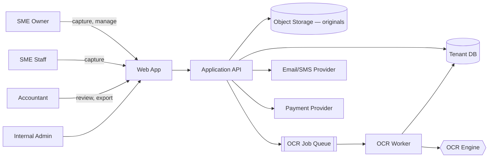
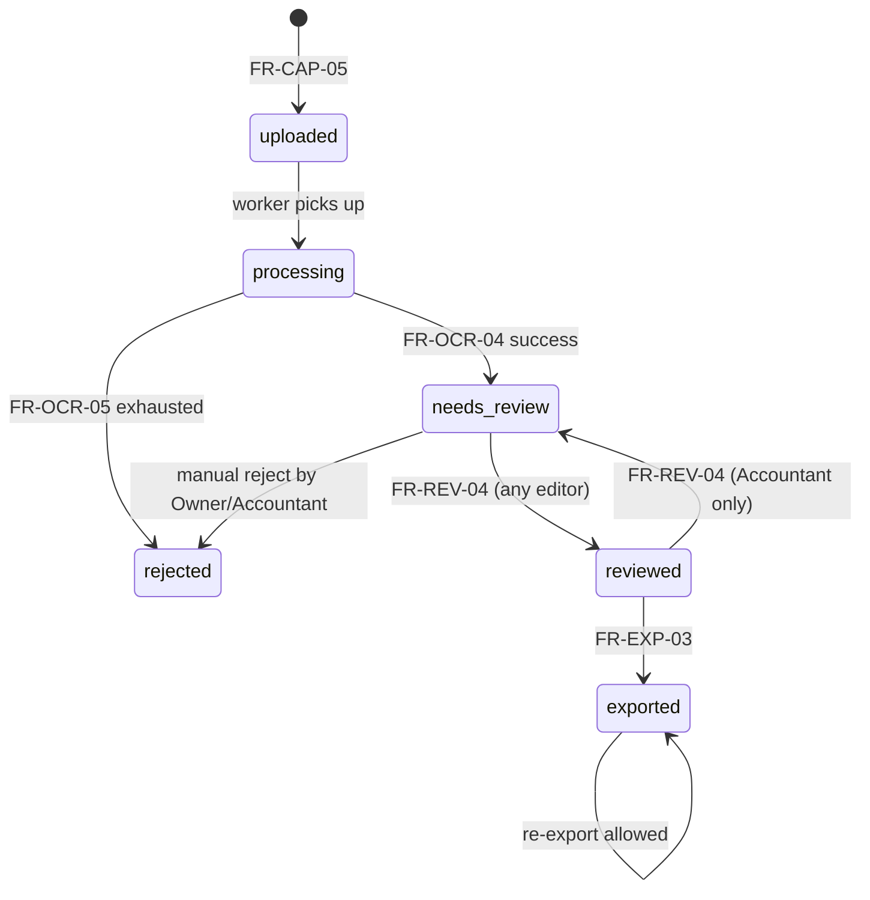

# Software Requirements Specification — Iraqi SME Invoice OCR Platform

# Software Requirements Specification (SRS)

**Product:** Invoice OCR Platform for Iraqi SMEs
**Document:** Software Requirements Specification
**Standard:** IEEE 830-style, adapted
**Status:** Draft v1.0
**Owner:** Engineering Lead [Open question: name owner]
**Related & upstream:** Vision & Problem Statement (approved), Business Requirements Document (approved)
**Audience:** Engineering, QA, autonomous coding agents, security reviewer, DevOps

---

## 1. Introduction

### 1.1 Purpose
This SRS specifies the functional and non-functional behavior the Invoice OCR Platform must exhibit for MVP delivery. Every functional requirement (FR) traces to a business rule (BR) or scope item (SC) from the approved BRD; every non-functional requirement (NFR) carries a hard number that QA can verify.

### 1.2 Document Conventions
- **FR-n** — functional requirement, MUST be implemented for MVP unless marked [Post-MVP].
- **NFR-n** — non-functional requirement, verified by measurement, not inspection.
- **[Assumption]** — the author took a position; product/business must correct if wrong.
- **[Open question — decided by: X]** — unresolved; names the decider.
- Keywords MUST, SHOULD, MAY follow RFC 2119.

### 1.3 Scope Summary
A multi-tenant web app that ingests photographed supplier invoices (JPEG/PNG/PDF), performs Arabic+English OCR, extracts structured fields, lets users review/correct, and exports to Excel/CSV/journal-entry files for external accountants. Full scope: BRD §3.1. Out of scope: BRD §3.2 — not repeated here.

### 1.4 References
- Vision & Problem Statement v1.0 (approved)
- Business Requirements Document v1.0 (approved)
- IEEE Std 830-1998 (adapted)
- WCAG 2.1 AA
- OWASP ASVS 4.0 Level 2

---

## 2. Overall Description

### 2.1 Product Perspective
Greenfield SaaS. Multi-tenant. Web-only (mobile-first responsive) per SC-IN-01. External dependencies: an OCR engine (managed API vs. self-hosted — [Open question — decided by: Engineering Lead + Finance, within cost envelope NFR-P-05]) and object storage for original images.

### 2.2 User Classes & Characteristics
| Class | Volume (Y1) | Tech skill | Primary device | Key needs |
|---|---|---|---|---|
| SME Owner | ~1,500 [Assumption] | Low | Sub-USD-200 Android, Chrome | Fast capture, trust, billing |
| SME Staff | ~2,500 [Assumption] | Low | Same | Capture only |
| Accountant | ~1,000 [Assumption] | Medium | Desktop Chrome/Edge | Bulk review, export |
| Admin (internal) | <10 | High | Desktop | Support, tenant ops |

### 2.3 Operating Environment
- **Client:** Chrome ≥ 100, Safari ≥ 15, Edge ≥ 100. Android 8+. iOS 14+. Screen widths 320px–1920px.
- **Server:** Linux x86_64. Containerized. Single region, closest low-cost region to Iraq [Open question — decided by: Engineering Lead; candidates: Frankfurt, Bahrain, Dubai].
- **Network:** Public internet, 3G-viable payloads (see NFR-P-03).

### 2.4 Assumptions & Dependencies
- [Assumption] Managed OCR API with Arabic support fits within NFR-P-05 at forecast volume.
- [Assumption] Object storage egress from chosen region to Iraq is unmetered or within budget.
- Dependency: SMS/email provider for OTP/invites (see FR-AUTH-04).
- Dependency: payment provider for plan billing [Open question — decided by: Founder; candidates: Stripe (no IQ presence), local gateway].

---

## 3. System Context



---

## 4. Functional Requirements

All FRs are MVP unless explicitly marked [Post-MVP]. "Trace" cites BRD BR-n / SC-n.

### 4.1 Authentication & Tenancy

| ID | Requirement | Trace | Acceptance |
|---|---|---|---|
| FR-AUTH-01 | The system MUST support account signup by an SME Owner using email + password OR phone + OTP. | BR-01, BR-03 | Given a valid new email/phone, when signup completes, then a tenant is created and the caller is assigned role Owner. |
| FR-AUTH-02 | Passwords MUST be ≥ 10 chars, MUST be stored using Argon2id (or bcrypt cost ≥ 12 if Argon2 unavailable). | Security | Password shorter than 10 chars is rejected with a specific error; DB row shows only a hash. |
| FR-AUTH-03 | OTP codes MUST be 6 digits, single-use, expire in 5 minutes, and be rate-limited to 5/hour/phone. | Security | 6th request in an hour returns HTTP 429. |
| FR-AUTH-04 | Owners MUST be able to invite users by email or phone and assign role Staff or Accountant. | BR-02, BR-03, BR-04 | Invitee receives link/OTP valid 72h; on accept, membership row is created with the specified role. |
| FR-AUTH-05 | An Accountant user MUST be able to belong to multiple tenants and switch tenant context without re-login. | BR-02 | UI shows tenant switcher when membership count > 1; API scoping changes on switch. |
| FR-AUTH-06 | Session tokens MUST expire after 30 days of inactivity and 90 days absolute. Logout MUST invalidate the token server-side. | Security | Token used after expiry returns 401. |
| FR-AUTH-07 | Only Owners MUST be able to change roles, remove users, or delete the tenant. | BR-03, BR-04 | Non-Owner call to those endpoints returns 403. |

### 4.2 Invoice Capture & Upload

| ID | Requirement | Trace | Acceptance |
|---|---|---|---|
| FR-CAP-01 | The web app MUST allow the user to capture a photo using the device camera on mobile browsers. | SC-IN-02 | On Android Chrome, tapping "Capture" opens the native camera and returns an image to the app. |
| FR-CAP-02 | The system MUST accept file uploads of JPEG, PNG, and PDF up to 10 MB per file. Other MIME types MUST be rejected with a user-visible error. | SC-IN-02 | 11 MB PDF is rejected with a specific error message; a 9 MB JPEG succeeds. |
| FR-CAP-03 | The client MUST client-side downscale images with the longest edge > 2000 px to 2000 px before upload, preserving EXIF orientation. | NFR-P-03 | 4000×3000 JPEG uploads as ≤ 2000 px on longest edge; upload payload ≤ 1.5 MB in P95. |
| FR-CAP-04 | Multi-page PDFs MUST be treated as one invoice per document (all pages of one PDF = one invoice record). | SC-IN-02 [Assumption] | 3-page PDF creates one invoice with 3 page images retained. |
| FR-CAP-05 | On successful upload, the system MUST create an Invoice row with status `uploaded`, enqueue an OCR job, and return its ID within 500 ms P95 after last byte received. | BR-05, NFR-P-01 | Response time measured server-side ≤ 500 ms P95. |
| FR-CAP-06 | The user MUST see upload progress and be able to cancel before completion. Cancelled uploads MUST NOT create an Invoice row. | Usability | Cancel at 50% leaves DB unchanged. |
| FR-CAP-07 | Duplicate detection: on OCR completion, if an existing non-rejected invoice in the same tenant has the same (vendor_normalized, invoice_number, invoice_date), the new invoice MUST be flagged `duplicate_of` and surfaced in the review UI. It MUST NOT be auto-rejected. | SC-IN-12 | Two identical uploads yield two rows; the second has `duplicate_of` populated. |

### 4.3 OCR & Extraction

| ID | Requirement | Trace | Acceptance |
|---|---|---|---|
| FR-OCR-01 | The OCR worker MUST process Arabic and English printed text in one pass and return per-token confidence. | SC-IN-03 | Sample bilingual invoice returns tokens tagged `ar`/`en` with 0–1 confidence. |
| FR-OCR-02 | The extractor MUST populate these fields per invoice: `vendor_name`, `vendor_tax_id`, `invoice_number`, `invoice_date`, `currency`, `subtotal`, `vat_amount`, `vat_rate`, `total`, `line_items[]` where each line item has `description`, `qty`, `unit_price`, `line_total`. Each field MUST carry a confidence score in [0,1]. | SC-IN-04 | JSON returned by extractor validates against the schema in Appendix A. |
| FR-OCR-03 | `currency` MUST default to IQD when detection confidence < 0.7; USD MUST be recognized when explicit ("USD", "$", "دولار"). | SC-IN-09 | Invoice with no currency string is stored as IQD; invoice with "$" is stored as USD. |
| FR-OCR-04 | On OCR success the invoice status MUST transition `uploaded` → `processing` → `needs_review`. On unrecoverable failure, `uploaded` → `processing` → `rejected` with a failure reason code. | BR-05 | Status log shows the transitions with timestamps. |
| FR-OCR-05 | OCR MUST be retried up to 2 times on transient errors (HTTP 5xx, timeout) with exponential backoff (2s, 8s). After the 2nd retry, invoice moves to `rejected` with reason `ocr_transient_failure`. | Reliability | Simulated 3× 500 responses yield `rejected` after ~10s. |
| FR-OCR-06 | An invoice MUST be billed to plan quota exactly once, at the transition into `needs_review` or later. Failed OCR MUST NOT consume quota. | BR-06 | Quota counter unchanged for `rejected` invoices. |
| FR-OCR-07 | End-to-end latency (last upload byte → status `needs_review`) MUST be ≤ 15 s P50 and ≤ 45 s P95 for single-page invoices ≤ 2 MB. | BO-01, NFR-P-02 | Load test reports meet thresholds. |

### 4.4 Review & Correction

| ID | Requirement | Trace | Acceptance |
|---|---|---|---|
| FR-REV-01 | The review UI MUST display the original image alongside the extracted fields, with click-to-highlight linking each field to its bounding box in the image. | SC-IN-05 | Clicking `total` highlights the corresponding region on the image. |
| FR-REV-02 | Fields with confidence < 0.85 MUST be visually flagged (color + icon), and the field MUST focus first when the user opens the invoice. | SC-IN-05, BO-06 | Field with 0.6 confidence is flagged; tab order starts there. |
| FR-REV-03 | Any user with role Owner, Staff (own uploads), or Accountant MUST be able to edit any extracted field. Edits MUST be persisted with editor ID, timestamp, and previous value (audit trail). | BR-04 | DB shows an edit history row per change. |
| FR-REV-04 | Saving edits MUST transition status `needs_review` → `reviewed`. Only an Accountant MAY transition `reviewed` → `needs_review`. | BR-05 | Staff attempting reopen gets 403. |
| FR-REV-05 | The system MUST validate totals: |subtotal + vat_amount − total| ≤ max(1 IQD, 0.5% × total). Violations MUST warn but not block save. | Data quality | Mismatched invoice saves with a visible warning banner. |
| FR-REV-06 | The UI MUST support Arabic (RTL) and English (LTR); user language preference MUST persist per user. | SC-IN-11, NFR-U-02 | Switching language flips layout direction and text; refresh preserves choice. |

### 4.5 Export

| ID | Requirement | Trace | Acceptance |
|---|---|---|---|
| FR-EXP-01 | Users MUST be able to export invoices filtered by date range, vendor, or status to (a) .xlsx, (b) .csv (UTF-8 with BOM), (c) a generic journal-entry .csv per the schema in Appendix B. | SC-IN-06 | All three files download; xlsx opens in Excel with Arabic legible. |
| FR-EXP-02 | Exports MUST include only invoices in status `reviewed` or `exported`. `needs_review` MUST be excluded by default, with an opt-in flag. | Data quality | Default export excludes unreviewed rows. |
| FR-EXP-03 | On successful export the invoice status MUST transition to `exported`. Re-exporting an `exported` invoice MUST be allowed and MUST NOT change status further. | BR-05 | Re-export leaves status = `exported`. |
| FR-EXP-04 | Exports MUST be capped at 10,000 invoices per file; larger requests MUST be split server-side and delivered as a .zip. | Performance | 12,000-invoice export yields a zip with 2 files. |
| FR-EXP-05 | Exports MUST be generated asynchronously when > 500 invoices; the user MUST be notified in-app when ready. | UX | 5000-invoice export completes in background; notification appears. |

### 4.6 Tenant, Billing & Quota

| ID | Requirement | Trace | Acceptance |
|---|---|---|---|
| FR-BIL-01 | Each tenant MUST have a plan with a monthly invoice quota. Quota consumption is per FR-OCR-06. | BR-06 | Quota view shows used/total. |
| FR-BIL-02 | When quota is reached, new uploads MUST be accepted only if the tenant is on a metered plan; otherwise uploads MUST be rejected with a specific error and a link to upgrade. | Business | 101st upload on 100-invoice plan is rejected with `quota_exceeded`. |
| FR-BIL-03 | The system MUST record a billing event per successful OCR completion, retained ≥ 24 months for reconciliation. | Finance | Billing table has one row per billed invoice. |

### 4.7 Retention, Audit, Admin

| ID | Requirement | Trace | Acceptance |
|---|---|---|---|
| FR-RET-01 | Original images and extracted data MUST be retained for ≥ 7 years from upload. [Assumption — confirm with tax advisor] | SC-IN-10 | Deletion job skips rows younger than 7 years. |
| FR-RET-02 | Owners MUST be able to request tenant deletion. Deletion MUST soft-delete for 30 days, then hard-delete all tenant data including images. Legal hold MAY prevent hard delete [Open question — decided by: Legal counsel]. | GDPR-analogue, BR-03 | 31 days after request, storage bucket contains 0 tenant objects. |
| FR-RET-03 | The system MUST maintain an audit log of: authentication events, role changes, invoice status transitions, edits, exports, deletions. Retention ≥ 24 months. | Security | Audit query returns all events for a given user in a range. |
| FR-RET-04 | An internal Admin role MUST be able to view (not edit) any tenant for support purposes; every Admin access MUST be audit-logged and visible to Owners in a "support access" log. | Trust | Support view creates a row visible to Owner within 5 min. |

### 4.8 Observability & Support (developer-facing)

| ID | Requirement | Trace | Acceptance |
|---|---|---|---|
| FR-OBS-01 | Every API response MUST carry a correlation ID header echoed in server logs. | Ops | grep by ID returns the request chain. |
| FR-OBS-02 | The system MUST emit metrics for: upload count, OCR success/failure, OCR latency (P50/P95), quota usage per tenant, active users. | Ops, NFR-A-02 | Dashboard shows the six series. |

---

## 5. Non-Functional Requirements

All NFRs are verified by measurement. "Baseline load" = 5,000 MAU, 50 rps peak, 200,000 invoices/month.

### 5.1 Performance (NFR-P)

| ID | Requirement | Verification |
|---|---|---|
| NFR-P-01 | API endpoints (excluding OCR) MUST respond ≤ 300 ms P50 and ≤ 800 ms P95 at baseline load. | k6 load test in staging. |
| NFR-P-02 | Upload-to-review latency MUST be ≤ 15 s P50, ≤ 45 s P95 for single-page invoices ≤ 2 MB (FR-OCR-07). | End-to-end synthetic test hourly. |
| NFR-P-03 | Initial page load MUST be ≤ 3.0 s on a simulated 3G connection (400 kbps, 400 ms RTT) with a cold cache; subsequent navigations ≤ 1.0 s. | Lighthouse CI. |
| NFR-P-04 | The system MUST sustain 50 rps average and 150 rps burst (60 s) without error rate > 0.5%. | Load test. |
| NFR-P-05 | Total monthly infra + OCR spend MUST be ≤ 500 USD at baseline load. | Monthly cost report; alert at 80%. |

### 5.2 Availability & Reliability (NFR-A)

| ID | Requirement | Verification |
|---|---|---|
| NFR-A-01 | Uptime MUST be ≥ 99.5% monthly for the web app and API (excludes scheduled maintenance ≤ 2 h/month announced 48 h ahead). | External uptime monitor. |
| NFR-A-02 | RPO ≤ 24 h; RTO ≤ 8 h. Backups: nightly full + hourly incremental of DB; object storage versioned. | Quarterly restore drill. |
| NFR-A-03 | OCR job queue MUST survive worker crashes; no invoice MUST be lost. At-least-once delivery is acceptable; idempotency by invoice ID MUST prevent double-billing. | Kill-worker chaos test. |
| NFR-A-04 | On OCR provider outage, uploads MUST continue to be accepted (status stays `uploaded`) and MUST drain automatically when the provider recovers. | Simulated outage. |

### 5.3 Scalability (NFR-S)

| ID | Requirement | Verification |
|---|---|---|
| NFR-S-01 | Architecture MUST scale horizontally to 3× baseline (150 rps, 15,000 MAU) by adding worker and API instances without schema change. | Design review + load test at 3×. |
| NFR-S-02 | Multi-tenant DB MUST partition or index such that a single tenant's queries do not degrade beyond 20% up to 100,000 invoices/tenant. | Query plan review + benchmark. |
| NFR-S-03 | Object storage MUST scale to ≥ 5 TB with linear cost. | Vendor SLA. |

### 5.4 Security (NFR-SEC)

| ID | Requirement | Verification |
|---|---|---|
| NFR-SEC-01 | All traffic MUST be HTTPS (TLS ≥ 1.2). HTTP MUST redirect. HSTS MUST be enabled. | SSL Labs A rating. |
| NFR-SEC-02 | Data at rest (DB and object storage) MUST be encrypted (AES-256 or provider default). | Vendor console. |
| NFR-SEC-03 | Tenant isolation MUST be enforced at the query layer; automated tests MUST verify no cross-tenant read/write is possible from any API endpoint. | CI test suite `tenant_isolation_*`. |
| NFR-SEC-04 | The system MUST meet OWASP ASVS 4.0 Level 2 for MVP. | Pre-launch pentest. |
| NFR-SEC-05 | Secrets MUST NOT be checked into source; MUST be loaded from a managed secret store. | Repo scan in CI. |
| NFR-SEC-06 | Failed login rate limiting: ≥ 6 failures in 15 min for an account MUST trigger a 15-min lockout and audit event. | Test. |

### 5.5 Usability (NFR-U)

| ID | Requirement | Verification |
|---|---|---|
| NFR-U-01 | A first-time SME Owner MUST complete signup + first invoice capture + first correction without external help in ≤ 5 minutes (median across 5 unmoderated tests). | Usability test round. |
| NFR-U-02 | Full RTL support in Arabic mode: layout mirror, numerals, date formats. No English string MUST appear in the Arabic UI outside of proper nouns and units. | i18n review checklist. |
| NFR-U-03 | Every user-facing error MUST be actionable: state cause and next step; MUST NOT expose stack traces or internal IDs. | Error-catalog review. |
| NFR-U-04 | The capture flow MUST be usable one-handed on a 5" phone (touch targets ≥ 44 px, key actions in bottom third of screen). | Design review + device test. |

### 5.6 Accessibility (NFR-ACC)

| ID | Requirement | Verification |
|---|---|---|
| NFR-ACC-01 | The web app MUST conform to WCAG 2.1 Level AA. | axe-core CI + manual audit. |
| NFR-ACC-02 | All interactive elements MUST be keyboard operable; visible focus MUST meet 3:1 contrast. | Manual audit. |
| NFR-ACC-03 | Color MUST NOT be the sole channel of information (e.g., low-confidence fields also carry an icon). | Design review. |
| NFR-ACC-04 | Text MUST meet 4.5:1 contrast; large text ≥ 3:1. | Automated + manual audit. |

### 5.7 Compliance & Data (NFR-C)

| ID | Requirement | Verification |
|---|---|---|
| NFR-C-01 | Invoice image and extracted data retention MUST be ≥ 7 years (FR-RET-01). [Assumption] | Retention job configuration. |
| NFR-C-02 | Personal data (user email, phone) MUST be deletable on Owner request per FR-RET-02, subject to legal hold. | Test. |
| NFR-C-03 | Data residency: [Open question — decided by: Legal counsel; whether Iraqi data may reside outside Iraq]. Default assumption: no residency restriction. | Legal sign-off. |

### 5.8 Maintainability & Portability (NFR-M)

| ID | Requirement | Verification |
|---|---|---|
| NFR-M-01 | The OCR engine MUST be behind an interface such that swapping providers requires no changes outside the OCR adapter module. | Code review. |
| NFR-M-02 | Infrastructure MUST be declared as code (IaC); no manual production changes. | Repo audit. |
| NFR-M-03 | Test coverage MUST be ≥ 70% line for backend and ≥ 60% for frontend on merge to main. | CI gate. |

---

## 6. State Model

Invoice lifecycle (per BR-05), authoritative:



---

## 7. External Interfaces

### 7.1 User Interfaces
Web, responsive 320–1920 px, Arabic RTL + English LTR, WCAG 2.1 AA (see §5.5–§5.6). Detailed screen inventory belongs in the UX spec, not here.

### 7.2 API Interfaces
Internal REST/JSON over HTTPS. Auth via bearer token (FR-AUTH-06). Correlation ID header required (FR-OBS-01). Full API contract defined in a separate OpenAPI spec [Open question — decided by: Engineering Lead — path/versioning scheme].

### 7.3 External Service Interfaces
- OCR provider: HTTPS API; adapter interface per NFR-M-01.
- Email/SMS: transactional provider; interface: send(to, template, vars).
- Payment provider: TBD [Open question — decided by: Founder].

### 7.4 File Formats
- Input: JPEG, PNG, PDF ≤ 10 MB (FR-CAP-02).
- Output: .xlsx, .csv (UTF-8 BOM), journal-entry .csv (Appendix B).

---

## 8. Data Requirements (summary)

Authoritative schema belongs in the system design blueprint. This SRS specifies only what FRs demand.

| Entity | Key fields | Notes |
|---|---|---|
| Tenant | id, name, plan_id, created_at, status | BR-01 |
| User | id, email, phone, password_hash, locale | FR-AUTH-02 |
| Membership | tenant_id, user_id, role | BR-04, FR-AUTH-05 |
| Invoice | id, tenant_id, uploader_id, status, image_ref, ocr_json, edited_json, duplicate_of, uploaded_at | BR-05, FR-CAP-07 |
| InvoiceEdit | invoice_id, field, previous_value, new_value, editor_id, at | FR-REV-03 |
| Export | id, tenant_id, requester_id, filter, format, file_ref, invoice_count, at | FR-EXP-* |
| BillingEvent | id, tenant_id, invoice_id, at | FR-BIL-03 |
| AuditLog | id, tenant_id, actor_id, action, target, at, metadata | FR-RET-03 |

---

## 9. Traceability Matrix

| BRD source | SRS requirement(s) |
|---|---|
| BR-01 tenant scoping | FR-AUTH-01, NFR-SEC-03 |
| BR-02 accountant multi-tenant | FR-AUTH-04, FR-AUTH-05 |
| BR-03 owner-only admin | FR-AUTH-04, FR-AUTH-07, FR-RET-02 |
| BR-04 roles | FR-AUTH-04, FR-AUTH-07, FR-REV-03 |
| BR-05 invoice states | FR-OCR-04, FR-REV-04, FR-EXP-03, §6 |
| BR-06 billing on OCR success | FR-OCR-06, FR-BIL-01, FR-BIL-03 |
| SC-IN-01 web/mobile-first | NFR-P-03, NFR-U-04, §2.3 |
| SC-IN-02 capture types | FR-CAP-01, FR-CAP-02, FR-CAP-04 |
| SC-IN-03 AR+EN OCR | FR-OCR-01 |
| SC-IN-04 field extraction | FR-OCR-02 |
| SC-IN-05 review UI | FR-REV-01, FR-REV-02 |
| SC-IN-06 exports | FR-EXP-01..05 |
| SC-IN-07/08 multi-tenant + roles | FR-AUTH-04, BR-04 |
| SC-IN-09 IQD/USD | FR-OCR-03 |
| SC-IN-10 7-yr retention | FR-RET-01, NFR-C-01 |
| SC-IN-11 AR/EN UI | FR-REV-06, NFR-U-02 |
| SC-IN-12 duplicates | FR-CAP-07 |
| BO-01 30 s capture | FR-OCR-07, NFR-P-02 |
| BO-02 ≥90% accuracy | FR-OCR-01, FR-REV-02 |
| BO-03 ≤ 500 USD/mo | NFR-P-05 |
| BO-06 ≤ 15% correction | FR-REV-02, FR-REV-03 |

---

## Appendix A — OCR Extraction JSON Schema (informative)

```json
{
  "invoice_id": "uuid",
  "vendor_name": {"value": "string", "confidence": 0.0},
  "vendor_tax_id": {"value": "string|null", "confidence": 0.0},
  "invoice_number": {"value": "string", "confidence": 0.0},
  "invoice_date": {"value": "YYYY-MM-DD", "confidence": 0.0},
  "currency": {"value": "IQD|USD", "confidence": 0.0},
  "subtotal": {"value": 0.0, "confidence": 0.0},
  "vat_rate": {"value": 0.0, "confidence": 0.0},
  "vat_amount": {"value": 0.0, "confidence": 0.0},
  "total": {"value": 0.0, "confidence": 0.0},
  "line_items": [
    {
      "description": {"value": "string", "confidence": 0.0},
      "qty": {"value": 0.0, "confidence": 0.0},
      "unit_price": {"value": 0.0, "confidence": 0.0},
      "line_total": {"value": 0.0, "confidence": 0.0}
    }
  ]
}
```

## Appendix B — Journal-Entry Export Schema (informative)

CSV, UTF-8 with BOM, columns:
`date,invoice_number,vendor,vendor_tax_id,account_debit,account_credit,amount,currency,vat_amount,description,source_invoice_id`

One row per booking line; a single invoice yields at minimum two rows (debit expense/asset, credit payables) plus a VAT row when `vat_amount > 0`. Account mapping is [Open question — decided by: Accountant advisory group; MVP defaults to generic `EXPENSE`, `PAYABLE`, `VAT_INPUT`].