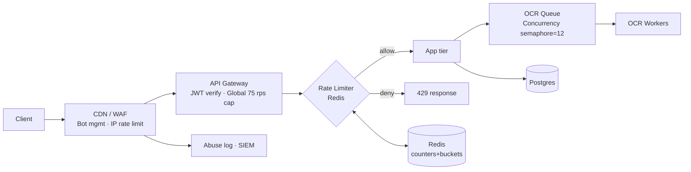

# Rate Limits & Abuse Protection — Invoice OCR (Production)

# Rate Limits & Abuse Protection

**Service:** Invoice OCR — Production  
**Stated load:** 5,000 users · peak 50 req/s · budget ≤ $500/mo  
**Scope:** Global limits, per-endpoint classes, tiering, algorithms, 429 contract, quota accounting, bot/abuse defense.

---

## 1. Sizing the Limits (Arithmetic)

Stated peak = **50 req/s** across all users. We do not oversubscribe beyond stated capacity; per-tier limits must sum ≤ headroom.

| Derivation | Formula | Value |
|---|---|---|
| Stated peak | given | 50 req/s |
| Concurrent active users [Assumption: 5% of 5,000 active in peak minute] | 5000 × 0.05 | 250 users |
| Avg req/s per active user | 50 / 250 | 0.2 req/s |
| Steady per-user allowance (×3 headroom) | 0.2 × 3 | 0.6 req/s ≈ **60/min** |
| Burst budget per user [Assumption: 10s burst window] | 0.6 × 10 × 2 | ~12 tokens |
| Global safety cap (protect origin) | 50 × 1.5 | **75 req/s hard cap** |

**[Assumption]** OCR is the expensive endpoint; UI/list endpoints dominate request count 8:1.

---

## 2. Endpoint Limit Classes

| Class | Endpoints | Cost profile | Enforcement point |
|---|---|---|---|
| **A — Auth** | `/auth/login`, `/auth/register`, `/auth/reset` | Cheap, abuse-prone | Edge (CDN) + API |
| **B — Read** | `GET /invoices`, `GET /invoices/:id`, `GET /me` | Cheap, cacheable | CDN + API |
| **C — Write (light)** | `POST /invoices/metadata`, `PATCH /invoices/:id` | Medium | API |
| **D — OCR (heavy)** | `POST /invoices/ocr`, `POST /uploads` | Expensive (CPU + queue) | API + queue admission |
| **E — Export/Report** | `GET /reports/*`, `POST /export` | Heavy read | API |
| **F — Webhook/Public** | `POST /webhooks/*` | Untrusted origin | Edge WAF + API |

---

## 3. Tier × Limit × Window × Burst

| Tier | Class A (auth) | Class B (read) | Class C (write) | Class D (OCR) | Class E (export) | Daily OCR quota |
|---|---|---|---|---|---|---|
| **Anonymous / IP** | 5 / 5 min, burst 2 | 30 / min, burst 10 | — | — | — | 0 |
| **Free** | 10 / 5 min, burst 3 | 60 / min, burst 20 | 20 / min, burst 5 | 5 / min, burst 2 | 2 / hr, burst 1 | 20 / day |
| **Pro** | 20 / 5 min, burst 5 | 240 / min, burst 60 | 120 / min, burst 30 | 30 / min, burst 10 | 20 / hr, burst 5 | 500 / day |
| **Business** | 30 / 5 min, burst 8 | 600 / min, burst 150 | 300 / min, burst 60 | 90 / min, burst 20 | 100 / hr, burst 20 | 5,000 / day |
| **Internal / Service** | n/a | 2,000 / min | 1,000 / min | 300 / min, burst 60 | 500 / hr | unbounded (SLO-gated) |

**Global caps (all tiers combined):** 75 req/s hard, 40 req/s soft (alarm). OCR queue admission cap: **12 concurrent jobs** [Assumption: 1 vCPU per job, 12 vCPU pool].

---

## 4. Algorithm Choice

| Class | Algorithm | Justification |
|---|---|---|
| A (auth) | **Sliding window log** (Redis ZSET) | Small volumes; precise fairness against credential stuffing; time-bucketed leakage matters. |
| B, C, E | **Token bucket** (Redis `INCR`+`EXPIRE` + refill) | Cheap, allows short bursts, smooth steady rate — matches interactive UX. |
| D (OCR) | **Token bucket + concurrency semaphore** | Rate limits *submissions*; semaphore bounds *in-flight* jobs so a burst cannot starve workers. |
| F (webhook) | **Leaky bucket** at edge | Absorbs spikes from noisy callers without dropping legitimate traffic. |
| Global | **Fixed-window counter** (1 s) at edge | O(1) hard ceiling; failsafe if per-user layer misbehaves. |

**Storage:** Redis (Upstash free tier or 256 MB managed, ~$15/mo) — keys `rl:{tier}:{userId}:{class}` with TTL = window.

---

## 5. Topology



---

## 6. 429 Response Contract

**Status:** `429 Too Many Requests`  
**Headers (always on 2xx and 429):**

| Header | Example | Meaning |
|---|---|---|
| `RateLimit-Limit` | `60` | Ceiling for current window |
| `RateLimit-Remaining` | `0` | Tokens left |
| `RateLimit-Reset` | `27` | Seconds until refill |
| `RateLimit-Policy` | `60;w=60;burst=20;class=B` | Human-parseable policy |
| `Retry-After` | `27` | RFC 6585 mandated on 429 |
| `X-RateLimit-Scope` | `user` \| `ip` \| `global` | Which bucket tripped |
| `X-Request-Id` | `01H…` | For support correlation |

**Body (application/problem+json, RFC 7807):**
```json
{
  "type": "https://api.invoiceocr.example/errors/rate-limited",
  "title": "Rate limit exceeded",
  "status": 429,
  "detail": "You have exceeded the OCR submission limit for the Free tier.",
  "scope": "user",
  "class": "D",
  "limit": 5,
  "window": "60s",
  "remaining": 0,
  "resetSeconds": 27,
  "upgradeUrl": "https://invoiceocr.example/pricing",
  "requestId": "01H8ZK…"
}
```

---

## 7. Quota Accounting

| Concern | Design |
|---|---|
| **Identity** | Prefer authenticated `sub` claim; fall back to `IP + UA hash` for anonymous. |
| **Multi-key** | Every request charges *all* applicable buckets: `user`, `tier`, `ip`, `global`. Deny if **any** exhausted. |
| **Atomicity** | Redis Lua script: read → check → decrement → set TTL in one round-trip. |
| **Failure mode** | Redis unreachable → **fail-open** for Classes B/C (with global edge cap still enforced); **fail-closed** for D (OCR) and A (auth). |
| **Clock** | Server-side monotonic; ignore client time. |
| **Refunds** | On 5xx from downstream, refund the token (Class D only) via async compensator. |
| **Daily quotas** | Separate counter `quota:{userId}:{yyyymmdd}` with 26 h TTL; resets at user's tz midnight [Assumption: UTC to keep it simple]. |
| **Upgrades** | Tier change invalidates cached limits via pub/sub `tier:changed`. |

---

## 8. Abuse & Bot Protection

| Threat | Control | Layer |
|---|---|---|
| Credential stuffing | Class A sliding window + **exponential backoff** (2ⁿ up to 15 min) after 3 fails; CAPTCHA after 5 | Edge + API |
| Account enumeration | Uniform response times + generic error on login/reset | API |
| Scraping | Bot score from CDN (Cloudflare Turnstile / equivalent); challenge score > 30 | Edge |
| Free-tier OCR abuse | Daily quota + **payment-verified email** required for > 5 OCRs/day | API |
| Distributed low-and-slow | `/24` IPv4 aggregate limit: 300 req/min per subnet | Edge |
| Token replay | JWT `jti` blacklist for 15 min post-logout | API |
| Upload bombs | `Content-Length` cap 15 MB; reject > 25 pages pre-OCR | API |
| Zip-bomb / malformed PDF | Sandboxed parser with 30 s CPU + 512 MB RAM cgroup | Worker |
| Webhook floods | HMAC signature required; leaky bucket 10/s per source | Edge |
| Repeat 429 offender | Auto-escalate: 3 windows tripped in 1 h → 1 h shadow-ban; log to SIEM | API |

**Bot signals fed into score:** missing `Accept-Language`, headless UA, TLS JA3 hash mismatch, mouse-move absence on submit, ASN reputation.

---

## 9. Observability of the Limiter

| Metric | Alert threshold |
|---|---|
| `ratelimit_denied_total{class,tier}` | > 5% of requests for 10 min |
| `ratelimit_redis_latency_p99` | > 5 ms |
| `ratelimit_fail_open_total` | any (page on-call) |
| `abuse_ip_shadowban_total` | trend anomaly |
| `ocr_semaphore_saturation` | > 90% for 5 min |

---

## 10. Assumptions Log

1. [Assumption] 5% of 5,000 users active in peak minute.
2. [Assumption] OCR jobs average 1 vCPU · 8 s; 12-worker pool fits budget.
3. [Assumption] UI/list traffic outweighs OCR 8:1.
4. [Assumption] Redis (Upstash) sufficient at ~$15/mo within $500 ceiling.
5. [Assumption] Quota day boundary = UTC midnight.
6. [Assumption] Cloudflare-class CDN with bot management available (free tier acceptable).