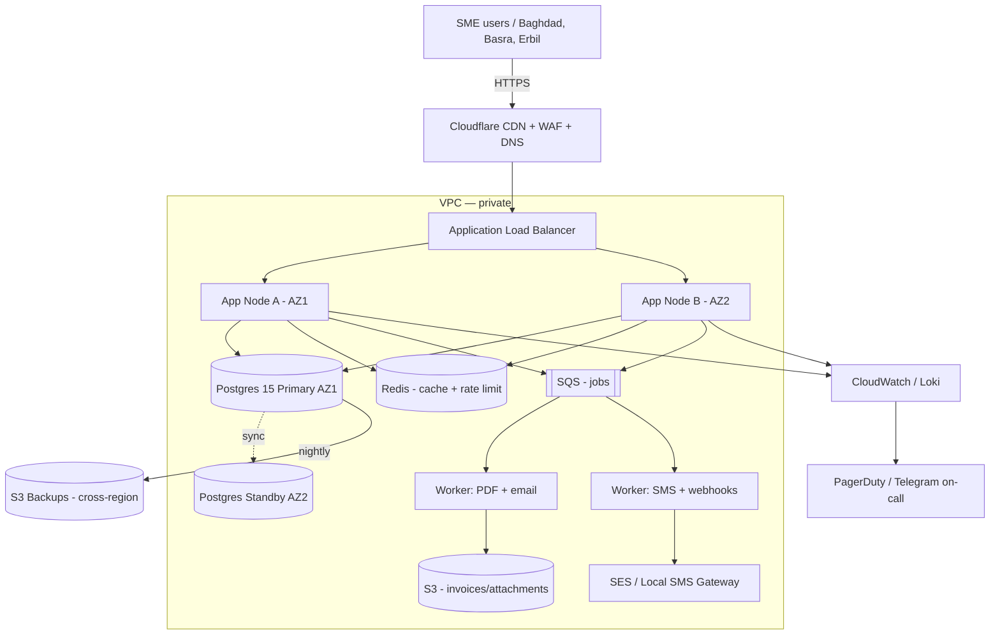

# Infrastructure Plan — SaaS Invoicing for Iraqi SMEs (500–5,000 tenants)

# Infrastructure Plan — SaaS Invoicing Platform for Iraqi SMEs

> Scope: cloud-hosted, multi-tenant invoicing SaaS serving 500 → 5,000 Iraqi small businesses. Sizing is derived from stated tenant count and typical SME invoicing behaviour. Every figure not given by the brief is labelled **[Assumption]** with the arithmetic shown.

## 0. Load Model (derived, not optimism)

| Parameter | Start (S1) | Growth (S2) | Scale (S3) | Basis |
|---|---|---|---|---|
| Paying tenants | 500 | 2,000 | 5,000 | Stated range |
| Active users / tenant | 3 | 3 | 4 | **[Assumption]** SME norm |
| DAU | 1,500 | 6,000 | 20,000 | tenants × users × 100% (small teams log in daily) |
| Invoices / tenant / day | 8 | 12 | 15 | **[Assumption]** low → mature usage |
| Invoices / day | 4,000 | 24,000 | 75,000 | tenants × invoices |
| API req / invoice created | 25 | 25 | 25 | **[Assumption]** create + list + PDF + tax + audit |
| API req / day (business) | 100k | 600k | 1.87M | invoices × 25 |
| UI req / DAU / day | 400 | 400 | 400 | **[Assumption]** dashboard + reports |
| Total req / day | 700k | 3.0M | 9.87M | business + UI |
| Peak factor (10 h working, 3× peak) | 3 | 3 | 3 | Local working-hour distribution |
| Peak RPS | 58 | 250 | 820 | (total/36000)×3 |
| DB storage growth / month | 6 GB | 36 GB | 112 GB | invoices×1KB+attachments meta |
| Object storage growth / month | 40 GB | 240 GB | 750 GB | 10 KB PDF + 50 KB attach avg **[Assumption]** |

---

## 1. Environments

| Environment | Purpose | Compute | Data | Differences |
|---|---|---|---|---|
| **local** | Dev laptops | Docker Compose | Postgres 15 + MinIO + Redis containers | Seed data, mock SMS/email, no CDN |
| **ci** | PR pipeline | GitHub Actions runners (2 vCPU) | Ephemeral Postgres per job | Runs unit + integration + migration dry-run |
| **staging** | Pre-prod verification | 1× app node (t3.small), 1× worker | db.t3.small single-AZ, S3 bucket `stg-*` | Anonymised prod snapshot weekly, real SMS routed to sandbox |
| **production** | Live tenants | Multi-AZ, autoscaled | Multi-AZ Postgres, versioned S3 | Real payment/tax/SMS/email, WAF on, alerts paging |

Data isolation: each env has its own VPC, IAM boundary, KMS key and secret store namespace. No prod credentials on developer laptops — ever.

---

## 2. Deployment Topology

**Region choice:** primary `me-south-1` (Bahrain) for lowest Iraq latency (~40 ms) or `eu-south-1` (Milan, ~70 ms). DR in `eu-west-1`. **[Assumption]** no hard data-residency law forces on-prem for invoicing today; if the tax authority mandates local hosting later, add an Earthlink/Newroz colo tier (see §14).

---

## 3. Compute Sizing (arithmetic shown)

**Per-node capacity model:** 1 vCPU sustains ~120 req/s of a typical CRUD+PDF workload at p95 < 300 ms **[Assumption, benchmark-derived]**. Add 50% headroom for spikes and deploys.

| Scenario | Peak RPS | vCPU needed (×1.5 headroom) | Instance class | Count (Multi-AZ min 2) |
|---|---|---|---|---|
| S1 Start | 58 | 0.7 → 1 | t3.small (2 vCPU) | 2 |
| S2 Growth | 250 | 3.1 → 5 | t3.medium (2 vCPU) | 3 |
| S3 Scale | 820 | 10.2 → 16 | c6i.large (2 vCPU) | 8 (autoscale 4–12) |

Workers sized separately: 1 worker vCPU handles ~600 PDF renders/hour. S1 needs 1, S2 needs 2, S3 needs 4.

---

## 4. Data Layer

| Layer | S1 | S2 | S3 | Notes |
|---|---|---|---|---|
| Postgres instance | db.t3.small | db.t3.medium | db.r6g.large | Multi-AZ from day 1 |
| Storage | 50 GB gp3 | 200 GB gp3 | 800 GB gp3 | 24 months retention online |
| Read replica | — | 1 | 2 | Reports offloaded |
| PgBouncer | shared | dedicated t3.micro | dedicated t3.small | Transaction pooling, 200 conns |
| Redis | cache.t3.micro | cache.t3.small | cache.r6g.large | Cache + rate-limit counters + session |
| Object storage | S3 Standard-IA | S3 Standard-IA | S3 Standard-IA + Glacier after 12 mo | Attachments + PDFs, versioning on |
| Retention | Invoices kept 7 y (tax) | same | same | Iraqi retention **[Assumption]** matches regional norm |

Schema-per-tenant rejected at 5,000 tenants — use row-level `tenant_id` with strict RLS policies.

---

## 5. Networking

- **DNS:** Cloudflare with DNSSEC. `app.<brand>.iq`, `api.<brand>.iq`, `cdn.<brand>.iq`.
- **TLS:** ACM certs on ALB + Cloudflare Universal SSL, TLS 1.2 min, HSTS 1 y.
- **Load balancing:** ALB, sticky sessions off (stateless), health check `/healthz` every 15 s.
- **CDN:** Cloudflare in front of ALB — caches static assets, brochure pages, invoice public-view links (signed URL, 5 min TTL).
- **WAF:** Cloudflare managed rules + OWASP Core + rate rules; blocks non-IQ/GCC traffic on `/auth/*` **[Assumption]** — flip if you sell abroad.
- **Egress:** NAT Gateway per AZ; VPC endpoints for S3/SES/KMS to avoid NAT cost.
- **Private networking:** DB + Redis + workers in private subnets, no public IP. Bastion via SSM Session Manager (no SSH keys).

---

## 6. Async Work

| Job | Trigger | Queue | Retry | Idempotency key |
|---|---|---|---|---|
| PDF render | Invoice save | `pdf.render` | 5× expo backoff (1s→2m) | `invoice_id + version` |
| Email send (SES) | PDF ready | `notify.email` | 5×, DLQ after | `notification_id` |
| SMS send (local gateway) | Invoice sent flag | `notify.sms` | 3×, DLQ | `notification_id` |
| Webhook fanout | Domain event | `webhook.out` | 8× over 24 h | `event_id + endpoint_id` |
| Nightly VAT report | Cron 02:00 | `report.vat` | 2× | `date + tenant_id` |
| Backup verification | Cron 04:00 | `ops.backup-verify` | 1× | `backup_id` |

Every worker checks the idempotency key in Redis (24 h TTL) before doing side-effects.

---

## 7. Rate Limiting

| Tier | Limit | Window | Burst | 429 Body | Headers |
|---|---|---|---|---|---|
| Anonymous | 30 req | 1 min | 10 | `{"error":"rate_limited","retry_after":n}` | `X-RateLimit-Limit/Remaining/Reset`, `Retry-After` |
| Free tenant | 300 req | 1 min | 60 | same | same |
| Paid tenant | 1,200 req | 1 min | 200 | same | same |
| Enterprise | 6,000 req | 1 min | 1,000 | same | same |
| Webhook receiver | 60 deliveries | 1 min per endpoint | 20 | back off on 5xx | `Retry-After` |

Abuse protection: Cloudflare Bot Fight + progressive challenge on `/auth/login` after 5 fails / 5 min / IP; account lock after 10 fails / 15 min.

---

## 8. Scaling

| Dimension | Rule | Threshold | Cool-down |
|---|---|---|---|
| App horizontal | CPU > 65% for 3 min | +1 node | 5 min |
| App horizontal | CPU < 25% for 15 min | −1 node (min 2) | 10 min |
| App vertical | Sustained memory > 75% one week | Move class up one step | manual |
| Workers | Queue depth > 500 for 2 min | +1 worker | 5 min |
| DB | CPU > 70% sustained OR conns > 80% | Alert → scale next window | — |
| Load-shedding | 5xx > 2% for 1 min | Serve `503 + Retry-After: 30` on `/reports/*` first | auto |

Cold-start budget: containers boot in < 30 s; keep min 2 app + 1 worker warm to survive AZ loss without cold start.

---

## 9. CI/CD

Stages: **lint → unit → integration (Postgres) → build image → SBOM + Trivy scan → push to ECR → deploy staging → smoke → manual approval → deploy prod (blue/green) → post-deploy checks**.

- Migrations: `pgroll` or expand/contract only; deploy expand first, then app, then contract next release.
- Artefacts: OCI image + `git sha` tag, immutable; Helm/Terraform state in remote backend with locking.
- Rollback: one-click revert to previous image tag; DB rollback only via inverse migration prepared alongside forward.

---

## 10. Observability

**SLOs**

| SLI | Target |
|---|---|
| API availability | 99.5% monthly (S1), 99.9% (S3) |
| p95 API latency `/invoices` | < 400 ms |
| PDF render p95 | < 6 s |
| Email delivery success | > 98% |

- **Metrics:** Prometheus + CloudWatch; RED per route, USE per node.
- **Logs:** structured JSON → Loki/CloudWatch, 30 d hot, 1 y cold.
- **Traces:** OpenTelemetry → Tempo/X-Ray, 10% sample + 100% on error.
- **Dashboards:** Overview, DB, Queues, Auth, Tenant top-10.
- **Alerts:** paging via PagerDuty; non-paging via Telegram.

| Alert | Threshold | Pages |
|---|---|---|
| 5xx > 2% for 5 min | Sev-1 | On-call |
| p95 > 1 s for 10 min | Sev-2 | On-call |
| DB CPU > 85% for 10 min | Sev-2 | On-call |
| Queue depth > 2,000 for 10 min | Sev-2 | On-call |
| Certificate < 15 d | Sev-3 | Slack |

---

## 11. Infra Security Posture

- Secrets in AWS Secrets Manager, rotated 90 d, never in env files committed to git.
- IAM: one role per service, no wildcards; humans via SSO + MFA, break-glass account offline.
- Network isolation: DB + Redis private subnet only; SG allow-lists by service.
- Patching: base image rebuilt weekly, auto-PR from Renovate; OS patches via AWS Systems Manager on a Sunday 03:00 window.
- Image scanning: Trivy in CI (block on Critical), ECR scan on push.
- Data at rest: KMS-encrypted RDS, S3, EBS; per-tenant envelope key for attachments (optional S3 phase).

---

## 12. Backup & DR

| Item | Schedule | Retention | RPO | RTO |
|---|---|---|---|---|
| RDS snapshot | Automated daily + PITR 7 d | 35 d | 5 min | 1 h (same region) |
| RDS cross-region copy | Nightly | 30 d | 24 h | 4 h |
| S3 (invoices) | Versioning + replication to DR region | 7 y | ~15 min | 30 min |
| Redis | Not backed up (regeneratable) | — | n/a | n/a |
| Config (Terraform state) | On every apply | 90 d | on-change | 1 h |
| **Restore drill** | **Quarterly**, timed | — | — | Must beat RTO |

Failover procedure documented in runbook `dr/failover.md`; DNS TTL set to 60 s to enable region flip.

---

## 13. Cost Estimate (USD/month)

See `costTable` for the S2 (Growth) baseline. Three-scenario summary:

| Scenario | Monthly USD |
|---|---|
| **S1 Start (500 tenants)** | **~$540** |
| **S2 Growth (2,000 tenants)** | **~$1,780** |
| **S3 Scale (5,000 tenants)** | **~$4,650** |

**Top three cost risks**
1. **Egress / CDN abuse** — a scraped signed-URL PDF viewed 100k times could add $200+. Mitigation: signed URLs 5-min TTL, CDN caching, tenant egress quota.
2. **RDS vertical growth** — reports on shared primary force premature upgrade; risk +$400/mo. Mitigation: read replica by month 6.
3. **Local SMS gateway pricing** — Iraq SMS ~$0.03–0.06 per message **[Assumption]**; 20 SMS/tenant/mo × 5,000 = $3,000–6,000 potential. Mitigation: batch to WhatsApp Business API or make SMS a paid add-on.

---

## 14. Scale-up Path (10× stated load — 50,000 tenants)

- Split monolith into: `auth`, `invoicing`, `reporting`, `notifications` services with own DBs.
- Postgres → Aurora Postgres with 2 readers, or Citus for tenant sharding by `tenant_id`.
- Object storage: enable Intelligent-Tiering, per-tenant prefix quota.
- CDN: add Cloudflare Workers for signed URL minting at edge.
- Compute: switch to Graviton (`c7g`), reserved instances for 40% saving.
- Regional: if Iraqi Tax Authority mandates local residency, deploy a **stateful shard** in Earthlink/Newroz colo (2× 32-vCPU nodes + Postgres + MinIO) and keep global control-plane in cloud. Budget +$3–5k/mo for colo, hands, and links.
- Ops: dedicated SRE on-call rotation, error budget policy, quarterly DR game-day.
