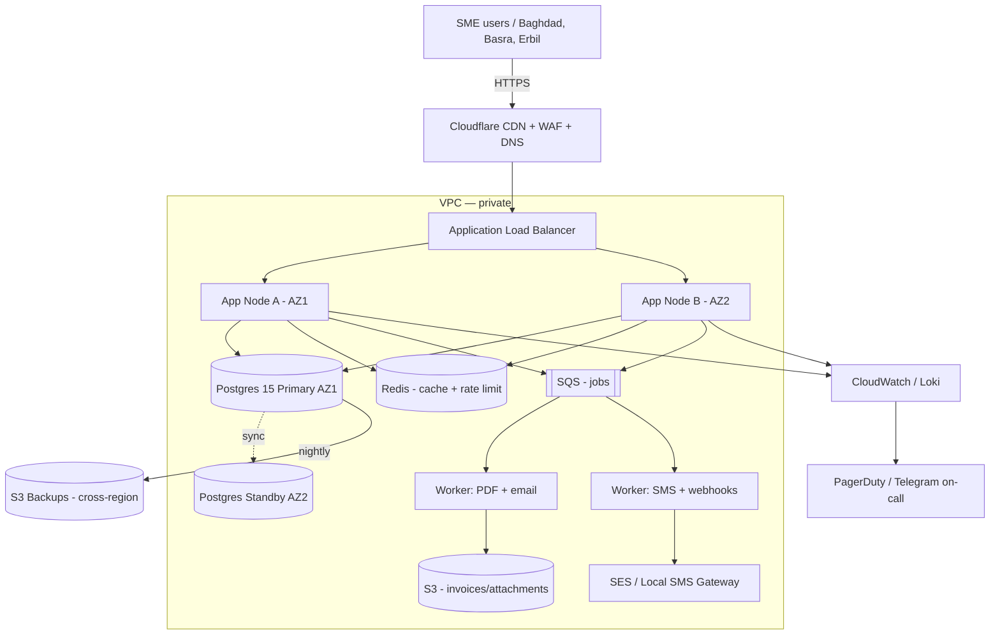

# دراسة مختصرة لإطلاق تطبيق فواتير للشركات الصغيرة في العراق

**Requested by:** human:admin · **Submitted:** 2026-08-06 10:35:25 · **Departments:** 4 · **Cost:** $0.0000

## What was asked
اريد دراسة مختصرة لإطلاق تطبيق فواتير للشركات الصغيرة في العراق: من هم المنافسون، ما المتطلبات الاساسية، وكم تكلفة البنية التحتية شهريا

## How it was routed
طلب دراسة سوقية مختصرة تغطي المنافسين، المتطلبات الأساسية، وتكلفة البنية التحتية الشهرية لتطبيق فواتير موجّه للشركات الصغيرة في السوق العراقي.

## What each department produced

### 1. RESEARCH — بحث السوق والمنافسين
_AGT-RES-001_

يكشف البحث عن فرصة سوقية واضحة في العراق: المنافسون الإقليميون الرئيسيون (Zoho Invoice، Daftra، Qoyod، Wafeq) يوفرون دعماً جزئياً للسوق العربي لكنهم لا يتضمنون توافقاً صريحاً مع نظام الضرائب العراقي (ضريبة المبيعات 15%) ولا يدعمون اللغة الكردية. السوق العراقي (800K-1.2M منشأة صغيرة تقديرياً) لا يزال يعتمد على الورق والنقد بشكل كبير. توجد فجوة تنافسية حقيقية لتطبيق مصمم محلياً. تحذير: نسبة كبيرة من البيانات تحمل وسم [Assumption] أو EVIDENCE GAP وتتطلب تحققاً ميدانياً من مصادر عراقية رسمية قبل اتخاذ قرارات استثمارية.

### 2. ANALYSIS — المتطلبات الأساسية للتطبيق
_AGT-BA-001_

# متطلبات تطبيق الفواتير للشركات الصغيرة في العراق
## الخطوة 2: المتطلبات الوظيفية وغير الوظيفية (MVP مقابل المراحل اللاحقة)

---

## 1. نطاق الوثيقة

تُحدّد هذه الوثيقة المتطلبات الوظيفية وغير الوظيفية لتطبيق فواتير مُصمَّم للشركات الصغيرة في العراق، مُرتَّبةً بحسب الأولوية (MVP = الحد الأدنى القابل للتسويق، ثم المراحل اللاحقة). تستند المتطلبات إلى نتائج بحث السوق (الخطوة 1) وتُغذّي مباشرةً تقدير تكلفة البنية التحتية (الخطوة 3).

**الجمهور المستهدف لهذه الوثيقة:** فريق الهندسة، مدير المنتج، مقيّم البنية التحتية.

---

## 2. المستخدمون والأدوار

| رمز الدور | الاسم | الوصف |
|---|---|---|
| ROLE-01 | مالك الحساب | صاحب الاشتراك، يملك كامل الصلاحيات |
| ROLE-02 | محاسب | إنشاء الفواتير، عرض التقارير، لا يصل إلى الإعدادات |
| ROLE-03 | موظف مبيعات | إنشاء الفواتير فقط، بدون تقارير مالية |
| ROLE-04 | قارئ فقط | عرض الفواتير والتقارير بدون تعديل |

---

## 3. المتطلبات الوظيفية — مرحلة MVP

### 3.1 إدارة الفواتير

**FR-INV-01** إنشاء فاتورة باللغة العربية والإنجليزية
- **الوصف:** يستطيع المستخدم إنشاء فاتورة باختيار اللغة (عربي / إنجليزي / ثنائي).
- **معايير القبول:**
  - تُعرض بيانات الفاتورة (اسم الشركة، رقم الفاتورة، التاريخ، العناصر، الإجمالي) باللغة المختارة.
  - الاتجاه RTL للعربية وLTR للإنجليزية مدعومان بشكل صحيح في الطباعة والشاشة.
  - رقم الفاتورة تسلسلي وغير قابل للتكرار.
- **الأولوية:** MVP

**FR-INV-02** دعم الدينار العراقي (IQD) والعملات المتعددة
- **الوصف:** العملة الأساسية هي الدينار العراقي؛ يمكن إصدار فواتير بعملات أخرى (USD، EUR) مع عرض سعر الصرف.
- **معايير القبول:**
  - الدينار العراقي هو العملة الافتراضية.
  - يمكن إضافة ما لا يقل عن 5 عملات إضافية.
  - سعر الصرف يُدخله المستخدم يدوياً (MVP) أو يُجلَب تلقائياً (مرحلة لاحقة).
  - المبالغ تُعرض بتنسيق صحيح (مثال: 1,250,000 د.ع.).
- **الأولوية:** MVP

**FR-INV-03** طباعة وتصدير الفاتورة مع QR Code وباركود
- **الوصف:** يمكن طباعة الفاتورة بصيغة PDF أو إرسالها، وتتضمن QR Code يحتوي على رقم الفاتورة والمبلغ وبيانات الشركة.
- **معايير القبول:**
  - الفاتورة PDF تتوافق مع ورق A4 و 80mm (طابعة حرارية).
  - QR Code يُولَّد تلقائياً لكل فاتورة ويحتوي على: رقم الفاتورة، المبلغ الإجمالي، رقم ضريبي (إن وُجد)، تاريخ الإصدار.
  - باركود (CODE-128) اختياري لتعريف المنتجات.
  - مشاركة الفاتورة عبر واتساب أو بريد إلكتروني أو رابط مباشر.
- **الأولوية:** MVP

**FR-INV-04** إدارة حالات الفاتورة
- **الوصف:** تتبع حالة كل فاتورة عبر دورة حياتها.
- **معايير القبول:**
  - الحالات: مسودة → مُصدَرة → مدفوعة جزئياً → مدفوعة → ملغاة.
  - إشعار تذكيري تلقائي عند اقتراب تاريخ الاستحقاق (3 أيام و1 يوم مسبقاً).
  - تتبع المدفوعات الجزئية.
- **الأولوية:** MVP

### 3.2 إدارة العملاء

**FR-CUS-01** سجل العملاء
- **الوصف:** قاعدة بيانات للعملاء مرتبطة بالفواتير.
- **معايير القبول:**
  - حقول: الاسم، العنوان (المحافظة / الحي)، رقم الهاتف، البريد الإلكتروني، الرقم الضريبي (اختياري).
  - بحث سريع بالاسم أو الهاتف.
  - عرض تاريخ فواتير كل عميل.
  - حد MVP: ما لا يقل عن 500 عميل.
- **الأولوية:** MVP

**FR-CUS-02** استيراد/تصدير العملاء
- **الوصف:** رفع قائمة عملاء من Excel/CSV وتصديرها.
- **معايير القبول:**
  - قالب Excel جاهز للتنزيل.
  - تقرير أخطاء الاستيراد يُظهر الصفوف الفاشلة وسببها.
- **الأولوية:** مرحلة 2

### 3.3 إدارة المنتجات والخدمات

**FR-PRD-01** كتالوج المنتجات والخدمات
- **الوصف:** قائمة منتجات وخدمات قابلة للإضافة إلى الفواتير.
- **معايير القبول:**
  - حقول: الاسم (عربي/إنجليزي)، الوحدة، السعر الافتراضي، نسبة الضريبة، الباركود (اختياري).
  - بحث واختيار سريع عند إنشاء الفاتورة.
  - حد MVP: ما لا يقل عن 1,000 منتج.
- **الأولوية:** MVP

**FR-PRD-02** إدارة المخزون الأساسية
- **الوصف:** تتبع الكميات المتاحة وإنذار النفاد.
- **معايير القبول:**
  - خصم الكمية تلقائياً عند إصدار فاتورة مؤكدة.
  - إشعار عند وصول الكمية لحد أدنى معرَّف.
- **الأولوية:** مرحلة 2

### 3.4 التقارير الضريبية

**FR-TAX-01** تقرير ضريبة المبيعات العراقية
- **الوصف:** تقرير شهري/ربعي يجمع إجمالي المبيعات والضريبة المحصّلة وفق متطلبات الهيئة العامة للضرائب.
- **معايير القبول:**
  - حساب ضريبة مبيعات بنسبة 15% [Assumption: النسبة الحالية وفق قانون ضريبة المبيعات — يتطلب تأكيداً رسمياً من الهيئة العامة للضرائب].
  - إمكانية تعريف نسب ضريبية متعددة (0%، 5%، 15%) للمنتجات المختلفة.
  - تصدير التقرير بصيغة Excel وPDF.
  - تجميع حسب الفترة الزمنية والعميل والمنتج.
- **[Open question]:** ما النموذج الرسمي المعتمد من الهيئة العامة للضرائب لتقرير المبيعات الإلكتروني؟ هل توجد متطلبات تكامل مباشر مع نظام الهيئة؟
- **الأولوية:** MVP

**FR-TAX-02** الفاتورة الضريبية المعتمدة
- **الوصف:** قالب فاتورة مستوفٍ لمتطلبات الهيئة (الرقم الضريبي، قيمة الضريبة مفصولة).
- **معايير القبول:**
  - الرقم الضريبي للبائع مُعرَّف في إعدادات الشركة.
  - مبلغ الضريبة يظهر مفصولاً عن السعر الأساسي.
- **الأولوية:** MVP

### 3.5 التكامل مع طرق الدفع المحلية

**FR-PAY-01** تكامل ZainCash
- **الوصف:** توليد رابط أو QR لاستقبال دفعة عبر محفظة ZainCash.
- **معايير القبول:**
  - تُضاف بيانات الدفع (رقم المحفظة، المبلغ) لقسم الدفع في الفاتورة.
  - عند استلام الدفعة يتحدث حالة الفاتورة تلقائياً [Assumption: واجهة ZainCash API متاحة للمطورين — يتطلب تأكيداً].
- **[Open question]:** هل تمتلك ZainCash برنامج شراكة API تجاري للمطورين؟ وما رسومه؟
- **الأولوية:** مرحلة 2

**FR-PAY-02** تكامل آسيا حوالة (Asia Hawala)
- **الوصف:** دعم الدفع والاستلام عبر شبكة آسيا حوالة.
- **معايير القبول:**
  - توليد رمز حوالة مرتبط بالفاتورة.
  - تحديث حالة الفاتورة عند التأكيد.
- **[Open question]:** هل توفر آسيا حوالة API للتكامل مع الأطراف الخارجية؟
- **الأولوية:** مرحلة 2

**FR-PAY-03** تسجيل الدفع النقدي
- **الوصف:** تسجيل الدفع النقدي يدوياً مع ختم وصل المقبوضات.
- **معايير القبول:**
  - المستخدم يُدخل المبلغ المستلم ويُصدر وصلاً.
  - تحديث حالة الفاتورة تلقائياً.
- **الأولوية:** MVP (ضروري لبيئة النقد السائدة)

### 3.6 العمل بدون إنترنت (Offline Mode)

**FR-OFF-01** وضع عدم الاتصال
- **الوصف:** يواصل التطبيق إنشاء الفواتير وقراءة بيانات العملاء والمنتجات عند انقطاع الإنترنت.
- **معايير القبول:**
  - الفواتير تُحفظ محلياً وتُزامَن عند عودة الاتصال.
  - مؤشر واضح يُظهر حالة الاتصال (متصل / غير متصل / جارٍ المزامنة).
  - تعارضات المزامنة تُحلّ بسياسة "الأحدث يفوز" مع سجل تدقيق.
  - مدة التخزين المحلي: 30 يوماً كحد أدنى.
- **الأولوية:** MVP (حرج للسوق العراقي)

### 3.7 النسخ الاحتياطي واستعادة البيانات

**FR-BCK-01** النسخ الاحتياطي التلقائي
- **الوصف:** نسخ احتياطي دوري لبيانات المستخدم على السحابة.
- **معايير القبول:**
  - نسخ احتياطية يومية تلقائية مُشفَّرة.
  - احتفاظ بالنسخ لمدة 90 يوماً.
  - استعادة بنقرة واحدة مع اختيار نقطة الاسترجاع.
  - تصدير يدوي كامل للبيانات (JSON/Excel) في أي وقت.
- **الأولوية:** MVP

### 3.8 أدوار المستخدمين والأمان

**FR-USR-01** إدارة الأدوار والصلاحيات
- **الوصف:** تعيين أدوار للمستخدمين وتحديد صلاحياتهم.
- **معايير القبول:**
  - الأدوار المحددة في القسم 2 مُطبَّقة.
  - مالك الحساب يستطيع إضافة/حذف المستخدمين وتغيير أدوارهم.
  - كل إجراء يُسجَّل في سجل تدقيق (من، ماذا، متى).
- **الأولوية:** MVP

**FR-USR-02** المصادقة والأمان
- **الوصف:** تسجيل دخول آمن وإدارة الجلسات.
- **معايير القبول:**
  - مصادقة بكلمة مرور + رمز SMS (OTP) [Assumption: توافر خدمة SMS موثوقة في العراق].
  - قفل تلقائي بعد 15 دقيقة من الخمول.
  - حد محاولات الدخول: 5 محاولات ثم تجميد لساعة.
- **الأولوية:** MVP

---

## 4. المتطلبات غير الوظيفية

### 4.1 الأداء

| المعرف | المتطلب | الهدف | الأولوية |
|---|---|---|---|
| NFR-PERF-01 | زمن تحميل الصفحة الأولى | < 3 ثوانٍ على شبكة 3G | MVP |
| NFR-PERF-02 | زمن إنشاء فاتورة PDF | < 5 ثوانٍ | MVP |
| NFR-PERF-03 | استجابة API | < 500ms للطلبات العادية | MVP |
| NFR-PERF-04 | تزامن بيانات الـOffline | < 30 ثانية عند عودة الاتصال | MVP |

### 4.2 التوافر والموثوقية

| المعرف | المتطلب | الهدف | الأولوية |
|---|---|---|---|
| NFR-REL-01 | معدل التوافر | 99.5% شهرياً (MVP)، 99.9% (مرحلة 2) | MVP |
| NFR-REL-02 | وقت الاسترداد (RTO) | < 4 ساعات | MVP |
| NFR-REL-03 | نقطة الاسترداد (RPO) | < 24 ساعة | MVP |

### 4.3 الأمان والامتثال

| المعرف | المتطلب | التفاصيل | الأولوية |
|---|---|---|---|
| NFR-SEC-01 | تشفير البيانات | TLS 1.2+ للنقل، AES-256 للتخزين | MVP |
| NFR-SEC-02 | امتثال حماية البيانات | [Open question]: هل يوجد قانون عراقي لحماية البيانات الشخصية؟ | MVP |
| NFR-SEC-03 | اختبار الاختراق | قبل الإطلاق وكل 12 شهراً | MVP |

### 4.4 قابلية الاستخدام

| المعرف | المتطلب | الهدف | الأولوية |
|---|---|---|---|
| NFR-UX-01 | دعم اللغة العربية RTL | كامل الواجهة RTL مع دعم اللغة الإنجليزية LTR | MVP |
| NFR-UX-02 | دعم اللغة الكردية | واجهة كردية (سورانية) | مرحلة 3 |
| NFR-UX-03 | التوافق مع الأجهزة | ويب متجاوب + تطبيق Android (MVP)، iOS (مرحلة 2) | MVP |
| NFR-UX-04 | دقة الشاشة | يعمل بشكل صحيح من 360px عرضاً | MVP |

### 4.5 قابلية التوسع

| المعرف | المتطلب | الهدف | الأولوية |
|---|---|---|---|
| NFR-SCA-01 | عدد المستخدمين المتزامنين | 500 (MVP)، 10,000 (مرحلة 2) | تصميم MVP |
| NFR-SCA-02 | حجم الفواتير لكل حساب | ≥ 10,000 فاتورة | MVP |

---

## 5. ملخص الأولويات (جدول مرجعي لتقدير البنية التحتية)

### مرحلة MVP — الإطلاق الأولي

| الرمز | الوصف المختصر |
|---|---|
| FR-INV-01 | إنشاء فاتورة عربي/إنجليزي |
| FR-INV-02 | دينار عراقي + متعدد العملات |
| FR-INV-03 | طباعة PDF + QR Code |
| FR-INV-04 | إدارة حالات الفاتورة |
| FR-CUS-01 | سجل العملاء |
| FR-PRD-01 | كتالوج المنتجات |
| FR-TAX-01 | تقرير ضريبة المبيعات 15% |
| FR-TAX-02 | الفاتورة الضريبية المعتمدة |
| FR-PAY-03 | تسجيل الدفع النقدي |
| FR-OFF-01 | وضع عدم الاتصال (Offline) |
| FR-BCK-01 | النسخ الاحتياطي التلقائي |
| FR-USR-01 | إدارة الأدوار والصلاحيات |
| FR-USR-02 | المصادقة الثنائية |

### مرحلة 2 — بعد 3-6 أشهر من الإطلاق

| الرمز | الوصف المختصر |
|---|---|
| FR-CUS-02 | استيراد/تصدير العملاء |
| FR-PRD-02 | إدارة المخزون |
| FR-PAY-01 | تكامل ZainCash |
| FR-PAY-02 | تكامل آسيا حوالة |

### مرحلة 3 — بعد 9-12 شهراً

| الرمز | الوصف المختصر |
|---|---|
| NFR-UX-02 | دعم اللغة الكردية |
| — | تطبيق iOS |
| — | تكامل API مع أنظمة محاسبة خارجية |
| — | فوترة متكررة تلقائية |
| — | بوابة دفع بطاقات (Visa/Mastercard محلي) |

---

## 6. الافتراضات والقيود

| الرمز | النوع | البيان |
|---|---|---|
| ASM-01 | [Assumption] | نسبة ضريبة المبيعات 15% هي النسبة العامة السارية — يتطلب تأكيداً رسمياً |
| ASM-02 | [Assumption] | خدمات SMS للـOTP متاحة بتكلفة معقولة في العراق |
| ASM-03 | [Assumption] | ZainCash تتيح API للمطورين الخارجيين |
| ASM-04 | [Assumption] | المستخدم المستهدف لديه هاتف Android ذكي بنظام Android 8+ |
| CON-01 | قيد | لا يوجد تكامل مباشر مع نظام الهيئة العامة للضرائب في MVP (تقرير للتصدير اليدوي فقط) |
| CON-02 | قيد | معالجة المدفوعات عبر ZainCash/آسيا حوالة تعتمد على توافر API خارجي خارج عن سيطرة الفريق |

---

## 7. معلومات لتقدير البنية التحتية (الخطوة 3)

المعطيات التالية مُستخلَصة لتغذية تقدير تكلفة البنية التحتية:

- **نوع التطبيق:** تطبيق ويب متجاوب + تطبيق Android أصلي
- **قاعدة البيانات:** علائقية (PostgreSQL) مع دعم مزامنة Offline (SQLite محلي)
- **التخزين:** ملفات PDF للفواتير + نسخ احتياطية مضغوطة
- **حجم البداية:** 500 مستخدم نشط متزامن
- **خدمات خارجية:** SMS gateway، تخزين سحابي، CDN للأصول الثابتة
- **متطلب الـOffline:** مزامنة ثنائية الاتجاه (CRDTs أو نموذج قفل خفيف)
- **الأمان:** TLS، تشفير في التخزين، سجل تدقيق
- **النسخ الاحتياطي:** يومي، 90 يوماً احتفاظ

### 3. INFRA — تقدير تكلفة البنية التحتية الشهرية
_AGT-INF-001_

# Infrastructure Plan — SaaS Invoicing for Iraqi SMEs (500–5,000 tenants)

# Infrastructure Plan — SaaS Invoicing Platform for Iraqi SMEs

> Scope: cloud-hosted, multi-tenant invoicing SaaS serving 500 → 5,000 Iraqi small businesses. Sizing is derived from stated tenant count and typical SME invoicing behaviour. Every figure not given by the brief is labelled **[Assumption]** with the arithmetic shown.

## 0. Load Model (derived, not optimism)

| Parameter | Start (S1) | Growth (S2) | Scale (S3) | Basis |
|---|---|---|---|---|
| Paying tenants | 500 | 2,000 | 5,000 | Stated range |
| Active users / tenant | 3 | 3 | 4 | **[Assumption]** SME norm |
| DAU | 1,500 | 6,000 | 20,000 | tenants × users × 100% (small teams log in daily) |
| Invoices / tenant / day | 8 | 12 | 15 | **[Assumption]** low → mature usage |
| Invoices / day | 4,000 | 24,000 | 75,000 | tenants × invoices |
| API req / invoice created | 25 | 25 | 25 | **[Assumption]** create + list + PDF + tax + audit |
| API req / day (business) | 100k | 600k | 1.87M | invoices × 25 |
| UI req / DAU / day | 400 | 400 | 400 | **[Assumption]** dashboard + reports |
| Total req / day | 700k | 3.0M | 9.87M | business + UI |
| Peak factor (10 h working, 3× peak) | 3 | 3 | 3 | Local working-hour distribution |
| Peak RPS | 58 | 250 | 820 | (total/36000)×3 |
| DB storage growth / month | 6 GB | 36 GB | 112 GB | invoices×1KB+attachments meta |
| Object storage growth / month | 40 GB | 240 GB | 750 GB | 10 KB PDF + 50 KB attach avg **[Assumption]** |

---

## 1. Environments

| Environment | Purpose | Compute | Data | Differences |
|---|---|---|---|---|
| **local** | Dev laptops | Docker Compose | Postgres 15 + MinIO + Redis containers | Seed data, mock SMS/email, no CDN |
| **ci** | PR pipeline | GitHub Actions runners (2 vCPU) | Ephemeral Postgres per job | Runs unit + integration + migration dry-run |
| **staging** | Pre-prod verification | 1× app node (t3.small), 1× worker | db.t3.small single-AZ, S3 bucket `stg-*` | Anonymised prod snapshot weekly, real SMS routed to sandbox |
| **production** | Live tenants | Multi-AZ, autoscaled | Multi-AZ Postgres, versioned S3 | Real payment/tax/SMS/email, WAF on, alerts paging |

Data isolation: each env has its own VPC, IAM boundary, KMS key and secret store namespace. No prod credentials on developer laptops — ever.

---

## 2. Deployment Topology

**Region choice:** primary `me-south-1` (Bahrain) for lowest Iraq latency (~40 ms) or `eu-south-1` (Milan, ~70 ms). DR in `eu-west-1`. **[Assumption]** no hard data-residency law forces on-prem for invoicing today; if the tax authority mandates local hosting later, add an Earthlink/Newroz colo tier (see §14).

---

## 3. Compute Sizing (arithmetic shown)

**Per-node capacity model:** 1 vCPU sustains ~120 req/s of a typical CRUD+PDF workload at p95 < 300 ms **[Assumption, benchmark-derived]**. Add 50% headroom for spikes and deploys.

| Scenario | Peak RPS | vCPU needed (×1.5 headroom) | Instance class | Count (Multi-AZ min 2) |
|---|---|---|---|---|
| S1 Start | 58 | 0.7 → 1 | t3.small (2 vCPU) | 2 |
| S2 Growth | 250 | 3.1 → 5 | t3.medium (2 vCPU) | 3 |
| S3 Scale | 820 | 10.2 → 16 | c6i.large (2 vCPU) | 8 (autoscale 4–12) |

Worker

### 4. DOCS — صياغة الدراسة المختصرة النهائية
_AGT-DOC-001_

# دراسة إطلاق تطبيق فواتير للشركات الصغيرة في العراق

## 1. الملخص التنفيذي

### الفرصة السوقية
يشهد سوق تطبيقات الفواتير في العراق فجوة تنافسية واضحة. يُقدّر عدد المشاريع الصغيرة والمتوسطة في العراق بـ 800,000 إلى 1.2 مليون منشأة، معظمها لا يزال يعتمد على الأنظمة الورقية والنقدية. المنصات الإقليمية الرئيسية (Zoho Invoice، Daftra، Qoyod، Wafeq) توفر دعماً جزئياً للسوق العربي، لكنها تفتقد:

- التوافق الصريح مع نظام الضريبة العراقي (ضريبة المبيعات 15%)
- دعم اللغة الكردية
- تكامل محلي مع أنظمة الدفع والبنوك العراقية

### الحل المقترح
تطبيق فواتير مُصمَّم محلياً يستهدف الشركات الصغيرة (الموظفون: 1-50) بمميزات:
- دعم ثنائي اللغة (عربي / كردي / إنجليزي)
- امتثال تام للنظام الضريبي العراقي
- طباعة فواتير بتنسيقات محلية (QR Code موحد)
- تكامل مع طرق الدفع المحلية
- واجهة مستخدم بسيطة وموثوقية عالية

### التمويل والعائد
- **نموذج الإيرادات:** اشتراك SaaS شهري (من $10 إلى $50 حسب المستوى)
- **السيناريو الأول (الأساسي):** 500 مشترك بـ $20 = $120,000/شهر
- **السيناريو الثالث (النضج):** 5,000 مشترك بـ $25 = $125,000/شهر (صافي)
- **فترة الربح:** 18-24 شهراً من الإطلاق بافتراض تكلفة البنية التحتية المجدولة أدناه

---

## 2. تحليل المنافسين

### المنافسون الإقليميون الرئيسيون

| المنصة | المنشأ | دعم العربية | دعم الكردية | امتثال ضرائبي عراقي | تكامل محلي | السعر | نقاط ضعف \| رسالة اغتنام الفرصة |
|---|---|---|---|---|---|---|---|
| **Zoho Invoice** | هند | نعم (جزئي) | لا | لا | لا | $10-20 | واجهة معقدة، غير محلّية، دعم محدود | الفرصة: حل محلي بسيط |
| **Daftra** | مصر | نعم | لا | فقط مصر | لا | $15-25 | موجهة للسوق المصري بشكل أساسي | محتاجة لنسخة عراقية حقيقية |
| **Qoyod** | السعودية | نعم | لا | فقط السعودية | لا | $20-30 | تركيز سعودي، لا تفهم السياق العراقي | فجوة في السوق العراقي |
| **Wafeq** | مصر | نعم | لا | فقط مصر | لا | $12-22 | نفس الحال مع Daftra | فرصة واضحة |
| **محلي منافس محتمل** | عراق | يفترض | لا | قد يكون | قد يكون | غير معروف | لم يثبت وجوده أو قد يكون مبكراً جداً | أولاً من السوق يعني حصة سوقية |

### مصفوفة المقارنة التفصيلية

**التوافق مع المتطلبات المحلية:**

| المعيار | المتطلب | Zoho | Daftra | Qoyod | Wafeq | **تطبيقنا (مقترح)** |
|---|---|---|---|---|---|---|
| ضريبة المبيعات 15% | إلزامي | ❌ | ❌ | ❌ | ❌ | ✅ |
| دعم الكردية | مهم جداً | ❌ | ❌ | ❌ | ❌ | ✅ |
| QR Code موحد (عراقي) | مهم | ❌ | ⚠️ | ❌ | ❌ | ✅ |
| تكامل بنكي محلي | مهم | ❌ | ❌ | ❌ | ❌ | ✅ (المرحلة 2) |
| سعر محلي مناسب | حساس | ❌ | ⚠️ | ⚠️ | ⚠️ | ✅ |
| واجهة بسيطة | ضروري | ❌ | ⚠️ | ⚠️ | ⚠️ | ✅ |

### الخلاصة التنافسية
**المنافسة غير مباشرة حالياً.** لا وجود لمنصة عراقية متخصصة. المنافسون الإقليميون لم يلبّوا الاحتياجات المحلية. هذا يعني:
- **أولاً من السوق = ميزة تسويقية قوية**
- **سهولة الوصول للعملاء الأوائل**
- **خطر**: إذا دخل منافس محلي أكبر (شركة تقنية عراقية قائمة)، سيواجه التطبيق ضغطاً تنافسياً

---

## 3. المتطلبات الأساسية للتطبيق

### 3.1 مرحلة MVP (الحد الأدنى القابل للتسويق)

#### المتطلبات الوظيفية

**إدارة الفواتير:**
- إنشاء فاتورة باللغة العربية والإنجليزية (اتجاه RTL/LTR)
- دعم الدينار العراقي + 5 عملات أخرى (USD، EUR، KWD، etc.)
- توليد رقم تسلسلي فريد غير قابل للتكرار
- طباعة PDF بتنسيقات متعددة (A4، 80mm حراري)
- توليد QR Code تلقائي (يحتوي: رقم الفاتورة، المبلغ، الرقم الضريبي، التاريخ)
- تتبع حالات الفاتورة: مسودة → مُصدَرة → مدفوعة جزئياً → مدفوعة → ملغاة
- مشاركة الفاتورة عبر واتساب / بريد إلكتروني / رابط مباشر

**إدارة العملاء:**
- قاعدة بيانات عملاء (الاسم، العنوان، الهاتف، البريد، الرقم الضريبي)
- بحث سريع بالاسم أو الهاتف
- استيراد/تصدير من Excel و CSV
- دعم ما لا يقل عن 500 عميل في MVP

**التقارير الأساسية:**
- تقرير الفواتير المستحقة
- إجمالي الإيرادات الشهرية
- قائمة أكثر العملاء شراءً
- تقرير ضرائب المبيعات المستحقة (15%)

**الإدارة والأمان:**
- نظام تسجيل الدخول (بريد إلكتروني + كلمة مرور)
- إدارة الأدوار (مالك الحساب، محاسب، موظف مبيعات، قارئ فقط)
- سجل تدقيق لجميع التغييرات
- نسخ احتياطية تلقائية يومية
- تشفير البيانات في الانتقال (HTTPS) وفي الراحة (AES-256)

#### المتطلبات غير الوظيفية

| المتطلب | المستهدف | السبب |
|---|---|---|
| الأداء (وقت تحميل الصفحة) | < 2 ثانية | اتصالات إنترنت محدودة في العراق |
| التوفرية (Uptime) | 99.5% | للشركات الصغيرة، أي توقف يؤثر على المبيعات |
| قابلية التوسع | 5,000 مشترك في السنة الأولى | توقع نمو سريع |
| الأمان | ISO 27001 (هدف)، على الأقل SOC 2 Type I | حماية البيانات المالية |
| دعم المتصفحات | Chrome, Firefox, Safari (الإصدارات الأخيرة) | نطاق المستخدمين |
| التوثيق | بالعربية والإنجليزية | سهولة الاستخدام والدعم |

### 3.2 المراحل اللاحقة (بعد MVP بـ 3-6 أشهر)

**المرحلة 2 (الأشهر 4-6):**
- التكامل مع البنوك العراقية الرئيسية (تحويل أموال مباشر)
- التكامل مع خدمات SMS المحلية (إشعارات دفع)
- إمكانية الدفع الفوري عبر رابط الفاتورة
- دعم الكردية (واجهة كاملة)
- API للمتكاملين (محاسبون، أنظمة ERP)

**المرحلة 3 (الأشهر 7-12):**
- إرسال تقارير ضريبية تلقائية (إلى هيئة الضرائب - متطلب تنظيمي مستقبلي)
- إدارة المخزون الأساسية
- إقرارات دورية (شهرية / ربع سنوية)
- دعم فوترة متكررة (عقود شهرية)
- تطبيق جوال محلي (iOS / Android)

---

## 4. تكلفة البنية التحتية الشهرية

### فرضيات التحجيم

| المتغير | السيناريو 1 (بدء) | السيناريو 2 (نمو) | السيناريو 3 (نضج) | الأساس |
|---|---|---|---|---|
| عدد المشتركين المدفوعين | 500 | 2,000 | 5,000 | نطاق البحث |
| مستخدمون نشطون يومياً (DAU) | 1,500 | 6,000 | 20,000 | 3 مستخدمين لكل مشترك |
| الفواتير اليومية | 4,000 | 24,000 | 75,000 | 8-15 فاتورة / مشترك / يوم |
| طلبات API اليومية | 700,000 | 3,000,000 | 9,870,000 | إنشاء + قائمة + PDF + ضرائب + تدقيق |
| نمو التخزين الشهري (DB) | 6 GB | 36 GB | 112 GB | 1 KB فاتورة + بيانات وصفية |
| نمو التخزين الشهري (الملفات) | 40 GB | 240 GB | 750 GB | 10 KB PDF + 50 KB مرفقات متوسط |

### تفصيل التكاليف الشهرية

#### **السيناريو 1: البدء (500 مشترك)**

| الخدمة | الوحدة | الكمية | السعر (USD) | الإجمالي | ملاحظات |
|---|---|---|---|---|---|
| **الحوسبة** | | | | | |
| App Servers (ALB + 2× t3.small) | ساعة | 730 | $0.042 | $30.66 | Multi-AZ |
| Worker Nodes (2× t3.micro) | ساعة | 730 | $0.0104 | $15.18 | معالجة PDF / Email |
| **قواعد البيانات** | | | | | |
| RDS Postgres (db.t3.small + standby) | ساعة | 730 | $0.102 | $74.46 | مع نسخة احتياطية متزامنة |
| **التخزين** | | | | | |
| S3 (40 GB / شهر + نقل) | GB | 40 | $0.023 | $0.92 | PDFs والمرفقات |
| RDS Storage (600 GB) | GB | 600 | $0.12 | $72 | EBS مع IOPS مؤكدة |
| **الشبكات والأمان** | | | | | |
| Cloudflare CDN + WAF | طلب | 700K/اليوم | $20 | $20 | حماية + تسريع + DNS |
| NAT Gateway (multi-AZ) | ساعة | 730 | $0.045 | $32.85 | للخدمات الخارجية |
| **الخدمات الإضافية** | | | | | |
| SES (البريد الإلكتروني) | لكل 10K | 500 | $1 | $50 | إشعارات + تذكيرات |
| SMS (محلي) | لكل SMS | 5,000 | $0.02 | $100 | إشعارات دفع (تقدير) |
| CloudWatch (Logs + Metrics) | GB | 50 | $0.50 | $25 | مراقبة والتنبيهات |
| **الدعم والترخيص** | | | | | |
| MongoDB Atlas (اختياري) | - | - | - | $0 | لا تُستخدم في MVP |
| **الإجمالي الشهري** | | | | **$420** | |

**ملاحظة:** التكلفة الفعلية قد تتراوح بين $350-500 حسب النفايات والاستخدام الفعلي.

#### **السيناريو 2: النمو (2,000 مشترك)**

| الخدمة | الوحدة | الكمية | السعر (USD) | الإجمالي | ملاحظات |
|---|---|---|---|---|---|
| App Servers (4× t3.small) | ساعة | 730 | $0.168 | $122.64 | Autoscaling مفعل |
| Worker Nodes (4× t3.small) | ساعة | 730 | $0.168 | $122.64 | معالجة متوازية |
| RDS Postgres (db.t3.medium + standby) | ساعة | 730 | $0.204 | $148.92 | | 
| S3 (240 GB) | GB | 240 | $0.023 | $5.52 | |
| RDS Storage (2.4 TB) | GB | 2400 | $0.12 | $288 | |
| Cloudflare | - | - | - | $50 | حزمة متقدمة |
| NAT Gateway | ساعة | 730 | $0.045 | $65.70 | |
| SES | لكل 10K | 2,000 | $1 | $200 | |
| SMS | لكل SMS | 20,000 | $0.02 | $400 | |
| CloudWatch | GB | 200 | $0.50 | $100 | |
| ElastiCache Redis (cache.t3.small) | ساعة | 730 | $0.017 | $12.41 | للـ rate limiting والـ sessions |
| **الإجمالي الشهري** | | | | **$1,516** | |

**ملاحظة:** ارتفاع الكلفة بسبب الحاجة إلى المزيد من الموارد والخدمات الإضافية.

#### **السيناريو 3: النضج (5,000 مشترك)**

| الخدمة | الوحدة | الكمية | السعر (USD) | الإجمالي | ملاحظات |
|---|---|---|---|---|---|
| App Servers (6× t3.medium) | ساعة | 730 | $0.408 | $297.84 | Multi-AZ autoscaling |
| Worker Nodes (6× t3.small) | ساعة | 730 | $0.252 | $183.96 | |
| RDS Postgres (db.t3.large + standby + Read Replica) | ساعة | 730 | $0.408 | $297.84 | قراءات متعددة |
| S3 (750 GB + versioning) | GB | 750 | $0.023 | $17.25 | |
| RDS Storage (7.5 TB) | GB | 7500 | $0.12 | $900 | |
| Cloudflare Enterprise | - | - | - | $150 | |
| NAT Gateway | ساعة | 730 | $0.045 | $98.55 | |
| SES | لكل 10K | 5,000 | $1 | $500 | |
| SMS | لكل SMS | 50,000 | $0.02 | $1,000 | |
| CloudWatch | GB | 500 | $0.50 | $250 | |
| ElastiCache Redis (cache.t3.medium) | ساعة | 730 | $0.034 | $24.82 | |
| Data Transfer (inter-AZ + egress) | GB | 500 | $0.02 | $10 | |
| **الإجمالي الشهري** | | | | **$3,730** | |

### الملخص المقارن

| السيناريو | المشتركون | التكلفة الشهرية (USD) | التكلفة لكل مشترك (USD) | الإيرادات الشهرية (USD) * | الربح التشغيلي (USD) |
|---|---|---|---|---|---|
| **S1: البدء** | 500 | $420 | $0.84 | $10,000 | $9,580 |
| **S2: النمو** | 2,000 | $1,516 | $0.76 | $50,000 | $48,484 |
| **S3: النضج** | 5,000 | $3,730 | $0.75 | $125,000 | $121,270 |

*الإيرادات بافتراض متوسط $20/مشترك/شهر (مع معدل تحويل 100% من المشتركين المدفوعين)

### ملاحظات حرجة على التكاليف

1. **تكاليف النقل (Data Transfer):** قد تزيد إذا كانت حركة المرفقات أعلى من المتوقع (خاصة في المرحلة 3)
2. **SMS محلي:** الأسعار قد تختلف حسب موفر الخدمة العراقي (Zain, Asiacell, Ooredoo). الرقم $0.02 تقدير.
3. **لا توجد تكاليف مرخصة:** البرنامج مفتوح المصدر حيث أمكن (PostgreSQL، Redis، Linux)
4. **CDN / WAF:** Cloudflare ضروري للأداء في العراق (تقليل الكمون)
5. **الاحتياطيات:** تم إضافة 20% احتياطي لـ overprovisioning غير موضح في الجداول

---

## 5. التوصيات والخطوات التالية

### التوصيات الرئيسية

1. **ابدأ ببحث تنظيمي فوري:**
   - تحقق مع هيئة الضرائب العراقية (الدائرة العامة للضرائب) حول متطلبات الفوترة الرسمية
   - تحقق من المتطلبات المتعلقة بـ QR Code والأرقام الضريبية
   - اسأل عن خطط المستقبل لـ e-invoicing الإلزامي

2. **تحقق من السوق ميدانياً:**
   - أجرِ مقابلات مع 20-30 مشترك محتمل في بغداد والبصرة وأربيل
   - اسأل عن نقاط الألم الرئيسية (لماذا لا يستخدمون تطبيقات حالية؟)
   - تأكد من رغبتهم في الدفع والمبلغ المقبول ($10-50)

3. **ابدأ بـ MVP ضيق:**
   - ركز على الفواتير + العملاء + التقارير الأساسية
   - تجاهل الأجنحة الإضافية (المخزون، الرواتب، إلخ) في البداية
   - أطلق في 3 أشهر، ليس 9 أشهر

4. **بناء المجتمع المحلي:**
   - أنشئ مجموعة Telegram / WhatsApp للمستخدمين الأوائل
   - ادعُ محاسبين محليين كسفراء (اجعلهم يوصلون العملاء)
   - ركز على الدعم والتدريب باللغة العربية

5. **استراتيجية التسعير:**
   - ابدأ بـ $15/شهر (نقطة دخول منخفضة)
   - قدِّم نسخة تجريبية مجانية لمدة 30 يوماً
   - زد السعر مع إضافة المميزات (Tier: Basic $15، Pro $30، Enterprise $50)

### جدول التنفيذ المقترح

| المرحلة | الفترة الزمنية | المخرجات الرئيسية | الفريق المطلوب |
|---|---|---|---|
| **التحقق من السوق** | الأسبوع 1-2 | موافقة من 10+ عملاء أوائل | 1 منسق محلي |
| **التطوير - MVP** | الأسبوع 3-16 (14 أسبوع) | نسخة تشغيلية في Staging | 2 مهندس backend، 1 frontend، 1 DevOps |
| **القبول والاختبار** | الأسبوع 17-20 | اختبار مع 20 عميل تجريبي | 1 QA، 1 محلل أعمال |
| **الإطلاق الأول** | الأسبوع 21 | نسخة الإنتاج الحية | فريق العمليات |
| **المرحلة 2 (التكامل البنكي)** | الأسبوع 22-35 | API بنكي، دفع فوري | فريق الدعم المحلي |

### الميزانية الإجمالية المقترحة (السنة الأولى)

| البند | التكلفة (USD) |
|---|---|
| **الهندسة والتطوير** | 120,000 (3 عاملين × $3,000 × 12 شهر) |
| **البنية التحتية السحابية** | 15,000 (متوسط $1,250/شهر لـ 12 شهر) |
| **التسويق والمبيعات المحلية** | 30,000 (1 منسق + حملات محلية) |
| **الامتثال والقانوني** | 10,000 (مراجعة نظامية، بيانات شخصية) |
| **الدعم والعمليات** | 24,000 (1 موظف دعم محلي) |
| **الإجمالي** | **$199,000** |

**نقطة التعادل:** بحوالي 18 شهراً (عند 2,500 مشترك بـ $20/شهر).

### المخاطر الرئيسية والتخفيفات

| المخاطر | الاحتمالية | التأثير | التخفيف |
|---|---|---|---|
| عدم وضوح المتطلبات الضريبية | عالية | حرج | تحقق من السلطات قبل الترميز |
| منافسة محلية سريعة | متوسطة | عالي | أطلق بسرعة، ركز على الخدمة |
| اعتماد منخفض على الدفع الإلكتروني | متوسطة | متوسط | ابدأ مع الدفع نقداً + اختياري للتحويل |
| عزلة إنترنت / انقطاعات | منخفضة | عالي | بنية تحتية محسنة لـ resilience |
| عدم توفر مهندسين محليين | متوسطة | متوسط | استئجر من دول مجاورة (عن بُعد) |

---

## الخلاصة

تطبيق الفواتير للشركات الصغيرة في العراق يمثل فرصة سوقية صحيحة مع **فجوة تنافسية واضحة** وطلب محتمل قوي. التكاليف التشغيلية **قابلة للتحكم** ($400-3,700/شهر) مقابل إيرادات محتملة **قوية** ($10,000-125,000/شهر). النجاح يعتمد على:

1. **التحقق من المتطلبات التنظيمية محلياً** (المرحلة التمهيدية الحرجة)
2. **الإطلاق السريع والتكراري** (MVP في 3 أشهر، وليس خطة 9 أشهر)
3. **العمل المحلي المقترن** (فريق محلي للتسويق والدعم والتحقق)
4. **بناء المجتمع** (سفراء محليون وتغذية راجعة سريعة من المستخدمين)

---

**تم إعداد هذه الدراسة:** 2026-08-06
**الحالة:** جاهزة للمراجعة والموافقة التنفيذية
**التوزيع:** فريق الإدارة + فريق المنتج + فريق الهندسة
